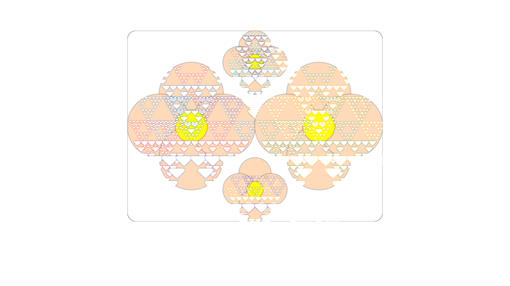
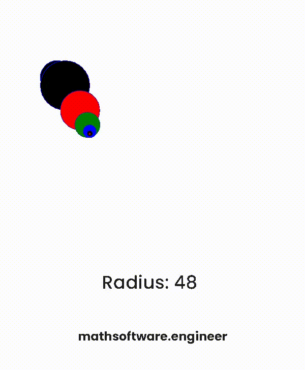
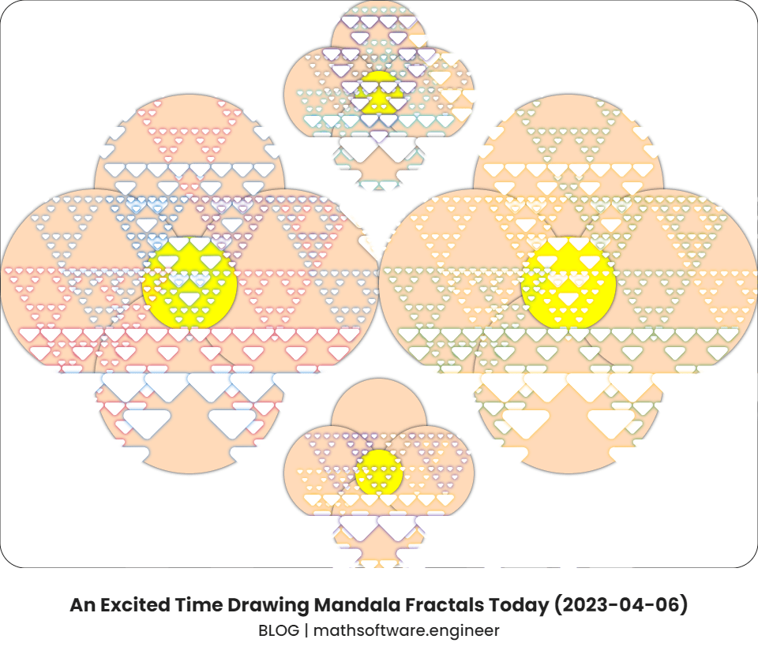

<!-- Copyright (c) 2023 Tobias Briones. All rights reserved. -->
<!-- SPDX-License-Identifier: CC-BY-4.0 -->
<!-- This file is part of https://github.com/tobiasbriones/blog -->

# An Excited Time Drawing Mandala Fractals Today (2023-04-06)

---

Today at this moment, I was thinking about fractals and mandalas. I'm always
thinking about these concepts, but I just got excited about it and stayed
playing with some drawings I figured out.

It's a way to feel better, that I'm doing what I love, I just had to do it even
though I had no schedule for that.

Among being a mathematician, engineer, philosopher, entrepreneur, gamer, and
others..., being an artist who designs the meaning of all this knowledge is part
of my stance.

I've wished to formalize the MathSwe logo, so it can be defined declaratively 
via recursion or an elegant equation instead of Photopea [^1] vector shapes 
or raster graphics.

[^1]: Photopea is a free version of Photoshop

So, I've been playing with some recursion and fractals once in a while the last
few days.

One example is the below drawing with animation I was checking last time:

<figcaption>

<strong>Basic Fractal with Circles</strong>

</figcaption>

It was just a basic PoC, and I got some insights, for example: recalled that
understanding the *constant part of relativity* and recursion is a *key* to 
understanding relativity, and that, as the radius gets bigger the circle looks
relatively "flat" but it's still a circle, so you can use your imagination or 
creativity which is another *key* and think that "you're getting closer to the
surface of the sun", so many will believe that "the sun is flat" because that's
what they see in their local, fragmented, or absolute perspective but as we
understand relativity we know what's happening, and that these shapes are
circles (relatively).

Notice how recursion contains *that constant part of relativity*: the recursive
function is the **pattern** that **keeps constant** (one part), and the observer
is the domain of the function that **keeps changing** (second part).

That sounds familiar, it's like induction (so math). Base step,
recursive/inductive step.

That is, mathematical elegance with homogeneity, as I say in
[From Imperative to Functional: TypeScript Fetch Promise](from-imperative-to-functional-_-typescript-fetch-promise),
*the simplest designs are the best*, and **homogeneity yields the simplest
form of a problem** so that the other part can constantly keep changing
peacefully. That's also a way to see and prove how boilerplate is a measure
of bad quality of software, **you have to factorize it**.

Now, the drawings I was playing with today were about circles and a version
of the Sierpiński triangle.

I drew [^2] a flower petal as a base for the drawing, and put some triangles as
`source-atop` composite operation. I made them smoother with arcs, so they're
smooth curves instead of ugly lines with discontinuities [^3] as plane triangles
would otherwise be. I added some colors to the shadows, etc.

[^2]: I've been using HTML Canvas lately for this

[^3]: For me, mathematical beauty lies in smooth curves with continuous
    derivatives

It's not perfect, and not symmetric, but it's a pretty nice and valid result.

It was an improvised drawing, out of passion and curiosity to relieve the stress
of these days.

I liked it a lot, the shapes, the colors, the experience, it was lovely.

I also learned about what particularly "mandala fractals" are since they're a
specific type of mandala drawings that use fractals and are created using
computer graphics, so it's convenient for me to work with them, because of the
fractal and computing part they consist of.

Right now, I'm not providing source code or projects regarding these drawings,
but a lot is coming to Repsymo and MathSwe.

I've also thought about automating the creation of this kind of content, so I
already have a mature idea of what to do.

It was good to have worked with drawings, mandala fractals, and ideas these
days as they gave insights, and relaxation, I'm closer to fulfilling some
objectives about MathSwe and Repsymo, and I'll keep doing this great job.

<figcaption>

<strong>Drawing</strong>

</figcaption>

## Bibliography

- [The Sierpinski Triangle \| Math \| Boston University](https://math.bu.edu/DYSYS/chaos-game/node2.html)
- [CanvasRenderingContext2D.globalCompositeOperation \| Web APIs \| MDN](https://developer.mozilla.org/en-US/docs/Web/API/CanvasRenderingContext2D/globalCompositeOperation)
- [Fractal Geometry \| Computer Science \| Loyola Marymount University](https://cs.lmu.edu/~ray/notes/fractals)
- [Creative Self-Care: Make Art! \| Healthy IU \| Indiana University](https://healthy.iu.edu/campus-programs-services/university/creative-self-care/mandalas.html)
- [Restoring Creative Balance: How to Create Mental ‘Space’ and Design a Mandala \| The Elm \| University of Maryland](https://elm.umaryland.edu/elm-stories/Elm-Stories-Content/Restoring-Creative-Balance-How-to-Create-Mental-Space-and-Design-a-Mandala.php)

