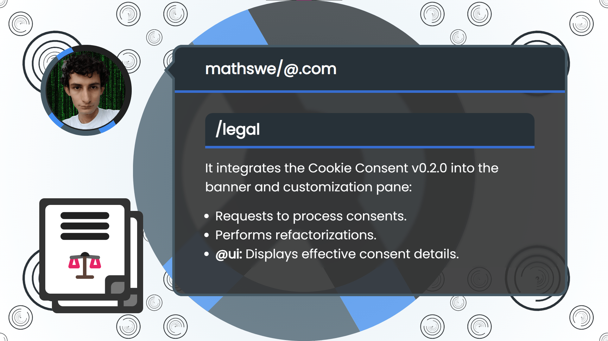
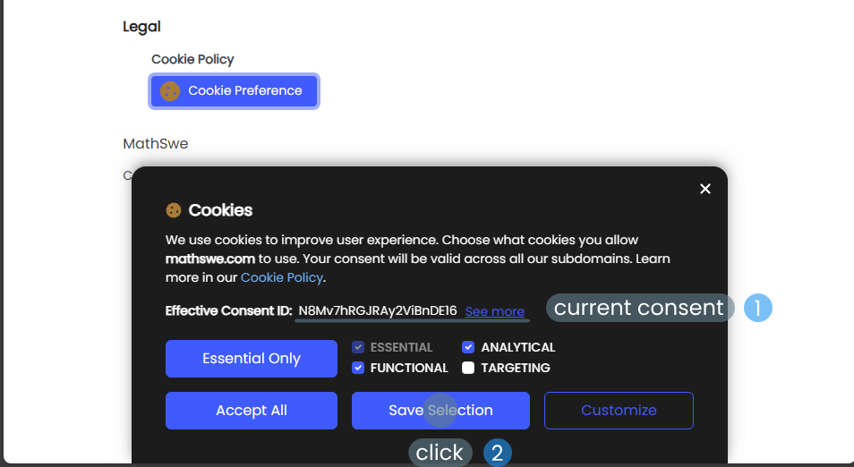
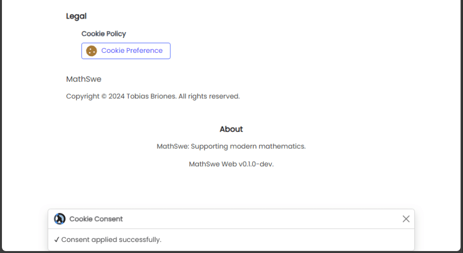
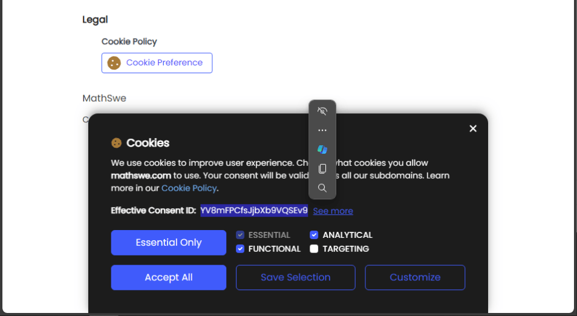
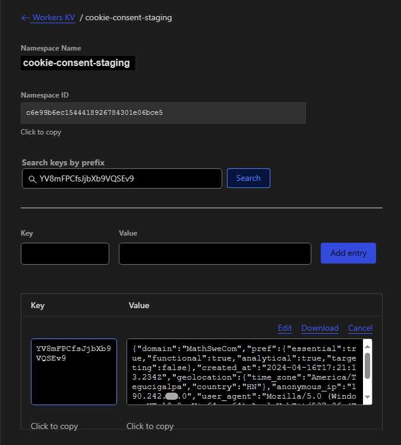
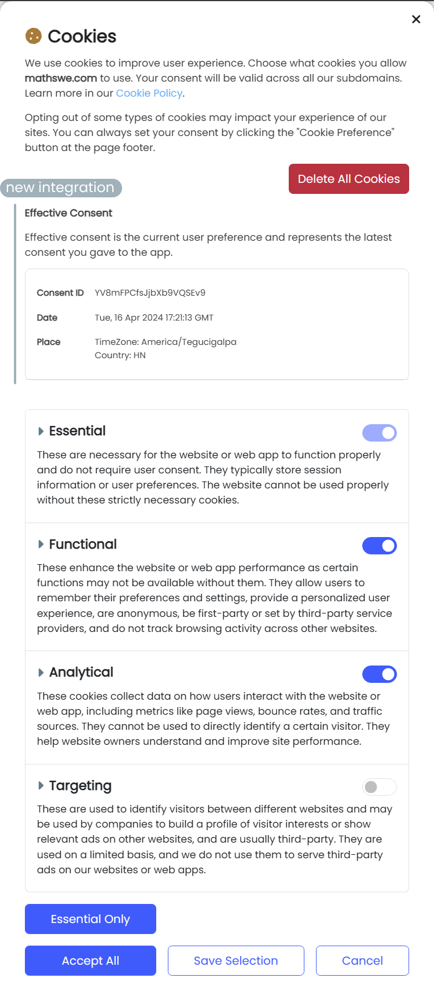

<!-- Copyright (c) 2024 Tobias Briones. All rights reserved. -->
<!-- SPDX-License-Identifier: CC-BY-4.0 -->
<!-- This file is part of https://github.com/tobiasbriones/blog -->

# Cookie Consent Client Integration | MathSwe Com (2024/04/17)

The relatively stable version 0.2.0 of the Cookie Consent service is available,
but the banner and customization pane require front-end integration to complete
the process.

---

**Create env var for service cookie-consent and update deps**

Apr 14: PR [#13](https://github.com/mathswe/mathswe.com/pull/13) merged
into `dev <- mathswe/ops` by [tobiasbriones](https://github.com/tobiasbriones)
{: .pr-subtitle }

It creates a new environment variable to connect to the Cookie Consent service,
so the cookie banner (and customization pane) apply the consent to store those
records. Further, it applies minor dependency updates to the project.

---

**Rename field from analytics to analytical (CookieConsent)**

Apr 15: PR [#14](https://github.com/mathswe/mathswe.com/pull/14) merged
into `dev <- legal` by [tobiasbriones](https://github.com/tobiasbriones)
{: .pr-subtitle }

It pairs with the last naming convention adopted by MathSwe Cookie Consent
v0.2.0. See more:
[Request and Response Integration \| Cookie Consent v0.2.0](/cookie-consent-v0-2-0---mathswe-legal-2024-04-09#request-and-response-integration).

---

**Add new component NotificationToast to @ui, @app**

Apr 15: PR [#15](https://github.com/mathswe/mathswe.com/pull/15) merged
into `dev <- mathswe/ui` by [tobiasbriones](https://github.com/tobiasbriones)
{: .pr-subtitle }

It integrates the `NotificationToast` component from the UI library to allow the
app to show brief update messages.

---

**Display cookie consent details**

Apr 16: PR [#16](https://github.com/mathswe/mathswe.com/pull/16) merged
into `dev <- mathswe/ui` by [tobiasbriones](https://github.com/tobiasbriones)
{: .pr-subtitle }

It shows the details from the `ClientCookieConsent` server response, such as
consent id, date, and geolocation.

---

**Tune cookie consent id sizing in banner and fix public icon path in
NotificationToast**

Apr 16: PR [#17](https://github.com/mathswe/mathswe.com/pull/17) merged
into `dev <- mathswe/ui` by [tobiasbriones](https://github.com/tobiasbriones)
{: .pr-subtitle }

It enhances the sizing of the cookie consent ID/"see more" detail in
the `CookieBanner` component. It fixes the public directory path to load the
Notification Toast component icon in production.

---

**Fix inline padding when effective consent id is multiline**

Apr 16: PR [#18](https://github.com/mathswe/mathswe.com/pull/18) merged
into `dev <- mathswe/ui` by [tobiasbriones](https://github.com/tobiasbriones)
{: .pr-subtitle }

It removes bloated padding from inline elements to make the "Effective Consent
ID" line fit well when it doesn't fit in one line (a few cases sometimes).

---

**Integrate Cookie Consent service**

Apr 17: PR [#19](https://github.com/mathswe/mathswe.com/pull/19) merged
into `dev <- legal` by [tobiasbriones](https://github.com/tobiasbriones)
{: .pr-subtitle }

It calls the Cookie Consent endpoint to apply the consent and persists the
response with the cookie preferences along with newer features to support this
integration:

- Posts user consents to the Cookie Consent (v0.2.0) service.
- Stores the response as the confirmation that the system applied the consent.
- Displays the effective consent ID in the banner.
- Displays the effective consent details in the customization pane.
- Avoid automatically prompting the banner if redundant, or unwanted.
- Avoid posting redundant consents that already match the effective user
  preference.
- Refactors inconsistent definitions with improvements in the internal API.

Users can give new consent either if there's none or if there's an existing one
so they can update their preferences. If the user saves a new preference
(different from the previous, if any), **the app requests the consent to the
Cookie Consent service to make it effective**.

In the following case, the banner shows the current or **effective consent**
ID the system applied before. Now, it will be renewed by a new preference (i.e.,
opt-out of "targeting") where the user unchecked the "targeting" option.

<figure>
    
    <figcaption>Saving New Consent</figcaption>
</figure>

The app shows a `NotificationToast` (component integrated by PR #15 above)
with the successful confirmation when applying the server response. If there's
any error, or it wasn't necessary to post the consent due to unchanged
preferences, the toast will notify accordingly.

<figure>
    
    <figcaption>Consent Applied Successfully</figcaption>
</figure>

After the app applies the new consent, when opening the banner again (from the
Legal footer section), it'll show *the new consent ID*.

<figure>
    
    <figcaption>New Effective Consent Id</figcaption>
</figure>

The ID is the key of a cookie consent, as
[Proof of Consent \| Cookie Consent v0.1.0 | MathSwe Legal (2024/03/29)](/cookie-consent-v0-1-0---mathswe-legal-2024-03-29#proof-of-consent)
says, which also gives in-depth details about consent records.

One can get the consent record by searching its ID in the database (admin only).

<figure>
    
    <figcaption>Requesting a Consent Record by Id from the Database</figcaption>
</figure>

Finally, and quite importantly, in this integration, the customization pane
shows the detailed effective consent, thus expanding the banner functionality.

<figure>
    
    <figcaption>Effective Consent on the Customization Pane</figcaption>
</figure>

A new minor feature in the backlog will add the expiration date to the details
so the user can see how much is left for the `cookie-consent` cookie to expire
(it lasts 1 year) and then prompt the banner to renew the consent.

The Cookie Service integration into the Cookie Banner and Customization pane
makes the user preferences effective. It enriches the client-side consent
behavior and transparency with the new details presented to the user about their
effective consent.

---

The Cookie Consent v0.2.0 service was released recently, and the cookie banner
and customization pane had their integration on the client side to complete the
consent process.

It added the environment variable to get the hostname to connect to the
microservice and renamed the `analytics` field to match properly with the
established `analytical` naming.

The `ui` path implemented a new `NotificationToast` component and added the new
features to the `CookieBanner` and `CookieCustomization` to integrate with the
service.

Finally, the integration requests to process consents to make them effective and
apply them on the client side by storing the `cookie-consent` cookie consisting
of the `ClientCookieConsent` service response. It further displays the effective
consent ID in the banner and all the details in the pane.

Besides minor technical details left, with the client integration, we can
consider the current MathSwe Cookie Consent finished in development terms. Now,
the focus should be more on completing the privacy redaction with the
cookies-used report and integrate it to MSW to restore its initialization of
operations.

