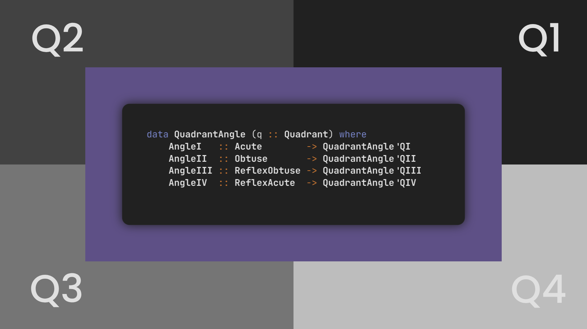

<!-- Copyright (c) 2024 Tobias Briones. All rights reserved. -->
<!-- SPDX-License-Identifier: CC-BY-4.0 -->
<!-- This file is part of https://github.com/tobiasbriones/blog -->

# Designing the Angle Geometry for an Oriented Segment



Line segments oriented by an angle and orthogonal design concepts led to an
engineering-grade draft of a language I designed in Haskell. It defines angles
with high-level forms in the geometric domain, showing greater insight and skill
for related domain languages.

## The Line Type of Canvas Play

I'm correcting some design flaws in the Java Canvas Play for the Line sum type
[I described before](/ensuring-principle-compliance-_-this-line-sum-type-is-not-a-partition-2023-12-07).
This way, I'll build a DSL to draw —among others— line segments easily. The
motivation for these DSLs, I have to say, is primarily about drawing fractals
for production at my will.

One of the primary concerns of the initial design is that a `Line` consisted
of `Segment`, `HSegment`, and `VSegment` products, while `Segment` made
redundant the other two. On top of that, the last two are redundant in
structure, so I suggested in the article to make the product types conceptually
orthogonal to induce a partition that fixes the design and introduce a soft sum
type (i.e., `enum`) to factorize the fields of both `HSegment` and
`VSegment` into one physical record with logical variants instead.

The ugliness of Java makes me go to Haskell to think clearly about exactly *what
I need to do* instead of loading an overhead of idiotic (and unnecessary)
language details.

So, I was drafting a more robust language to study the separate concepts
concerning the design I'm finishing in Java to go back with powerful insights
for the next project's PRs.

## Angle Definitions

When working with Haskell, I became eager to go further, so I wrote the
languages needed for the `Line` DSL regarding angle definitions. These
definitions are not requirements for me now, but they'll be useful in the future
for engineering math software.

First, I used the `DataKinds`, `GADTs`, and `TypeFamilies` language extensions,
which can be enabled via pragmas at the source file header. I also imported
the `Maybe` monad for an implementation until the end.

I defined the types of angles there are so I could build up from these domain
truths.

`Initializing the Domain Design | Angle Types | Main.hs`

```haskell
newtype Angle = Angle Double
  deriving (Show, Num)

newtype Acute = Acute Angle -- (0-90)

newtype Obtuse = Obtuse Angle -- (90-180)

newtype ReflexObtuse = ReflexObtuse Angle -- (180-270)

newtype ReflexAcute = ReflexAcute Angle -- (180-360)
```

The types allow understanding the semantics of the code, but **it's still not
safe**. One should use LiquidHaskell to define the subsets of the refinement
types. However, I'm not doing that since I only need the design, not the
production code, and this is hard to achieve in Java (the targeting language)
anyway[^1]. Something about **refinement types** in Java might happen, according
to [this recent project](https://catarinagamboa.github.io/liquidjava.html)
inspired by ML and Haskell, and
[this paper](https://arxiv.org/pdf/2110.05444.pdf), but I haven't tried them in
Java so far.

[^1]: You can validate fields in any programming language and even return
    `Optional` in Java (don't use exceptions as they're an ill-design), but
    that's barely a runtime check

These definitions can be defined for general angles for multiples of the base
angles in `[0, 360)` degrees if needed and provide a solid domain understanding
and inference options.

So, now we have the constant angles lying on the axes.

`Quadrantal Angle Sum Type | Main.hs`

```haskell
data QuadrantalAngle
  = Zero
  | Right
  | Straight
  | ReflexRight

angle :: QuadrantalAngle -> Angle
angle x = Angle $ case x of
  Zero -> 0
  Main.Right -> 90
  Straight -> 180
  ReflexRight -> 270
```

With the above definitions, I could model angles that cover the entire cartesian
plane and develop further DSL insights.

## Leveraging Powerful Functional Abstractions

From here, I started designing higher-level constructs. First, we can think in
terms of the cartesian quadrants.

`Quadrants of the Plane | Main.hs`

```haskell
data Quadrant = QI | QII | QIII | QIV
```

So, I can define a GADT for the four types of angles defined previously.

`Defining Angle Types by Quadrant`

```haskell
data QuadrantAngle (q :: Quadrant) where
  AngleI :: Acute -> QuadrantAngle 'QI
  AngleII :: Obtuse -> QuadrantAngle 'QII
  AngleIII :: ReflexObtuse -> QuadrantAngle 'QIII
  AngleIV :: ReflexAcute -> QuadrantAngle 'QIV
```

The above GADT starts employing advanced features, namely, `GADTs` itself
and `DataKinds`, where I use the *phantom parameter type* `q` to enforce the
type of `QuadrantAngle` to create from the data constructors. So, I can build
a `QuadrantAngle` *of* `'QI` (i.e., the *promoted data constructor* `QI` of
`Quadrant`), etc.

With the type safety above, I can enforce a function that requires an angle
belonging to the first quadrant, for example:

`Example Function Taking Angles in QI`

```haskell
fn :: QuadrantAngle 'QI -> Angle
fn (AngleI (Acute a)) = a + (angle Straight)
```

If you try to match nonsense
like:

`Matching for Other Cases is Nonsense`

```haskell
fn (AngleII (Obtuse a)) = a * (angle ReflexRight)
```

The program compilation will disallow to proceed with the output:

`Unable to Match Erroneous Logic Thanks to the Functional Type System`

```
• Inaccessible code in
    a pattern with constructor:
      AngleII :: Obtuse -> QuadrantAngle 'QII,
    in an equation for ‘fn’
  Couldn't match type ‘'QI’ with ‘'QII’
```

This is because I defined `fn` above to take only angles in the first quadrant,
so any other case like `AngleII` that belongs to other quadrants will fail to
compile. In other words, **if the program compiles, then it's already *mostly*
correct because the very application logic is *encoded* into the functional type
system**. Now, it depends on you as the engineer to *encode* that domain logic
correctly.

Of course, if you try this system further, like calling the function with
ill-types, results in:

```haskell
let valid = fn $ AngleI $ Acute 20
let wrong = fn $ AngleIV $ ReflexAcute 340
```

```
• Couldn't match type ‘'QIV’ with ‘'QI’
  Expected: QuadrantAngle 'QI
    Actual: QuadrantAngle 'QIV
• In the second argument of ‘($)’, namely
    ‘AngleIV $ ReflexAcute 340’
```

**The type system provided by functions (i.e., by FP) is one of the most
powerful *engineering* tools**, and you won't find it elsewhere in ordinary
programming languages. Provided only by FP, for example, type and data
constructors are functions, data constructors are promoted to type constructors,
type families are "functions for types," etc.

I learned and put into practice many concepts of Haskell and its top type
system, based on type theory, where everything is a function, including type and
data constructors, thus inducing advanced abstractions like type families,
GADTs, etc. This is in contrast to non-functional languages that can only be
randomly designed via a pragmatic variety of workarounds.

I also have to say this work is part of my end-of-year memories, where I
learned a lot more while doing related research for my next publication at MSW
Engineer, which will remind me of the past 2023/12/31.

With the previous work, I devised an engineered draft giving insight for further
math DSLs, by leveraging the angle types defined first and creating
abstractions for the plane quadrants, leading to higher-level definitions.

## High-Level Angles

What's left is to finish composing the results into high-level angles that
operate over the cartesian plane in the range of `[0, 360)` degrees.

Connecting the details of
the [previous section](#leveraging-powerful-functional-abstractions), I defined
a type family to map the type of angles to their corresponding quadrant to
ensure correctness and simplicity —as always.

`Mapping Angles to their Quadrant | Main.hs`

```haskell
type family AngleQuadrant a :: Quadrant where
  AngleQuadrant Acute = 'QI
  AngleQuadrant Obtuse = 'QII
  AngleQuadrant ReflexObtuse = 'QIII
  AngleQuadrant ReflexAcute = 'QIV
```

Then, I created a type class to convert the values. So, if I need a
`QuadrantAngle`, it can help for doing `let angle = toQuadrantAngle $ Acute 48`
instead of `let angle = AngleI $ Acute 48`, which requires client knowledge of
the specific quadrant or data constructors you have to use, according to the
angle you have.

`Straightforward Type Class Implementation`

```haskell
class ToQuadrantAngle a where
  toQuadrantAngle :: a -> QuadrantAngle (AngleQuadrant a)

instance ToQuadrantAngle Acute where
  toQuadrantAngle = AngleI

instance ToQuadrantAngle Obtuse where
  toQuadrantAngle = AngleII

instance ToQuadrantAngle ReflexObtuse where
  toQuadrantAngle = AngleIII

instance ToQuadrantAngle ReflexAcute where
  toQuadrantAngle = AngleIV
```

**The type family helped simplify** the parameters of the `ToQuadrantAngle`
class and the client code because *it defines the quadrant corresponding to each
type of angle, so we can engineer that information into the type system*. This
is an instance (no pun intended) of how type families are so powerful as
"functions for types."

Finally, I created the type for covering all possible angles (without including
their multiples).

`Sum of All the Possible Angle`

```haskell
data MeasuredAngle where -- [0-360)
  InAxisAngle :: QuadrantalAngle -> MeasuredAngle
  InQuadrantAngle :: QuadrantAngle q -> MeasuredAngle
```

The sum types are conceptually orthogonal —which is simple to understand in a
functional language[^2] while a stone in the shoe in OO/mixed[^3]
languages[^4]—. Therefore, I have a correct design where the sum types
induce a partition of orthogonal products that simplifies the programs 
since all physical and logical redundancies are eliminated. Then, we have 
independent concepts that can be composed as demonstrated above.

[^2]: Good design that Haskell encourages

[^3]: It becomes hard to see and achieve in OO languages because they're
    inherently over-engineered

[^4]: For example, data constructors are not functions but objects, and then
    each extra object creates one more (sub)type in all the idiotic JVM
    languages (Java, Kotlin, and Scala), which is total nonsense —part of
    the research I've been doing

A plane angle is represented via orthogonal definitions: quadrantal angles plus
angles that belong to one of the four quadrants.

The design built from the angle definitions, and the angles by quadrant in the
cartesian plane resulted in an expressive rigorous definition of angles
in the `[0, 360)` degrees set.

## The Power of Domain Language Engineering

Notice that, **all the languages (a.k.a. DSLs) I've created here come from math,
so nothing is made up**. That is, *I'm a domain expert* —which is the main
requirement to be a *math* software engineer.

One of the remarkable skills of mathematical software engineering is **the
scientific research** component.

It's also important to notice this since DSLs are *expensive to engineer*. I
take plenty of resources to make formal sense of everything I create. Once I
achieve results, it pays off forever, since I relativize, that is, *relate*
everything to everything, so one improvement in one part of the system improves
everything else (i.e., relative not absolute), etc.

Therefore, with a well-informed background coming from objective domains, we can
build engineering-grade software which must be the major goal of any software
engineer.

## The Oriented Segment of Canvas Play

With all the study and design in Haskell, I encountered my design in the JavaFX
project of Canvas Play clearly and already wrote the new API for line segments,
including the ADT for oriented segments.

An **oriented segment** is a line segment defined by an angle and radius. This
is an important standard of MathSwe since it optimizes the center, making it
symmetric. For example, when you draw, your target point should be the center of
the figure, and then scale it. Other definitions I like are valid
transformations but non-primary. I like the "a line is defined by two points"
definition.

With the code and insights I've created, I can also unify all this together 
in Canvas Play (Java).

I also created Haskell code for the line segments I mentioned in the
[introductory article](#the-line-type-of-canvas-play). I'll leave the 
playground drafts here, as well, for the record.

`Devising the Design for Oriented Segments for Canvas Play
| Drafts with General Conclusions | Main.hs`

```haskell
class Orientation a orientation where
  orientation :: a -> orientation

data AxisOrientation = Horizontal | Vertical

instance Orientation QuadrantalAngle AxisOrientation where
  orientation x = case x of
    Zero -> Horizontal
    Straight -> orientation Zero
    Main.Right -> Vertical
    ReflexRight -> orientation Main.Right

data AcuteOrientation
  = Acute15
  | Acute30
  | Acute45
  | Acute60

instance Orientation Acute (Maybe AcuteOrientation) where
  orientation (Acute (Angle a))
    | a == 15 = Just Acute15
    | a == 30 = Just Acute30
    | a == 45 = Just Acute45
    | a == 60 = Just Acute60
    | otherwise = Nothing


-- mod Algebra
data Sign = Positive | Negative


-- Imported from mod Shape
class Area a where
  area :: a -> Double


class Minus a where
  minus :: a -> a


-- mod Shape.Line
data Line = Segment Double Double Double Double

instance Area Line where
  area _ = 0

instance Minus Line where
  --  Dummy implementation, the structure is what mattered here
  minus (Segment sx sy ex ey) = Segment (sx - 1) (sy - 1) (ex - 1) (ey - 1)
```

It left my mind clear by getting close to the
actual problem. This is how the FP-first mindset allows you to do a better job,
even if the target language has nothing to do with FP.

This way, I just mentally compile the design devised optimally in FP terms to a
program written in the Java way.

## Engineering Geometry Languages in Haskell with Insights

Further language designs primarily concerning Canvas Play arose many insights
requiring good analytical judgment to be addressed. Thus leading to Haskell. To
clarify the underlying, I just wrote the definitions for angles so I could
finally address the oriented segment and further design challenges in Canvas
Play.

I started with general angles consisting of real numbers, with an `Angle`
type with a `Double` data representation. Then, the design scaled to refinement
types of independent angles belonging to a common subset, like `Acute`, and the
quadrantal angles, like `Right`. All the definitions are orthogonal, so far so
great. Much greater when abstractions are applied to create more high-level
orthogonal concepts like `MeasuredAngle` consisting in angles of
`[0, 360]` degrees and providing an engineering-grade API thanks to the
functional type system of Haskell.

The language specification for angles results in one more enabler for my
instinct when engineering DSLs, where I've been enforcing the proper
understanding of the theory with concepts like orthogonality to produce quality
software. The above notions are useful for the API for an oriented segment 
