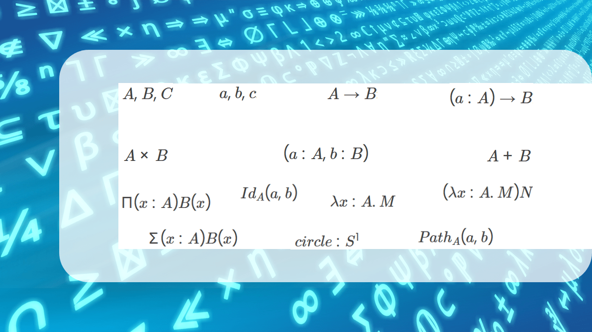

<!-- Copyright (c) 2023 Tobias Briones. All rights reserved. -->
<!-- SPDX-License-Identifier: CC-BY-4.0 -->
<!-- This file is part of https://github.com/tobiasbriones/blog -->

# Introductory Type Theory Notation Summary (2023/12/25)

<b>
Background Derived from
<a href="static/notice">Pixabay</a> Images
</b>

## Bibliography

- "Types and Programming Languages," by Benjamin C. Pierce.
- "Foundations" by Jeremy Avigad.
