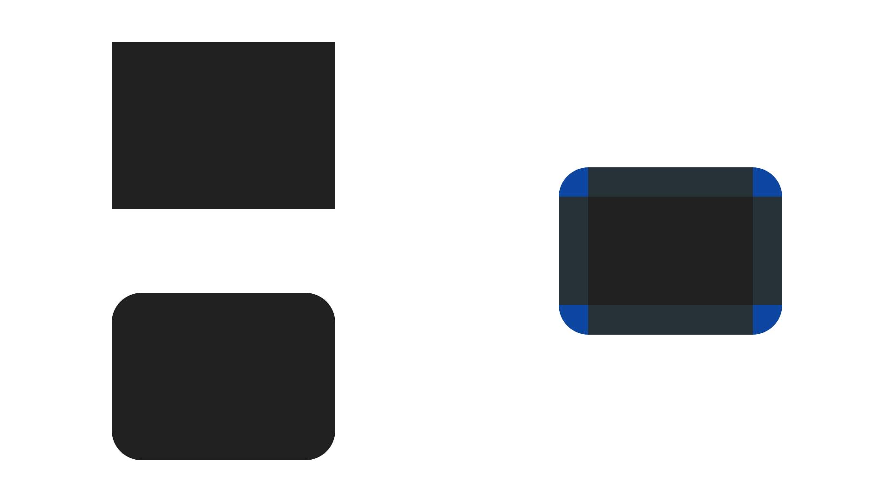
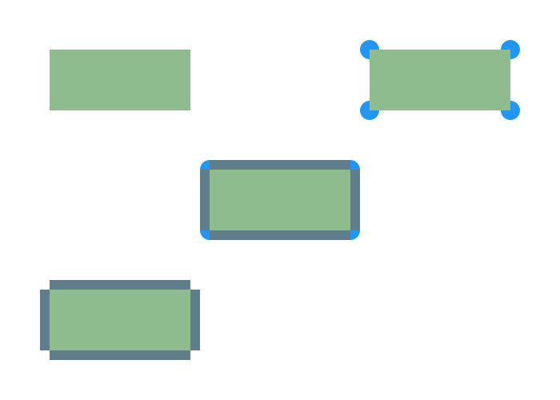
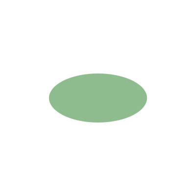

<!-- Copyright (c) 2023 Tobias Briones. All rights reserved. -->
<!-- SPDX-License-Identifier: CC-BY-4.0 -->
<!-- This file is part of https://github.com/tobiasbriones/blog -->

# Designing a Rounded Rectangle Against Pragmatic Misconceptions



---

Some fake friends show up as design flaws in systems apparently working in easy
conditions but unable to scale, like the false and persuasive idea that a
rounded rectangle is a rectangle. A rounded rectangle is similar to a rectangle
but quite different in definition, requiring the application of math to
establish a correct design.

## Vague Idea of a Round Rectangle

The popular idea of a round rectangle usually comes from taking a rectangle and
radius arcs to magically round or mutate its borders, which is far from correct.

### Round Rect in Canvas

The canvas APIs take raw primitives, so like the `fillRoundRect` method (and the
API itself analogously), take the top-left, width, and height (i.e., a
rectangle) and the arcs to soften it.


<figure>
<div class="header user-select-none headerless">
    <div class="caption">
        
    </div>

    <div class="menu">
        

        <button type="button" data-code="public void fillRect(
    double x,
    double y,
    double w,
    double h
) { &#x2F;* ... *&#x2F; }

public void fillRoundRect(
    double x,
    double y,
    double w,
    double h,
    double arcWidth,
    double arcHeight
) { &#x2F;* ... *&#x2F; }
" onclick="onCopyCodeSnippet(this)">
            <span class="material-symbols-rounded">
            content_copy
            </span>

            <div class="tooltip">
                Copied
            </div>
        </button>
    </div>
</div>

```java
public void fillRect(
    double x,
    double y,
    double w,
    double h
) { /* ... */ }

public void fillRoundRect(
    double x,
    double y,
    double w,
    double h,
    double arcWidth,
    double arcHeight
) { /* ... */ }
```



{{ markdownContent | markdownify }}


<figcaption>Round Rect in the JavaFX GraphicsContext API [2]</figcaption>
</figure>

Sure, the general-purpose canvas API (of HTML5, JavaFX, or whatever platform)
eats some `double` primitives, so it can make sense to say that a rectangle plus
some arcs ~~compose~~ a round rectangle.

This API *suggests that a round rectangle is the composition of a normal
rectangle and arcs,* which is wrong, but understandable in pragmatic terms.

The canvas API is lower-level (as it works with primitive values like `doable`),
so it takes less meaningful data types if at all —not to say it's inherently
mutable 😬—, so it's a misleading guide for high-level designs (though, powerful
for implementation details).

The interpretation that gives the canvas API is similar to one mathematical
definition of a round rectangle, but the issue with this model is that
the `w, h` arguments suggest a rectangle taking the whole lengths (i.e., more
than it is, so leaving out composition) when they should be `w - arcWidth / 2`,
and `h - arcHeight / 2` to *actually* denote an (inner) rectangle —albeit less
practical if using primitives.

That is, the `w, h` arguments are misleading since "rounded rectangles"
don't have width and height since they're not rectangles, but they have an inner
rectangle of `w - arcWidth / 2` times `h - arcHeight / 2` dimensions.

So, the canvas API is fine, but don't fall for the fake friends since primitive
values won't give the idea of high-level (mathematical) constructs.

### The Outer World

There are many more misleading definitions that apparently make sense but would
damage a system design if employed, not to say the very mathematical
definitions.

> Rounded rectangle is a rectangle with chamfered corners. However, these two
> shapes have one more significant difference: rectangles can have three
> dimensions and appear in 3D animation, while rounded rectangles can’t. So, if
> you plan to create 3D animation for your model, we recommend you to use
> rectangles, not rounded rectangles.
>
> Source: *Rounded rectangle* \| AnyLogic Help (under fair use) [3]

The above idea says that "Rounded rectangle **is** a rectangle," which is
totally wrong. It also dares to say that "rectangles can have **three
dimensions**" —also wrong.

It even gets weirder: "while rounded rectangles **can’t**." So if a round
rectangle is a rectangle, why are "rectangles" 3D, but "round rectangles"
can't be?

The only way a "rectangle" can be in a 3D space is when it lies on a plane
subspace, but even so, the above concepts are wrong and confusing at best.

Of course, those "definitions" make sense in their corresponding context or
software, but you see how they just pass unnoticed as if it were true.

You must pay close attention to all the details and particularly avoid falling
for banal non-mathematical ideas like the misleading "definitions" of a round
rectangle.

## Rounded Rectangle

The definition of a rounded rectangle comes from a model that composes an inner
rectangle, the ellipse arcs defining the round borders, and the four remaining
rectangles of the borders.

First, a "**quadrilateral** is a polygon that has four sides," a
"**parallelogram** is a quadrilateral in which both pairs of opposite sides are
parallel," and a "**rectangle** is a parallelogram that has a right angle" [1].

So, it's clear to prove a rectangle is not a 3D shape and a rounded rectangle is
not a rectangle. That is, proving false the misled random "definitions" from the
internet.

It's clear that a rounded rectangle is *not exactly* "four sides," but much
more, so it's not a rectangle.

Now, there can be various definitions of a "round shape," but this one can be
depicted from the canvas API. I figured out how it takes the values, and it's a
model that takes the whole width and height, as said in
[Round Rect in Canvas](#round-rect-in-canvas).


<figure>
    
    <figcaption>Canvas Round Rect</figcaption>
</figure>

Let $$a, b$$ be the width and height of the green inner rectangle, and $$r_x,
r_y$$ the radius of the ellipses[^1], respectively.

[^1]: Circles this time to simplify

The canvas API takes $$w = a + 2r_x$$ and $$h = b + 2r_y$$ for
pragmatic/low-level reasons as mentioned, which suggests that it takes a
"single rectangle" and mutates its borders, which is far from real.

Regarding the arcs, they share the same style of the above: $$arcWidth = 2r_x$$
and $$arcHeight = 2r_y$$.

From the high-level mathematical perspective, taking the green rectangle with
$$a$$ and $$b$$ is appropriate since *that **is** an actual rectangle, and you
finish composing the rest*.

If you take the whole `width, height` (commonly suggested out there), you have
more than you need, so they *don't compose well*. If you also take the
`arcWidth, arcHeight` is a flaw as well, since the (short) side of the dark-blue
surrounding rectangles is $$r_x$$ or $$r_y$$, so you either take the "canvas" or
the "math" approach to keep consistent.

Another issue with general-purpose tools is to understand what they actually
mean, so you might think you're drawing something, but it's actually different.
*Creating tests for the drawings is a responsibility* but often complicated, so
**it's best to stand by the theory** to minimize the doubt.

In other words, **the only way to build engineering-grade math software is via
its DSL**.

Rounded rectangles are not rectangles but more complex shapes primarily
composed of rectangles, and you have to be careful with the definitions to be
"on the same page."

### Degenerate Rounded Rectangle

A rounded rectangle can take a degenerate form like other shapes do when pushed
to trivial.

Significant differences exist between "the canvas" and "the math"
rounded rectangle definitions. The former takes the whole "final" `w, h` and the
latter is an inner rectangle with an ellipse model to round its outer corners.

The canvas way is low-level while the math way can be composed.

In the canvas API, $$r_x, r_y$$ have to be bounded to prevent a *degenerate
shape*, indeed, that bound is `w` and `h` respectively. Any arc length greater
than that is "ignored."

In the canvas model, you can control the final width/height trivially, but —as a
tradeoff— the inner rectangle doesn't exist, so it's up to your abstractions
whether to take it for calculations. This leads to annoying effects like
"deleting" your rect if too much "border" is applied since **the border will
consume the shape in the canvas model**.

A rounded rectangle can be drawn in canvas with a value like
`arcWidth = arcHeight = 24`.

<figure>
    
    <figcaption>Canvas Round Rect 24px Arc</figcaption>
</figure>

Since the canvas API takes the final width and height `w, h`, the shape
degenerates when $$arcWidth \geq w \land arcHeight \geq h$$.

<figure>
    
    <figcaption>Canvas Degenerate Round Rect</figcaption>
</figure>

This shows how **the arcs and the inner rectangle (unexisting in the canvas
model) are *tightly coupled***, unlike the mathematical definition given before.

On the other hand, when taking the mathematical definition of the shape, *any
change to the arcs doesn't change the inner rectangle*. That is, **the math
model is uncoupled and composable**.

Since the rounded borders are ellipsis, the rounded rectangle consisting of an
inner rectangle, four boundary rectangles, and four ellipse arcs degenerates to
an ellipse when $$a = 0 \land b = 0$$.

The boundary rectangles have lengths corresponding to $$a, b$$ for the
stretching sides, so they're also zero.

This gives the simplified (degenerate) ellipse composed of the four concentric
arcs of 90° each.

The math way is rigorous, although the canvas way is pragmatic by taking `w, h`
like any other imperative "shortcuts," which only makes it more convoluted in
the end, for example, when wondering if your rect is going to be consumed by the
arcs, or extracting properties like area or scaling to a composable design.

A rounded rectangle degenerates to an ellipse when its inner rectangle
degenerates to a point in mathematical terms, or when the arcs are off the
threshold in canvas terms. The mathematical definition shows how
side-effect-free is, while the canvas model is more imperative and pragmatic but
limited.

### The Math Model Design

The two concepts of a rounded rectangle given can be further contrasted one more
time to show how the mathematical way is the correct design in the long term
given its composability.

The math model consists of two parts: the ellipse arc radius and the inner
rectangle. So, if you change $$r_x, r_y$$ (the arcs), the dark-blue borders are
responsive as the arcs grow, and $$a, b$$ (the green rectangle) don't mutate
(contrary to the canvas model). Conversely, if you change $$a, b$$, the arcs
won't change. Therefore, one change to one part of the model doesn't apply an
*effect* to the other, leading to a composable design.

If you change either the inner rect or the arcs, the final dimensions `w, h`
will change, but that design *is not part of the rounded rectangle model*. It's
part of a high-level "user" model that *will carry on the composition allowed by
the mathematical model* mentioned.

Therefore, the canvas model *trades* an easy mundane API by an inner mutation
that degenerates to an ellipse in an inconsistent obfuscated way
(arcs greater than `w, h`) —*tightly coupled characteristic of imperative
systems*— while the math model *allows you to feature* what you need with no
tradeoff, so it degenerates to an ellipse correctly (when the inner rectangle
degenerates to a point) —*declarativeness of mathematical systems and FP*.

Defining mathematical concepts is rigorous, specifically a rounded rectangle.
The same correctness of math is extended via FP with properties like
composition. So, we can build mathematical software like complex shapes or
visualizations the same we work out mathematics, for instance, employing
definitions and properties.

## Leveraging Math to Clarify the Rounded Rectangle Design

There are many vague non-mathematical concepts out there, like the meaning of a
rectangle and a rounded rectangle. These false ideas suggest that rounded
rectangles are rectangles, that you can make a rectangle rounded by mutating its
borders imperatively, and even that they're 3D shapes.

A fake idea includes the name itself, "rounded *rectangle*," leading to a fake
friend or idea that suggests to be something it's not.

Particularly in the domain of shapes, math will give us the theoretical
framework to build math software and throw away general-purpose shortcuts like
primitive-driven design, the need for overwhelming and complicated tests, and
implementation ambiguity.

A round rectangle consists of ellipse arcs and an inner rectangle, and by using
a math definition, we're led to composable high-level constructs.

Rounded rectangles degenerate to an ellipse when the inner rectangle
degenerates (to a point), only leaving the four arcs. It's been seen how the
canvas API is tightly coupled with respect to high-level designs since one
change to one part of its model changes everything else —not happening when
using the math model.

By applying basic math, the design misconceptions and flawed general-purpose or
imperative issues will go away. Rounded rectangles are 2D shapes more complex
than rectangles, and by standing by the theory, we can scale more complex
compositions properly.

## References

[1] Alexander, D. C., & Koeberlein, G. M. (2011). Elementary Geometry for
college students (fifth ed.).

[2] [GraphicsContext (JavaFX 8)](https://docs.oracle.com/javase/8/javafx/api/javafx/scene/canvas/GraphicsContext.html).
(2015, February 10).

[3] [Rounded rectangle \| AnyLogic Help](https://anylogic.help/anylogic/presentation/rounded-rectangle.html).


