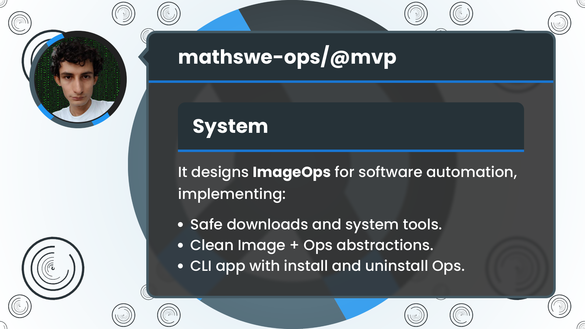

<!-- Copyright (c) 2024 Tobias Briones. All rights reserved. -->
<!-- SPDX-License-Identifier: CC-BY-4.0 -->
<!-- This file is part of https://github.com/tobiasbriones/blog -->

# Designing Image Ops | MathSwe Ops MVP (2024/08/08)




After initializing the MathSwe Ops project, new designs arise to support the
implementation of software images in Ubuntu for automated operations such as
installing, uninstalling, and reinstalling. The first MVP project is a CLI
application called "System," featuring a modular repository of server and
desktop images that will keep scaling over time.

---

**Add test_file.txt with lorem ipsum**

Jul 17: PR [#1](https://github.com/mathswe-ops/mathswe-ops---mvp/pull/1) merged
into `main <- ops/resources`
by [tobiasbriones](https://github.com/tobiasbriones)
{: .pr-subtitle }

It serves as a sample file to test basic downloads.

---

**Add project system with modules tmp, download**

Jul 18: PR [#2](https://github.com/mathswe-ops/mathswe-ops---mvp/pull/2) merged
into `main <- system` by [tobiasbriones](https://github.com/tobiasbriones)
{: .pr-subtitle }

It creates a new Rust app `system` that will provide the tools for automating
Linux systems, such as installing software safely.

It implements modules for managing system temporal files and performing blocking
downloads with a basic integrity check.

- **Module `tmp`:** It will provide APIs to manipulate system temporary files. A
  program should request to `TmpWorkingDir::new()` its dedicated temporal
  directory to work with, for example, `mathswe-ops_26P8JP/`. It currently
  provides a blocking download method since asynchronous requirements are still
  obscure.
- **Module `download`:** It will implement secure downloads (not necessarily to
  a temporal directory or file).
- **Module `download::hashing`:** It will implement file checksum code to
  compare file hashes for integrity.

The new project `system` started providing modules for programs to get a
dedicated temporal directory to operate within and download tooling capable of
extension for more integrity file checks (besides `SHA-256`).

---

**Add CLI and command APIs**

Jul 20: PR [#3](https://github.com/mathswe-ops/mathswe-ops---mvp/pull/3) merged
into `main <- system` by [tobiasbriones](https://github.com/tobiasbriones)
{: .pr-subtitle }

It initializes a CLI structure with the `clap` library to parse command line
arguments and provides a module `cmd` with an API to call system commands.

---

**Add modules image::*, download::*, package, os, system, exec, with
program-wide structure and refactorization**

Aug 1: PR [#4](https://github.com/mathswe-ops/mathswe-ops---mvp/pull/4) merged
into `main <- system` by [tobiasbriones](https://github.com/tobiasbriones)
{: .pr-subtitle }

It defines and implements modules required for the program's structure,
robustness, and ability to scale and maintain software images.

- `mod package:` It defines what a high-level package needs. It defines:
    - Serializable version types such as `SemVer` and `SemVerRev`.
    - A `Software` record, an essential software product model.
    - A `Package` record to model a high-level software package.
- Performs various module redesigns to fit scalability and maintenance needs
  with type safety.
- Implements GPG signature verification with `download::Integrity::Gpg(GpgKey)`
  for downloaded files requiring this method (like Zoom).
- Implements serialization of image information that changes a lot, or is
  volatile, such as versions (e.g., `SemVer`). For example, `ZoomInfo` with
  version, and GPG key with its fingerprint.
- `mod image::desktop:` It implements the images of type `DesktopImageId` for
  software that only works for desktop GUIs, such as Zoom. It tests the current
  operations and system design with the image `Zoom.`
- `mod image::server:` It implements the images of type `ServerImageId` for
  software that works in general for server or workstation/desktop, such as Rust
  It tests the current operations and system design with the image `Rust.`
- `mod os:` It provides OS-level command implementations to abstract away from
  `ImageOps.`
- `mod system:` It contains the main program module.
- `mod exec:` It takes responsibility for the last layer of the (user-facing)
  program execution.

These changes provide modules to **structure the program**, **safe downloads**
(to temporal directories) with `Integrity::Gpg` verification (besides the
`Sha256` `Hash` provided before), and **proof of concept** via the
`DesktopImageId::Zoom` and `ServerImageId::Rust` `ImageOps` implementations.

Serialization of volatile image information that changes frequently, thus
requiring high maintenance (commits, reviews, etc.) goes to a `JSON` file in the
program directory. Changing data such as image version and checksum goes to its
info file while domain data belongs inside the program memory. Therefore,
**hacking the program is minimized or disallowed** since the `Image` `JSON` file
only contains minimal data. For example, it only contains its version, not the
whole `Url` to fetch from, so the `HTTPS` protocol and the correct `Url` domain
name (which don't have to change) are always safe since that data is part of the
**program domain**.

Recall that `Image` models and their serializable (`JSON`) info go on a
case-by-case basis allowing **`Image` customization**.

Modules `system` and `exec` implement terminal operations, such as user-friendly
program messages while consuming abstractions like `ImageOps` with traits such
as `Image`, `Install`, and `Uninstall`.

Modules `image::desktop` and `image::server` demonstrated the system design with
(currently side effect) automated and manual testing. Adding more images is
maintainable and relatively stable from now on.

---

**Clean boilerplate with ImageLoadContext and Implement GoImage**

Aug 4: PR [#5](https://github.com/mathswe-ops/mathswe-ops---mvp/pull/5) merged
into `main <- system` by [tobiasbriones](https://github.com/tobiasbriones)
{: .pr-subtitle }

It adds the `ImageLoadContext` abstraction that provides the otherwise
boilerplate at each image module, so images only need a `new` constructor
instead of three.


<figure>
<div class="header user-select-none headerless">
    <div class="caption">
        
    </div>

    <div class="menu">
        

        <button type="button" data-code="let info_loader = ImageInfoLoader::from(
    &amp;self.id, PathBuf::from(&quot;image&quot;), PathBuf::from(&quot;&quot;)
);
let ctx = ImageLoadContext::new(&amp;os, info_loader);
let image = match self.id {
    Rust =&gt; ImageLoadContext::basic_image_from(os, RustImage::new),
    Go =&gt; ctx.load(GoImage::new)?,
};

&#x2F;&#x2F; `RustImage::new` only requires `Os`, hence &quot;Basic.&quot;
&#x2F;&#x2F; `GoImage::new` requires Os and `GoInfo.`

&#x2F;&#x2F; `ctx.load` abstracts away loading the info JSON file,
&#x2F;&#x2F; the boxing, and calls the constructor.
" onclick="onCopyCodeSnippet(this)">
            <span class="material-symbols-rounded">
            content_copy
            </span>

            <div class="tooltip">
                Copied
            </div>
        </button>
    </div>
</div>

```rust
let info_loader = ImageInfoLoader::from(
    &self.id, PathBuf::from("image"), PathBuf::from("")
);
let ctx = ImageLoadContext::new(&os, info_loader);
let image = match self.id {
    Rust => ImageLoadContext::basic_image_from(os, RustImage::new),
    Go => ctx.load(GoImage::new)?,
};

// `RustImage::new` only requires `Os`, hence "Basic."
// `GoImage::new` requires Os and `GoInfo.`

// `ctx.load` abstracts away loading the info JSON file,
// the boxing, and calls the constructor.
```



{{ markdownContent | markdownify }}

<div class="abstract">ImageLoadContext Saves the State to Build and Image</div>

<figcaption>Client Code Using ImageLoadContext</figcaption>
</figure>

Integration of `ImageLoadContext` removes two extra constructors (`from` and
`load_with`) boilerplate from each image module since image loading should
follow the same pattern.

It also implements the `GoImage` with particularities such as decompressing
(untar) files, using the `usr/local` system directory, and adding and removing
environment variables.

The `ImageLoadContext` integration makes the client code smoother and safer
while the `GoImage` implementation keeps adding more features to the repository.

---

**Implement images Java, Gradle and add SemVerVendor**

Aug 5: PR [#6](https://github.com/mathswe-ops/mathswe-ops---mvp/pull/6) merged
into `main <- system` by [tobiasbriones](https://github.com/tobiasbriones)
{: .pr-subtitle }

It implements the `JavaImage` and `GradleImage` as well as a new version
definition `SemVerVendor` to support images with versions such
as `java x.y.z-amzn` containing the `SemVer` followed by the vendor to fetch
from.

---

The new System CLI application introduces a modular, relatively scalable, and
secure design to add software images with automated operations such as
installing, uninstalling, and reinstalling on a case-by-case basis.


<figure>
<div class="header user-select-none headerless">
    <div class="caption">
        
    </div>

    <div class="menu">
        

        <button type="button" data-code="src&#x2F;
├── cmd.rs
├── download
│   ├── gpg.rs
│   └── hashing.rs
├── download.rs
├── exec.rs
├── image
│   ├── desktop.rs
│   ├── repository.rs
│   └── server.rs
├── image.rs
├── main.rs
├── os.rs
├── package.rs
├── resources.rs
├── system.rs
└── tmp.rs
" onclick="onCopyCodeSnippet(this)">
            <span class="material-symbols-rounded">
            content_copy
            </span>

            <div class="tooltip">
                Copied
            </div>
        </button>
    </div>
</div>

```
src/
├── cmd.rs
├── download
│   ├── gpg.rs
│   └── hashing.rs
├── download.rs
├── exec.rs
├── image
│   ├── desktop.rs
│   ├── repository.rs
│   └── server.rs
├── image.rs
├── main.rs
├── os.rs
├── package.rs
├── resources.rs
├── system.rs
└── tmp.rs
```



{{ markdownContent | markdownify }}


<figcaption>Current System Structure</figcaption>
</figure>

Modules `download::*`, provide secure (blocking) downloads with verifications
such as `HTTPS` protocol and checksum/GPG.

Implementation details live in modules like `cmd` (command line abstractions),
`tmp` (system temporal files), and `os` (supported OSs and common low-level
functionalities like installing `deb` packages).

Modules such as `image` and `package` define application abstractions.

There are a lot of minor details to work out, considering the project is an MVP
barely targeting its initial release. Issues can be like "unit" tests that
perform side effects requiring mocking and testing complicated/terminal side
effect operations.

Other challenges will cover detecting if the OS has the correct state before
operating, for example, checking that software or parts of it are not installed
in the OS before executing `install`, and esoteric handling of software versions
already installed with different procedures to maintain. Such challenges have no
priority now, but the engineering-grade SWAM will require them.

Conversely, crucial parts of modules with priority will always have robust
engineering, according to expectations. As said, the project is an MVP grade
with its priorities. It matters to address the "Minimum" part of MVP with good
engineering while lowering the bar for the rest of the requirements.

As I said in
[Initializing the MathSwe Ops GitHub Organization (2024/06/19)](/initializing-the-mathswe-ops-github-organization-2024-06-19),
the OS is full of mutable states or side effects compared to pure MSW, as well
as many other insights.

In the application side, modules `image::*`, provide the repository and modular
organization of concrete software images. The project organizes images into two
high-level categories, namely, desktop and server. Desktop images are software
like Zoom (`ZoomImage`) that only works with GUI, while server images are the
rest that work on any machine (including desktop) like Rust (`RustImage`).


<figure>
<div class="header user-select-none headerless">
    <div class="caption">
        
    </div>

    <div class="menu">
        

        <button type="button" data-code="├── image
│   ├── desktop.rs      -- mod zoom
│   ├── repository.rs
│   └── server.rs       -- mods rust, go, sdkman, java, gradle
├── image.rs            -- Abstraction
" onclick="onCopyCodeSnippet(this)">
            <span class="material-symbols-rounded">
            content_copy
            </span>

            <div class="tooltip">
                Copied
            </div>
        </button>
    </div>
</div>

```
├── image
│   ├── desktop.rs      -- mod zoom
│   ├── repository.rs
│   └── server.rs       -- mods rust, go, sdkman, java, gradle
├── image.rs            -- Abstraction
```



{{ markdownContent | markdownify }}

<div class="abstract">Each Image belongs to a Submodule</div>

<figcaption>Scalability of Software Images</figcaption>
</figure>

Modules such as `main`, `system`, and `exec` implement terminal client code
employing the mentioned abstractions, such as `ImageOps`, as the CLI application
entrance.

A command would look like `cargo run -- install java`, with other operations,
like `uninstall` and `reinstall`. Besides, images with information serialization
require their `JSON` file in the `./image` directory.


<figure>
<div class="header user-select-none ">
    <div class="caption">
        Image Info
    </div>

    <div class="menu">
        

        <button type="button" data-code="{
  &quot;version&quot;: &quot;21.0.4-amzn&quot;
}
" onclick="onCopyCodeSnippet(this)">
            <span class="material-symbols-rounded">
            content_copy
            </span>

            <div class="tooltip">
                Copied
            </div>
        </button>
    </div>
</div>

```
{
  "version": "21.0.4-amzn"
}
```



{{ markdownContent | markdownify }}

<div class="abstract">Java Version as SemVerVendor</div>

<figcaption>Record JavaInfo Serialized</figcaption>
</figure>

The CLI supports version formats (defined in `package.rs`) such as `SemVer`
(semantic versioning), `SemVerRev` (four digits), and `SemVerVendor`. So,
application models also ensure type safety for serialized records.

The target OS is Ubuntu, so any Ubuntu machine user, either server or
desktop/workstation, can benefit from the CLI for automating while hiding
undesired implementation details, such as package particularities and
lower-level operations.

The current advancements in the "MathSwe Ops MVP: System" CLI application
provide well-engineered modules to add and continue refactoring concrete
software images for OS automation goals. While I develop the MVP, its
engineering-grade version is in mind with its DSL. These first PRs allow us to
expand more image implementations so the project will be ready for its initial
release.


