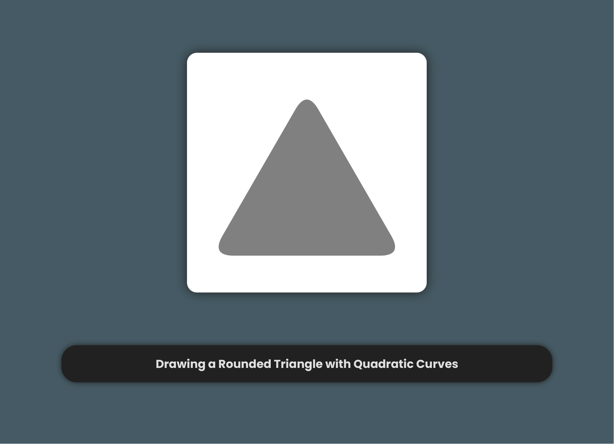

<!-- Copyright (c) 2023 Tobias Briones. All rights reserved. -->
<!-- SPDX-License-Identifier: CC-BY-4.0 -->
<!-- This file is part of https://github.com/tobiasbriones/blog -->

# Drawing a Rounded Triangle via Quadratic Curves (2023/12/22)


<p align="center">
<b>
Derived from
<a href="static/notice#cover">Pixabay</a> Background Images
</b>
</p>

---

I added support for rounded triangles to the Canvas Play JavaFX project using
quadratic Bézier curves.

I was in a hurry for this shape since I'm resembling the fractal
[I drew for fun in JS some months ago](https://blog.mathsoftware.engineer/an-excited-time-drawing-mandala-fractals-today-2023-04-06).

Rounded triangles will be part of my still unpublished blog EP for drawing a
"Sierpinski Petal Fractal in JavaFX."

I used quadratic Bézier curves to define the borders given the radius at each of
the three vertexes.

Moreover, I took extra time today to build the presentation from the drawing so
the code is left clear —as always, optimizing for quality and caring about my
readers.

<div>
<div id="drawing-a-rounded-triangle" class="carousel slide " data-bs-ride="false"
>
<div class="carousel-indicators">
    <button
    type="button"
    data-bs-target="#drawing-a-rounded-triangle"
    data-bs-slide-to="0"
    aria-label="Slide 1"
    class="active"
    aria-current="true"
>
</button>
<button
    type="button"
    data-bs-target="#drawing-a-rounded-triangle"
    data-bs-slide-to="1"
    aria-label="Slide 2"
    class=""
    
>
</button>
<button
    type="button"
    data-bs-target="#drawing-a-rounded-triangle"
    data-bs-slide-to="2"
    aria-label="Slide 3"
    class=""
    
>
</button>
<button
    type="button"
    data-bs-target="#drawing-a-rounded-triangle"
    data-bs-slide-to="3"
    aria-label="Slide 4"
    class=""
    
>
</button>
<button
    type="button"
    data-bs-target="#drawing-a-rounded-triangle"
    data-bs-slide-to="4"
    aria-label="Slide 5"
    class=""
    
>
</button>
<button
    type="button"
    data-bs-target="#drawing-a-rounded-triangle"
    data-bs-slide-to="5"
    aria-label="Slide 6"
    class=""
    
>
</button>
<button
    type="button"
    data-bs-target="#drawing-a-rounded-triangle"
    data-bs-slide-to="6"
    aria-label="Slide 7"
    class=""
    
>
</button>
<button
    type="button"
    data-bs-target="#drawing-a-rounded-triangle"
    data-bs-slide-to="7"
    aria-label="Slide 8"
    class=""
    
>
</button>
</div>

<div class="carousel-inner">
    <div class="carousel-item active">
    
</div>
<div class="carousel-item ">
    
</div>
<div class="carousel-item ">
    
</div>
<div class="carousel-item ">
    
</div>
<div class="carousel-item ">
    
</div>
<div class="carousel-item ">
    
</div>
<div class="carousel-item ">
    
</div>
<div class="carousel-item ">
    
</div>
</div>


<button
    class="carousel-control-prev"
    type="button"
    data-bs-target="#drawing-a-rounded-triangle"
    data-bs-slide="prev"
>
   <div class="icon">
     <span
        class="carousel-control-prev-icon"
        aria-hidden="true">
     </span>
   </div>
    <span class="visually-hidden">Previous</span>
</button>

<button
    class="carousel-control-next"
    type="button"
    data-bs-target="#drawing-a-rounded-triangle"
    data-bs-slide="next"
>
   <div class="icon">
     <span
        class="carousel-control-next-icon"
        aria-hidden="true">
      </span>
    </div>
    <span class="visually-hidden">Next</span>
</button>


<button type="button" class="zoom">
<span class="material-symbols-rounded enter">
zoom_in
</span>

<span class="material-symbols-rounded exit">
zoom_out
</span>
</button>

<button type="button" class="fullscreen">
<span class="material-symbols-rounded enter">
fullscreen
</span>

<span class="material-symbols-rounded exit">
fullscreen_exit
</span>
</button>

</div>

<h5>Drawing a Rounded Triangle</h5>

</div>

The "low-level" canvas code follows the same step-by-step model.


<figure>
<div class="header user-select-none headerless">
    <div class="caption">
        
    </div>

    <div class="menu">
        

        <button type="button" data-code="ctx.beginPath();
ctx.moveTo(base.sx(), base.cy());
ctx.lineTo(base.ex(), base.cy());

ctx.quadraticCurveTo(
    base.ex() + arc,
    base.cy(),
    right.ex(),
    right.ey()
);

ctx.lineTo(right.sx(), right.sy());

ctx.quadraticCurveTo(
    base.cx(),
    base.cy() - height,
    left.ex(),
    left.ey()
);

ctx.lineTo(left.sx(), left.sy());

ctx.quadraticCurveTo(
    base.sx() - arc,
    base.cy(),
    base.sx(),
    base.cy()
);
" onclick="onCopyCodeSnippet(this)">
            <span class="material-symbols-rounded">
            content_copy
            </span>

            <div class="tooltip">
                Copied
            </div>
        </button>
    </div>
</div>

```java
ctx.beginPath();
ctx.moveTo(base.sx(), base.cy());
ctx.lineTo(base.ex(), base.cy());

ctx.quadraticCurveTo(
    base.ex() + arc,
    base.cy(),
    right.ex(),
    right.ey()
);

ctx.lineTo(right.sx(), right.sy());

ctx.quadraticCurveTo(
    base.cx(),
    base.cy() - height,
    left.ex(),
    left.ey()
);

ctx.lineTo(left.sx(), left.sy());

ctx.quadraticCurveTo(
    base.sx() - arc,
    base.cy(),
    base.sx(),
    base.cy()
);
```



{{ markdownContent | markdownify }}


<figcaption>Canvas Drawing of a Rounded Triangle</figcaption>
</figure>

So, the test is left to give some guarantees about the API stability.


<figure>
<div class="header user-select-none headerless">
    <div class="caption">
        
    </div>

    <div class="menu">
        

        <button type="button" data-code="@Test
void drawEquilateralRoundTriangle() {
    var color = Color.GRAY;

    actualCanvas(canvas -&gt; {
        var prodCanvas = new FxProdCanvas(canvas, 1.0);

        prodCanvas
            .drawingCtx(TriangleDrawing::of)
            .apply(
                new RoundedTriangle(
                    new EquilateralTriangle(
                        200.0,
                        CANVAS_WIDTH &#x2F; 2.0,
                        CANVAS_HEIGHT &#x2F; 2.0
                    ),
                    24.0
                )
            )
            .fill(color);
    });

    matchImage(&quot;rounded-equilateral-triangle.png&quot;);
}
" onclick="onCopyCodeSnippet(this)">
            <span class="material-symbols-rounded">
            content_copy
            </span>

            <div class="tooltip">
                Copied
            </div>
        </button>
    </div>
</div>

```java
@Test
void drawEquilateralRoundTriangle() {
    var color = Color.GRAY;

    actualCanvas(canvas -> {
        var prodCanvas = new FxProdCanvas(canvas, 1.0);

        prodCanvas
            .drawingCtx(TriangleDrawing::of)
            .apply(
                new RoundedTriangle(
                    new EquilateralTriangle(
                        200.0,
                        CANVAS_WIDTH / 2.0,
                        CANVAS_HEIGHT / 2.0
                    ),
                    24.0
                )
            )
            .fill(color);
    });

    matchImage("rounded-equilateral-triangle.png");
}
```



{{ markdownContent | markdownify }}

<div class="abstract">Experimental Canvas Play API</div>

<figcaption>Rounded Triangle Test Case</figcaption>
</figure>

<figure>
    
    <figcaption>Test Case: Rounded Equilateral Triangle</figcaption>
</figure>

The concern with quadratic curves is that they won't necessarily resemble an
ellipse, which may be (in general) the standard definition for quadratic
polygons besides
[rounded rectangles](/designing-a-rounded-rectangle-against-pragmatic-misconceptions#rounded-rectangle)
I designed mathematically via ellipses for the soft corners.

So, using a technique like quadratic curves can generalize to solve the problem
for any rounded polygon, but I have to be careful with the design —as always.

Supporting rounded rectangles and triangles is a great step for the current
Canvas Play in JavaFX while solving many other design challenges under the
hood.


