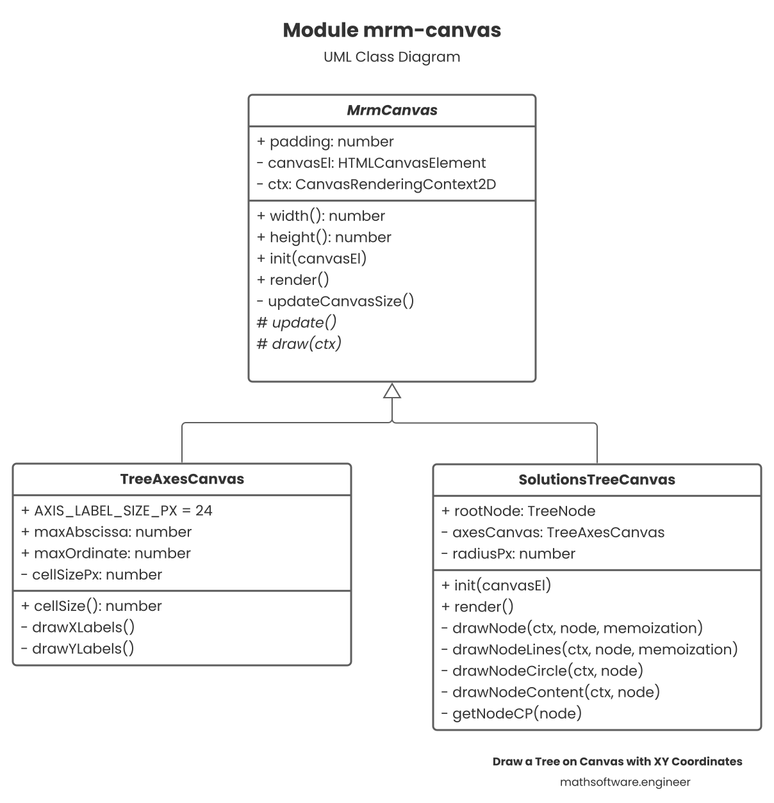

# Draw a Tree on Canvas with XY Coordinates

## Requirements

### Knowledge

Moderate:

- Tree data structure
- Recursion

Basic:

- TS/JS, DOM and Canvas APIs
- HTML
- Trigonometry

### Tools

- Internet Browser
- Text editor/IDE (Webstorm, VSC, ...)
- GitHub
- Tree object (provided [here](root-node.json))

## Development

Two elements are required to draw on the canvas, namely, the 2D-Axis and the
tree which grows horizontally.

### Getting Started

Create into your HTML a `div` containing the `canvas` in which we are going to
draw.

```html

<div id="solutionsTreeParent">
  <canvas id="solutionsTree">
  </canvas>
</div>
```

Some styles can be added.

```css
#solutionsTreeParent {
  width: 100%;
  height: 720px;
  overflow-x: auto;
}
```

Now everything will be programmatically.

Create the module `mrm-canvas` that is going to be developed. It's going to
contain the following specification that is going to be detailed along this
article:



### Data Structures

The solutions tree for the machine replacement model consists of the following
data structure:

```ts
interface TreeNode {
  machineAge: number;
  decisionYear: number;
  k?: TreeNode;
  r?: TreeNode;
}
```

It follows that the independent variable `x` is going to be the `decisionYear`
attribute and the dependent variable `y` the `machineAge`. The tree is binary
which can have two children: `k` and `r`.

Thus, we have a binary tree to draw on a `xy-plane`.

This data structure is an external given model, so you should add it, say, into
a `model.ts` module.

#### Canvas

The following base class is going to manage the canvases. It has the
`HTMLCanvasElement` (with its respective context) member so the drawing is
performed on that canvas element. The init method sets the canvas element and
its size according its parent element. The render method runs a standard game
loop operation when the model is updated and then the drawing is performed with
the new model values computed. That means the tree can be re-rendered in
different states if the `render` method is called.

```ts
abstract class MrmCanvas {
  public padding: number;
  private canvasEl: HTMLCanvasElement;
  private ctx: CanvasRenderingContext2D;

  protected constructor() {
    this.padding = 0;
  }

  get width() {
    return this.canvasEl.width;
  }

  get height() {
    return this.canvasEl.height;
  }

  init(canvasEl: HTMLCanvasElement) {
    this.canvasEl = canvasEl;
    this.ctx = this.canvasEl.getContext('2d');
    this.updateCanvasSize();
    this.update();
  }

  render() {
    this.update();
    this.draw(this.ctx);
  }

  private updateCanvasSize() {
    const parentEl = document.getElementById(parentElId);
    this.canvasEl.width = parentEl.offsetWidth - this.padding;
    this.canvasEl.height = parentEl.offsetHeight - this.padding;
  }

  protected abstract update();

  protected abstract draw(ctx: CanvasRenderingContext2D);
}
```

### Drawing the Axes

First, the axes lines are easily drawn:

```ts
ctx.font = '12px Poppins';
ctx.fillStyle = 'black';

ctx.moveTo(this.padding, 0);
ctx.lineTo(this.padding, this.height - this.padding);
ctx.lineTo(this.width, this.height - this.padding);
ctx.lineWidth = 1;
ctx.stroke();
```

To draw the `X` axis labels, set the text align center and draw the abscissa
value from `0` until a maximum set value. There is a variable `cellSizePx` that
tells the width and height of each cell in the `xy` plane (first quadrant).

```ts
ctx.textAlign = 'center';

for (let i = 0; i <= this.maxAbscissa; i++) {
  const x = (i * this.cellSizePx) + this.padding;
  ctx.fillText(String(i), x, this.height);
}
```

For drawing the `Y` axis labels some minor considerations are taken into account
to draw it properly.

```ts
ctx.textAlign = 'start';

for (let i = 1; i <= this.maxOrdinate; i++) {
  const y = this.height - (i * this.cellSizePx) - this.padding;
  ctx.fillText(String(i), 0, y);
}
```

These results are compiled into the `TreeAxesCanvas` class:

```ts
class TreeAxesCanvas extends MrmCanvas {
  public static readonly AXIS_LABEL_SIZE_PX = 24;
  public maxAbscissa: number;
  public maxOrdinate: number;
  private cellSizePx: number;

  constructor() {
    super();
    this.padding = TreeAxesCanvas.AXIS_LABEL_SIZE_PX;
    this.maxAbscissa = 5;
    this.maxOrdinate = 8;
  }

  get cellSize() {
    return this.cellSizePx;
  }

  protected update() {
    this.cellSizePx = this.width / 6;
  }

  protected draw(ctx) {
    ctx.font = '12px Poppins';
    ctx.fillStyle = 'black';

    ctx.moveTo(this.padding, 0);
    ctx.lineTo(this.padding, this.height - this.padding);
    ctx.lineTo(this.width, this.height - this.padding);
    ctx.lineWidth = 1;
    ctx.stroke();
    this.drawXLabels(ctx);
    this.drawYLabels(ctx);
  }

  private drawXLabels(ctx) {
    ctx.textAlign = 'center';

    for (let i = 0; i <= this.maxAbscissa; i++) {
      const x = (i * this.cellSizePx) + this.padding;
      ctx.fillText(String(i), x, this.height);
    }
  }

  private drawYLabels(ctx) {
    ctx.textAlign = 'start';

    for (let i = 1; i <= this.maxOrdinate; i++) {
      const y = this.height - (i * this.cellSizePx) - this.padding;
      ctx.fillText(String(i), 0, y);
    }
  }
}
```

### Drawing the Tree

The tree canvas is quite more complicated. The class consists of the following
structure:

```ts
class SolutionsTreeCanvas extends MrmCanvas {
  private readonly axesCanvas: TreeAxesCanvas;
  public rootNode: TreeNode;
  private radiusPx: number;

  constructor() {
    super();
    this.axesCanvas = new TreeAxesCanvas();
    this.rootNode = newTreeNode();
  }

  init(canvasEl) {
    super.init(canvasEl);
    this.axesCanvas.init(canvasEl);
  }

  render() {
    super.render();
    this.axesCanvas.render();
  }

  protected update() {
    this.radiusPx = this.axesCanvas.cellSize / 4;
  }

  protected draw(ctx) {
    const memoization = new Set<string>();

    this.drawNode(ctx, this.rootNode, memoization);
  }

  private drawNode(ctx: CanvasRenderingContext2D, node: TreeNode, memoization: Set<string>) {/* ... */}

  private drawNodeLines(ctx: CanvasRenderingContext2D, node: TreeNode, memoization: Set<string>) {/* ... */}

  private drawNodeCircle(ctx: CanvasRenderingContext2D, node: TreeNode) {/* ... */}

  private drawNodeContent(ctx: CanvasRenderingContext2D, node: TreeNode) {/* ... */}

  private getNodeCP(node: TreeNode) {/* ... */}
}
```

Notice we have:

- **An axes canvas:** To draw the axes.
- **The root node:** The tree data structure that is going to be drawn.
- **A radius:** A computed value for a node's radius.
- **Memoization:** To avoid drawing nodes that have already been drawn due to
  the recursive algorithm.

Finally, yes, the `drawNode` method is going to be the recursive function. You
can start noticing it is called to draw the root node, so it ends up drawing all
the children recursively.

Regarding the helper method `getNodeCP` we have the following code to get the
center point of the given `node`:

```ts
const cp = {
  x: (node.decisionYear * this.axesCanvas.cellSize) + TreeAxesCanvas.AXIS_LABEL_SIZE_PX,
  y: this.height - (node.machineAge * this.axesCanvas.cellSize) - TreeAxesCanvas.AXIS_LABEL_SIZE_PX
}
```

#### Drawing a Node (`drawNode`)

This is the recursive function to populate the whole tree from the root node. We
take care of memoization to dynamically store the drawn nodes. For correctness
effects we always render the node circle and its content but the node lines and
labels (which are visually significant if rendered more than once) are only
rendered once.

```ts
const point2d = { x: node.decisionYear, y: node.machineAge };
const point2dStr = JSON.stringify(point2d);
const hasNeverBeenDrawn = !memoization.has(point2dStr);

if (hasNeverBeenDrawn) {
  this.drawNodeLines(ctx, node, memoization);
}
this.drawNodeCircle(ctx, node);
this.drawNodeContent(ctx, node);
memoization.add(point2dStr);
```

So, it takes three steps:

- Draw the outgoing lines with their corresponding labels.
- Draw the circle with background and border.
- Draw the node content consisting of its `machineAge` (y-coordinate) attribute.

The method `drawNodeLines` calls back to this method so initiates the recursion
process. That one is left to the end as it's the harder.

#### Node Circle and Content (`drawNodeCircle` and `drawNodeContent`)

These are pretty straightforward.

To draw the circle:

```ts
const { x, y } = this.getNodeCP(node);
ctx.beginPath();
ctx.arc(x, y, this.radiusPx, 0, 2 * Math.PI);
ctx.fillStyle = 'white';
ctx.fill();
ctx.stroke();
```

To draw the content inside the node:

```ts
ctx.font = '24px Poppins';
ctx.textAlign = 'center';
ctx.fillStyle = 'black';
const txt = String(node.machineAge);
const txtMetrics = ctx.measureText(txt);
const txtHeight = txtMetrics.actualBoundingBoxAscent + txtMetrics.actualBoundingBoxDescent;
const { x, y } = this.getNodeCP(node);
ctx.fillText(txt, x, y + txtHeight / 2);
```

Notice in the call to `measureText`, we use an advanced Canvas API to get the
text height and be able to center it vertically. It is horizontally centered
with `ctx.textAlign = 'center'`.

#### Line with Labels from Node to Node (`drawNodeLines`)

First, we need some definitions to address this challenge:

```ts
const padding = TreeAxesCanvas.AXIS_LABEL_SIZE_PX;
const { x, y } = this.getNodeCP(node);
const isNodeNext = (next: TreeNode) => node.machineAge === 1 && next.machineAge === 1;
const isNodeBelow = (next: TreeNode) => node.machineAge < next.machineAge;
```

The `x`, `y` coordinates are the center of the node (Center Point). The arrows
tell us if the next node is just to the right of the current node
(iff both nodes' ordinates are the same and equals to `1` for this problem).

Drawing the line is straightforward:

```ts
const nextX = (next.decisionYear * this.axesCanvas.cellSize) + padding;
const nextY = this.height - (next.machineAge * this.axesCanvas.cellSize) - padding;
ctx.beginPath();
ctx.moveTo(x, y);
ctx.lineTo(nextX, nextY);
ctx.stroke();
```

The rectangle triangle defined by the two node points is going to be useful for
computing the directions for the outgoing lines from the current node to the
next one. We simply use similar triangles to obtain the requesting points.

```ts
const triangle = (next: TreeNode) => {
  const nextCP = this.getNodeCP(next);
  const nextX = nextCP.x;
  const nextY = nextCP.y;
  const triangleX = nextX - x;
  const triangleY = Math.abs(nextY - y);
  const hypotenuse = getHypotenuse(triangleX, triangleY);
  return { triangleX, triangleY, hypotenuse };
};
```

With that information we can draw the lines according to the corresponding
quadrant: up, straight or right, down. The next node is always to the right as
the decision year always increases.

```ts
const drawUpRightLabel = (next: TreeNode, label: string) => {
  const { triangleX, triangleY, hypotenuse } = triangle(next);
  const labelX = x + (triangleX * this.radiusPx / hypotenuse);
  const labelY = y - (triangleY * this.radiusPx / hypotenuse) - 8;
  ctx.fillText(label, labelX, labelY);
};

const drawDownRightLabel = (next: TreeNode, label: string) => {
  const { triangleX, triangleY, hypotenuse } = triangle(next);
  const labelX = x + (triangleX * this.radiusPx / hypotenuse) - 4;
  const labelY = y + (triangleY * this.radiusPx / hypotenuse) + 16;
  ctx.fillText(label, labelX, labelY);
};

const drawRightLabel = (next: TreeNode, label: string) => {
  const { triangleX, triangleY, hypotenuse } = triangle(next);
  const labelX = x + (triangleX * this.radiusPx / hypotenuse) + 4;
  const labelY = y + (triangleY * this.radiusPx / hypotenuse) + 16;
  ctx.fillText(label, labelX, labelY);
};
```

Then just call to one of these functions to draw the appropriate line:

```ts
const drawLabelTo = (next: TreeNode, label: string) => {
  ctx.font = '12px Poppins';
  ctx.textAlign = 'center';
  ctx.fillStyle = 'black';

  if (isNodeBelow(next)) {
    drawUpRightLabel(next, label);
  }
  else if (isNodeNext(next)) {
    drawRightLabel(next, label);
  }
  else {
    drawDownRightLabel(next, label);
  }
};
```

Finally, to implement the method `drawNodeLines` we draw the line to the
"Keep" node and to the "Replace" node making use of recursion:

```ts
if (node.k) {
  drawLineTo(node.k);
  drawLabelTo(node.k, 'K');
  this.drawNode(ctx, node.k, memoization); // Recursive call
}
if (node.r) {
  drawLineTo(node.r);
  drawLabelTo(node.r, 'R');
  this.drawNode(ctx, node.r, memoization); // Recursive call
}
```

The initial method `drawNode` is called recursively (recall that `drawNode` was
the caller and `drawNodeLines` is the callee) and the `memoization`
set is carried to the method call.

### Result

Importing the developed module, the API is consumed as follows:

```ts
const canvasEl = document.getElementById('solutionsTree') as HTMLCanvasElement;
const canvas = new SolutionsTreeCanvas();
const tree = this.solver.getSolutionsTree(); // Replace with your tree

canvas.rootNode = tree;
canvas.init(canvasEl);

canvas.render();
```
