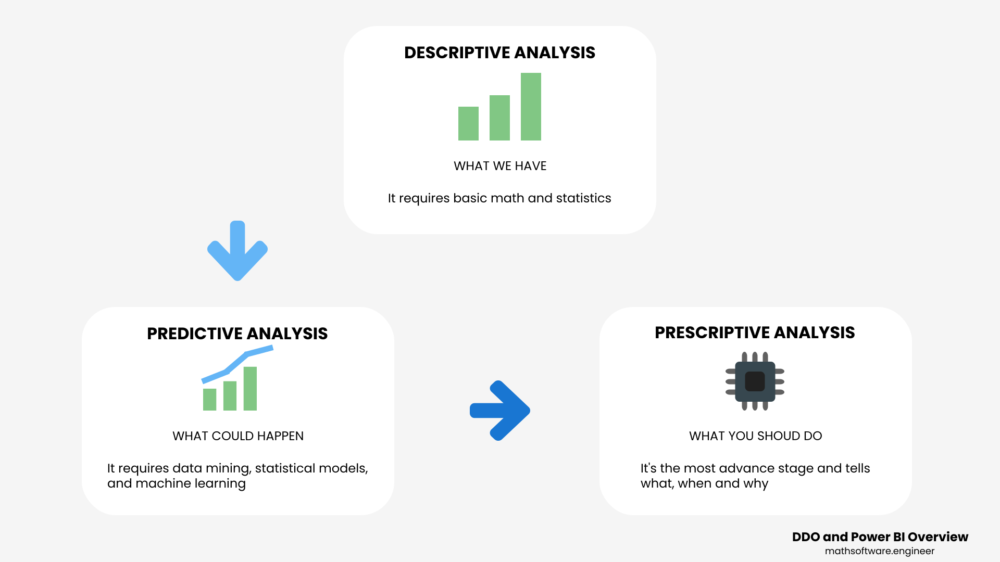

<!-- Copyright (c) 2022 Tobias Briones. All rights reserved. -->
<!-- SPDX-License-Identifier: CC-BY-4.0 -->
<!-- This file is part of https://github.com/tobiasbriones/blog -->

# Data-Driven Organizations and Power BI Overview

<figcaption>

Image from
<it>
<a href="https://pixabay.com/photos/chart-data-business-graph-finance-6765401">Pixabay
</a>
</it>
by Mariakray

</figcaption>

---

An introductory framework about the data-driven culture and why it's fundamental
for any business is given in this article, then an overview is given to
understand software like Power BI or Tableau and how they can be advantageous
for your organization. This information is introductory and useful for any
stakeholder or data analyst.

## Introduction

Organizations should own their data but also have a way to make proper use of
them. Data are facts and with data science, we can infer accurate reports about
what's going on in the organization.

There are many ways of performing data analysis, the most popular are:

- Python libraries (Numpy and Pandas).
- The Julia programming language is a niche for that domain.
- Jupyter Notebooks that can document results with Markdown but run the code
  right there.
- Even other popular programming languages like Kotlin, Java, and C# are used
  for data analysis or similar applications.
- Needless to say, systems programming languages like Rust, C++, or C also take
  part in this adventure for high-performance computations [^1].

[^1]: For example, Python libraries like Numpy are partly written in C so that
    Python is used as a C interface with an easier syntax but the underlying
    code is written in C [6].

Moreover, those are technical ways of developing data science applications. For
end-users, there are plenty of options too. One of the most popular is, of
course, Microsoft Power BI and Excel, and other competition like Tableau.

Power BI is a Microsoft 365 product that consists of apps and services to create
a powerful client for creating end-users reports from data. Like any other
Microsoft product, it uses a binary format, so it's useful for end-users to
understand their data rather than for data professionals.

Even though Power BI is a tool aimed at office professionals, it still allows a
more advanced use for technical staff, but it does not require knowing. Using
Power BI is like using any other tool from the Microsoft Office suite. That
enables an organization to quickly generate reports that may be deployed to the
web, the desktop, or mobile.

### Data-Driven Organization

According to *Building a Data-Driven Organization | O’Reilly Media* [2], a
Data-Driven Organization should have a culture to use data for decision-making,
the organization with the structure to support it, and the technology that
supports it. The key is to develop that culture. Everything is data, for
literally any decision to take, use data as a fact to lead to that decision.

A problem with traditional organizations is requiring the so-called **HIPPO
(Highest-Paid Person in the Office)**
to make decisions [2]. Recall that you also need data permissions to acquire
them, so you usually depend on the HIPPO who will be far from good results,
that's a big problem for the data-driven organization.

Everyone should use data in the organization so the results are more accurate,
and you can check your organization is data-driven when data initiatives are
coming from the bottom of the hierarchy rather than the top or bureaucrats [2].

According to the *Five facts: How customer analytics boosts corporate
performance | McKinsey* [7] survey, states that data-driven organizations
are 23 times more likely to acquire customers, 6.5 times as likely to retain
customers, and 18.8 times as likely to be profitable. That is, 
**organizations leveraging analytics are significantly more competitive than 
those that don't**.

<figcaption>

<strong>Extensive use of customer analytics drives corporate 
performance heavily</strong>

Source: <it>Five facts: How customer analytics boosts corporate
performance | McKinsey</it> [7] (under fair use)
</figcaption>

---

<figcaption>

<strong>Successful companies outperform the competition 
across full customer lifecycle</strong>

Source: <it>Five facts: How customer analytics boosts corporate
performance | McKinsey</it> [7] (under fair use)
</figcaption>

---

### The Role of the CIO

The **CIO (Chief Information Officer)** is the top executive who has the
expertise to take the lead on the organization's information. It is a
professional for the business rather than for the product. The CIO has to make
sure about managing and getting results from the organization's information and
keeping up with the new information technologies. Instead of focusing on the
technical result of a product, the CIO focuses on the business results instead.

According to *Chief Information Officer (CIO)* [3], the definition of CIO is as
follows:

> A chief information officer (CIO) is the company executive responsible for the
> management, implementation, and usability of information and computer
> technologies. Because technology is increasing and reshaping industries
> globally, the role of the CIO has increased in popularity and importance. The
> CIO analyzes how various technologies benefit the company or improve an
> existing business process and then integrates a system to realize that benefit 
> or improvement.
>
> Source: *Chief Information Officer (CIO)* \| Investopedia [3]

As said before, the CIO must keep up with the current technological trends. An
effect of this is that, the definition of CIO before used to be more technical
but now with cloud computing, the new mainstream and emerging technologies there
is a plenty of opportunities for businesses to move faster but, this also
implies the CIO and, most importantly, the whole culture also keep up to date
to be capable of constantly moving forward. This can be resumed into the
following comparison:

| **From**               | **To**                       |
|------------------------|------------------------------|
| IT-outcome-focused     | Business-outcome-focused     |
| Order-taking           | Collaborative agenda-setting |
| Supporting             | Compelling                   |
| Cost-controlling       | Revenue-building             |
| Process re-engineering | Data-exploiting              |
| Sourcing               | Creating                     |
| Function-focused       | Platform-focused             |
| Seeking parity         | Seeking differentiation      |
| Within IT              | Everywhere                   |
| IT-risk-focused        | Business-risk-focused        |

<figcaption>

<strong>
Source: <it>CIO Agenda 2018</it> | Gartner [4]
</strong>

</figcaption>

### Watch Out Fake Friends

I found a fascinating article that actually encouraged me to write this entry.
First, let's see the following quote:

> Without data you’re just a person with an opinion.
>
> --- W. Edwards Deming (patron saint of the Total Quality Management (TQM)
> movement)

Then it makes sense, as stated before, data are facts, and you build science
with facts. If you don't have the facts then you just have an opinion.

Like anything in else in real life, this does not help too much in practice. Now
we know that "Without data you’re just a person with an opinion", right?.

Now check this out. Data are collected from social interactions which turn them
into not-real facts, extremely temporal-and-human-coupled, data are everywhere
nowadays, and finally, you must keep in mind the glorious inequality
**quality > quantity**.

This recalls me
that [Dijkstra](https://en.wikipedia.org/wiki/Edsger_W._Dijkstra)
wanted to make computer software out of theorems proving every library's
correctness, but in real life, computer science is as stated by its name, a
science and not math, so you prove a program wrong with unit testing instead of
directly proving it right. That is also said by
[Robert C. Martin](https://en.wikipedia.org/wiki/Robert_C._Martin) in one his
lectures.

Facts and math are important, but you need to know how to use them properly. An
example can be the correctness proof for a significant subset of the Rust
programming language's safe type system at the
[RustBelt: Securing the Foundations of the Rust Programming Language](https://people.mpi-sws.org/~dreyer/papers/rustbelt/paper.pdf).

The article I talked about at the beginning of this subsection is *Without An
Opinion, You're Just Another Person With Data* | Forbes. Pay attention to
the following interesting assertions:

> ... Roberta Wohlstetter argued that the Japanese attack succeeded because 
> of an overabundance of data: “At the time of Pearl Harbor the circumstances of
> collection in the sense of access to a huge variety of data were…close to
> ideal.” Problems arose, not from too little information, but from too much,
> and from the inability to glean useful "information" from mere "data." She 
> concluded that the job of lifting signals out of a confusion of noise is an
> activity that is very much aided by hypotheses.
> 
> Source: *Without An Opinion, You're Just Another Person With Data* \| 
> Forbes [5]

Having a lot of data is a responsibility and problem that needs to be managed
properly, otherwise it'll never work. This tells us that mere data are not facts
but noise.

Next, we have this quote to conclude this subsection:

> Executives who make effective decisions know that one does not start with 
> facts. One starts with opinions… The understanding that underlies the right 
> decision grows out of the clash and conflict of divergent opinions and out of
> serious consideration of competing alternatives. To get the facts first is
> impossible. There are no facts unless one has a criterion of relevance.”
> --- Peter Drucker
> 
> Source: *Without An Opinion, You're Just Another Person With Data* \|
> Forbes [5]

So, going back to the original quote, watch out instead for
"Without An Opinion, You're Just Another Person With Data". When you get to be
an expert at what you do then you will eventually be able to use data as facts.

### Your Dataset

Consider the following general requirement to make sure your dataset is 
high-quality. Your dataset must be:

- Precise
- Clean
- Unbiased
- Trustable

And of course, your dataset should not be too small to lack information or too 
big to obfuscate the information.

### Next Steps

In this introduction, I hope to had given you enough insight about data-driven
organizations and why you must make proper use of your data, so you can
articulate all this information into useful approaches. Next, I will provide
with the article an overview of Power BI that will help as an entry point to
building reports. That knowledge can also be used for any other tool or concept
in the data science field and, it's not necessarily coupled to Power BI.

## Business Intelligence

Business Intelligence consists of the process to take data as facts and turn
them into informed or objective decisions. That is a long undertake and as said
before, you have to make sure that your whole organization is capable of going
ahead with a data-driven culture.

We have the following definition of Business Intelligence:

> Business intelligence (BI) refers to the procedural and technical
> infrastructure that collects, stores, and analyzes the data produced by a
> company’s activities.
>
> BI is a broad term that encompasses data mining, process analysis, performance
> benchmarking, and descriptive analytics.
>
> Source: *Business Intelligence (BI)* \| Investopedia [8]

The process will follow the next structure:

- Collecting
- Integrating
- Analyzing
- Presenting

### Descriptive Analysis

The descriptive analysis tells you **what has happened or what your organization
has**, and it's the first step of this data analysis process.

This encompasses daily activities like selling reports, inventory, warehouse,
surveys and social media interactions. Hence, the way of performing this
analysis is basic consisting of daily tools like Power BI and entry mathematics
and statistics including also entry visualizations like bar or pie charts.

You must have this stage as it's the base for the rest of the analysis. Many
companies even lack this stage or are not capable of moving forward. If you
don't have descriptive analysis implemented then you're completely lost. If you
are stuck or don't have any data culture initiative, make sure to start here as
soon as possible.

Advanced techniques require lots of data and knowledge, so you must make sure of
doing descriptive analysis.

### Predictive Analysis

As its name states, this data analysis tells or predicts **what could happen in
the future**. Think of it as an extrapolation of your descriptive analysis. It
is a more advanced technique based on probabilities and makes use of data
mining, statistical models, and machine learning.

As it's based on probabilities (like many useful techniques) it is not perfect,
but it yields great results. Make sure to keep your data healthy to get better
insights.

Predictive analysis is useful for the following applications [9]:

- Efficiency
- Customer service
- Fraud detection prevention
- Risk reduction

### Prescriptive Analysis

Lastly, prescriptive analysis is the most advanced technique for data analysis.
It requires lots of data, knowledge, or expertise and the use of models and
tools.

The prescriptive analysis tells **what should be done** in a -what, when, and
why- fashion. It is the main mind that gives you advanced information like why
something might happen, so you can take immediate action to optimize it or fix
it.

Needless to say, if you don't even have a descriptive analysis implementation
then you'll never make it to this stage. That's why **it's crucial to start with
the data-driven culture and data analysis as soon as possible** to not lose
valuable time in your organization.

A downside of this approach is the extensive amount of data required
(internal and external) so machine learning tools can automate inferences, but
it is also not completely accurate due to the usage of probabilities that also
happens with the predictive analysis.

Even though, if well done, the ultimate prescriptive analysis leads the business
to have great insights. Think about all those who didn't make it to this point,
and you will appreciate being here.

Common applications of prescriptive analysis are [9]:

- GPS
- Oil and manufacturing
- Healthcare
- Insurance
- Pharmaceutical research

### Take Away

Data are facts and if you don't have a data-driven culture populated into your
organization then you must start doing so as soon as possible to stay
competitive and optimize your business decision-making and results.

Don't go just for mere data but for your own data, keeping it healthy that is
going to be useful for the accuracy of the models. Also, be careful with your
user's privacy and data privacy laws.

If you are not aware of all these, then you better start pushing these data
analysis techniques as soon as possible. Every competent business must make sure
to have at least descriptive analysis functioning for daily and basic reports
and keep moving forward to be able to make informed decisions.

<figcaption>

<strong>Descriptive Predictive and Prescriptive 
Analysis</strong>

</figcaption>

---

## Power BI Overview

In this section, an overview of Power BI is given to understand what it is and
how can be useful for you as a stakeholder in your business or data analyst.

First, it is absolutely recommended reading the official docs from Microsoft.
They are user-friendly and arranged like a reading course, so you can learn
better about Power BI from
the [Power BI on Microsoft Learn | Microsoft Docs](https://docs.microsoft.com/en-us/learn/powerplatform/power-bi)
resource. This way you can go further with more details.

If you are interested in Power BI is also recommended checking the official blog
[Power BI Blog](https://powerbi.microsoft.com/en-us/blog) where you can find
lots of post about it.

Next, a practical and resumed experience is given to make your getting starting
to this product faster. Recall that other BI analytics products like Tableau
work under the same concepts. There are other similar products doing the same
but Power BI and Tableau are the leading. For example, IBM Watson Analytics is
discontinued according to
[TrustRadius](https://www.trustradius.com/products/ibm-watson-analytics/reviews#overview).

### Available Platforms

Microsoft Power BI offers a variety but not completely options for working.
There's a cloud service similar to what other Microsoft products offer and the
desktop, web, and mobile applications.

You can use the web application at
[app.powerbi.com](https://app.powerbi.com/home) to leverage the collaborative
and cross-platform service offered by the web.

You will likely be using the desktop app to work on your reports. It's important
to know that the desktop app is only available for Windows from its app store
and there's no version for macOS. If you want to use this app on macOS you will
have to emulate it with some visualization software like Wine or VirtualBox.
Recall that you always have the web app available, but professionals should
usually employ desktop apps to have more performance, stability, and features.

Last but not least, there's a mobile app for Android and iOS. With this app,
other users like non-technical stakeholders can get their reports to consume
them. Recall that there would be a scenario where someone is going to develop
the technical task (probably on the desktop app) and there will be at least
someone else who will need to use those results and this is a good use case that
fits the mobile app.

### Pricing

As usual, you have a free version available and then a suite of prices all the
way up as far as your needs require it. There are certain soft limitations with
the free version so if you're not an established business this may hurt your
wallet. Students should not have any problem to use the product and services for
educational or personal purposes.

#### Free

It has:

- Use and collaborate on Power BI in Microsoft Teams.

Also check:

- 1GB of storage, only public report sharing.
- No simultaneous collaboration.

#### Pro

> License individual users with modern, self-service analytics to visualize data
> with live dashboards and reports, and share insights across your organization.
>
> Source: https://powerbi.microsoft.com/en-us/pricing

It has:

- What Free has.
- Create Power BI Pro workspaces.
- Create Power BI Pro workspaces.
- Share datasets, dashboards, and reports with other Power BI Pro users.
- Get intelligent and augmented analytics capabilities.

Also check:

- 10GB of storage.
- Can share with internal users paying the Pro version too.
- On-premises data sources with a Power BI gateway.
- Limits datasets on shared capacity to 8 daily refreshes.

The current pricing for the Pro version is $9.99 per user per month.

#### Premium and More

For a complete comparison among the different paying versions please check the
pricing link given above.

Next they have a Premium per use model at $20 per user per month, and:

> License individual users to accelerate access to insights with advanced AI,
> unlock self-service data prep for big data, and simplify data management and
> access at enterprise scale.

Also check (for Premium):

- 100TB of storage.
- Share with internal users with no Pro license.
- Better scalability and performance.
- Limits datasets on shared capacity to 48 daily refreshes.

A Premium per capacity model from $4,995 per capacity per month, and:

> License your organization with capacity to accelerate access to insights with
> advanced AI, unlock self-service data prep for big data, and simplify data
> management and access at enterprise scale—without per-user licenses for
> content consumers.

And, there's also an Autoscale plan with the following information:

> Respond to occasional, unplanned overage spikes in Power BI Premium
> capacity by automatically adding one vCore at a time per 24-hour period as 
> your organization’s needs change with the flexibility of an Azure 
> subscription.

That is the information you need to know about how Power BI works according to
its usage.

### Data Sources

Power BI allows to use a great amount of data sources to work with the data
contained in those files or databases.

Popular data sources used are:

- Excel
- Text/CSV
- XML
- JSON
- SQL Server
- Access
- Other DBs like Oracle, MySQL, etc.
- Azure SQL
- Power BI datasets
- Dataverse
- Web
- Many more...

They are classified into these data source types:

- File
- Database
- Power Platform
- Azure
- Online
- Other

Data can be normalized or denormalized. Normalized data passed through the
formalization of a relational database (1, 2, 3, etc. Normal Form) in order to
have an optimum way of storing the data with attributes like avoiding
duplications, referential integrity, and storage optimization. On the other
hand, denormalized data is the opposite or normalized, that is, data redundancy
with high query speed but high storage wastage too. What kind of approach to
take depends on the application but a normalized relational model is always
required for modeling business applications because you always find relations in
your business entities (like employees, products, categories, etc.), hence the
usefulness of relational models.

The following approaches are to be considered when adding a new dataset or
creating a new project:

#### Import

This option lets you open a data source and make a copy into Power BI's memory
so that the origin data source is decoupled from the work done on Power BI.

This option works for any data source, that is, files or databases.

#### Direct Query

This is the other option and enables synchronization to keep the connectivity
with your data source. That means that if your database is updated then your
data on your Power BI report will be sync and changes will be reflected.

This option only works for database connections. You can add databases from
localhost, Azure, MySQL, your server, and many options more.

### Power Query

Power Query is a big feature in Power BI that allows to make data
transformations. This is useful when adding your data source to your project, so
you can perform the typical data cleaning, filtering, or curation before going
ahead with your reports.

It extracts data from any data source.

It has transformations like merging, combining, cleaning, or enhancing data.

It loads all data, so they can be processed or analyzed in Power BI.

One downside of this feature is that does not allow you to undo your changes, so
you will have to be careful when performing actions or else you will have to
start again.

#### Common Data Transformations

You can apply the following data transformations:

- Add columns
- Divide columns
- Filter data
- Change data type
- Replace values
- Add queries
- Combine queries

Power BI has data type inference that you customize so for example your data
imported from Excel or CSV will likely have an appropriate data type. Data types
are required to work with Power BI. If you don't have a relational database
already then you will likely have to make more work on this data transformation
stage.

## Power BI vs Tableau

This section contains a quick summary of data found at the links I leave you to
the end.

Both products are the market leaders for analytics and BI platforms. Tableau has
more trajectory (since 2003) while Power BI is newer (since 2011/2013). Both
products have the same objectives, and your knowledge of them is quite
interchangeable.

Key differences are: Tableau works on macOS, Tableau offers more certifications,
prices vary, and Power BI is part of Office 365 so is like using other Microsoft
products, unlike Tableau which integrates easier with Salesforce.

If you want more context and details then go to these resources to make your
conclusions:

[Compare Tableau to Microsoft Power BI: Key Considerations \| Tableau](https://www.tableau.com/compare/tableau-power-bi)

[Power BI vs Tableau: Which one should you choose? \| DataCamp](https://www.datacamp.com/blog/power-bi-vs-tableau-which-one-should-you-choose)

## Conclusion

In this framework, context, data, and analysis were given to introduce the
reader to the importance of implementing a data-driven organization as soon as
possible. Also, an overview about entry tools that anyone can use like Power BI
was detailed so that organizations can learn more about how to get started on
developing analytics, and acquiring value from their data.

## References

[1] Microsoft. (2022). Power BI on Microsoft Learn. Microsoft Docs. Retrieved
March 15, 2022,
from [Power BI on Microsoft Learn | Microsoft Docs](https://docs.microsoft.com/en-us/learn/powerplatform/power-bi).

[2] Thusoo, A. (2022). Creating a Data-Driven Enterprise with DataOps. O’Reilly
Online Learning. Retrieved March 15, 2022,
from [4. Building a Data-Driven Organization - Creating a Data-Driven Enterprise with DataOps [Book] | O’Reilly Media](https://www.oreilly.com/library/view/creating-a-data-driven/9781492049227/ch04.html).

[3] Chief Information Officer (CIO). (2021, June 17). Investopedia. Retrieved
March 15, 2022,
from [Chief Information Officer (CIO) | Investopedia](https://www.investopedia.com/terms/c/cio.asp).

[4] Gartner. (2018). Mastering the New Business Executive Job of the CIO.
[CIO Agenda 2018 | Gartner](https://www.gartner.com/imagesrv/cio-trends/pdf/cio_agenda_2018.pdf).

[5] Silberzahn, M. J. A. P. (2016, March 15). Without An Opinion, You’re Just
Another Person With Data. Forbes. Retrieved March 15, 2022,
from [Without An Opinion, You're Just Another Person With Data | Forbes](https://www.forbes.com/sites/silberzahnjones/2016/03/15/without-an-opinion-youre-just-another-person-with-data/?sh=10542115699f).

[6] Numpy.org. (2022). GitHub - numpy/numpy: The fundamental package for
scientific computing with Python. Numpy | GitHub Repository. Retrieved
March 15, 2022,
from [Numpy | GitHub Repository](https://github.com/numpy/numpy).

[7] Bokman, A., Fiedler, L., Perrey, J., & Pickersgill, A. (2018, February 5)
. Five facts: How customer analytics boosts corporate performance. McKinsey &
Company. Retrieved March 15, 2022,
from [Five facts: How customer analytics boosts corporate performance | McKinsey](https://www.mckinsey.com/business-functions/marketing-and-sales/our-insights/five-facts-how-customer-analytics-boosts-corporate-performance).

[8] Investopedia. (2021, June 23). How Business Intelligence – BI Works.
Retrieved March 16, 2022,
from [Business Intelligence (BI) | Investopedia](https://www.investopedia.com/terms/b/business-intelligence-bi.asp).

[9] UNSW Online. (2020, January 29). Descriptive, Predictive, Prescriptive
Analytics | UNSW Online. Retrieved March 16, 2022,
from [Descriptive, Predictive & Prescriptive Analytics: What are the differences? | UNSW Online](https://studyonline.unsw.edu.au/blog/descriptive-predictive-prescriptive-analytics).
