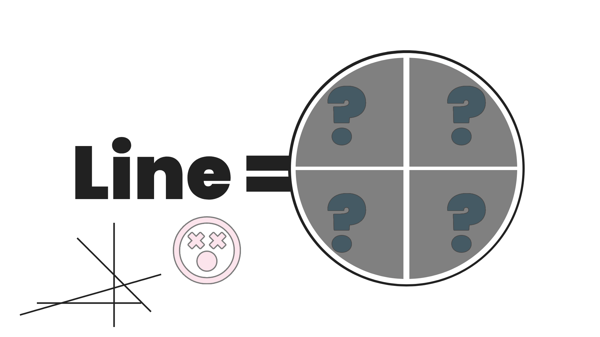

<!-- Copyright (c) 2023 Tobias Briones. All rights reserved. -->
<!-- SPDX-License-Identifier: CC-BY-4.0 -->
<!-- This file is part of https://github.com/tobiasbriones/blog -->

# Ensuring Principle Compliance: This Line Sum Type is Not a Partition (2023/12/07)



---

A Line shape from the initial DSL in Canvas Play is a study case of why sum
types must induce partitions in their underlying set, emphasizing the need to
comply with mathematical principles to detect these flaws.

## Initial DSL for Drawing Shapes in Canvas Play

Lately, I designed a small math DSL in Java and JavaFX for drawing high-level 2D
shapes in my new project
[Canvas Play](https://github.com/tobiasbriones/canvas-play), which I'm currently
preparing for the first PR including the initial design of this DSL.

I don't plan to use Java in the long term (Kotlin, HTML5, Purescript, etc. are
coming next) since it's more of an exercise language for me. You know, the
"brain muscle."

Designing DSLs requires being a domain expert (i.e., mathematician) and granular
design effort.

Exploiting Java for anything out of the mundane "corporate" software is a severe
challenge, so it's on me. I'm always taking challenges. Of course, it'll never
be a good language for non-conservative programs, but I need the exercises,
hence canvas *play*.

The initial design is currently done, but there are several flaws in this stage
that I need to address.

I always have a paradigm vision in my head. I think about how to solve problems
properly (and trivially) in Haskell and then write the Java code. Since I'm
proficient in Java, I know how to do it "the Java way 😖," after first stating it
in an FP mindset.

This is when the adage of knowing FP turns you into a better programmer takes
place. Of course, I'm a math software engineer and take this to its finest.

So, the final phase of the initial DSL design in Canvas Play has left some
design concerns I should share.

## Sum Types must be Partitions

Complying with the principles is essential to leverage a powerful DSL that
inherits mathematical properties, such as following the potential partitions
created when we define sum types.

A sum type for the set of all triangles $$T$$ has to be a collection of subsets
of triangles, and the sum (union) of them is $$T$$, but they also have to create
a partition.

That is, if `T = Equilateral | Isosceles | Scalene`, then:

$$\bigcup_{A \in T} A = T$$

And they're disjoint subsets: $$\forall A,B \in T \implies A \cap B =
\emptyset$$.

Remember that, "Two sets are called disjoint if, and only if, they have no
elements in common"[1].

This is a form of polymorphism where the subsets of the partition (the product
types like `Equilateral`) share the same *physical*[^1] properties, so **we can
simplify (or homogenize) our problem** if we need to work with equilateral
triangles in specific, for instance.

[^1]: The same *physical* properties because they're *product types* or records

An equilateral triangle has its three sides equal, an isosceles two sides and a
scalene triangle has no side length equal. So, `T` is a partition of the set of
all triangles, because an `Equilateral` type can't be `Isosceles`, etc. That is,
the subsets or product types *are mutually disjoint*.

Unlike some kinds of open polymorphisms (like ad hoc), sum types must be created
**to partition a given set** you know well. I mention this because of
*exhaustive pattern matching*.

The class of equilateral triangles allows us to work with simplified equations
and assumptions. Similarly, we can define a triangle as a sum type
(partition) of triangles according to their angle:
`T' = Acute | Right | Obtuse`. Thus leveraging other properties induced by the
equivalence classes of the partition (e.g., can use the Pythagorean theorem for
the class of right triangles).

They're all triangles whether you define them using `T` or `T'`. The difference
is **the property you need to optimize**, like side lengths or angles.

Now, I mention that sum types *should* be partitions or consist of mutually
disjoint subsets (assuming they sum up an underlying set) because the compiler
won't check for that. It's up to your definitions as the designer. So, **sum
types can be created with overlapping subsets, but you have to avoid it**.

If your subsets overlap, two of them may share elements in common, so
implementations (expressions) will be more generic and thus bloated. **If
they're disjoint, you can and know how to optimize since you leave the overhead
behind and decouple the problems**. Then decoupling leads to composition, etc.,
that is, engineering-grade software.

Simplifying by defining sum types for a given set makes implementations more
efficient as well, since equations become trivial for specific problems
(that could be executed many times), unlike general bloated equations.

Remember when the `sin` and `cos` become zero or one, and the expressions become
trivial from the math courses? That's exactly what I'm talking about. Now,
*imagine those simplifications have performance implications*. Hence, **we
engineer math software** —software that inherently comes from math.

If subsets are disjoint, the sum type creates a partition. From this, we can
also infer that *the sum type is an equivalence relation* since **all partitions
induce an equivalence relation** (reflexive, symmetric, and transitive) [2].
**All equivalent relations also induce a partition** on the underlying set [3].

The fact of being a partition (union of mutually disjoint subsets or product
types) **makes sum types Algebraic Data Types (ADTs): operations like sums
(unions), product (cartesian), and properties like equivalent classes are
leveraged to do the algebra**.

This is all basic theory all (competent) software engineers must know well. If
you have a math major and practice real-life SWE, you happen to be on top
theoretically, as that's the breading air of solving problems efficiently. Then
this is not an obstacle for you because you already understand the math
language[^2].

[^2]: Talking to someone who's not a mathematician (even a terrible one, at
    least) is never the same, as they will never speak the same language; between
    math majors, we understand each other because we are formally trained, so
    it's a feeling of being "in family," and I know this because math is a
    closure: you build math with math, you must be part of the closure

I highly recommend reading the references I left if you want to understand
Haskell classes or ad hoc polymorphism —study all about equivalent classes and
partitions.

Sum types are ADTs providing a kind of polymorphism that allows us to create
specific types of a given type with exhausting pattern matching. Even though its
product types can overlap, you must avoid it to create mutually disjoint
subsets, leading to leveraging the properties of partitions to apply ADTs
properly and employ their algebra more powerfully.

## Current Design of a Line Shape

The initial design that came into mind required supporting line segments in
general and trivial types of segments like horizontal or vertical.

The **proper definition of a `Line` is crucial for the DSL** since polygons are
made up of lines, and shapes are filled with solid polygons. That includes a
universe of creations, so the objective here is to notice the current design
flaws. It's an objective as well to create awareness of how important it is to
notice a design.

First, we have the `sealed interface` to denote the union:
`public sealed interface Line extends Shape` in `Line.java`. The records defined
there are `Segment`, `HSegment`, and `VSegment`.

The `Shape` base interface is just defining the `area` for now.

Regarding virtual methods (because this is Java), we have the following:


<figure>
<div class="header user-select-none ">
    <div class="caption">
        interface Line
    </div>

    <div class="menu">
        <button type="button" data-path="current-line-design/Line.java" onclick="onOpenCodeSnippetLink(this)">
    <span class="material-symbols-rounded">
    open_in_new
    </span>
</button>

        <button type="button" data-code="double sx();

double sy();

double ex();

double ey();

Line minus(double minusRadius);

@Override
default double area() {
    return 0.0;
}
" onclick="onCopyCodeSnippet(this)">
            <span class="material-symbols-rounded">
            content_copy
            </span>

            <div class="tooltip">
                Copied
            </div>
        </button>
    </div>
</div>

```java
double sx();

double sy();

double ex();

double ey();

Line minus(double minusRadius);

@Override
default double area() {
    return 0.0;
}
```



{{ markdownContent | markdownify }}


<figcaption>Virtual Methods of a Line</figcaption>
</figure>

The `area` of a `Line` is zero by default since they're one-dimensional shapes,
so they don't have any area in a 2D space.

Now, the product types are implemented as follows.


<figure>
<div class="header user-select-none ">
    <div class="caption">
        interface Line
    </div>

    <div class="menu">
        <button type="button" data-path="current-line-design/Line.java" onclick="onOpenCodeSnippetLink(this)">
    <span class="material-symbols-rounded">
    open_in_new
    </span>
</button>

        <button type="button" data-code="record Segment(
    double sx,
    double sy,
    double ex,
    double ey
) implements Line {
    @Override
    public Segment minus(double minusRadius) {
        var x = ex - sx;
        var y = ey - sy;
        var angle = atan(y &#x2F; x);
        var dx = minusRadius * cos(angle);
        var dy = minusRadius * sin(angle);
        return new Segment(
            sx + dx,
            sy + dy,
            ex - dx,
            ey - dy
        );
    }
}
" onclick="onCopyCodeSnippet(this)">
            <span class="material-symbols-rounded">
            content_copy
            </span>

            <div class="tooltip">
                Copied
            </div>
        </button>
    </div>
</div>

```java
record Segment(
    double sx,
    double sy,
    double ex,
    double ey
) implements Line {
    @Override
    public Segment minus(double minusRadius) {
        var x = ex - sx;
        var y = ey - sy;
        var angle = atan(y / x);
        var dx = minusRadius * cos(angle);
        var dy = minusRadius * sin(angle);
        return new Segment(
            sx + dx,
            sy + dy,
            ex - dx,
            ey - dy
        );
    }
}
```



{{ markdownContent | markdownify }}

<div class="abstract">A Segment Represents an Arbitrary Line Segment</div>

<figcaption>Type Segment of Line</figcaption>
</figure>

There are many "validations" to check, but they must be part of the type system
instead of imperative tricks with primitive-obsession. They're *defined* as much
as the DSL gets more robust.

Notice how a general `Segment` is trivially implemented because of the property
methods `sx`, `sy`, `ex`, and `ey` (start and end points) of `Line`
automatically implemented in `Segment`.

So, `minus` was left to implement, and it had complex expressions to subtract or
trim the segment into a new one. One "minor" flaw is readable since I have to
check for `x` different from zero. Of course, I can't use nasty exceptions.

There's no reason to keep using exceptions in modern programming, but you know,
it's Java. Fun fact 🐯: the `Result` type (used in Android Kotlin, Rust, or
anywhere you want) is a sum type consisting of `Ok` or `Err`.

Then, we have `HSegment` and `VSegment`, which are trivial types of lines.

```java
record HSegment(
    double cx,
    double cy,
    double radius
) implements Line {
    @Override
    public double sx() { return cx - radius; }

    @Override
    public double sy() { return cy; }

    @Override
    public double ex() { return cx + radius; }

    @Override
    public double ey() { return cy; }

    @Override
    public HSegment minus(double minusRadius) {
        return new HSegment(cx, cy, radius - minusRadius);
    }
}

record VSegment(
    double cx,
    double cy,
    double radius
) implements Line {
    @Override
    public double sx() { return cx; }

    @Override
    public double sy() { return cy + radius; }

    @Override
    public double ex() { return cx; }

    @Override
    public double ey() { return cy - radius; }

    @Override
    public VSegment minus(double minusRadius) {
        return new VSegment(cx, cy, radius - minusRadius);
    }
}
```

Something to consider is that all the designs (MathSwe universally) are centered
to be symmetric and simple. So, shapes are drawn from the center by default.

The horizontal and vertical segments **have the same physical structure, so it's
inefficient to keep that redundancy**. The solution can be to *factor out* the
repetition and create a simple (soft) enum (enums can be basic sum types in
Java) to denote *its orientation*.

Well, the solution is not as easy because of what I said about the importance of
getting the `Line` design right at the beginning of this section.

The coordinate properties (start/end points) don't play well and are a bit
redundant. This can be eventually fixed. This happens because `Line` is not a
partition, so concepts get more bloated since we're not working with
**orthogonal** records —*consequences of boilerplate or redundancy*.

One out-of-scope detail to add is a data type for points, so we don't use
raw `double` primitives.

Naming is another frequent severe challenge here 😵. You must be a domain
expert (and FP expert) in granular terms to get this all the way right. It also
takes a huge amount of resources like time, experience, etc.

I work out challenges per layer, like my EPs, blogs, playgrounds, etc.

Now, there are concerns in this playground's incipient stage, but **the
reason for this article comes here: `Line` is not a partition**.

In Haskell terms, we have this definition:


<figure>
<div class="header user-select-none headerless">
    <div class="caption">
        
    </div>

    <div class="menu">
        

        <button type="button" data-code="data Line
    = Segment { sx :: Double, sy :: Double, ex :: Double, ey :: Double }
    &vert; HSegment { cx :: Double, cy :: Double, radius :: Double }
    &vert; VSegment { cx :: Double, cy :: Double, radius :: Double }
" onclick="onCopyCodeSnippet(this)">
            <span class="material-symbols-rounded">
            content_copy
            </span>

            <div class="tooltip">
                Copied
            </div>
        </button>
    </div>
</div>

```haskell
data Line
    = Segment { sx :: Double, sy :: Double, ex :: Double, ey :: Double }
    | HSegment { cx :: Double, cy :: Double, radius :: Double }
    | VSegment { cx :: Double, cy :: Double, radius :: Double }
```



{{ markdownContent | markdownify }}


<figcaption>Definition of Line in Haskell</figcaption>
</figure>

It's readable that *`Segment` defines all the possible line segments, leaving
`HSegment`, `VSegment`, and any other type redundant*, so **the `Line` type has
overlapping (not mutually exclusive) subsets**.

You can also see how the expressions in the `minus` function simplify when
the `angle` is zero or straight (horizontal or vertical line) since
`atan(y / x)`, `cos(angle)`, and `sin(angle)` get trivial. If the segment is
vertical, then `x = ex - sx = 0`, so this implementation of `minus` in
`Segment` will have to play well with *subsets where expressions get trivial*
like `HSegment` or `VSegment` in order to compose.

Adding to what I said about the *repetition* in the records `HSegment` and
`VSegment`: If the physical representation (**hard**) is the same, then the
difference (between a horizontal or vertical line) must be a relation
(**soft**), as I also described before. **These are mathematical rules to
simplify or factorize programs**.

Finally, I finish here without a final solution yet since I'm working in a
playground, leaving the insight and a design so robust will take a much
different approach and language. From now on, I'll keep refactorizing the Java
playground as I go, and as needed because I'm soon creating (and staying)
with the Kotlin and HTML5 playground to optimize the little DSL.

## Identification of Design Flaws in Sum Types

From the initial DSL, I'm about to merge in Canvas Play, I spotted several
(expected) design flaws usual in the incipient development and design stages.
These are related to sum types, so I wrote the documentation about this study
case.

Sum types are ADTs whose algebraic power can be exploited further as far as our
design coherence.

When engineering software, **we must ensure compliance with underlying
principles**, like *inducing partitions in sum types*, since —as said above—
this likely depends on our design or domain to be coherent and not on the
compiler.

It was seen how a triangle sum type creates a partition, where its product types
or records are orthogonal by being mutually disjoint, leading to independent
problems that can be addressed and composed. This is how FP has to be employed.

Regarding the current design of a line in the Java playground, some flaws were
noticed, like the need for mutually disjoint subsets, and hard/physical
duplication of records.

Studying these flaws makes awareness of how essential it is to verify the
compliance of mathematical principles in software and domain design since it is
what opens our minds on how to go through the right way.

## References

[1] Epp, S. (2010). Discrete Mathematics with Applications (4th ed.).Section
6.1: Partitions of Sets.

[2] Epp, S. (2010). Discrete Mathematics with Applications (4th ed.).Section
8.3: Equivalence Relations. Theorem 8.3.1.

[3] Epp, S. (2010). Discrete Mathematics with Applications (4th ed.).Section
8.3: Equivalence Relations. Lemma 8.3.3.


<div class="my-4">
  <div class="subdir-btn my-4">
    <a class="btn" href="current-line-design">
      
      <span>
        Current Line Design
      </span>
    </a>
  </div>
</div>