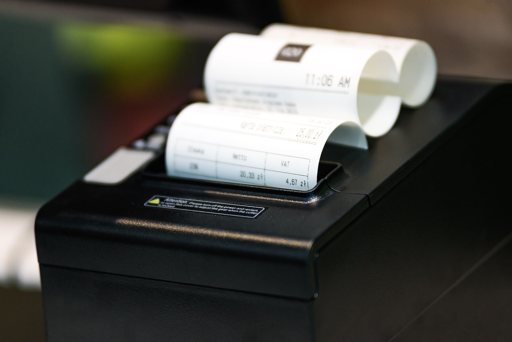
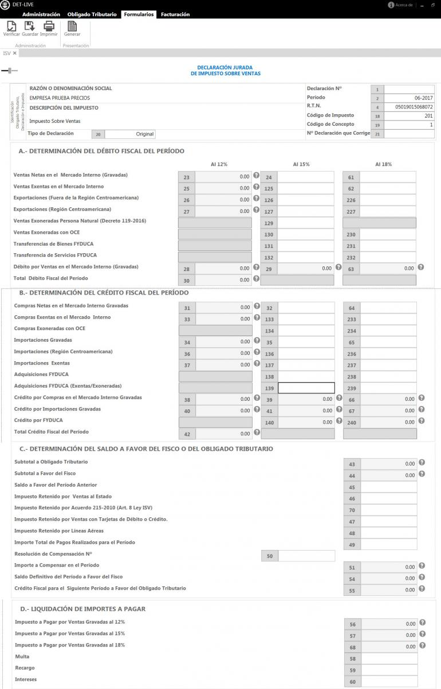

<!-- Copyright (c) 2023 Tobias Briones. All rights reserved. -->
<!-- SPDX-License-Identifier: CC-BY-4.0 -->
<!-- This file is part of https://github.com/tobiasbriones/blog -->

# SAR HN: Sales Tax Overview (2023/08/28)

<figcaption>

Image by
<a href="https://pixabay.com/users/photomix-company-1546875">PhotoMIX-Company</a> via
<a href="https://pixabay.com/photos/cash-register-printer-receipt-store-5610295">Pixabay</a>

</figcaption>

---

## Sales Tax Resources

I enrolled in a course that was available at the SAR learning platform and
closed the past Sunday, August 27.

I'll develop a quick overview of the course contents[1] here, which can also be
stated in other resources like the "Law of Sales Tax"[2] in a complete (and
formal) form.

This way, I can provide a good record overview of the sales tax mechanism in
Honduras.

## Course Takeaways

This is my resume for the course, and take into account that it's informational
only and may not be too accurate since it only covers generalities.

### Sales Tax

First, it's stated that the **sales tax** is applied to the national territory.
It's non-accumulative and is applied at each import and selling stage according
to the law and its regulations.

Now, regarding **sales**, cases are when you interchange or transfer one
merchandise from your domain to another, whether you're a natural person or a
business.

Selling also includes taxable services according to the regulation.

Overall, when you sell a good or give a service, the **tax base** is the value
worth of the good or service (either cash or credit) minus direct expenses.

One of the tax bases for imported goods is their
**CIF (Cost Insurance and Freight)** value and other more specific rights and
taxes.

For other tax bases like merchandise for personal use or gifts, it's to be the
commercial value of the good or service.

Cases **exempt** from the tax base are discounts or boxing if they're returned.

The **taxable event** takes place when you sell goods, so you have a selling
date of the billing or else at the moment when you provide the goods.

This event is also present when you give a service, when you use merchandise for
your own use or as part of the business fixed assets, and when goods are
imported.

A **sworn declaration (affidavit of sales)** has to be provided by the
responsible for collecting this tax every month within its first ten days.

Furthermore, to apply the sales tax, the responsible has to give a billing
(original copy) with the corresponding requirements to the consumer.

The responsible for the sales tax has to subscribe as such to the **SAR (Rent
Administration Service)** by stating their operations beginning or providing
their first declaration.

The sales tax base can generally be of 15% for basic products or 18% for
non-fundamental ones. For alcoholic products, the 18% is applied.

This can be applied to the taxable base value of the imported goods or the
selling of goods and services.

For beers and sodas, the tax is applied to the selling price at the distribution
stage.

It's also interesting that (for alcoholic beverages), the sales tax is applied (
according to the law, and non-accumulative) to the import stage and each selling
stage. For example, 18% is applied to each:

- Production or import,
- Distribution,
- Retailer, and
- Final consumer.

For air transport, you pay 18% for most classes, and 15% for economic class,
except disabled persons who pay 15%.

So overall, this is how the sales tax is originated and applied when sales take
place.

### Exempt Cases

There's a big list of things exempt from paying sales taxes. They can be:

- Popular essential products (with exceptions):
    - Meats.
    - Dairy.
    - Eggs.
    - Vegetables.
    - Fruits.
    - Grains.
    - Bakery.
    - Coffee (up to 1 pound).
    - Other aliment products.
    - Pharmacist products for human use.

- Popular services and products (with exceptions):
    - Equipment for electrical energy generation, and their spare parts.
    - Books, scientific magazines, etc.
    - Minor artisanal sectors.
    - Electric energy for residential fee users
    - Drinking water and sewerage.
    - Professional fees obtained from natural persons.
    - Construction services.
    - Hospitalization services.
    - Clinical laboratories for humans.
    - Other medical services except aesthetic treatments.
    - Ground transportation of passengers.
    - Banking services.
    - Agricultural raw material and tooling.
    - Veterinarian pharmaceutics.

There are more advanced items and constraints, but those give you an idea of
what is exempt from sales taxes.

### Presenting a Declaration

Finally, if you're responsible for the sale tax, you have to declare the
corresponding data to the SAR platform via its **virtual office** and
**"DETlive"** desktop (Windows) application.

You can get trained on how to use these systems by taking this course or
following up on SAR social media to get resources to get more familiar with this
process.

<figcaption>

<strong>
DET Live: ISV Form
</strong>

Source: <it>Declaración Jurada Impuesto Sobre Ventas | DET Live [3] (under fair
use)</it>

</figcaption>

You will have to fill several fields, and others will get autofilled, and once
sent, you can't change it. I'd advise you to have an accountant for this or have
deep knowledge of this accounting domain if you have to do it.

### Time of the Quiz

To complete the course, I answered an online quiz with 20 timed questions, just
like the university (UNAH) tests are.

## References

[1] Curso: Impuesto Sobre Ventas. (2023). Escuela Virtual Tributaria. Retrieved
August 28, 2023,
from [Impuesto Sobre Ventas \| Escuela Virtual Tributaria \| SAR \| gob.hn](https://escuelavirtualtributaria.sar.gob.hn/course/view.php?id=14).

[2] Ley del Impuesto Sobre Ventas Texto Consolidado. (2016, June 10). SEFIN.
Retrieved August 28, 2023,
from [Ley del Impuesto Sobre Ventas Texto Consolidado \| SEFIN \| gob.hn](http://www.sefin.gob.hn/wp-content/uploads/2016/06/TEXTO_CONSOLIDADO_LEY_IMPUESTO_SOBRE_VENTAS_10JUNIO2016.pdf).

[3] Declaración Jurada Impuesto Sobre Ventas | DET Live. (n.d.).
[DETlive \| SAR \| gob.hn](http://detlive.sar.gob.hn/?q=Ayuda-ISV).
