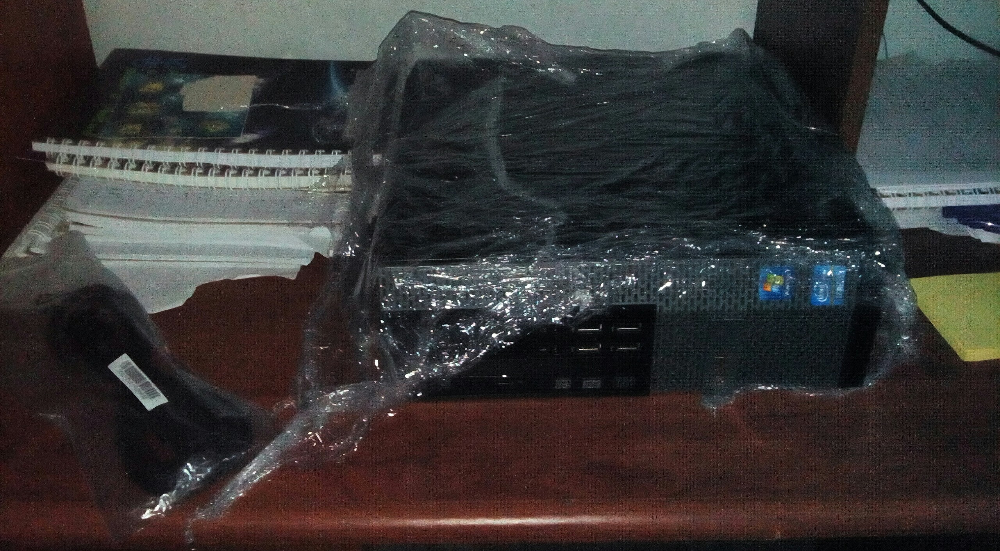
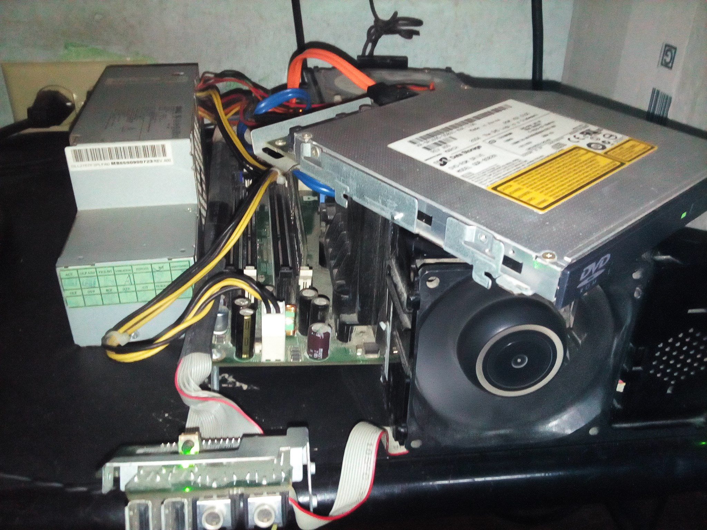
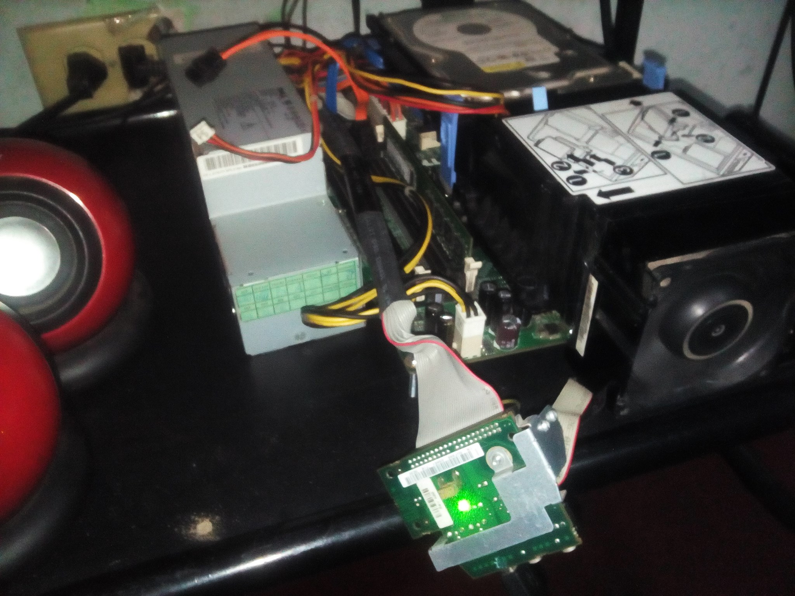
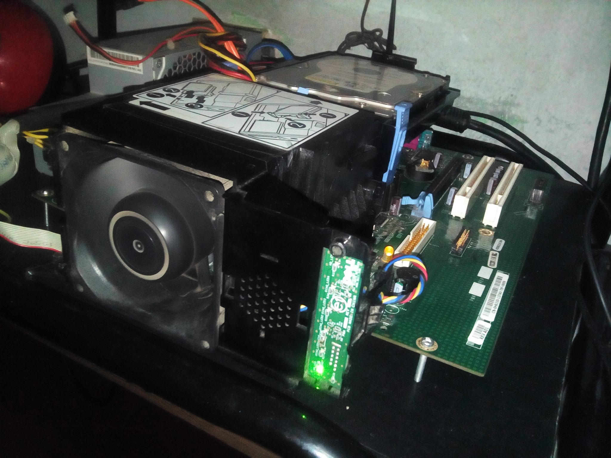
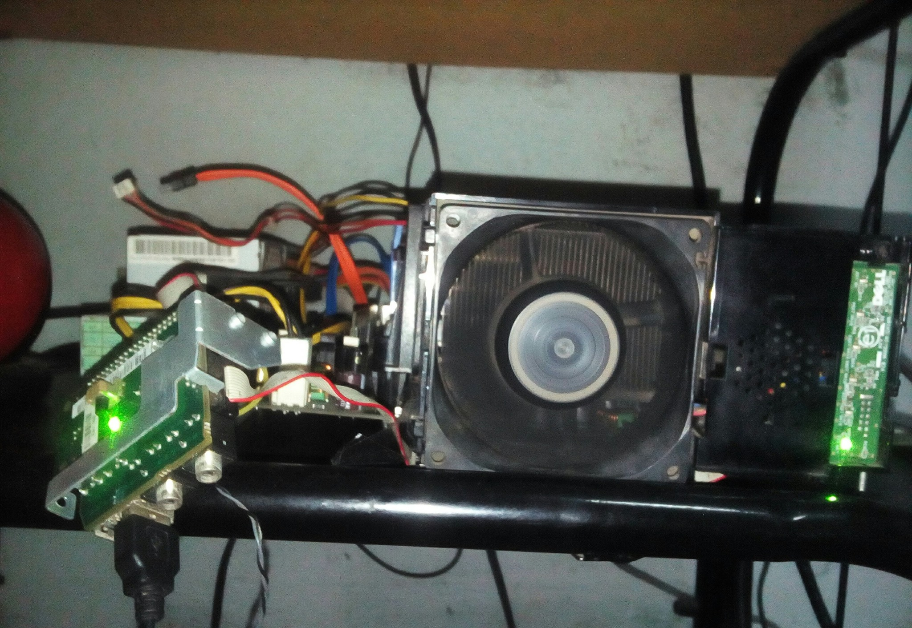
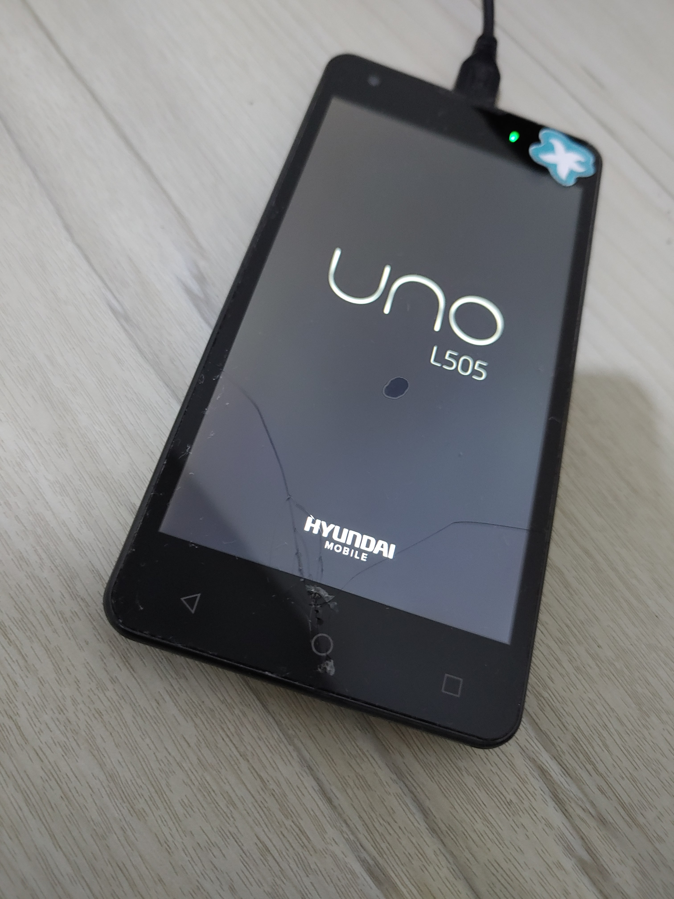
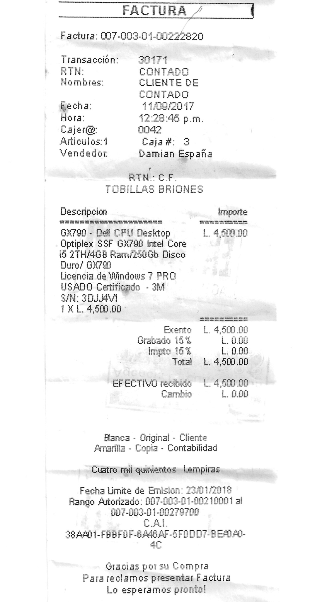
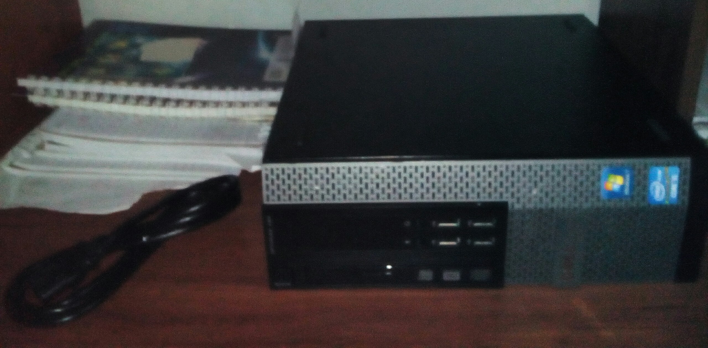

<!-- Copyright (c) 2023 Tobias Briones. All rights reserved. -->
<!-- SPDX-License-Identifier: CC-BY-4.0 -->
<!-- This file is part of https://github.com/tobiasbriones/blog -->

# Celebrating the Possibility of Having a Computer to Work with (2023/09/11)

---

## Inception: The Imaginary Computer and the Cyber Era

I was drawn to computers while I grew up, and my fascination with tech
persisted, leading me to learn through observation. Despite limited resources, I
honed abstract tech skills. These experiences forged my innate tech aptitude,
marking just the start of my tech journey.

When I was a kid (about six years old), I stared at the desktop computers at the
supermarket. They were used to print price tickets, for example. They were old
2000s square PCs, as that was the available tech back then.

So, one day, I even made up a simple and boring cardboard computer to fill the
desire to have one.

I always grew up staring at computers because I never had one, and "I was born
with tech in my traits."

**I've always observed**. That's how I figured out how to use the mouse wheel
and find "information in Google" in the mere beginnings of the 2010s when I
found ways to go to the "cybercafé" to play GTA VC and view Nokia phones[^x].

[^x]: I was always obsessed with Nokia models like N97, N8, 5800, X6, and many
    other good OL' legends since I never had the chance to get any; I lived
    extremely excited to know everything about them and hoped to have one
    someday

Sure, I was so naive that I had to figure out sooner rather than later that I
had to click the Google search results to go to the website instead of staying
with the result snippet only, that I could use the mouse wheel to scroll instead
of dragging the scroll bar, and that the GTA Vice City introduction wasn't
mandatory and could be skipped.

One day, I sat down and imagined in my mind how I played FIFA on the old
square house TV when turned off. I was developing abstract skills out of
need: I couldn't have a decent computer or any at all.

They were learning and gaming times[^x][^x]. I started from nothing at a fast
learning rate, given the extreme limitations.

[^x]: Until today, I've never had a GPU or gaming PC (the closest I've had has
    barely been my current LG G8X, i.e., a 2019 high-end I acquired in late
    2021)

[^x]: I've always been committed to PC and mobile gaming, disregarding any lag,
    and I used to play many good OL' low-spec games in the 2010s out of passion,
    similar to **how I used to read computer and smartphone reviews on the web
    all the time**

Hard times and innate tech skills are what was about in the beginning, but hard
times are just the beginning of the beginning.

## Extreme Decade Challenges

### My Very First Computer

The first computer I had was a gift (because it didn't turn on), but 
I could find the pattern to make it work and give it a try for a 
long while.

The computer was a Dell Optiplex GX270 from 2003 that they gave me near 2011 (if
memory serves me right). The "gift" was due to the machine's state —*it didn't
turn on and was basically trash* 🤯.

It had a trick to turn it on, and as expected —*I'm well known for finding 
mysterious patterns*.

It was a Pentium 4 HT with 512MB DDR of RAM Windows XP and 40GB of HHD disk in
~2011, and it didn't even turn on well 💥.

In a few moments, I was able to find the trick (as far as I remember): I just
had to plug the power cord, and when the LED turns on, quickly unplug it and
plug it back again ✔.

I used first, mobile data[^x] (from my LG Optimus ME I had for a long time, and
after having my Moto Q[^x]) via USB to share the connection, then a residential
`512Kbps` was acquired[^x] to "do homeworks" you know[^x].

[^x]: Fun Fact 🐯: In the beginning (in 2009), I used phone balance
    (with some 3x or 4x balance bonus, I used to buy 1GB packs in the end to
    have one day 👾) to enter the internet in a Samsung phone (not smart) I
    bought at about $30 (then was cheapened to about $10 after I paid for it
    😒), and I dreamed to be able to play web videos on that tiny
    $$96x96 pixels^?$$ brick (something impossible obviously)

[^x]: The Moto Q is one main pillar of my story as it was a failed device, and
    its internet connection never worked, but even so, I hacked into it to get
    internet (GPRS/EDGE) for free

[^x]: For buggy reasons due to the old contract, I guess; I got to have 10Mbps
    speed for months after some years in about 2017, then 512Kbps, then 20Mbps
    other time, then slow again

[^x]: I leveraged everything I could to learn; I've always been self-taught

I haven't mentioned **I never had a monitor until 2019, when I was first able to
buy my HP 22cwa (22" FHD)**.

I used a ~~scholarship~~ service job scholarship[^x] money I got in late 2018
to buy my first monitor and desk to work on.

[^x]: I was persuaded to engage in this university program since I wasn't even
    applicable due to my two simultaneous majors, and it's only about
    bureaucracy and service work, totally unemphatic to super tough careers like
    mathematics due to other issues like incompatible requirements they ask

So, until 2019, I had to use the house TV as a huge 32" monitor, but 720p
resolution 😵. Besides having *extremely low pixel density*, it was getting
older, too.

If that wasn't enough, I had that TV available because it was a supermarket
raffle we won in 2009 by mere chance of life. I don't know what could've
happened if it wasn't for that touch of luck long ago.

Therefore, with all this context, I could endure at the beginning of this tech
era.

My first computer, a Dell Optiplex GX270 from 2003, was a "gift" in ~2011,
albeit not in working condition, but I managed to decipher the pattern to bring
it to life. I didn't even have a monitor until 2019. Until then, I relied on the
32" 720p house TV, and the internet connection was what I could barely afford.

### The First Computer I Bought

Approximately around 2013, I could actually buy a computer: The Dell Optiplex
745, another terrible computer.

I had some savings of about $90 and could afford to buy a refurbished 745 back
then. It was a bad decision: for a few bucks, I could get a Core2Duo version.
Never mind.

The computer was gross: Pentium D 2.8Ghz, 1GB of RAM DDR2, 80GB of HDD
disk, and Windows XP or 7 if I wanted.

If that's not enough, I was also scammed: the HDD failed after a few months
(I had to reinstall Windows 7 every day 🤪 and buy a new disk).

Okay, so I used this computer for a few years more, but the experience was
horrible, like the previous one.

That Pentium D is most likely **the worst dual-core Intel processor**. It got
overly hot, and the fan made so much noise that you could hear it from the house
entrance[^x].

[^x]: When I started using the CPU by opening software, the fan went all the
    way up; remember that ambient temperatures were (still are) about 36 °C most
    of the time

I was learning programming, and one day, I opened up Android Studio (recall, 1
GB of RAM). Say no more. I had to unplug the cord from the power outlet to
unfreeze the computer in its misery 💥. Seriously, Android Studio in 1 GB of
memory? 😆.

I used Eclipse with the Android SDK for many years for Java and Android, from
about 2013 to 2017.

Not to say video games, I played what I could.

Now, something wrong happened in 2016. I was cleaning the PC, but when I closed
the CPU socket, it made a funny noise 🤪. I just had screwed up the CPU socket
pins, and now I had to get a new motherboard.

All Optiplex PCs I've had have been small form factor, by the way.

Unfortunately, I didn't find any spare parts, so I had to settle with a Mini
Tower motherboard I found on eBay.

After receiving the motherboard, I set up everything again, but a mad truth I
knew was coming: it didn't fit in the SFF case 😂:

<figcaption>

<strong>
Optiplex 745 Barebones 1 2016-2017
</strong>

</figcaption>

<figcaption>

<strong>
Optiplex 745 Barebones 2 2016-2017
</strong>

</figcaption>

<figcaption>

<strong>
Optiplex 745 Barebones 3 2016-2017
</strong>

</figcaption>

<figcaption>

<strong>
Optiplex 745 Barebones 4 2016-2017
</strong>

</figcaption>

The solution was to **assemble it barebones** and try to be careful with that
environment.

Even so, nothing stopped me from keeping growing and learning. No matter how
much lag, lack of resources, or unfavorable life limitations.

I was in my first year of university by then, but there were many terms lost due
to nonsense political strikes.

Most of what I've learned (and played) has been through these miserably low-end
refurbished equipment. I made and flashed Android ROMs in ~2012, started
learning Java concepts and Android development, graduated from my electronics
high school career in 2014 (e.g., I was the only one who could program),
already did web development in 2015[1], learned English almost from scratch in
2015, and got to study two majors at the university with top global grades, etc.

In other words, these pictures represent a genius's successful struggles.
Engineers solve problems, and mathematicians optimize. That's what I do.

**I appreciate the goodwill efforts I've made as a form of original art**.
It's a lovely motivation where I make the good of the past persist[^x].

[^x]: Persisting your genuine achievements is a key to be **relative and
    scale**, e.g., you keep using today what you achieved 15 years ago

So it was incredibly challenging to have learned so much and moved on with
machines and third-world living conditions like these.

That Optiplex 745 was the first computer I bought, which made me pass through
many weird challenges.

#### The other Legend in the History: My Mobile Phone

<figcaption>

<strong>
Hyundai UNO 2016-2022
</strong>

</figcaption>

## My Opportunity: The Optiplex 790

### The First Time I could have a Powerful Computer

<figcaption>

<strong>
Optiplex 790 Receipt (2017/09/11)
</strong>

</figcaption>

<figcaption>

<strong>
Excited Unpacking of the Optiplex 790 (2017/09/11)
</strong>

</figcaption>

### Moving Forward Times

## References

[1] tobiasbriones/word-knowledge: App that lets you play word games for fun or
practicing languages. (n.d.). GitHub.
[Word Knowledge \| GitHub](https://github.com/tobiasbriones/word-knowledge)
