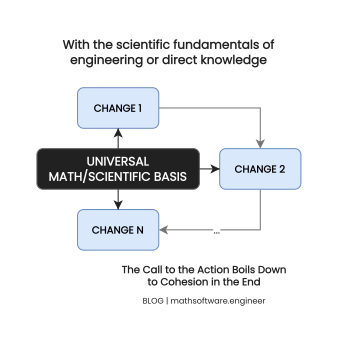

<!-- Copyright (c) 2022 Tobias Briones. All rights reserved. -->
<!-- SPDX-License-Identifier: CC-BY-4.0 -->
<!-- This file is part of https://github.com/tobiasbriones/blog -->

# The Call to Action Boils Down to Cohesion in the End

<figcaption align="center">

<strong>Call to Action</strong>

</figcaption>

---

The *call to action* boils down to cohesion in the end. Marketing, capitalist
buzzwords, and OOP always have to end up in the same fundamental principles of
FP/math/science/real-engineering.

Although buzzwords have *something helpful*: they're easy to understand for
non-geniuses or average people. In this case, for business people.

## Call to Action Design

Call to action consists of giving a clear way to the user to do what the
business wants them to do (e.g. add to cart) unlike those archaic desktop 2000s
WinXP apps with hundreds of bloated enterprise and small forms, buttons, and
options in the same window. Or bloated unresponsive websites full of options
and advertisements.

Software used to be a monolith in those archaic times of computers and
incipient programming (recall that computers were square back in the day and
everything was unclear and full of obnoxious workarounds 😂).

Now we have the capability to enforce better-designed systems that
are cohesive:

- 🐵 do one thing (homogeneous whole) and well done, instead of

- 🙈 everything (a monolith) and done mediocre full of workarounds like OO
  systems.

If you present the user with a bloated app they won't focus on what to do, but
you *want them* to make sure to buy your stuff and do it right, so you maximize
your profit and also the user's effort to get value from your business.

That doesn't mean you can only put a function into a file or a button into a
screen, but instead, the same logic for a module, the same logic for a screen,
etc.

### Understand When It's Bloated

An adult human mind can only hold 4 different things on average [1]. So, what
matters is not to limit to "one button per screen" but the same kind of
logic/interaction in one screen (scales horizontally).

*It's relative:*

- if you go to [StackOverflow](https://stackoverflow.com) you
  can see a cohesive whole as the entire website and that makes sense for you
  as a user who wants to move around the website to obtain value from it, but
- if you're the programmer then the whole website is a monolith with many
  *orthogonal* concepts.

The science of this is that you have to define *homogeneous* entities or things.

Although seeing the abstraction of what "the homogeneous whole" is, is an art 
with no generic rule that tells you how to find it, the scientific part lies 
when you formally establish it, so you can *measure it*.

For that, we have to go in a case-by-case basis and then formalize each case, 
so we can infer quality measurements.

The actions in the top right menu are cohesive, I can know that because
*they're close to each other*, so I expect the underlying logic to be
homogeneous too, all menu items are homogeneous or of the same type so the
bundle of actions in the menu is cohesive.

Notice that "close" is *relative* to *your metric*, so you can define a metric
space or use the Euclidean distance, now you can see why you must be good at
math to be a good software engineer and why the cohesion principle is science.

A small change in the input (mouse cursor or keyboard keys) produces a small
output close to the sibling entities (menu actions) output. This *measure* of
homogeneity is what defines the quality of the software or design of your
system.

The art of cohesion places homogeneous entities/things close, so they can
build a united cohesive whole. A highly cohesive system can be more
mathematically proved whilst heterogeneous systems with orthogonal
integrations are a complete mess.

Therefore, if you want to optimize for an action in your screen, you must
give the clear UI/UX to the user to achieve only *that action,* so you *call
to the action*. If you give orthogonal options to that action to the user
then it's become a heterogeneous system and the results are more difficult
to prove or test and the user will likely take a suboptimal decision if any at
all.

#### Side Note on (Un)Deterministic Input and Output

Some people might say that there are systems where "a small change of the input
produces a random change in the output" like chaotic dynamic systems,
cryptography, stochastic processes, etc., but those are just temporal
workarounds to get good-enough results faster, we want forward engineering here
instead.

I'd call those systems that are not cohesive like AI, data science, or
stochastic processes *minimal workarounds* or *controlled workarounds* since
they produce great results but are just temporal or short-lived *methods*.

I see them as minimal workarounds that are proved-enough or partially proved
hence they work. How do you know AI or DS is going to work? Because they're 
not deterministic but have been proved-enough to make *much* fewer mistakes 
than humans, so they are good at fixing the workarounds of the 
non-deterministic mess we find in real life like getting information out of 
semi-structured HTML files downloaded from the news external website that 
are not modeled like we were the owners of the news company (notice how 
"you" and "the news company" are external systems and heterogeneous, so we 
need the temporal workaround I talk so much).

On the other hand we find nonsense like "enterprise OO systems" which
build workarounds on top of workarounds so, they're anything but minimal or 
controlled workarounds, they're just a nonsense mess.

Your business logic is not short-lived, it's more like gravity or physics
constants: they're long-lasting. So the less temporal the more cohesive it
has to be.

Imagine if you jump and end up in another galaxy, see my point? On the other 
hand, we can have arbitrary t-shirt colors from one day to another and that 
*short-lived event* doesn't change the raw universal laws that are cohesive and 
*long-lasting*.

That's why non-cohesive AI, stochastic models, etc. work, because
they are for temporal solutions and *are built* on top of cohesive models
like algebra, physics constants, deterministic models. Have you heard a
stochastic process yields a different output from *family* of know possible
outcomes unlike differential equations that give a deterministic output given
the same initial condition? Can you get me? They are based on math and 
physics laws in their core anyway, so they're controlled workarounds.

I develop on these wonderful topics in my other article [everything is 
relative](../../philosophy/everything-is-relative). 

#### The Subscription Model Example

We usually see that subscription plans are minimal and give 3 options on 
average. You can go to any commercial platform and verify this.

If they give more options, then the user will start overthinking 
*workarounds* but if you employ highly cohesive flows then the user only has 
to focus on one thing at a time and thus make a more optimal decision.

### The Mobile Navigation Example

Menus or navigations use to be at the top of the website or app in most 
devices, but I learned from UX designers to place them on the bottom for 
mobile devices.

The reason is that mobile phones are used when you hold them and so your 
fingers are *close* to the bottom and center of the screen but far from the top
of the screen, so it's awkward or "spaghettified" to stretch your fingers 
out of their natural position to press the top of the screen.

For something important like a navigation item that *is clicked many times* 
you need to place it in a *cohesive* location so there is only *one move* to 
take an immediate action and naturally take more moves for a less cohesive 
action (avoid the latter anyway).

So when you design the GUI input close to the human user input you *made a 
cohesive whole that is homogeneous*, that is, the human-triggered touch event 
together with the app logic, or have a homogeneous flow, the natural 
position of the user fingers is a *united* whole with the app logic, it only 
needs one move to get immediate value.

If you had to take more awkward moves, then it'd be unnecessary so less 
efficient. The logic is also fragmented because the "homogeneous whole" gets 
fragmented between the original idea and external systems with workaround 
steps. When the user wanted to click on an awkward app interface they will 
start focusing on something else until they get burned. That's why I say 
that all monoliths will eventually fall apart.

Having the main navigation in the bottom for mobile is certainly another 
example of ~~call to action~~ cohesion because you want the user to interact in 
first-class with the menu actions, it's a semantic design that conveys the 
intention of the app designer.

Another clear example is the Android FAB (Floating Action Button), and they 
even tell you have you can only place one FAB per activity or screen by 
obvious reasons I've explained in the entire article, so UI/UX designers 
can also see this universal principle of cohesion to avoid bloating the user 
with too many options.

The difference is that we are engineers or mathematicians, so we have the 
universal panorama of the design concepts, just notice how I'm technical to 
explain out.

Here you can measure cohesiveness with the number of steps that take to do 
something immediate.

Don't fragment the logic. OO and corporate systems are good at doing that for 
instance, so you need a "manager" or "teacher" to try to glue the broken 
whole. Imagine that you need to comply with bureaucracy, you're put a 
label like any peon of capitalism, so they make you wear a school uniform and 
walk to school: in the end, you're just tired of so much *workaround* 
garbage and can't keep on studying anymore. So don't make your users feel 
like that.

Last but not least, I fully recommend you this YouTube channel where, for 
example, I learned about the position of the mobile navigation in 
[Your Mobile Navigations STINK! Better UX AWAITS! \| DesignCourse](https://youtu.be/1D4FzPcEiN4)
I really mean it, watch the video!.

Since I'm pretty intelligent, I remember what I do by having relations in my 
mind, so for example, here I knew that I watched that video and learned 
something useful about this topic about 2 years ago, and I know where to look
for things in those scenarios, I think of people or things semantically, so I 
got to the level in which I can index all my experiences and knowledge,
but that's another topic. I know I had in my internal memory that 
"DesignCourse" is a "friend" channel, so I remember things from there more 
accurately despite the fact that I just learn once and then just keep on but 
don't forget those details.

### Marketers vs Scientist

Cohesion is one of the most important universal principles, and I teach it a
lot, as you can see, it applies to any problem, disregarding the buzzwords they
make.

OOP marketers (they're not programmers) call it SOLID, etc., but in the end,
everything formally ends up in the same scientific principles (with no marketing
buzzwords). The way they see it, is just an easier way to understand it for
their context.

Like some say, OOP ends up much like FP when applying "OOP principles".

Imagine if real engineers like electrical/civil engineers or math software
engineers would use cringe buzzwords fuzzy words like "WET", "YAGNI", "Tell
Don't Ask", etc., (I don't even know/remember what they mean, and we DO NOT
want to know either). Then now, imagine cities, electrical systems of your
house, spacecrafts, car engines, traffic lights, etc., would be a complete mess
developed by a chunk of stupid people unable to understand science.

It's deplorable that many "engineers" or "programmers" don't know what it
means "DSL", and they even say that they don't care, but they obviously know
the cringe OOP words because they're cheap programmers. It's fair if you
don't know something but being a bottom programmer (IT labourer actually) is
completely different. I've also explained that *everything is a language* so
a software engineer must positively understand what "DSL" means, to then build
homogeneous systems.

A real engineer must understand the scientific principles of their
engineering discipline like for example, electric charge/field for electrical
engineers, differential equations for civil engineers, set theory for
software engineers, etc.

## Cohesion is Universal

The dictionary states that cohesion "forms a united whole" so here your work as
an engineer is to define what the homogeneous "whole" means since everything is
relative, that is, you must remove the heterogeneity to get a cohesive "whole".
That proves that cohesion is a universal axiom of design.

Cohesion is a universal principle, it can even be proved that "lexical cohesion
is computationally feasible to identify" [2]. The education system doesn't teach
you any of these fundamental topics, they're clearly not cohesive organizations
so schools are just cheap workarounds instead of what they're supposed to be.

FP tells you *what to do* or what functions you can call, FP concepts
also ensure to keep the logic flow cohesive. You can't call a function that
is far away and does not make sense for the current data type. It's like a
`Result` which can only be defined as `Ok` or `Err` so you *know what to do*
and carry on.

### Cohesive Flows

As you can see, we find how cohesion is formally applied as a measure for

- Physics
- Software Engineering
- Natural Language Grammar
- Even Marketing

You can employ cohesion for any long-lasting design.

Highly cohesive flows are about building homogeneous subsystems that focus
on the same content, so you can go back and forth and don't get burned.

In contrast, see how a heterogeneous system that has vertical integrations
draws a lot of energy. Think of a switch or a three-phase industry-power engine
that has to turn on and off: the drastic change of inertia takes a huge
amount of energy and does not focus on the same thing, my UPS goes to 
battery at the moment they turn on this kind of equipment, so *non-cohesive
systems affect random external systems* that have nothing to do. What does my 
computer has to do with the side effect of turning on a far away washing 
machine? That's because those electric systems get from zero to full power 
at once, so that implies a lot of things to do at once, and so poorly done. 

Another way to put this even more clear: non-cohesive systems do not focus 
on one united whole, but they fragment that whole (like OOP does) and side 
effects from that fragmentation are going to end up in my computer UPS 🥴.

You need to have cohesive workdays to avoid getting tired with heterogeneous or
vertical tasks that make you change the context uncontrollably, so cohesion, 
of course, also applies to your personal life.

### Universal Principles are Always Needed

I've worked with some people who struggle to understand what "call to action"
means even if they think they understand it.

As I showed above, all this is about universal principles like cohesion in
the end.

Developing code and related IT jobs are something that burns many practitioners
as it's a constant fast-changing industry. I therefore advise to have a solid
understanding on the "useless" theory or principles, so you have a basis to hold
on:

If you possess the direct knowledge then you only have to move on small 
details to learn ordinary knowledge. For example, you can easily learn a new 
tool (that's what an engineer does) like CAD, another game engine, another 
JS framework, a new concurrency model on Android, etc. But you need a 
fundamental base that holds you.

Direct knowledge *factorizes* the common set of skills that you need to be 
an engineer, so take it. Direct knowledge is universal and long-lasting 
unlike ordinary knowledge like (another) new JS framework that depends on 
web browsers or JS, and accountability that depends on capitalism or 
sociology that depends on humanity (notice the level of pureness here).

Have you wondered how to learn newer programming languages? It's not hard 
when you already have the *concepts*, I don't feel threatened when I face a new
language I don't know (unless is a natural language). Learn FP to know how 
to build software and OOP to learn how NOT to build it, so you have the 
solid base to move between small details like a particular language or another.

Direct knowledge like math does not depend on humans at all (the opposite is 
law that depend on humans and on top of that, on capitalism too, so it's 
easily one of the most impure we can find) and science works with humans
sometimes but is inherently *objective*. Then we have engineers who are a
spectrum from cheap bottom bunglers who can't even be called engineers to 
the most developed professional practitioners of engineering. 

On the other hand, with no direct knowledge, and only ordinary knowledge,
practitioners have to relearn everything from scratch and have constant 
vertical integrations or workflows so that's a big reason why they get burnout.

Many jobs are not good, so as said, they have constant vertical workflows so 
your direct knowledge won't help you there, so that's to take into account too.

Try to apply direct knowledge as much as possible as a practitioner, that's 
the best rewarding outcome, but frequently challenging in real life.

When we understand direct knowledge, we can follow any direction so as I've 
said along this article, I understand cohesion which is something pretty 
abstract and most people don't understand abstractions, you even need to 
understand relativism as a requirement. Then I'm able to manage back and forth
the buzzwords that come out like "call to action", but if you're, for instance,
a marketer/manager/etc. then you will lock into the small reality of yours. 
It's like when they say, a mathematician/physicist have the capacity to 
become an engineer but not the other way around.

## Conclusion

The call to action is a modern approach to interface with our users that helps
build cohesive flows so that the user is focused on retrieving value from our
software/products/services and the business also maximises their profit by
having more engaged users who are presented a clear way to solve their problems.

If you do it wrong, you'll bloat users with orthogonal options that only
create an unmanageable cyclomatic complexity. So users will not even keep
burning their heads into your platform and won't be clear *what to do*.

I'm a relativist who enjoys and applies these principles all the time, you have
to read my article on
[everything is relative](../../philosophy/everything-is-relative), I've been
developing these days with more insights I have every day.

## References

[1] Finn, E. (2011, June 23). When four is not four, but rather two plus two.
MIT News | Massachusetts Institute of Technology. Retrieved July 11, 2022,
from https://news.mit.edu/2011/miller-memory-0623

[2] Morris, J., & Hirst, G. (1991). Lexical Cohesion Computed by Thesaural
Relations as an Indicator of the Structure of Text. ACL Anthology. Retrieved
July 11, 2022, from https://aclanthology.org/J91-1002.pdf
