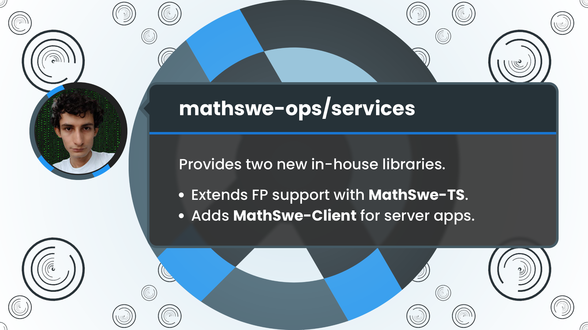

<!-- Copyright (c) 2024 Tobias Briones. All rights reserved. -->
<!-- SPDX-License-Identifier: CC-BY-4.0 -->
<!-- This file is part of https://github.com/tobiasbriones/blog -->

# In-House MathSwe-TS-and-Client Libraries | MathSwe Ops Services (2024/09/15)




It provides two new in-house libraries in the MathSwe Ops Services application
that will become MathSwe standard libraries for any TypeScript and server
projects. While MathSwe-TS leverages the FP-TS library to add extended support
for FP, MathSwe-Client will be standard for server applications.

---

**Add in-house libs mathswe-ts, mathswe-client**

Sep 15: PR [#2](https://github.com/mathswe-ops/services/pull/2) merged into
by [tobiasbriones](https://github.com/tobiasbriones)
{: .pr-subtitle }

The `mathswe-ts/adt` module defines the **general pattern matching for sum types
**. You also must follow manual guides to correctly build a sum type in
TypeScript, even with `fp-ts` and `mathswe-ts`.


<figure>
<div class="header user-select-none headerless">
    <div class="caption">
        
    </div>

    <div class="menu">
        

        <button type="button" data-code="describe(&quot;Lazy Rich SumType&quot;, () =&gt; {
    type Shape = { tag: &quot;Point&quot; } &vert; { tag: &quot;Circle&quot;, radius: number };

    const point: Shape = { tag: &quot;Point&quot; };
    const circle: Shape = { tag: &quot;Circle&quot;, radius: 1 };

    it(&quot;computes the area via matching and destructure&quot;, () =&gt; {
        type Circle = { radius: number };

        const circleArea
            = ({ radius }: Circle) =&gt; Math.PI * Math.pow(radius, 2);

        const area = (shape: Shape): number =&gt; {
            const withShapeVariant = withMatchVariant&lt;number&gt;(shape);

            return pipe(
                shape,
                match({
                    Point: () =&gt; 0,
                    Circle: withShapeVariant(circleArea),
                }),
            );
        };

        expect(area(point)).toBe(0);
        expect(area(circle)).toBe(Math.PI);
    });
});
" onclick="onCopyCodeSnippet(this)">
            <span class="material-symbols-rounded">
            content_copy
            </span>

            <div class="tooltip">
                Copied
            </div>
        </button>
    </div>
</div>

```ts
describe("Lazy Rich SumType", () => {
    type Shape = { tag: "Point" } | { tag: "Circle", radius: number };

    const point: Shape = { tag: "Point" };
    const circle: Shape = { tag: "Circle", radius: 1 };

    it("computes the area via matching and destructure", () => {
        type Circle = { radius: number };

        const circleArea
            = ({ radius }: Circle) => Math.PI * Math.pow(radius, 2);

        const area = (shape: Shape): number => {
            const withShapeVariant = withMatchVariant<number>(shape);

            return pipe(
                shape,
                match({
                    Point: () => 0,
                    Circle: withShapeVariant(circleArea),
                }),
            );
        };

        expect(area(point)).toBe(0);
        expect(area(circle)).toBe(Math.PI);
    });
});
```



{{ markdownContent | markdownify }}


<figcaption>Sum Type Pattern Matching</figcaption>
</figure>

Something the test doesn't show is that you must create the data constructors
manually to keep up with good practices. That is, to avoid the `tag` field in
client code, which is supposed to be an implementation detail.

Notice that, when using `pipe` you give context to the `match` function, i.e.
`SumTypeMap<Shape, string>`, so **the pattern matching is exhaustive**. If you
call it separately, i.e. `match({})(shape)`, it loses the sum type, i.e.
`SumTypeMap<SumType, string>`, so the generic type weakens from `Shape` to
`SumType`.

You must apply the `withMatchVariant` higher-order function to pass your branch
function to it. Your branch function, for example, `circleArea`, *will define
the type of the branch*. In that case, you tell your `withShapeVariant` partial
function that *the type of the branch argument is `Circle`* since it performs a
cast under the hood, so you must define this type correctly to match
successfully the branch.

As you can see, the branch function `circleArea` defines the `{ radius }:
Circle` param type that the `withShapeVariant` partial function will use to
convert the original sum type to the actual variant value.

Finally, the matching is lazy for correctness. If you pass an eager map to
`match`, it will execute all the variants automatically. Further, it would fail
at runtime because it'd pass the same argument to all the different branch
functions without discrimination.

Conversely, the `mathswe-ts/enum` module allows you to **match plain sum type
branches** eagerly.


<figure>
<div class="header user-select-none headerless">
    <div class="caption">
        
    </div>

    <div class="menu">
        

        <button type="button" data-code="describe(&quot;PlainEnum&quot;, () =&gt; {
    type Color = { tag: &quot;Red&quot; } &vert; { tag: &quot;Green&quot; } &vert; { tag: &quot;Blue&quot; };

    const red: Color = { tag: &quot;Red&quot; };
    const green: Color = { tag: &quot;Green&quot; };
    const blue: Color = { tag: &quot;Blue&quot; };

    it(&quot;should pipe match enum variants with type safe exhaustive map&quot;, () =&gt; {
        const label = (color: Color) =&gt; pipe(
            color,
            matchPlain({
                Red: &quot;red-variant&quot;,
                Green: &quot;green-variant&quot;,
                Blue: &quot;blue-variant&quot;,
            }),
        );

        expect(label(red)).toBe(&quot;red-variant&quot;);
        expect(label(green)).toBe(&quot;green-variant&quot;);
        expect(label(blue)).toBe(&quot;blue-variant&quot;);
    });
});
" onclick="onCopyCodeSnippet(this)">
            <span class="material-symbols-rounded">
            content_copy
            </span>

            <div class="tooltip">
                Copied
            </div>
        </button>
    </div>
</div>

```ts
describe("PlainEnum", () => {
    type Color = { tag: "Red" } | { tag: "Green" } | { tag: "Blue" };

    const red: Color = { tag: "Red" };
    const green: Color = { tag: "Green" };
    const blue: Color = { tag: "Blue" };

    it("should pipe match enum variants with type safe exhaustive map", () => {
        const label = (color: Color) => pipe(
            color,
            matchPlain({
                Red: "red-variant",
                Green: "green-variant",
                Blue: "blue-variant",
            }),
        );

        expect(label(red)).toBe("red-variant");
        expect(label(green)).toBe("green-variant");
        expect(label(blue)).toBe("blue-variant");
    });
});
```



{{ markdownContent | markdownify }}


<figcaption>Matching Plain Sum Type Branches</figcaption>
</figure>

The `matchPlain` function of the `enum` module is eager, and **you must not use
`matchPlain` for non-trivial sum types**.

Notice that, `fp-ts` doesn't have a general pattern-matching solution, only
ad-hoc matching functions for specific types, like `Either`. Therefore, I took
the exciting challenge to solve it, as per the language limitations since it's
better to have some kind of pattern matching than none.

Finally, the `mathswe-ts/string` module defines some type-classes to start
implementing them in TS programs as a standard practice (like the Rust way).


<figure>
<div class="header user-select-none headerless">
    <div class="caption">
        
    </div>

    <div class="menu">
        

        <button type="button" data-code="export interface ToString&lt;T&gt; {
    toString(value: T): string;
}

export interface FromString&lt;T&gt; {
    fromString(string: string): Either&lt;string, T&gt;;
}
" onclick="onCopyCodeSnippet(this)">
            <span class="material-symbols-rounded">
            content_copy
            </span>

            <div class="tooltip">
                Copied
            </div>
        </button>
    </div>
</div>

```ts
export interface ToString<T> {
    toString(value: T): string;
}

export interface FromString<T> {
    fromString(string: string): Either<string, T>;
}
```



{{ markdownContent | markdownify }}


<figcaption>Type Classes in the String Module</figcaption>
</figure>

The module `mathswe-ts/require` provides a method `requireRight` to unsafe
unwrap of `Either` values. It throws an `Error` if the given `Either` is `Left`,
or else returns its `Right` value. It's useful for testing when you're sure a
value is always `Right`, or must be `Right` to pass the test.

The current MathSwe-TS library supports sum-type general pattern matching, which
is lazy, but also for eager matching for plain branches without fields. It
further defines some type-classes for Strings and a method for unsafe unwrapping
of Either.

---

The `mathswe-client/domain/domain` module defines the `ToDomainName` type class
to convert any domain to a `string` domain name. It also defines the `Allowed`
sum type to grant access to those domains.


<figure>
<div class="header user-select-none headerless">
    <div class="caption">
        
    </div>

    <div class="menu">
        

        <button type="button" data-code="export interface ToDomainName&lt;T&gt; {
    toDomainName(domain: T): string;
}

export type Allowed
    = { tag: &quot;FullAccess&quot; }
    &vert; { tag: &quot;PartialAccess&quot;, values: string[] }
" onclick="onCopyCodeSnippet(this)">
            <span class="material-symbols-rounded">
            content_copy
            </span>

            <div class="tooltip">
                Copied
            </div>
        </button>
    </div>
</div>

```ts
export interface ToDomainName<T> {
    toDomainName(domain: T): string;
}

export type Allowed
    = { tag: "FullAccess" }
    | { tag: "PartialAccess", values: string[] }
```



{{ markdownContent | markdownify }}


<figcaption>Domain Module</figcaption>
</figure>


<figure>
<div class="header user-select-none headerless">
    <div class="caption">
        
    </div>

    <div class="menu">
        

        <button type="button" data-code="export type MathSwe
    = &quot;MathSweCom&quot;
    &vert; &quot;MathSoftware&quot;
    &vert; &quot;MathSoftwareEngineer&quot;;
" onclick="onCopyCodeSnippet(this)">
            <span class="material-symbols-rounded">
            content_copy
            </span>

            <div class="tooltip">
                Copied
            </div>
        </button>
    </div>
</div>

```ts
export type MathSwe
    = "MathSweCom"
    | "MathSoftware"
    | "MathSoftwareEngineer";
```



{{ markdownContent | markdownify }}


<figcaption>MathSwe Module</figcaption>
</figure>


<figure>
<div class="header user-select-none headerless">
    <div class="caption">
        
    </div>

    <div class="menu">
        

        <button type="button" data-code="export type ThirdParty = &quot;GitHubCom&quot;;
" onclick="onCopyCodeSnippet(this)">
            <span class="material-symbols-rounded">
            content_copy
            </span>

            <div class="tooltip">
                Copied
            </div>
        </button>
    </div>
</div>

```ts
export type ThirdParty = "GitHubCom";
```



{{ markdownContent | markdownify }}


<figcaption>ThirdParty Module</figcaption>
</figure>

The `mathswe-client/req/http` module defines HTTP abstractions.


<figure>
<div class="header user-select-none headerless">
    <div class="caption">
        
    </div>

    <div class="menu">
        

        <button type="button" data-code="export type Hostname = {
    domainName: string,
    subdomain: string,
}

export type Path = string[];

export type SecureUrl = {
    hostname: Hostname,
    path: Path,
}
" onclick="onCopyCodeSnippet(this)">
            <span class="material-symbols-rounded">
            content_copy
            </span>

            <div class="tooltip">
                Copied
            </div>
        </button>
    </div>
</div>

```ts
export type Hostname = {
    domainName: string,
    subdomain: string,
}

export type Path = string[];

export type SecureUrl = {
    hostname: Hostname,
    path: Path,
}
```



{{ markdownContent | markdownify }}


<figcaption>HTTP Module</figcaption>
</figure>

The `mathswe-client/req/origin` path contains modules with rules defining if a
given request origin has access to the server.


<figure>
<div class="header user-select-none headerless">
    <div class="caption">
        
    </div>

    <div class="menu">
        

        <button type="button" data-code="export type OriginDomain
    = { tag: &quot;MathSweDomain&quot;, mathswe: MathSwe }
    &vert; { tag: &quot;ThirdPartyDomain&quot;, thirdParty: ThirdParty };

export type OriginPath = Path;

export type Origin = {
    domain: OriginDomain,
    path: OriginPath,
    url: SecureUrl,
}
" onclick="onCopyCodeSnippet(this)">
            <span class="material-symbols-rounded">
            content_copy
            </span>

            <div class="tooltip">
                Copied
            </div>
        </button>
    </div>
</div>

```ts
export type OriginDomain
    = { tag: "MathSweDomain", mathswe: MathSwe }
    | { tag: "ThirdPartyDomain", thirdParty: ThirdParty };

export type OriginPath = Path;

export type Origin = {
    domain: OriginDomain,
    path: OriginPath,
    url: SecureUrl,
}
```



{{ markdownContent | markdownify }}


<figcaption>Modules OriginDomain and Origin</figcaption>
</figure>


<figure>
<div class="header user-select-none headerless">
    <div class="caption">
        
    </div>

    <div class="menu">
        

        <button type="button" data-code="describe(&quot;newOriginPathFromDomain&quot;, () =&gt; {
    it(&quot;should return path for FullAccess domain&quot;, () =&gt; {
        const domain: OriginDomain = pipe(
            &quot;mathswe.com&quot;,
            originDomainFromString.fromString,
            requireRight,
        );

        const path = &quot;&#x2F;any-path&quot;;
        const expected = right(pipe(path, newPathFromString, requireRight));
        const result = pipe(path, newOriginPathFromDomain(domain));

        expect(result).toEqual(expected);
    });

    it(&quot;should return an error for a restricted domain path&quot;, () =&gt; {
        const domain: OriginDomain = pipe(
            &quot;github.com&quot;,
            originDomainFromString.fromString,
            requireRight,
        );

        &#x2F;&#x2F; github.com&#x2F;restricted-path random user
        const path = &quot;restricted-path&quot;;
        const expected = left(`Path ${ path } of domain ${ domain } is restricted.`);
        const result = pipe(path, newOriginPathFromDomain(domain));

        expect(result).toEqual(expected);
    });

    it(&quot;should accept partially allowed path&quot;, () =&gt; {
        const domain: OriginDomain = pipe(
            &quot;github.com&quot;,
            originDomainFromString.fromString,
            requireRight,
        );

        &#x2F;&#x2F; github.com&#x2F;mathswe organization
        const path = &quot;mathswe&quot;;
        const expected = right(pipe(path, newPathFromString, requireRight));
        const result = pipe(path, newOriginPathFromDomain(domain));

        expect(result).toEqual(expected);
    });
});

describe(&quot;newOriginFromUrl&quot;, () =&gt; {
    it(
        &quot;should return a valid Origin when domain and path are allowed&quot;,
        () =&gt; {
            const expectedUrl: SecureUrl = pipe(
                &quot;https:&#x2F;&#x2F;mathswe.com&#x2F;valid-path&quot;,
                newUrlFromString,
                requireRight,
            );

            const result = newOriginFromUrl(expectedUrl);
            const { domain, path, url } = requireRight(result);
            const expectedDomain = mathSweDomain(&quot;MathSweCom&quot;);
            const expectedPath = pipe(
                &quot;valid-path&quot;,
                newPathFromString,
                requireRight,
            );

            expect(domain).toEqual(expectedDomain);
            expect(path).toEqual(expectedPath);
            expect(url).toEqual(expectedUrl);
        },
    );

    it(&quot;should return an error if the domain is disallowed&quot;, () =&gt; {
        const result = newOriginFromString(&quot;example.com&#x2F;some-path&quot;);

        expect(isLeft(result)).toBe(true);
    });
});
" onclick="onCopyCodeSnippet(this)">
            <span class="material-symbols-rounded">
            content_copy
            </span>

            <div class="tooltip">
                Copied
            </div>
        </button>
    </div>
</div>

```ts
describe("newOriginPathFromDomain", () => {
    it("should return path for FullAccess domain", () => {
        const domain: OriginDomain = pipe(
            "mathswe.com",
            originDomainFromString.fromString,
            requireRight,
        );

        const path = "/any-path";
        const expected = right(pipe(path, newPathFromString, requireRight));
        const result = pipe(path, newOriginPathFromDomain(domain));

        expect(result).toEqual(expected);
    });

    it("should return an error for a restricted domain path", () => {
        const domain: OriginDomain = pipe(
            "github.com",
            originDomainFromString.fromString,
            requireRight,
        );

        // github.com/restricted-path random user
        const path = "restricted-path";
        const expected = left(`Path ${ path } of domain ${ domain } is restricted.`);
        const result = pipe(path, newOriginPathFromDomain(domain));

        expect(result).toEqual(expected);
    });

    it("should accept partially allowed path", () => {
        const domain: OriginDomain = pipe(
            "github.com",
            originDomainFromString.fromString,
            requireRight,
        );

        // github.com/mathswe organization
        const path = "mathswe";
        const expected = right(pipe(path, newPathFromString, requireRight));
        const result = pipe(path, newOriginPathFromDomain(domain));

        expect(result).toEqual(expected);
    });
});

describe("newOriginFromUrl", () => {
    it(
        "should return a valid Origin when domain and path are allowed",
        () => {
            const expectedUrl: SecureUrl = pipe(
                "https://mathswe.com/valid-path",
                newUrlFromString,
                requireRight,
            );

            const result = newOriginFromUrl(expectedUrl);
            const { domain, path, url } = requireRight(result);
            const expectedDomain = mathSweDomain("MathSweCom");
            const expectedPath = pipe(
                "valid-path",
                newPathFromString,
                requireRight,
            );

            expect(domain).toEqual(expectedDomain);
            expect(path).toEqual(expectedPath);
            expect(url).toEqual(expectedUrl);
        },
    );

    it("should return an error if the domain is disallowed", () => {
        const result = newOriginFromString("example.com/some-path");

        expect(isLeft(result)).toBe(true);
    });
});
```



{{ markdownContent | markdownify }}


<figcaption>Ensuring Access to Allowed Origins Only</figcaption>
</figure>

Finally, the `mathswe-client/req/client/client-req` module provides a function
to get the `Origin` of a `Request`. Recall that the existence of an `Origin`
value means the underlying request is allowed.


<figure>
<div class="header user-select-none headerless">
    <div class="caption">
        
    </div>

    <div class="menu">
        

        <button type="button" data-code="describe(&quot;getOrigin&quot;, () =&gt; {
    it(
        &quot;should return Right(Origin) when a valid Origin header is provided&quot;,
        () =&gt; {
            const mockRequest = {
                headers: {
                    get: (key: string) =&gt;
                        key === &quot;Origin&quot;
                        ? &quot;https:&#x2F;&#x2F;mathswe.com&quot;
                        : null,
                },
            } as Request;

            const result = getOrigin(mockRequest);
            const expectedOrigin = pipe(
                &quot;https:&#x2F;&#x2F;mathswe.com&quot;,
                newOriginFromString,
                requireRight,
            );

            expect(result).toEqual(right(expectedOrigin));
        },
    );
});
" onclick="onCopyCodeSnippet(this)">
            <span class="material-symbols-rounded">
            content_copy
            </span>

            <div class="tooltip">
                Copied
            </div>
        </button>
    </div>
</div>

```ts
describe("getOrigin", () => {
    it(
        "should return Right(Origin) when a valid Origin header is provided",
        () => {
            const mockRequest = {
                headers: {
                    get: (key: string) =>
                        key === "Origin"
                        ? "https://mathswe.com"
                        : null,
                },
            } as Request;

            const result = getOrigin(mockRequest);
            const expectedOrigin = pipe(
                "https://mathswe.com",
                newOriginFromString,
                requireRight,
            );

            expect(result).toEqual(right(expectedOrigin));
        },
    );
});
```



{{ markdownContent | markdownify }}


<figcaption>Parsing HTTP Request to Allowed Origin</figcaption>
</figure>

The current MathSwe-Client library defines known MathSwe domains with full
access and third-party domains, like GitHub, which can only have partial access
to some paths. It defines HTTP concepts, like SecureUrl, so that DSL ensures
only allowed origins according to domain rules.

---

The new features of MathSwe-TS complement general and exhausting (when piping)
pattern matching for sum types. While it's not perfect, it works better than
expected, complimenting FP-TS, which only has ad-hoc matching for monads like
Option and Either.

Further, the new MathSwe-Client supports Origin rules to only accept HTTP
requests from accepted domains and paths.

The purpose of these two libraries is to become MathSwe standards for TypeScript
projects.


