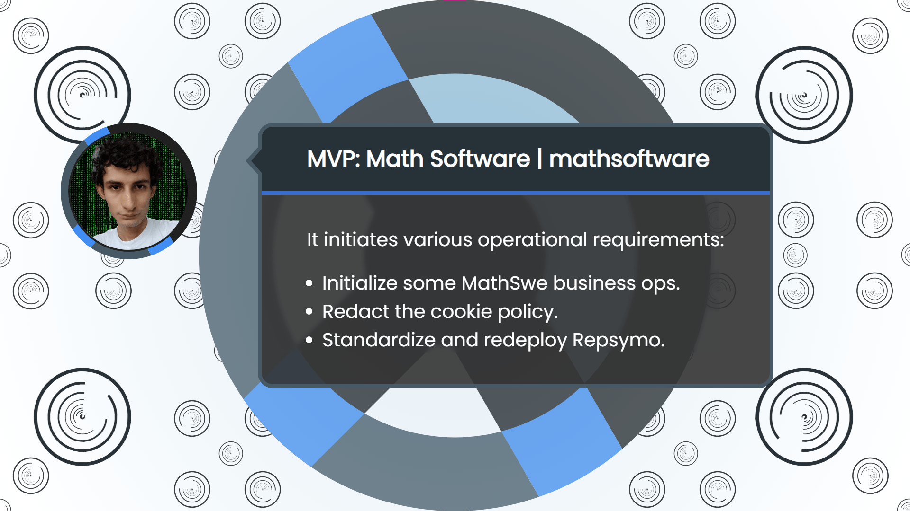

<!-- Copyright (c) 2024 Tobias Briones. All rights reserved. -->
<!-- SPDX-License-Identifier: CC-BY-4.0 -->
<!-- This file is part of https://github.com/tobiasbriones/blog -->

# Incremental Deployments and Researching Cookie Laws (2024/02/09)

Some Repsymo and MSW operational tasks were advanced, while a new
entrepreneurial challenge to implementing cookie privacy in MathSwe appeared and
is slowing down engineering activities.

---

Since MathSwe.com will be the business unit, the legal requirements will be
centralized in the .com domain, thus leaving the software and engineering
focused on quality by decoupling the real-world operations or constraints from
engineering.

The first requirement that appeared was **compliance with cookie laws**, so I
took the chance to open the MathSwe website while researching and writing the
privacy policy and **cookie policy**. This must be soon in production to unblock
my engineering tasks. As said, MathSwe.com will address such legal complexities
so they can be just mirrored in the other domains.

Complying with international cookie laws is complicated and expensive if
implemented well. I'm good at handling complexity by being an engineer so I can
minimize operational expenses.

Particular parts that become complicated and require valuable engineering
resources to plan, research, and operate are **a rich banner, storing records of
consent, documentation for all websites and apps, country-specific requirements,
ambiguity**, etc.

These expand with other requirements like integrating third-party API consent
(like Google consent mode).

I don't plan to use cookies heavily, so **normal and healthy cookie usage is
expected** because you need them, e.g., for saving login tokens and optimizing
products with analytics.

Cookies are an essential part of any website or web app. So, complying with
legal data privacy requirements from the beginning is necessary to **always stay
transparent**, not only in the open-source commitments but in the business
operations as well. These entrepreneurial activities are being addressed with
priority so the engineering tasks can take strength back again.

---

I was able to be productive before getting affected by these cookie requirements
(and other personal tasks).

I initialized the mathswe.com website. Now, I can open production [1] and start
portraying the privacy policies to users.

---

Regarding Repsymo, I applied
the [new standard draft](/initializing-the-new-msw-mvp-app-2024-01-30#drafting-new-engineering-standards)
to the repsymo org by creating the MVP repo by renaming the
old `2dp-repsymo-solver` repo to the standard `repsymo---mvp` name.

The MVP repo contains the Repsymo web app as one of its internal MVPs.

I removed the old deployment in app.repsymo.com to deploy to the premium domain
[rsm.math.software](https://rsm.math.software) [2].

I'm also updating operations in Repsymo now that the platform as a whole is
stabilizing [3][4].

---

Implementing cookie laws is a new challenge that's being addressed to keep full
transparency and comply with the latest international standards, which is the
**responsibility** of an engineer.

These tasks take many resources and block important developments, so their
implementation will be a relief to proceed to deliver more continuous
deployments to users.

I partially opened the MathSwe.com website, so I can address the business
affairs, like legal notices, in the appropriate domain. This operational
initiation will eventually proceed with further entrepreneurial activities.
Evolution is progressive to be efficient and scale horizontally.

I also worked on the old Repsymo repo and transformed it to the current standard
mode, so each iteration will be faster and deliver more models because the
project concepts are much more stable than ever.

The Math Software and Repsymo apps are deployed to the premium domain as MVPs in
dev mode (`v0.1.0-dev`), so they ship value in the most efficient (or
"agile") way. After addressing the cookie challenge, production versions will be
normal (e.g., `v0.1.0`), while development tests will go to
[the already available staging](/initializing-the-new-msw-mvp-app-2024-01-30#setting-up-deployments)
platform.

Regarding technical complexities, I don't see anything particular to worry about
since I can engineer and optimize anything required for mathematical software.
Business or real-world operational complexities are an external factor that
needs dedication to address.

All the recent challenges are requiring grit (as always) to embrace the
ambiguity and uncertainty of real-life constraints, so I'll keep dominating
these early-stage operational complexities.

## References

[1] [Initiate web app operations by tobiasbriones · Pull Request #1 · mathswe/mathswe.com.](https://github.com/mathswe/mathswe.com/pull/1)
GitHub.

[2] [Set app base URL to new deployment env rsm.math.software by tobiasbriones · Pull Request #54 · repsymo/repsymo---mvp.](https://github.com/repsymo/repsymo---mvp/pull/54)
GitHub.

[3] [Update app info and add analytics support by tobiasbriones · Pull Request #55 · repsymo/repsymo---mvp.](https://github.com/repsymo/repsymo---mvp/pull/55)
GitHub.

[4] [Update app info by tobiasbriones · Pull Request #56 · repsymo/repsymo---mvp.](https://github.com/repsymo/repsymo---mvp/pull/56)
GitHub.

