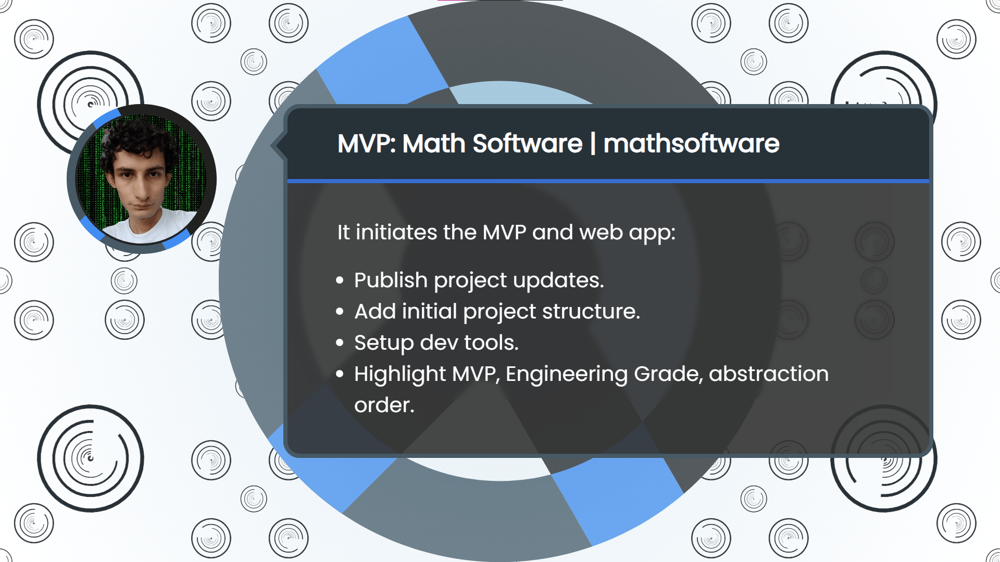

<!-- Copyright (c) 2024 Tobias Briones. All rights reserved. -->
<!-- SPDX-License-Identifier: CC-BY-4.0 -->
<!-- This file is part of https://github.com/tobiasbriones/blog -->

# Initializing Operations | Math Software MVP App (2024/02/01)

The Math Software MVP and its web app received two PRs providing project
initialization and implementing newer standard drafts outlining the MVP
structure. Other structural aspects were considered from the experience I had
working with Repsymo.

---

First, I recently published
[Initializing the New Math Software MVP App (2024/01/30)](https://blog.mathsoftware.engineer/initializing-the-new-msw-mvp-app-2024-01-30)
as an update on what's happening with the **Math.Software MVP** app.

---

The first PR[1] initialized most of the project applying the MVP structure from
the draft mentioned.

I created the `math.software---mvp` app with React 18, TypeScript 5 with SWC,
and Vite 5.

I fixed the standard to `ES2022` for all the project configurations, tuned the
TS config for strict checking, and took a lot of time to configure the ESLint
for checking TS, React with Hooks, and fixing some legacy issues of the tool.

I also installed `bootstrap-react` and `bootstrap` to continue a similar style
approach I've managed in Repsymo.

Moreover, I installed the `better-react-mathjax` library to keep formatting
equations in React, with a great integration compared to the JS mess of options
with abandoned or poor support. I set the ASCII Math support and removed *huge*
bloat from the LaTeX formulas.

Web configurations are always an off-topic mess that takes a lot of time to make
them work because of the dynamic and poorly designed nature of web tech like JS.
You can configure something, but it's uncertain if it'll actually be so or have
arbitrary side effects.

One of the legacy issues mentioned before was the "JSX uses React" lint error
when it's unnecessary to import `React` for JSX now (React 18), but the tool
still gives the error.

There was another third-party issue where I had to prevent the lint for a line
of the `vite.config.ts` file because there was no way to
fix `TS7016: Could not find a declaration file for module vite-plugin-eslint.`,
despite the presence of types in the vite-plugin-eslint library.

So, the types are there (in the `node_modules` lib), but they can't be found
🤦🏻‍♂️. I could fix that, but I won't lose more time with web dev nonsense
errors, and that's development code anyway. That's why I suppressed the lint for
that line of code.

One last pending detail is to migrate the legacy `.eslintrc.cjs` format
to `eslint.config.js`
since it's being dropped. I don't have a priority for this, and documentation
can be better later. So, I'll wait and migrate this minor ops detail in a future
opportunity.

Web dev is uncertain even with TS, unlike other platforms like Java where, for
example, you `CTRL+Q` and have quality documentation (the tech gives certain
guarantees). In web dev, only a mess with build tools and runtime surprises are
guaranteed.

Hence, **we *can't* use random standards and tools like web dev to reach the
engineering grade, and frequently, GUI/high-level apps can only make it to
production as an MVP**. GUI or high-level apps can have the engineering grade,
but that wouldn't be feasible unless you're deploying them to space or something
like that.

The web app configuration performed will allow the stable development of
upcoming pre-release versions.

---

Finally, the initial source code structure was defined in the second PR[2] with
the following paths of the `src` directory:

- `sys`: TS functionalities.
- `math`: Mathematical code (in-house/fast prototypes).
- `ui`: Standalone React components.
- `app`: Web app integration.

Notice they're in **abstraction order** (from `sys` to `app`). The abstraction
order is key for engineering anything (and avoiding cycles I mention so much).

When these paths get upgraded, for instance, `math` is rewritten in Purescript,
they'll be published as standalone libraries instead of belonging to the `app`
modular monolith. They'll still be MVPs but moving toward the demanding
engineering grade.

---

Abstraction order is mandatory for coherent designs. I also clarified why MVPs
and the engineering grade are both essential to succeed in software engineering.

My experience in Repsymo and newer standards allowed me to create the MVP of the
`mathsoftware` organization with operations initialized, so the next development
will go straight to the initial development for releasing `v0.1.0`.

## References

[1] [Initialize MVP ops by tobiasbriones · Pull Request #2 · mathsoftware/mathsoftware---mvp](https://github.com/mathsoftware/mathsoftware---mvp/pull/2).
GitHub.

[2] [Initialize project structure by tobiasbriones · Pull Request #3 · mathsoftware/mathsoftware---mvp](https://github.com/mathsoftware/mathsoftware---mvp/pull/3).
GitHub.

