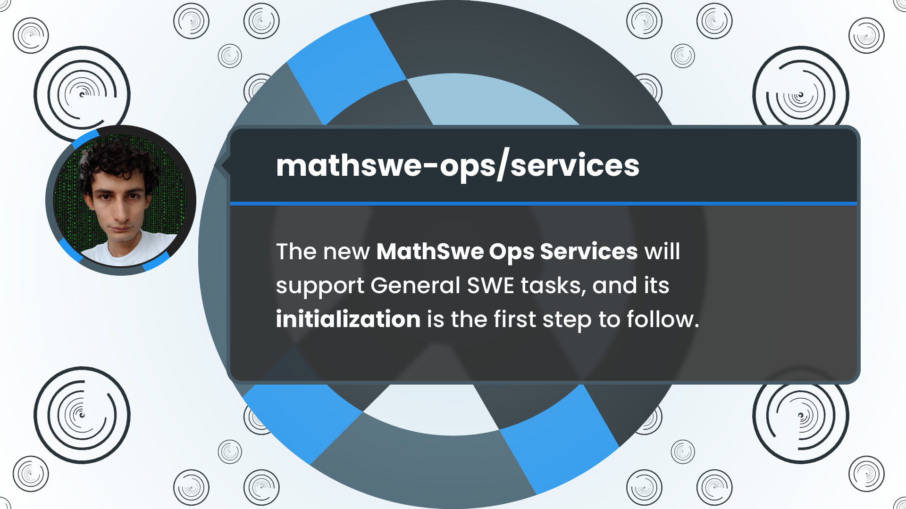

<!-- Copyright (c) 2024 Tobias Briones. All rights reserved. -->
<!-- SPDX-License-Identifier: CC-BY-4.0 -->
<!-- This file is part of https://github.com/tobiasbriones/blog -->

# Initializing the MathSwe Ops Services Project | MathSwe Ops Services (2024/09/15)

The new MathSwe Ops Services is a general-purpose server application designed to
support General SWE tasks related to mathematical software. The project
initialization is the first step to follow.

---

**Initialize project services with Cloudflare Workers, TS, and vitest**

Sep 15: PR [#1](https://github.com/mathswe-ops/services/pull/1) merged into `services/dev <- services/ops` by [tobiasbriones](https://github.com/tobiasbriones)
{: .pr-subtitle }

It creates a new project with TS, Vitest, and a Cloudflare Worker template.

I introduced the new MathSwe Ops Services project in
[Initializing MathSwe Ops Services (2024/09/15)](/initializing-mathswe-ops-services-2024-09-15)
with the concept, motivation, and tasks behind it.

MathSwe Ops Services is a new server application designated to provide General
SWE services, while PR #1 gets it started with the technology the project will
employ.

---

The Services application is initialized with the pertaining technologies,
completing the getting started stage.

