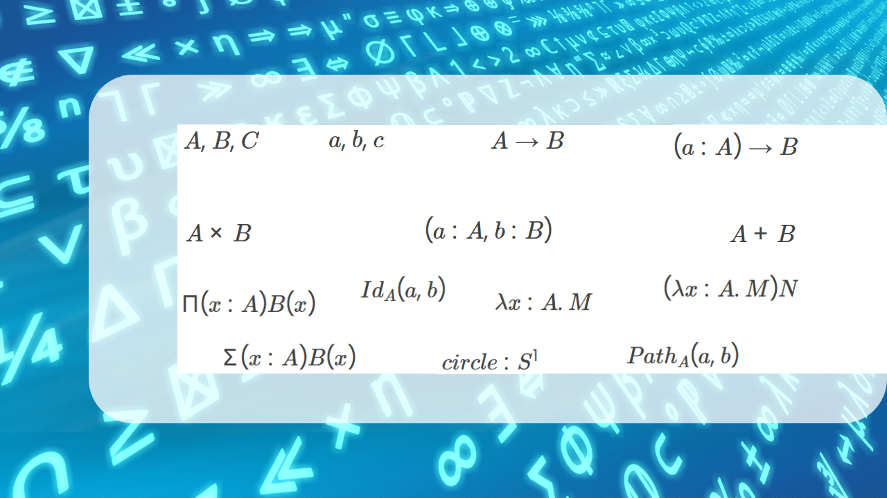

<!-- Copyright (c) 2023 Tobias Briones. All rights reserved. -->
<!-- SPDX-License-Identifier: CC-BY-4.0 -->
<!-- This file is part of https://github.com/tobiasbriones/blog -->

# Introductory Type Theory Notation Summary (2023/12/25)

<b>
Background Derived from
<a href="static/notice">Pixabay</a> Images
</b>

I collected an introductory summary as a presentation of the notation used in
type theory.

The types are presented from easy to advanced concepts.

    <button
    type="button"
    data-bs-target="#type-theory-notations"
    data-bs-slide-to="0"
    aria-label="Slide 1"
    class="active"
    aria-current="true"
>
</button>
<button
    type="button"
    data-bs-target="#type-theory-notations"
    data-bs-slide-to="1"
    aria-label="Slide 2"
    class=""
    
>
</button>
<button
    type="button"
    data-bs-target="#type-theory-notations"
    data-bs-slide-to="2"
    aria-label="Slide 3"
    class=""
    
>
</button>
<button
    type="button"
    data-bs-target="#type-theory-notations"
    data-bs-slide-to="3"
    aria-label="Slide 4"
    class=""
    
>
</button>
<button
    type="button"
    data-bs-target="#type-theory-notations"
    data-bs-slide-to="4"
    aria-label="Slide 5"
    class=""
    
>
</button>
<button
    type="button"
    data-bs-target="#type-theory-notations"
    data-bs-slide-to="5"
    aria-label="Slide 6"
    class=""
    
>
</button>
<button
    type="button"
    data-bs-target="#type-theory-notations"
    data-bs-slide-to="6"
    aria-label="Slide 7"
    class=""
    
>
</button>

    

    

    

    

    

    

    

    

<button
    class="carousel-control-prev"
    type="button"
    data-bs-target="#type-theory-notations"
    data-bs-slide="prev"
>
   

     
     
   

    Previous
</button>

<button
    class="carousel-control-next"
    type="button"
    data-bs-target="#type-theory-notations"
    data-bs-slide="next"
>
   

     
      
    

    Next
</button>

<button type="button" class="zoom">

zoom_in

zoom_out

</button>

<button type="button" class="fullscreen">

fullscreen

fullscreen_exit

</button>

<h5>Type Theory Notations</h5>

This makes it easy to understand why type parameters (a.k.a. "generic" types)
are lowercase styled in Haskell because it's a design decision that comes from
type theory or computer science.

Ordinary languages employ random syntax (probably pragmatic when
they were created) like uppercase generics or C-like syntax, which are ugly and
made-up/workarounds[^1].

[^1]: I read long ago that they tried the arrangements of C++ pointer syntax to
    make "sense" of them, but it ended up as the same workaround mess that
    language is, so pragmatic designs end up as workarounds rather than real
    solutions

Regarding type identifiers, modern languages have adopted the syntax `a: A`,
unlike old languages like C# and Java, which are `A a` C-like. If you notice,
the syntax `a: A` comes from type theory, and `a` is lowercase to not confuse a
type variable with its type —the reason why "generics" are lowercase in
Haskell if you ever wonder[^2].

[^2]: I mention this because coming from banal languages like Java (and all the
    other mainstream languages) where generic types are uppercase, arises the
    question of why they look "weird" in functional languages using lowercase
    for type variables; but it makes perfect sense when you understand the
    theory —what any professional engineer does

Sets in math are denoted in uppercase since they're abstractions containing
specific elements (or points in topology, vectors in vector spaces, etc.). Types
are like sets in CS, so they are denoted in uppercase, and the variables are
lowercase. Therefore, **we follow informed designs**.

Regarding the last slides, homotopy type theory is a new field of study based on
a recently discovered connection between homotopy theory and type theory,
offering a new "univalent" foundation of math [1].

This collection of type theory symbols and notations fundamentally related to
math and set theory in computer science can help grasp the meaning of concepts
like lambdas and ADTs as a general reference as well as design decision reasons.

## Bibliography

- "Types and Programming Languages," by Benjamin C. Pierce.
- "Foundations" by Jeremy Avigad.

## References

[1] [The HoTT Book](https://homotopytypetheory.org/book/). (2022, March 18). Homotopy Type Theory.

