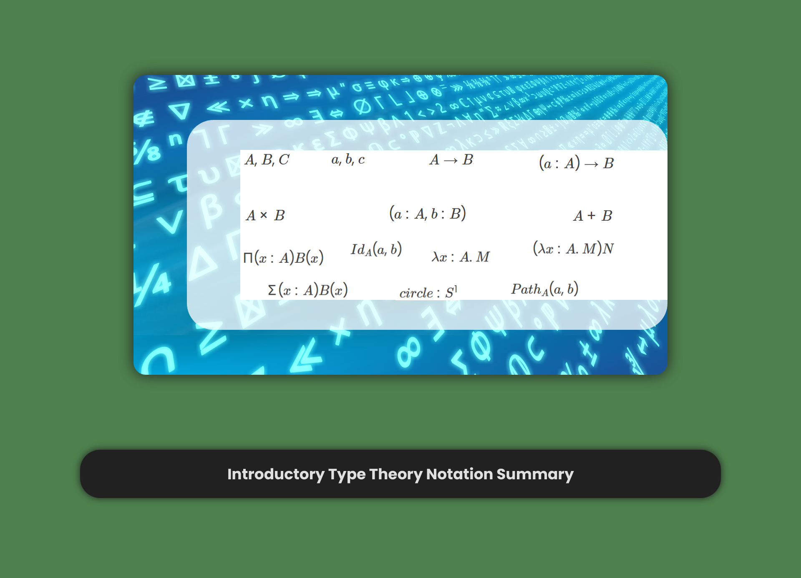
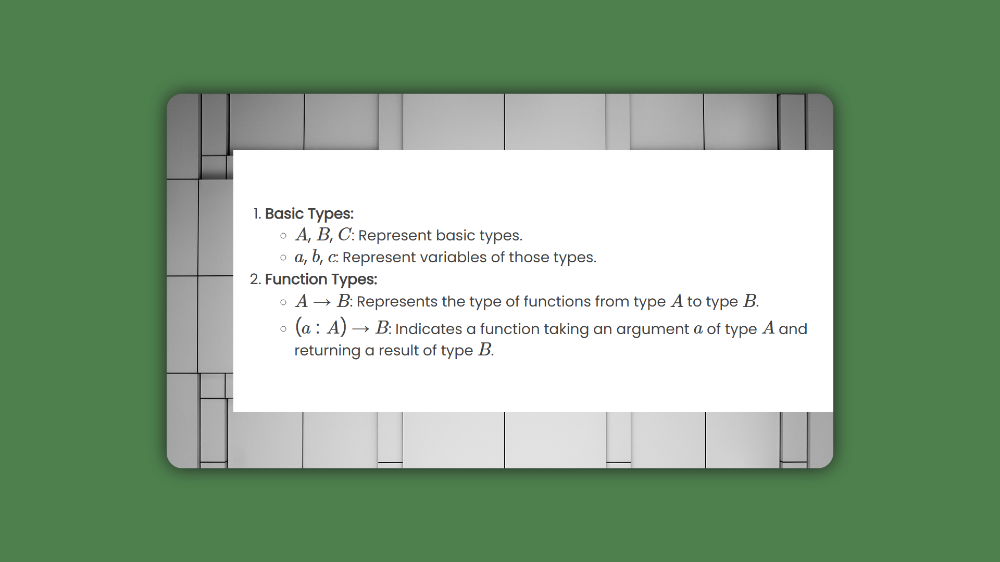
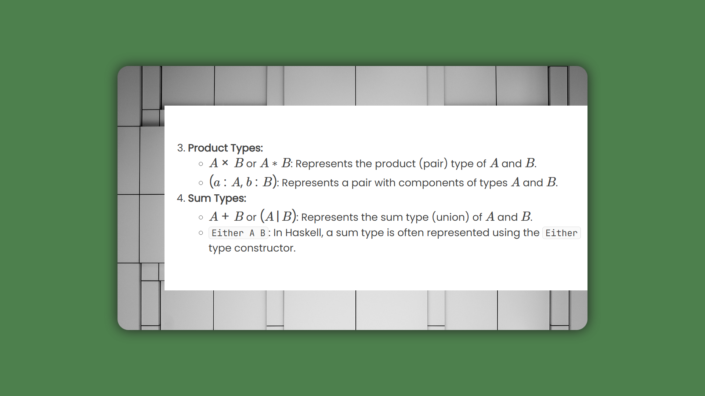
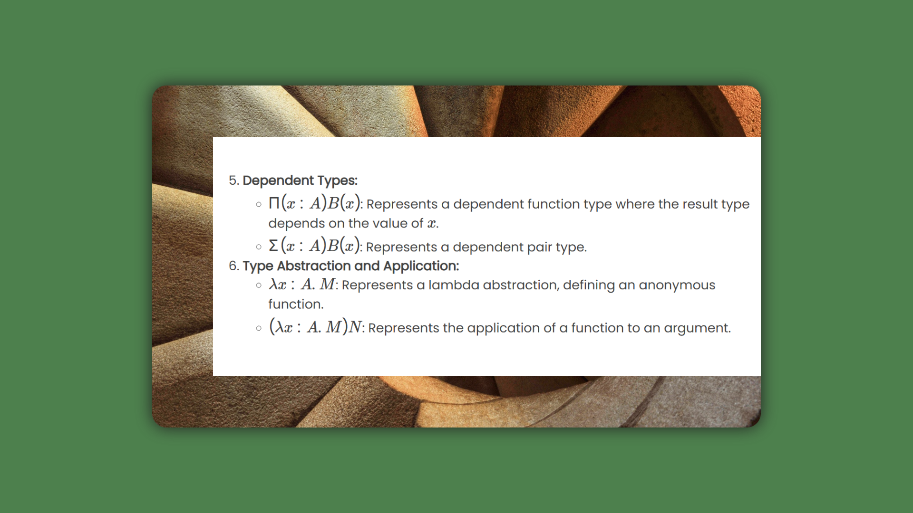
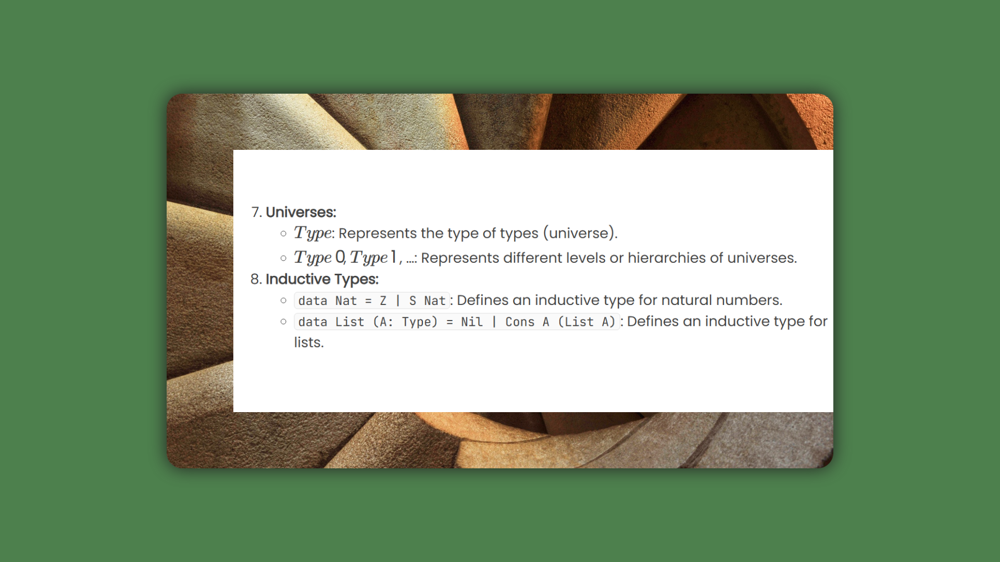

# Notice

## Derivatives

- [Cover](introductory-type-theory-notation-summary-2023-12-25.png)
    - Derivative from
        - [Mathematics Pay Algebra \| Pixabay](https://pixabay.com/illustrations/mathematics-pay-algebra-character-1044091/)
            - By [geralt](https://pixabay.com/users/geralt-9301/)
    - Under the [Pixabay License](https://pixabay.com/service/terms)
    - Changes: Use image as the background of the original image

- Presentation Slides: Type Theory Notations
    - Derivative from
        - [Staircase, Spiral, Architecture \| Pixabay](https://pixabay.com/photos/staircase-spiral-architecture-600468/)
            - By [stokpic](https://pixabay.com/users/stokpic-692575/)
        - [Abstract, Architecture, Contemporary \| Pixabay](https://pixabay.com/photos/abstract-architecture-contemporary-1867937/)
            - By [Pexels](https://pixabay.com/users/pexels-2286921/)
    - Under the [Pixabay License](https://pixabay.com/service/terms)
    - Changes: Use images as the background of the original images
