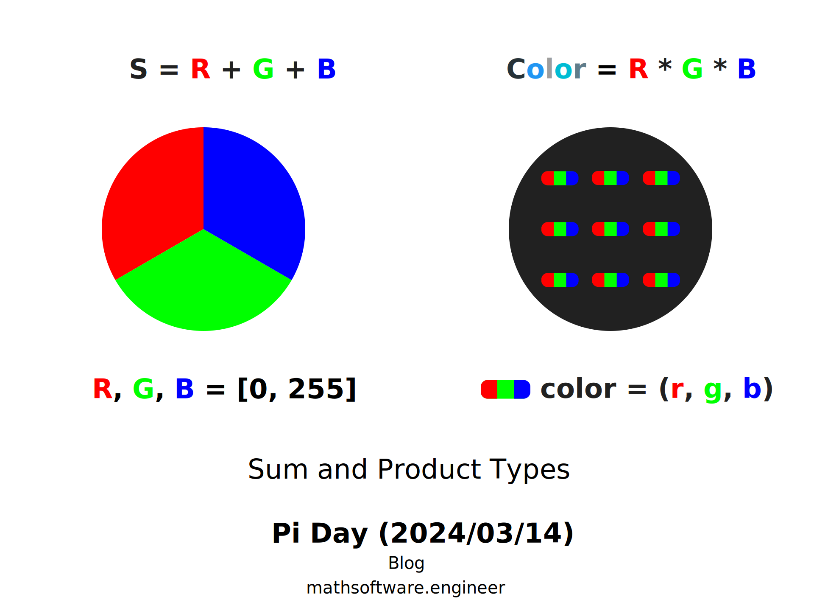

<!-- Copyright (c) 2024 Tobias Briones. All rights reserved. -->
<!-- SPDX-License-Identifier: CC-BY-4.0 -->
<!-- This file is part of https://github.com/tobiasbriones/blog -->

# Pi Day (2024/03/14)

---

The uppercase letter **Π (capital pi)** denotes the product operator in math.
While sets have the *cartesian product* operation, we can apply such an algebra
of sets to computer science via product types. While the symbol Π appears in
math, we can also employ it in ATDs (Algebra Data Types) like product types, and
much more.

Similar to how math notation uses Π for the product operator, we can denote the
summation via the uppercase sigma letter (Σ) [5]. Thus, we can denote sum
types (like enums) under Σ and product types (like tuples or records) under Π.

Let $$A, \, B$$ be types.

$$S = A + B = \sum_{\{ T_j \} \in \{ A, B \, \} } T_j$$

$$P = A * B = \prod_{\{ T_j \} \in \{ A, B \, \}} T_j$$

The disjoint union or sum type $$S$$ induces a partition of $$A, \, B$$.

A product type $$A * B$$ represents a term with an element of $$A$$ and an
element of $$B$$ [4]. So, the Π symbol can denote the basic product type $$P$$
defining the pairs $$(a, b)$$ where $$a \in A \land b \in B$$.

A program defining data types for `Color` components and values can depict basic
types like these.



The orthogonal components `R`, `G`, and `B` can partition an `RGB` color. So,
`S` defines an adequate partition to create a `Color`. On the other hand,
`Color`, is a product type defining the set of all colors `(r, g, b)`
where $$r \in R, g \in G, B \in B$$.

The theoretical concepts above can be efficiently implemented in a purely
functional language like Haskell.

`Expressing Math Concepts like ADTs in Functional Languages | Defining Sum and Product Types in Haskell`

```haskell
newtype R = R Int  -- [0, 255]
newtype G = G Int  -- [0, 255]
newtype B = B Int  -- [0, 255]

data ColorComponent = Red R | Green G | Blue B

data Color = Color { red :: R, green :: G, blue :: B }
```

The product type `Color` is defined as a record or nominal tuple to add fields
enhancing the underlying language semantics (each tuple component has a label or
associated accessor function).

Further, notice that a product type can be seen as an ADT with only one data
constructor or sum type with one only variant in Haskell since a product type is
isomorphic to such ADT. That is, algebraic data types with one constructor are
isomorphic to a product type, and product types are also the dual of sum types
[6].

The dualities mentioned show how Π is ubiquitous in mathematics and computer
science.

---

A **dependent type** is an advanced abstraction essential to formalize
information of our types that depend on runtime values. Some of them can be
dependent products or dependent sums.

A function codomain (or return type) can vary according to its argument value.
For example, a function that takes a non-negative integer `n` and returns a list
of length `n` at type level.

Dependent types can be like the type $$A^n$$ of length $$n$$ vectors, $$A^{n
\times m}$$ of $$n \times m$$ matrices, trees of height $$n$$, and sorted lists
and sorted binary trees. Also, notice that dependent types can also be index
sets. For example, $$A^n$$ is a type family indexed by $$n$$. [2]

One may define a tree of height $$n$$ as 3-tuple where the height of its root
node is $$n$$, that is, $$(V, children : V \to \mathcal {P} (V), root \in V)$$
and $$height : V \to \mathbb{Z}^{noneg}$$ where $$height(r) = n$$. Therefore, we
can *engineer the height-$$n$$ trees into the type system*, resulting in
engineering-grade software.

Dependent types are specialized abstractions where a type can be a function of
runtime values, thus fully encoding the domain into the type system. Therefore,
their role in computationally verifying mathematical proofs and building
engineering-grade/certified software is essential.

---

Some important dependent types are the **dependent product types** that
generalize product types. A type $$B$$ is a function of (or depends on) the
value of a type $$A$$.

A dependent product type is defined under the Π symbol, and thus called a
**Pi type**.

$$\prod_{x : A} B(x)$$

They can also be denoted as $$\prod(x: A) B(x) $$.

A **dependent product type** $$\prod_{x: A} B(x)$$ is the type of
"dependently typed functions" assigning to each $$x: A$$ an element of $$B
(x)$$, for the dependent type $$x: A \vdash B(x): Type$$ [3].

Product types are thus a particular case where $$B$$ is constant, so $$\forall x
\in A \implies B(x)=B$$.

A product type can be related to logical conjunction and, in predicate logic, to
a universal quantification model (∀). Similarly, a sum type or disjoint union
can be related to logical disjunctions and, in predicate logic, to an
existential quantification model (∃). [2]

The duality in both product and sum types is also reflected in their notations
since both can use the capital pi letter. Dependent product types are denoted
under $$\prod$$, while dependent sum types, or **dependent coproducts**, are
denoted under $$\sum$$ but also $$\coprod$$ [7].

The capital pi symbol (Π) is present in a vast amount of math and computer
science, as shown with dependent products/coproducts with their duality and
further relations in other domains like logic.

---

After noticing the magnificence of the symbol Π, we can explore how the constant
pi (π) can be expressed as an infinite product.

The number π equals the Wallis product [1]:

$$\prod_{n=1}^\infty \frac{2n}{2n - 1} \frac{2n}{2n + 1} = \frac{2}{1} \cdot
\frac{2}{3} \cdot \frac{4}{3} \cdot \frac{4}{5} \cdot \frac{6}{5} \cdot
\frac{6}{7} \cdot \ldots = \frac{\pi}{2}$$

While some proofs require integral calculus and trigonometry, others are
straightforward and require elementary math, like the Pythagorean theorem, basic
algebra, and the circle area $$\pi r^2$$. Others use complex trigonometric
identities while still avoiding calculus. This formula can also involve
geometric constructs and proofs with inequalities and sequences. There are a
variety of proofs with different requirements, either involving elementary math,
geometry, and also calculus for the advanced ones.

The Wallis infinite product that denotes the number $$\pi$$ under its own
capital letter $$\prod$$.

---

The product operator $$\prod$$ (capital pi, or Π) and the constant $$\pi$$ are
ubiquitous in math and computer science.

In type theory and functional programming, dependent types, like dependent
products, employ the capital Pi symbol Π. Thus, dependent product types are
called Pi types since the Π symbol denotes the math product. Moreover, the
symbols $$\prod$$ and $$\coprod$$ depict the duality between products and
coproducts.

Advanced formal computer science constructs like dependent types enable
comprehensive domain engineering at the type level. Since types can depend on
runtime values, dependent types are particularly remarkable in computational
theorem proof and enabling software engineering-grade capabilities such as
program verification.

Project implementations may cover engineering-grade software such as
mathematical software (MSW) and others that must be mathematically certified,
like aircraft software.

While Π and π don't have a direct relation since the former is a symbol and the
latter is a number, an infinite product under the symbol $$\prod$$ can express
the number $$\pi$$, thus giving us a philosophical relation between both. So,
the constant π shows us its ubiquitousness when expressed in terms of its own
capital symbol Π through an infinite product.

The remarkable presence of the symbol Π and the constant π in math and computer
science gives us plenty of insight to fulfill engineering-grade project
implementations.

## References

[1] Johan Wästlund (2007) An Elementary Proof of the Wallis Product Formula for
pi, The American Mathematical Monthly, 114:10, 914-917, DOI:
10.1080/00029890.2007.11920484

[2] Bove, A., & Dybjer, P. (2009).
[Dependent Types at Work](https://doi.org/10.1007/978-3-642-03153-3_2). In
Lecture Notes in Computer Science (pp. 57–99).

[3] [Dependent Product Type](https://ncatlab.org/nlab/show/dependent+product+type).
nLab.

[4] [2.1 Product Types \| Lecture 04.1: Algebraic Data Types and General Recursion](https://stanford-cs242.github.io/f17/assets/slides/04.1-adt-recursion.pdf).
CS 242: Programming Languages, Fall 2017 | Stanford.

[5] Contributors to Wikimedia projects. (2023, October 22).
[Pi (letter). Simple English Wikipedia, the Free Encyclopedia](https://simple.wikipedia.org/wiki/Pi_(letter)).

[6] Wikipedia contributors. (2023, November 12).
[Product type. Wikipedia](https://en.wikipedia.org/wiki/Product_type).

[7] [Idea \| Dependent Sum Type](https://ncatlab.org/nlab/show/dependent+sum+type#Idea)
nLab.
