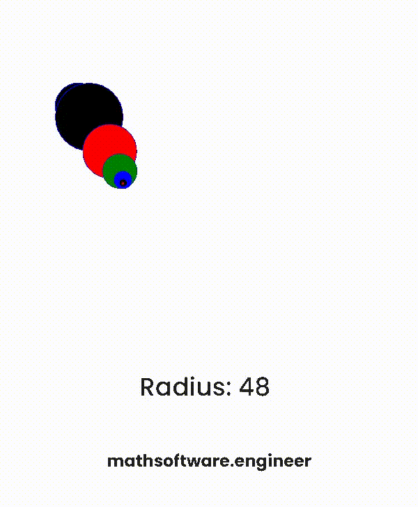

<!-- Copyright (c) 2022-present Tobias Briones. All rights reserved. -->
<!-- SPDX-License-Identifier: CC-BY-4.0 -->
<!-- This file is part of https://github.com/tobiasbriones/blog -->

# An Excited Time Drawing Mandala Fractals Today (2023-04-06)

---

One example is the above drawing with animation I was checking the last time:

<figcaption>

<strong>Basic Fractal with Circles</strong>

</figcaption>

It just was a basic PoC and I got some insights, for example: recall that
understanding the *constant part of relativity* and recursion is a
*key* for understanding relativity, and that, as the radius gets bigger the
circle looks relatively "flat" but it's still a circle, so you can use your
imagination or creativity which is another *key* and think that "you're getting
closer to the surface of the sun", so many will believe that "the sun is
flat" because that's what they see in their local, fragmented, or absolute
perspective but as we understand relativity we know what's actually happening,
and that these shapes are actually circles (relatively).

Notice how recursion contains *that constant part of relativity*: the
recursive function is the **pattern** that **keeps constant** (one part),
and the observer is the domain of the function that **keeps changing** 
(second part).

That sounds familiar, it's like induction (so math). Base step, 
recursive/inductive step.

That is, mathematical elegance with homogeneity, as I say in
[From Imperative to Functional: TypeScript Fetch Promise](from-imperative-to-functional-_-typescript-fetch-promise),
*the simplest designs are the best*, and **homogeneity yields the simplest
form of a problem** so that the other part can constantly keep changing
peacefully. That's also a way to see and prove how boilerplate is a measure 
for bad quality of software, **you have to factorize it**.

<figcaption>

<strong>Drawing</strong>

</figcaption>
