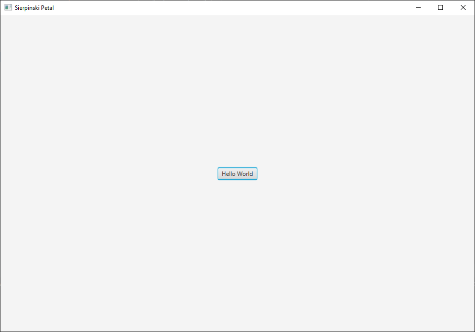

<!-- Copyright (c) 2023 Tobias Briones. All rights reserved. -->
<!-- SPDX-License-Identifier: CC-BY-4.0 -->
<!-- This file is part of https://github.com/tobiasbriones/blog -->

# Drawing a Sierpinski Petal Mandala Fractal in JavaFX

## Getting Started

Tools and project set up is given next, so you can build the basics for
developing the underlying drawing in JavaFX.

First, make sure to have Java 20+ installed on your development machine. If
you're using Linux, I recommend using [SDKMAN](https://sdkman.io) for
[installing Java](https://sdkman.io/usage#installdefault) and managing different
versions. If you're using Windows, you can download the
[installer from foojay.io](https://foojay.io/download).

In addition to the recommended Java installation method mentioned above, I
highly suggest using the **Zulu (FX) distribution** to get the FX mods out of
the box!

As always, I'm using IntelliJ IDEA as the IDE of choice, so next, we need to set
up the JavaFX app.

For creating a new JavaFX app, follow
[Beginning JavaFX Applications with IntelliJ IDE \| foojay.io](https://foojay.io/today/beginning-javafx-with-intellij)
with one of the approach given by the author. I suggest using the "Plain"
approach for this project.

Our app package name is `engineer.mathsoftware.blog.sierpinskipetal` by
following the reverse DNS Java convention for app packages. You'll need the
`Main.java` class and the `package-info.java` on the root package
(`sierpinskipetal`).

It's important to note the `module-info.java` in the module's source root
(`src` dir), as we use Java modules to import JavaFX mods in this case.
Exporting your root package is also necessary, as JavaFX is a framework that
uses reflection and needs to find your `Main` class.

With this, Java and JavaFX should be available on your machine as well as the
dev tools, environment, and starting project, so we can start writing the JavaFX
code.

### Hello World

Our Hello World app looks like the following:

```java
public class Main extends Application {
    private static final double WINDOW_WIDTH = 960.0;
    private static final double WINDOW_HEIGHT = 640.0;

    public static void main(String[] args) {
        launch(args);
    }

    @Override
    public void start(Stage primaryStage) {
        var root = new VBox();
        var scene = new Scene(root, WINDOW_WIDTH, WINDOW_HEIGHT);
        var btn = new Button();

        primaryStage.setTitle("Sierpinski Petal");

        btn.setText("Hello World");
        btn.setOnAction(actionEvent -> System.out.println("Hello World"));

        root.setAlignment(Pos.CENTER);
        root.getChildren().add(btn);

        primaryStage.setScene(scene);
        primaryStage.show();
    }
}
```

<figcaption>
<p align="center"><strong>Hello World Program</strong></p>
</figcaption>



<figcaption>
<p align="center"><strong>Hello World Scene</strong></p>
</figcaption>
