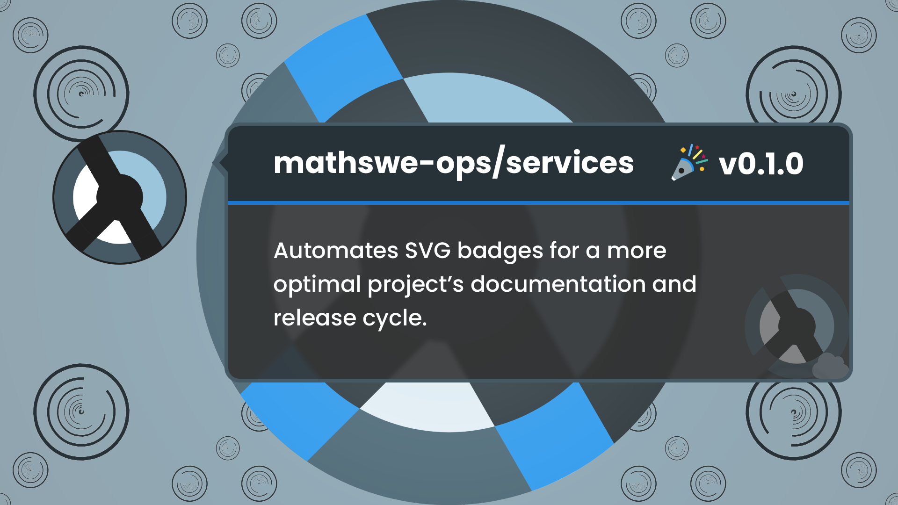
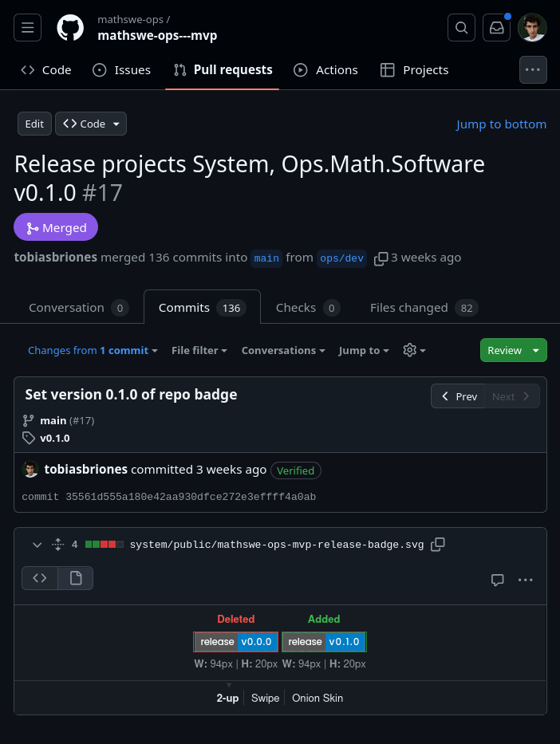

<!-- Copyright (c) 2024 Tobias Briones. All rights reserved. -->
<!-- SPDX-License-Identifier: CC-BY-4.0 -->
<!-- This file is part of https://github.com/tobiasbriones/blog -->

# MathSwe Ops Services v0.1.0 (2024/09/18)

MathSwe Ops Services is a web application supporting general-purpose software
engineering related to mathematical software. Its initial release presents
solutions to automate SVG badges for a more optimal project's documentation and
release cycle.

## Web API to Generate SVG Badges for Release and MathSwe Project Name with Icon

Some MathSwe projects, like microservices and MVPs, are subdirectories in their
repository. So, enriching their documentation with release badges requires
manual maintenance as popular badge providers, like Shields.Io, don't support
these standards. These subprojects are independent and need their version when
released, and eliminating (unnecessary) release overhead is a top engineering
priority to deliver value faster.

Further, besides the version badge problem, project docs require a badge with
their icon and name, which is currently manually handled. Finally, data like
base64 icons don't fit a Markdown URL, so the badge provider should support
these.

This initial release provides results to the
[Initializing MathSwe Ops Services (2024/09/15)](/initializing-mathswe-ops-services-2024-09-15)
insight.

- [Initializing the MathSwe Ops Services Project \| MathSwe Ops Services (2024/09/15)](https://blog.mathsoftware.engineer/initializing-the-mathswe-ops-services-project---mathswe-ops-services-2024-09-15).
- [In-House MathSwe-TS-and-Client Libraries \| MathSwe Ops Services (2024/09/15)](https://blog.mathsoftware.engineer/in--house-mathswe--ts--and--client-libraries---mathswe-ops-services-2024-09-15).
- [New Badge Version and Project Endpoints \| MathSwe Ops Services (2024/09/18)](https://blog.mathsoftware.engineer/new-badge-version-and-project-endpoints---mathswe-ops-services-2024-09-18).

GitHub release at
[Services v0.1.0: Publishes a Web API to Generate SVG Badges for Release and MathSwe Project Name with Icon](https://github.com/mathswe-ops/services/releases/tag/v0.1.0).

The release endpoint accepts GitHub repositories and their subprojects, while
the other accepts MathSwe projects and their MVP versions. The new endpoints in
the Services API remove significant manual maintenance overhead when releasing
and creating MathSwe project documentation.

## Version Badge

MathSwe projects can be direct repositories or independent subprojects inside
repositories such as microservices. A quality engineering process requires
subproject versioning as they're independent, but badge providers like
Shields.Io don't support these standards.

The problem is that the current way to add these particular badges is by
updating the SVG file in the repository every time you release it, which
increases the *release overhead* and pollutes the project's files.

Releasing (and developing) software must be as productive as possible to deliver
value fast without burning out, which leads to automating these badges.

<figure>
    
    <figcaption>Manually Updating Repository Version Badge Before Release</figcaption>
</figure>

The "trivial" version badge is that of the repository.

Further, you can see there are repositories with subprojects, like `ops.math.
software---mvp/` and `system/`. They needed various in-project badges, which
required manual maintenance.

<figure>
    
    <figcaption>Manually Updating Subproject Version Badges Before Release</figcaption>
</figure>

The `badge/version` endpoint automates this features.

| Method | Endpoint                                  | Description                  | Parameters                                                                                                                                                                      |
|--------|-------------------------------------------|------------------------------|---------------------------------------------------------------------------------------------------------------------------------------------------------------------------------|
| GET    | `/badge/version/:gitPlatform/:user/:repo` | Badge for repository version | `:gitPlatform` - Only GitHub supported `:user` - Repository user or Org `:repo` - Repository name  `?path` - Project's root subdirectory (e.g., a microservice or MVP) |

With a call to `badge/version/github/mathswe-ops/services` you can get the
version badge for the `services` repository of the `mathswe-ops`
user/organization hosted on `github`.

<figure>
    
    <figcaption>Ms Ops Services: Before Initial Release</figcaption>
</figure>

<figure>
    
    <figcaption>Ms Ops Services: After Initial Release</figcaption>
</figure>

One minor limitation currently is the service doesn't provide cache settings, so
the badge will take many hours to update on the GitHub side. There's a ticket to
fix it later.

The **compatibility for subprojects** encompasses those using NPM
`package.json` or Cargo `Cargo.toml` build systems.

You can specify subprojects with a query like
`badge/version/github/mathswe/legal?path=cookie-consent`, which responds with
the `release v0.2.0` badge for the Cookie Consent microservice of the MathSwe
Legal repository.

The release badge endpoint automates the documentation of MathSwe projects when
released by providing an online SVG badge URL that will infer the latest
project's or subproject's version.

## Project Badge

Repository documentation shows the project badge to introduce its name and icon.
While they don't require repetitive maintenance after you commit them to the
repository files, they still slow you down when creating them and pollute the
project's files.

Since they are simpler to create, this release provides the `badge/project`
endpoint for MathSwe projects.

| Method | Endpoint                  | Description              | Parameters                                                          |
|--------|---------------------------|--------------------------|---------------------------------------------------------------------|
| GET    | `/badge/project/:project` | Main badge for a project | `:project` - MathSwe project name `?mvp` - Flag for MVP versions |

The service contains domain knowledge, like base64 icons and project names, so
you only need the badge URL to display in your documentation.

<figure>
    
    <figcaption>Ms System Ops Mvp: Project Badge</figcaption>
</figure>

With a call to `/badge/project/mathswe-system-ops?mvp`, which includes the
`mvp` query, you can generate MathSwe project badges.

A limitation is the quality of icons since they're base64 PNGs, but that will
improve later and doesn't affect currently.

The project badge endpoint provides facade badges for MathSwe projects and their
MVP versions to eliminate these SVG files from the project's files.

## Badge Automation for Productive Releases

The initial release of MathSwe Ops Service focused on tackling the current needs
of SVG badges to increase the productivity of MathSwe projects.

The version badge automates a significant step of releasing projects or
subprojects, and the project badge also helps create new MathSwe projects by
extending this service. Automating badges reduces the development cycle overhead
and optimizes by eliminating unrelated static files from projects while
providing clear documentation.

