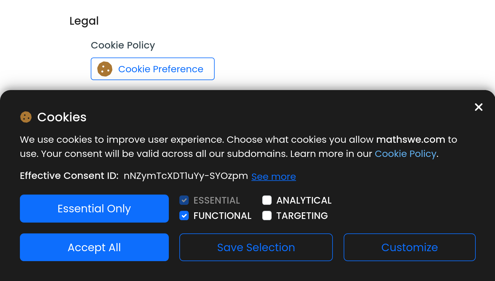
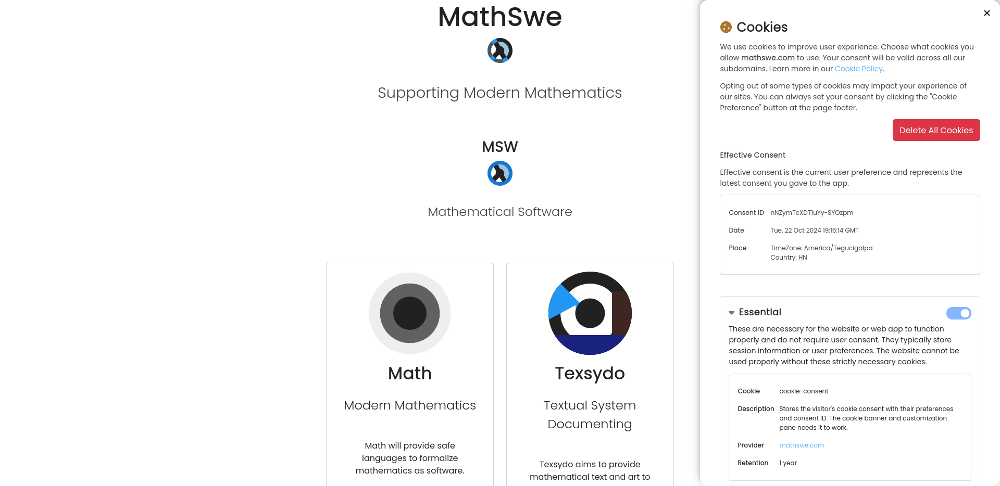
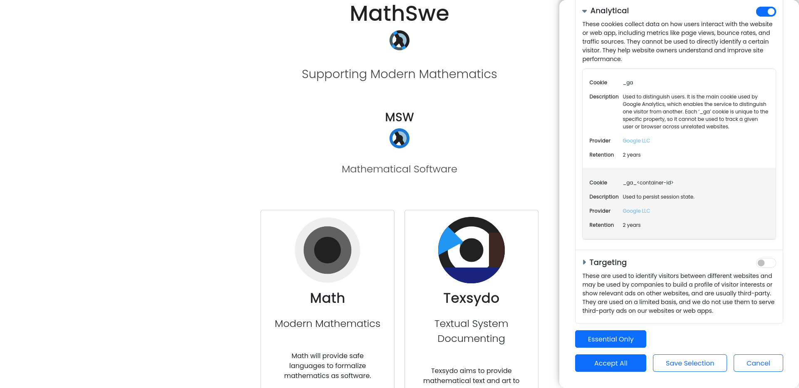

<!-- Copyright (c) 2024 Tobias Briones. All rights reserved. -->
<!-- SPDX-License-Identifier: CC-BY-4.0 -->
<!-- This file is part of https://github.com/tobiasbriones/blog -->

# MathSwe Com v0.1.0 (2024/10/23)

## Initial Cookie Policy and Brief Home Page Showcasing Existing Projects

MathSwe Com will introduce some commercial operations to help deliver final
products to users.

- [Initializing Ops with a Cookie Banner \| MathSwe Com (2024/03/21)](https://blog.mathsoftware.engineer/initializing-ops-with-a-cookie-banner---mathswe-com-2024-03-21).
- [New Cookie Customization Pane \| MathSwe Com (2024/04/03)](https://blog.mathsoftware.engineer/new-cookie-customization-pane---mathswe-com-2024-04-03).
- [Cookie Consent Client Integration \| MathSwe Com (2024/04/17)](https://blog.mathsoftware.engineer/cookie-consent-client-integration---mathswe-com-2024-04-17).
- [Cookie Policy Ready and Home Page \| MathSwe Com (2024/10/22)](https://blog.mathsoftware.engineer/cookie-policy-ready-and-home-page---mathswe-com-2024-10-22).

GitHub release at
[MathSweCom v0.1.0: Publishes the Initial Cookie Policy and Provides a Brief Home Page Showcasing Existing Projects.](https://github.com/mathswe/mathswe.com/releases/tag/v0.1.0).

The GitHub release also attaches the effective
[MathSwe Cookie Policy (2024/10/21)](https://github.com/mathswe/mathswe.com/releases/download/v0.1.0/mathswe-cookie-policy-2024-10-21.pdf)
document.

Deployment preview at
[Deploy Preview 25 \| Netlify](https://deploy-preview-25--mathswe.netlify.app).

Production at [MathSwe.Com](https://mathswe.com).

The initial release of MathSwe Com provides a minimal home page listing the
existing projects in production and integrating the MathSwe Cookie Consent
system with an effective cookie policy. Cookies integration is technically and
legally complete at MathSweCom, but it will provide technical support for other
web apps later.

## Initial Cookie Policy

The first developments in MathSwe Com involved technically and legally allowing
cookies to properly use tools, like Google Analytics, embedded videos, or other
business needs that can arise later. The extensive work on cookies was an
important exercise to initialize standards and legal redactions in general
rather than actually using cookies.

The **MathSwe Cookie Consent** system is rigorous, as always. If you opt out of
analytical cookies, the site will tell Google Analytics there are no permissions
granted, so it adds no `ga` cookies at all. This behavior is also proven with
the [Google Tag Assistance](https://tagassistant.google.com)
to ensure the correct implementation of Google Analytics according to user
choices on cookies.

The new **Cookie Banner** asks for quick user consent when required.

The banner optionally leads to the **Cookie Customization Pane** with advanced
options and information.

The development process involved research to validate a rigorous yet practical
compliance with the GDPR, as the
[Cookie Consent v0.1.0](/cookie-consent-v0-1-0---mathswe-legal-2024-03-29)
service is particularly detailed in sections "Complying with the GDPR" and
"Validating the Design of Consent Records" with an academic and industry
review to validate it.

The Cookie Policy text is attached above in
[the release introduction](#initial-cookie-policy-and-brief-home-page-showcasing-existing-projects)
to keep a record of the legal document.

MathSwe Com provides a new cookie policy with total transparency about cookie
usage in MathSwe apps. While only MathSwe Com integrates MathSwe Cookie Consent
right now, other web apps will integrate it to show the banner to users,
enabling tools like Google Analytics that can improve site insights,
customization, or performance.
