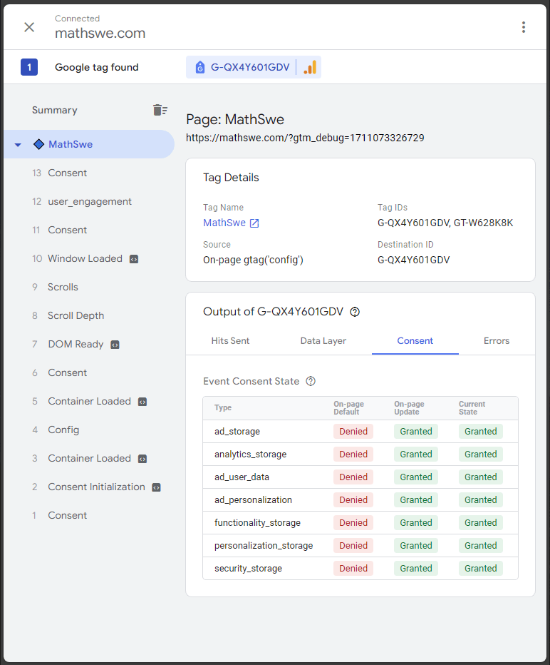
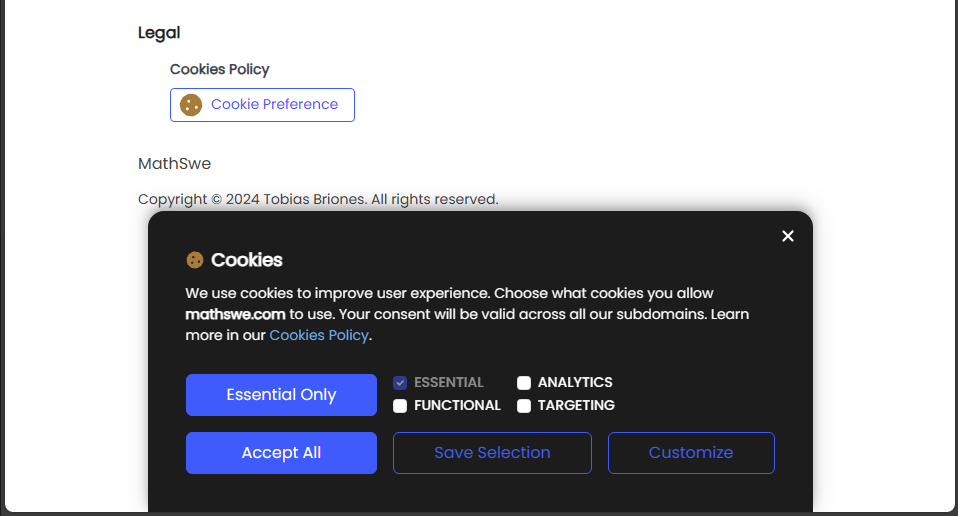

<!-- Copyright (c) 2024 Tobias Briones. All rights reserved. -->
<!-- SPDX-License-Identifier: CC-BY-4.0 -->
<!-- This file is part of https://github.com/tobiasbriones/blog -->

# Initializing Ops with a Cookie Banner | MathSwe Com (2024/03/21)

---

**Initiate web app operations**

Feb 5: PR [#1](https://github.com/mathswe/mathswe.com/pull/1) merged
into `dev <- mathswe/ops` by [tobiasbriones](https://github.com/tobiasbriones)
{: .pr-subtitle }

It sets up the web app for its initial development.

---

**Add component Table**

Feb 11: PR [#2](https://github.com/mathswe/mathswe.com/pull/2) merged
into `dev <- mathswe/ui` by [tobiasbriones](https://github.com/tobiasbriones)
{: .pr-subtitle }

It helps render minimalistic responsive tables.

I extracted the table component from the current MSW Engineer styles which
helped render the cookie policy tables with coherent cross-platform UX/UI and
responsive design.

---

**Implement component CookieBanner UI**

Feb 20: PR [#3](https://github.com/mathswe/mathswe.com/pull/3) merged
into `dev <- legal` by [tobiasbriones](https://github.com/tobiasbriones)
{: .pr-subtitle }

It adds the UI implementation for the cookie banner that will allow the user to
select cookie preferences immediately.

---

**Enhance UI of component CookieBanner with styles and anims**

Feb 21: PR [#4](https://github.com/mathswe/mathswe.com/pull/4) merged
into `dev <- legal` by [tobiasbriones](https://github.com/tobiasbriones)
{: .pr-subtitle }

It enhances and fixes some further styles and adds the showing animation.

---

**Add dep react-cookies**

Feb 21: PR [#5](https://github.com/mathswe/mathswe.com/pull/5) merged
into `dev <- mathswe/ops` by [tobiasbriones](https://github.com/tobiasbriones)
{: .pr-subtitle }

It adds app cookie support.

---

**Fix src path TS configs**

Feb 21: PR [#6](https://github.com/mathswe/mathswe.com/pull/6) merged
into `dev <- mathswe/ops` by [tobiasbriones](https://github.com/tobiasbriones)
{: .pr-subtitle }

The build command failed because of the tsconfig.json typos in the project
paths.

---

**Implement state persistence via cookies in CookieBanner.tsx**

Feb 22: PR [#7](https://github.com/mathswe/mathswe.com/pull/7) merged
into `dev <- legal` by [tobiasbriones](https://github.com/tobiasbriones)
{: .pr-subtitle }

It enables cookie usage to start storing user's content via the `CookieBanner`
component.

---

**Enable env vars and set cookie consent to all subdomains**

Feb 22: PR [#8](https://github.com/mathswe/mathswe.com/pull/8) merged
into `dev <- mathswe/ops` by [tobiasbriones](https://github.com/tobiasbriones)
{: .pr-subtitle }

It supports the `production` and `staging` environments with public variables
like domain names, as well as setting the cookie consent domain to all
subdomains.

Notice that valid cross-site cookies must be set only by the APEX domain. Set
the cookie consent from the main domain only, and it will apply to all its
subdomains.

---

**Implement rigorous Google Analytics app API**

Feb 27: PR [#9](https://github.com/mathswe/mathswe.com/pull/9) merged
into `dev <- mathswe/ops` by [tobiasbriones](https://github.com/tobiasbriones)
{: .pr-subtitle }

This implementation:

- Uses env variables to set up GA as per environment requirements.
- Follow the Google consent mode (v2).
- Is type-safe.
- Has important documentation.
- Pass the consent mode tests via Google Tag Assistance and is reactive to
  cookie changes.
- Disallows arbitrary updates (side effects) to the cookie banner check buttons
  while showing.

The remaining task is implementing this via SSR in the head tag (removing the
react-ga lib).

I had to test and reverse-engineer some libs like `@types/gtag.js`,
and `react-ga4` various times 😣 to get to the correct implementation. The
correct Google Analytics implementation was complicated and still has some
non-functional requirements pending, like loading the script with SSR in the
head (when Next.js is available for the app) instead of using the `ReactGA`
lib.

I don't plan to use other modes than `analytics_storage`, but I configured all
of them according to the Google documentation and cookie categories, so they
will scale trivially if ever needed. For example, if you only give
`analytics` consent, then only the `analytics_storage` state will be `Granted`.

The GA implementation was tested with the Google Tag Assistance tool, and worked
correctly when the consent was updated from the banner in mathswe.com.

---

**Fix build with missing dep @types/gtag.js**

Feb 27: PR [#10](https://github.com/mathswe/mathswe.com/pull/10) merged
into `dev <- mathswe/ops` by [tobiasbriones](https://github.com/tobiasbriones)
{: .pr-subtitle }

It adds the `@types/gtag.js` dev dependency to support the required type for
GTag.

---

**Add extra personalization with more complete cookie consent and better banner
styles**

Mar 2: PR [#11](https://github.com/mathswe/mathswe.com/pull/11) merged
into `dev <- legal` by [tobiasbriones](https://github.com/tobiasbriones)
{: .pr-subtitle }

It adds the other common categories of cookies: functional, and targeting.

It sets the other Google consent parameters from the Google documentation. They
may not be required, but the system will set them accordingly.

It allows quality personalization by showing the underlying domain name
requesting consent in the banner.

Personalization is even more complying now by enabling the "Essential Only" CTA
button in the cookie banner, besides the existing "Accept All" CTA button.

It improves some styles for better readability in the cookie banner.

The cookie banner component is done with these changes and complies with cookie
laws —as you can see. The next additions are being oriented to the preference
dialog (the expanded version) and the Rust microservice (in MathSwe Lambda) to
store the consents (required to comply with cookie laws, too).

---
