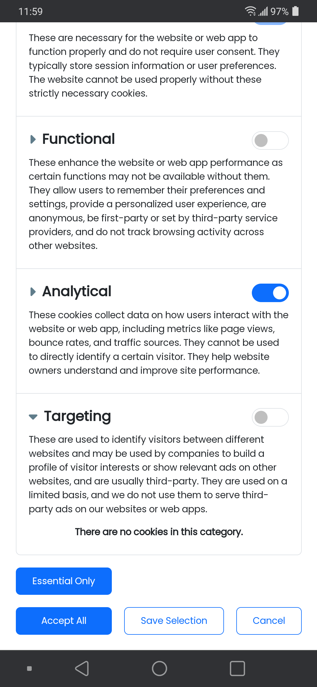
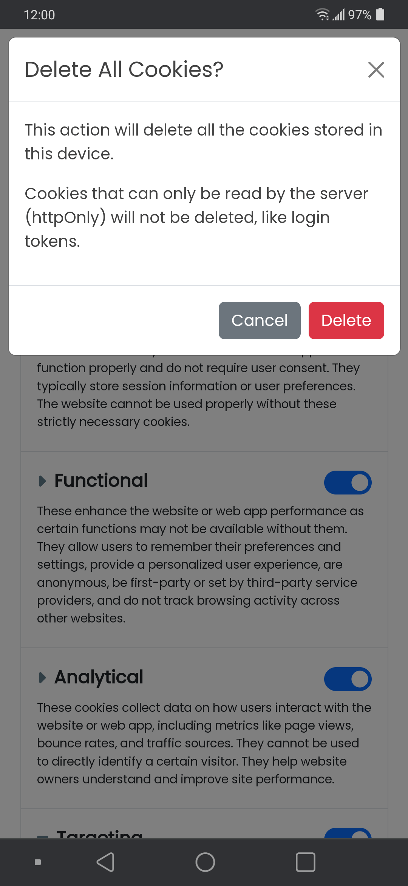

<!-- Copyright (c) 2024 Tobias Briones. All rights reserved. -->
<!-- SPDX-License-Identifier: CC-BY-4.0 -->
<!-- This file is part of https://github.com/tobiasbriones/blog -->

# New Cookie Customization Pane | MathSwe Com (2024/04/03)

---

**Implement component CookieCustomization with advanced options**

Apr 4: PR [#12](https://github.com/mathswe/mathswe.com/pull/12) merged
into `dev <- legal` by [tobiasbriones](https://github.com/tobiasbriones)
{: .pr-subtitle }

It implements a configuration pane to compliment the `CookieBanner` component
with more personalization options. It's an expansion of the `CookieBanner`.

It shows more detailed information that the banner can't show. It's responsive
and supports most screen modes and sizes.

It includes an option to delete all (non-`httpOnly`) cookies.

It lists the cookie purposes (categories) the site uses and shows a switch to
opt in to each category:

- **Essential**
- **Functional**
- **Analytical**
- **Targeting**

Each list item corresponding to a cookie category displays all its individual
cookie information in a responsive table:

- **Cookie:** Cookie name.
- **Description:** Brief cookie description and why it's used.
- **Provider:** Domain of the company or site emitting the cookie with a link to
  its corresponding cookie policy to know how that provider uses cookies. The
  provider can be first class, like *mathswe.com*.
- **Retention:** Retention period or duration of the cookie.

The table with detailed cookie information is rendered such that you can read it
vertically from top to bottom. This way, you read the items in key-value pairs.
It also has a maximum height to avoid losing the context.

When the screen size is neither mobile nor desktop, the table has the chance to
render normally in four columns.

The preference pane is shown to the right space on desktop size, as per MathSwe
standard (design from left to right).

Since the right space is always small, the table styles are mobile-like.

Finally, I implemented a button to delete all the cookies if the user wants.
It's not quite necessary, but it struck me as an interesting extracurricular
feature to make it more original.

Since cookies are deleted from the client side, it doesn't remove `httpOnly`
cookies, so it's a good feature to "clean" cookies without interrupting crucial
functionality, like the login.

The new component `CookieCustomization` expands the functionality of the
`CookieBanner` with more detailed information and features.

---
