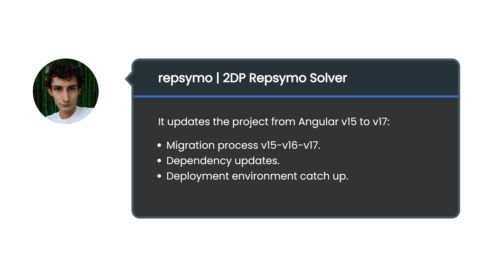

<!-- Copyright (c) 2023 Tobias Briones. All rights reserved. -->
<!-- SPDX-License-Identifier: CC-BY-4.0 -->
<!-- This file is part of https://github.com/tobiasbriones/blog -->

# Updating from Angular V15 to V17 | 2DP Repsymo (2023/12/06)

----

Many dependency updates reached production today, including Angular versions and
the rest of the project dependencies pending to arrive at 2DP Repsymo.

There's been a lot of work before in the project, but now it's the first time
I'm blogging it since the blog is available for recording these updates 🎉.

This means that technical updates like PRs will reach the blog more often to
keep formal documentation (knowledge base) and everyone involved well-informed.

---

This maintenance updates leaves the project ready with all the dependencies up
to date, including Angular, which is running in production in its latest[2]
version 17 [1]:

It performs the migration process to update the project from the previous
Angular v15 used in production through v16 until the latest Angular v17.

It includes dependency updates to their last versions.

---

The Netlify deployment couldn't deploy the `ops` branch because of an obscure
internal error when running the `build` command with no reason or logs. I read
the "solution" was to delete the site and add it again. I did it, and it worked
😂. Of course, everything was running locally, so that was a polite attempt to
fix the deployment.

These major project dependency updates are an antechamber that will enable
development iterations and operations required to be performed pretty soon
without looking back at the legacy.

## References

[1] Update project from Angular v15 to v17 by
[tobiasbriones · Pull Request #50 · repsymo/2dp-repsymo-solver](https://github.com/repsymo/2dp-repsymo-solver/pull/50).
(n.d.). GitHub.

[2] [Angular Update Guide](https://update.angular.io/). (n.d.).
