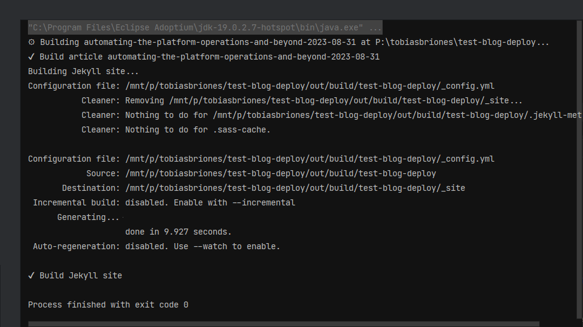

<!-- Copyright (c) 2023 Tobias Briones. All rights reserved. -->
<!-- SPDX-License-Identifier: CC-BY-4.0 -->
<!-- This file is part of https://github.com/tobiasbriones/blog -->

# Automating the Platform Operations and Beyond (2023/08/31)


---

Transitioning from a default environment to a richer and more standardized
platform to publish articles in a faster cadence has been tackled as a CLI tool
in Kotlin (Arrow) as part of an ongoing process that's also left new features
and powerful visions.

## Previous Article Operations

I started using GitHub pages with Jekyll[^1] and the minimal theme at the
beginning since it was the most available.

[^1]: Jekyll is a popular tool that builds static websites from Markdown and
    available for GitHub pages

I've published several articles of different kinds and have others unpublished
that I can use for proof of concept so I can check the newer designs fit well in
practice.

With that, I've been experimenting by manually deploying the content to the
`gh-pages` branch.

Now that I've found concise guidelines in practice, I'm ready to automate the
workflow.

It's not an easy task: there's a lot to automate, many bugs and side effects
I've fixed, complex definitions, and many parts of the system are still
temporal.

I always try to avoid over-engineering, so for example, I'll obviously get rid
of Jekyll and many other mundane tools[^2] (temporal parts), but now, I still
have to support them, so I have to check whether the tooling to develop and
test[^3] will return the investment.

[^2]: Jekyll has given me a lot of trouble regarding side effects
    (some articles ending with "x" don't build, etc.), watch mode doesn't work,
    Ruby dependencies, customization, etc., and I don't need mere static sites
    anymore, so I better move on and off Jekyll soon

[^3]: When developing software, repetitive manual testing or automated testing
    of something you will get rid of later introduces a lot of overhead, so you
    have to avoid both under-engineering and over-engineering

Many details are still unclear in this early stage, so I still haven't formally
opened a repository to work on these ops tools. I'm not fully sure yet where
they will belong in the end. This is due to other tools that I will create, so
all of them are barely starting to take shape.

Eventually, after validating many processes, I'm ready to start automating some
parts of the system.

## Development of a CLI Tool

In order to automate my common workflow on mathsoftware.engineer I needed to
develop a CLI tool to write some commands to operate on the article's source
code all the way to production.

### Kotlin and FP

One of the favorite technologies for this implementation was Kotlin for various
reasons.

The developing tooling is not stable yet and will not be for a while since this
will be part of something big that is not well-defined in practical terms yet.

For CLIs, Rust[^4] would be my first choice, but it's too complicated for this
stage of the system, so I need something faster to develop.

[^4]: I've been using Rust to automate Ubuntu system installation instead

I could use Purescript or Haskell to build a robust DSL, but that would also be
over-engineering for this stage too.

A convenient tool for my familiarity and its FP support is Kotlin since Java
was my first language, and I'm well versed all over these ecosystems.

The JVM isn't convenient for CLIs or GitHub actions tasks due to VM startup and
overhead. Getting crazy about GraalVM or Kotlin native wouldn't make a lot of
sense either. Since performance optimization is not a requirement (yet), I won't
bother about this concern.

As said, I'd use Rust which is appropriate, but I ended up choosing Kotlin
(JDK 19) because it's a great balance among all the constraints. Furthermore, I
can use the Arrow library to use a decent approach to FP, that is, my code and
ideas can still be future-proof this way.

### Commands

I developed some useful and required commands to move forward in the automation
processes.

You can run the tool via terminal in any Git repository subdirectory containing
articles. The root of the project is detected by the program. So, it's like
using `git` or a similar standard tool.

For now, I called the CLI program **"ops"** after distributing its binary to run
on my machine. Recall that this will be part of something big later on, and I
haven't published anything formal.

#### Entries

It lists all the article entries found in the repository.

*Syntax:* `ops entries`.

*Example:*


The command will show the number of articles and list them all in their ID form
as found in the working repository.

#### Create

It creates a new entry given its ID and classes[^5] separated by commas.

[^5]: I came up with this design from a lot of experience where source code is
    naturally organized in (subsets) subdirectories by hierarchies —from 
    abstract to concrete— of domain-specific (mathematical) **classes**, forming
    a logically structured tree that scales horizontally

*Syntax:* `ops create { entry-id } { class_1,class_2,...,class_n }`.

Where classes from $$1 \to n$$ go from coarse to finer subdirectories.

*Example:*


Entry names must be correct values; they must not exist already, and the classes
are passed as a value separated by commas.

Articles are developed in the Git branch named as their ID.

So, the command leaves you in the article's branch, where a new empty entry with
the given information is created and committed to Git by the system.

#### Build

It builds the article(s) passed.

*Syntax:* `ops build { target } (jekyll)`.

Where:

- `target` can either be the ID of the article or `.`. If a dot `.` is passed,
  the article corresponding to the current branch (if some) will be built,
  otherwise (when in branch `main`) all articles will be built.
- `jekyll` is an optional argument to run `bundle exec jekyll clean` and
  `bundle exec jekyll build` (so it can be *served* later).

*Example:*



There are two steps in the building process. One is the **intermediate source
generation** (i.e. the `ops` tool) that's still readable and targeted for
Jekyll. Then Jekyll is applied to these intermediate files.

#### Serve

It runs a configured (Ktor) web server for testing the site in localhost.

The server listens to the `{ project }/out/build/{ project }/_site` directory 
where Jekyll generated the site in the last building step.

*Syntax:* `ops serve`.

The response will be similar to this:

`Command: Serve Project Out`

```
[main] INFO ktor.application - Serving P:\tobiasbriones\test-blog-deploy\out\build\test-blog-deploy\_site
[main] INFO ktor.application - Application started in 0.13 seconds.
[DefaultDispatcher-worker-1] INFO ktor.application - Responding at http://127.0.0.1:8080
```

Applications can be locally served with this command after running the build
plus Jekyll command that puts the output to the `out` building directory.

#### Deploy

It deploys to GitHub the passed article(s) from branch main.

*Syntax:* `ops deploy { target }`.

Where:

- `target` is the article ID to deploy or a dot `.` to deploy everything.

*Example:*


Articles have to be already published, that is, integrated into the `main`
branch, so the process is applied from source to production.

### Migration from GitHub Pages to Netlify

GitHub pages serve only as a basic static site platform for mere repository
documentation, so the next step was to move to something appropriate like
Netlify, which I'm also experienced with.

### New Features

Relevant new features have been developed in the meantime.

This includes functional requirements I'll address soon in the next blog, like
**ToC article navigation and source code tree navigation**.

Among non-functional requirements, I developed a dictionary system to
convert entry names to title cases. This way, article titles, images captions,
etc., will be rendered automatically from source. The source is the file name
itself (simple 👍🏻), similar to how I encoded
[hyphens and pipes on file names](/how-i-standardized-hyphen-and-pipe-symbols-on-file-names).

You can see how this smart dictionary works from the current spec:

`The Text System is Defining High-Level Titles from Resource IDs`

```kotlin
@Test
fun toTitleCase() {
    val entry: (String) -> Entry = { Entry(Path.of("/swe/abc/$it")) }
    val cases = mapOf(
        entry(
            "basic-title"
        ) to "Basic Title",

        entry(
            "temporal-coupled-article-2023-08-13"
        ) to "Temporal Coupled Article (2023/08/13)",

        entry(
            "example-title-_-everything-is-relative"
        ) to "Example Title: Everything is Relative",

        entry(
            "example-project---blog"
        ) to "Example Project | Blog",

        entry(
            "title-with-actual-high--level-hyphen"
        ) to "Title with Actual High-Level Hyphen",

        entry(
            "removing-cyclic-dependencies--_--java-vs-go-2023-05-28"
        ) to "Removing Cyclic Dependencies, Java vs Go (2023/05/28)",

        entry(
            "license-change-from-mit-to-bsd--3--clause-for-code-snippets-2023-04-13"
        ) to "License Change from MIT to BSD-3-Clause for Code Snippets (2023/04/13)",

        entry(
            "4-years-since-vocational-fair-at-unah--vs-2023-05-09"
        ) to "4 Years Since Vocational Fair at UNAH-VS (2023/05/09)",

        entry(
            "ddo-and-power-bi-overview"
        ) to "Data-Driven Organizations and Power BI Overview",

        entry(
            "finishing-writing-the-documentation-for-my-next-ep-2023-07-14"
        ) to "Finishing Writing the Documentation for my Next EP (2023/07/14)",

        entry(
            "how-i-use-intellij-idea"
        ) to "How I Use IntelliJ IDEA",

        entry(
            "this-is-a-state--of--the--art-ai-model"
        ) to "This is a State-of-the-Art AI Model",

        entry(
            "sar-hn-_-sales-tax"
        ) to "SAR HN: Sales Tax",
    )

    cases.forEach { assertEquals(it.value, it.key.toTitleCase(dic)) }
}
```

Among other implementation details, semantics like article abstract, headings,
Jekyll Front Matter, etc., had to be extracted from Markdown.

Filtering files and directories from gitignore, handling tons of errors with
the `Either` monad, learning, testing, and debugging were part of this stage. 

They all were successful challenges that took a lot of effort. The effort is so
consuming that comes from stages where I manually worked on this to validate
concepts first.

## The Future is SWAM

In the process, I defined a new technology for executing MathSwe operations.

I'm introducing **SWAM (Special Software and Models)**.

The objective is to take rigorous *soft* specs like **models** with *concrete*
tools like **software** to deploy MathSwe operations on the outer world
unrelated to mathematical purity.

Inspired by **S.W.A.T. (Special Weapons and Tactics)** from the police
department teams to enforce the law, I can **establish a compromise and
discipline link** to MathSwe software *operations* by developing these concepts.

It's super exciting that, —after innovating in previous original tech concepts
that are evolving like Repsymo, MathSwe, and premium (first-class) like
mathsoftware.engineer and math.software— we'll have one more original technology
to rely on.

## Beginning of the Standard Platform Automation

The experiences obtained from writing mathsoftware.engineer articles in an
incipient GitHub pages environment and on-the-progress challenges have lead to
the creation of new tools and important concepts now that many standards are
well-defined, although many other system parts are still temporal.

The latest developments represent a chapter in automating essential tasks,
allowing me to create more content with significantly reduced overhead.
