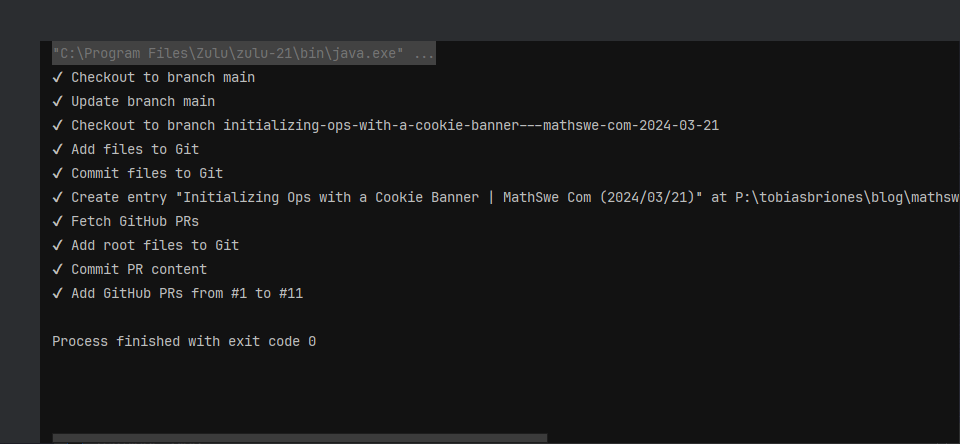

<!-- Copyright (c) 2024 Tobias Briones. All rights reserved. -->
<!-- SPDX-License-Identifier: CC-BY-4.0 -->
<!-- This file is part of https://github.com/tobiasbriones/blog -->

# Text Ops: New Add PR Command (2024/03/23)

## A New Major Project with MathSwe Text

I'll work on a new project to allow users to create MathSwe webpage articles
from an app that uses technologies similar to Markdown based on source code.

It may initially be advantageous in academia as a modern and domain-specific
software to avoid the burden and bloat of LaTeX or generic text editors like
Google Docs. The challenge is to standardize it as soon as possible since
considering breaking changes is not pretty feasible.

Previously, I published an update about a new tool to automate my work when
building articles in MSW Engineer, which is also helping to define standards.
Its name is `ops` for now, a CLI app that will evolve into the major project
SWAM (Special Software and Models), as published in
[Automating the Platform Operations and Beyond (2023/08/31)](/automating-the-platform-operations-and-beyond-2023-08-31).

The tool `ops` is still not published, and I've worked on it ad-hoc because of
legacy compatibility with Jekyll (a generic Markdown to static website generator
I'm slowly removing). Although there'll be a priority (in a few months or so)
for this project to officially standardize and publish it so it'll be available
for anyone.

I have to say I've been devising the name `text` when I publish the tooling
regarding "Markdown/DSL to Website," so it'll get deployed to the premium
subdomain text.math.software.

The constant implementations and innovations are getting MathSwe Text closer to
production to keep enriching the quality math products portfolio.

## Communication from Technical Development to Engineering Results

I've ascertained how to communicate technical work, like commits, as a cohesive
whole so engineering efforts fully scale from technical to product results. In
this case, from GitHub to MSW Engineer blogs with concise updates.

It's crucial to recall that in MathSwe, **everything is a function**. A
paragraph, an image, a table, an article, **a commit or PR message**,
engineering itself, etc., are all a function. So, this can be trivially composed
to create the highest quality content via the DSL.

For example, I can bring my technical work (from a development context on
GitHub) to a high-level publication (in MSW Engineer with domain engineering
context). Working with a formal DSL means **the system automatically understands
the semantics to automate the workflow**.

Therefore, **work is *continuous***. When I write good commit messages,
high-level PRs containing those commits, and *semantic branches*[^1] I can scale
that primitive/technical system to a greater cohesive whole with domain
abstractions. The system is engineered to work for the domain.

[^1]: Semantic branch names instead of banal ticket IDs, or others which are an
    implementation detail, side effects, or workarounds

Commit and PR messages are **nano-articles** or functions, like anything else.
Therefore, *I'm automatically writing a blog when I commit or merge anything*,
even when they're deep technical areas. That enables my communication skills to
show and *prove* my work.

Connecting primitive work efficiently to the next abstraction level (e.g., from
commits to PRs and then to blog updates) relativizes them, which results in a
high ROI, provided the system keeps the functional principles. That is, if we
first invest in quality and concise work (e.g., good PRs, well-designed commits,
etc.) and create relations among those functions, then we can get the most out
of our work by the advanced inference capabilities of our system.

## Add-PR Command

It creates a new entry by executing the `create` command with the given
arguments and then adds the requested GitHub pull requests as sections of a
structureless article.

Syntax: `ops add-pr { entry-id } { class_1,class_2,...,class_n } { path } { from-pr }`.

Where:

- `entry-id` and `class_n` are the same arguments of
  [create](/automating-the-platform-operations-and-beyond-2023-08-31#create).
- `path` is the repo's full name, like `tobiasbriones/blog`
  (i.e., `{ user } / { repo }`).
- `from-pr` is the first PR number to take (inclusive), and the program will
  fetch the rest of the PRs until the last one. This option doesn't provide more
  flexibility yet.

*Example:*

`ops add-pr initializing-ops-with-a-cookie-banner---mathswe-com-2024-03-21 mathswe,com,legal,ops,cookies,pr mathswe/mathswe.com 1`

The command generated [this article source](demo/demo.md), which was
smoothly finished with less technical updates and published at
[Initializing Ops with a Cookie Banner | MathSwe Com (2024/03/21)](/initializing-ops-with-a-cookie-banner---mathswe-com-2024-03-21).

The command leaves everything committed, so you can directly focus on high-level
content like the conclusion and abstract sections, thus removing most of the
overhead for fast technical communication.
