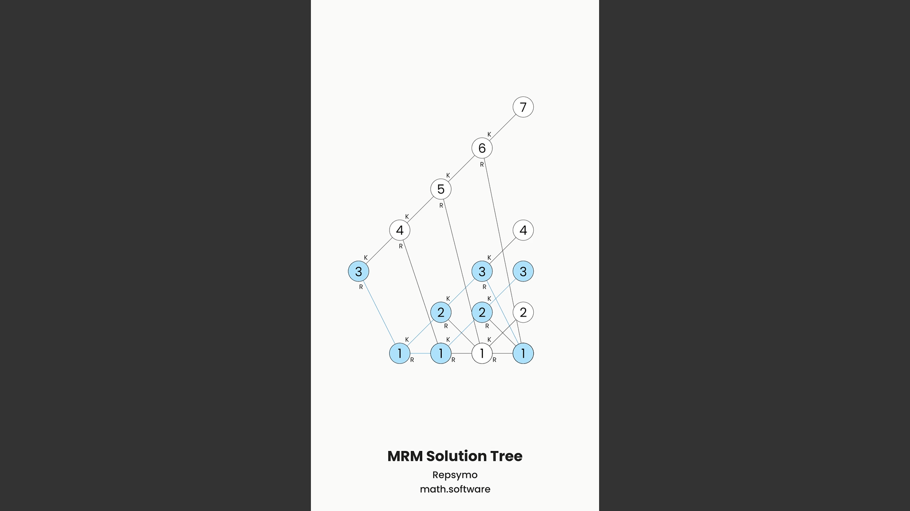

<!-- Copyright (c) 2023 Tobias Briones. All rights reserved. -->
<!-- SPDX-License-Identifier: CC-BY-4.0 -->
<!-- This file is part of https://github.com/tobiasbriones/blog -->

# Visualization Caption (2023/10/01)

---

Generated content from domain visuals requires captions to keep their context
and inherent textual descriptions of the visualization, which is the first
MathSwe standard for captions now available to implement.

## Importance of Captions

Captions are integral to content like images, animations, or videos. They can be
found in many formats and richness, but one (MathSwe) standard has to be
introduced to formalize their usefulness and move forward, creating further
original mathematical content.

The following quote can give relevant insight into a visualization caption.

> A visualization caption is a concise and formal description or label that
> accompanies a graphical representation, chart, or graph. It provides essential
> information about the visual content, such as its purpose, key insights, or
> data sources, in a brief and clear manner. Effective visualization captions
> are used to enhance understanding and context for the audience, especially
> when interpreting complex data or presenting findings in reports or
> presentations.
>
> Source: [Chat \| OpenAI](https://chat.openai.com) [1]

They are essential because content that's generated —binary files— from the DSL,
—unlike source code— lose the context as they're binary. Generated content can
be images or videos, for instance.

Notice that **domain components (like model representations) have the context
distributed in the right place since they're relative, so they don't need many
captions, but generated binary artifacts like images or videos are absolute, so
the way to visually relativize them is by tracking the context with captions**.

Recall that **I (so MathSwe) work with homogeneous designs**.

According to the underlying language, it can be that *everything is an article*,
for instance. So, a site, an article, a section, an image, or a paragraph *are
all articles* (i.e., subject to the same principles).

This can also mean that *everything is a function* if we're talking about
programming instead of articles or books —that is, FP.

For example, for domain content, we have a well-defined structure: domain name (
or organization name), subdomain (if any), path (entry or article name),
sections, subsections, resources inside subsections, etc. You don't need to add
redundant context to each image or part of the article or app.

On the other hand, if it comes to a separate file, that relative context is
lost, so it has to be applied again.

It's hard to "copy-paste" a domain-specific component (which is relative) to
"steal it" to an *external system* (which is absolute or fragmented). Now, on
the other hand, generated content such as files are "easy to steal"
because their form is already absolute or "compiled."

Even though files can be "easy to steal away from the place they belong,"
this is fixed by applying good captions that prevent social media
"influencers" from stealing and profiting from others' content.

So, captions have two main advantages: relativizing generated binary content and
preventing unethical practices from third parties.

Captions are important to keep either domain or generated visualizations
cohesive and coherent to the logical place where they belong.

## Caption Design

Captions consist of various concise elements that apply context from abstract
sources all the way to the underlying visualization.

One key principle is to create from the center, that is, optimize for the
center. This plays well with the left-to-right/top-to-bottom (abstract to
detail) adage.

When watching a graphic resource, the main content to optimize is the underlying
resource, like the image or video. Therefore, the underlying visualization has
to be in the center.

Captions are secondary and complement the visualization, so they have to go to
the bottom, always centered horizontally.

Needless to say:

- The more top, the more specialized the caption to the (textual) content of the
  visualization in the center.
- The more bottom, the more abstract captions get.

This is to guarantee the principle of **cohesion or composability**.

A standard for visualization captions allows the generation of full-featured
relative content from the source language.

### Source Home

For visualizations exported as binary files, this information will keep them
attached to the origin where they belong.

The home can be the domain name or app/organization name.

The home consists of two values: **a mandatory home and an optional sub-home**.

For example, if we take resources from this article, their home may
be `blog | mathsoftware.engineer`, and the sub-home the name of the blog
article `Visualization Caption (2023/10/01)`.

They are the most abstract captions in the composition, so they go all the way
to the bottom.

**The font-weight is `Medium`**. It's an exact match. If it were bolder
(`Semi Bold`), the whole caption would get bloated. If it were thinner
(`Normal`), it'd look like a paragraph, but captions are not paragraphs but
*titles*[^1].

[^1]: The only exception is abstract captions that have to be `Light` since
    they're "abstract titles," a bit longer, and require elegance to match the
    composition

The home or homes of a visualization add the abstract context of the place where
they were generated. They're strong titles that differentiate from normal text
but keep the composition clean.

### Sub-Home

Similarly to how the home gives the universe set where resources belong, this
can be narrowed down to something concise, but more specific to have the context
of where the resource is particularly related, so what it actually is about.

It's a **high-level title** that does not give the context of the universe set
like homes do, but the actual content of the visualization topic.

**Sub-homes may be the underlying article name, app path, or the subdomain
itself as well.**

As said above, if we'd take a resource from this article, the sub-home would be
its heading.

They have the same definition as homes but are optional.

They may be omitted for special first-class content. So, that's relative
(like everything). It must be coherent and depends on the concept you want to
optimize.

Sub-home captions are a strategic way to communicate not the root source but the
visualization topic or even more abstract like the subdomain but without being
as abstract as the root source or home.

### Visualization Title

The next level consists of the actual title of the underlying resource that
concisely encloses the definition of the visualization.

If it's an image, its caption title is **the name** of the image. If it's a
video animation, it defines the whole video in one simple title (the video name).

The font weight is `Bold`, which is the proper weight for titles in general. It
must be a high-level style (title cased) as well.

By reading the caption title of the visualization you must be able to understand
what it's all about.

### Visualization Abstract Title

The final element to enrich a presentation or visualization is its caption
abstract title, which is a micro explanation after the visualization title of
what the visualization is about.

From here, **the next level of detail after the visualization abstract is not
text anymore but the visualization itself**.

The abstract is optional and has to be separated from the other titles because
it resembles more a paragraph (an abstract section in the end) than a title.

It goes **title-cased** as well as the other titles because despite being a
micro paragraph, it must still be **a one-line title**.

**The font-weight is `Light`** because it has to be different from hard titles
which are bolder, and it acts as normal text. Of course, the normal text has to
have `Normal` weight, but I left the `Light` weight since the result is just
compelling: *a light font-weight is designed for a minimalist text that looks
elegant*, and contrasting with the previous hard titles, it looks much cleaner
as well.

This abstract is pretty useful for videos where there's a sequence of
animations, so you have to explain each one.

Thus, for video animations, **abstract captions always change (i.e., one per
animation) unlike the hard titles that have to be more constant**. Needless to
say, the more bottom, the less changing titles have to be. The animation itself
is the most changing element here. So, *the animation plays the role of an
article body*.

The caption abstract is an optional soft title that encloses an elegant
visualization description.

## Caption Dimensions

Caption font sizes have to be well-defined for compelling visualizations and
predictive STEM simulations.

Captions (as well as everything) must be relative meaning that **they look and
behave exactly the same** (*predictability* for the sake of the scientific
method) without side effects.

So, if I export a production in 240p or FHD or 8K resolution, portrait or
landscape, everything must be exactly the same.

Lately, I defined the font sizes in code by using `720px` width as an absolute
baseline, `1rem = 16px` as usual, so I have $$1 rem = 16 \frac{width}{720} px$$.

This way, I can use relative units of size that will be converted to the
rendering size when generating the animations.

Therefore, **the size for home captions (home, sub-home) is `1.5rem`, and for
caption title and abstract is `1.5` the title size, or `2.25rem`**.

I devised another approach if I want to "embed" the caption into the
visualization to save space. **If captions occupy the space of the
visualization, then the home captions are `1.25rem`**.

These metrics might not be totally final, but they have the essence and are
stable.

Regarding the visualization content, that is, the canvas where the visualization
lies is calculated by taking off the hard captions (homes and title), but the
abstract (if any) is always taken as part of the animation since they're both
tightly related.

Notice how **the abstract is about the visualization rather than context. Hard
captions like homes and titles give context instead.**

Other technical details (that might change a bit) include the paddings to
separate each caption.

I set the text padding to the size of its font divided by four so they can have
a good separation. So, the bigger the font (like the title and abstract size),
the more padding they will have relative to their text size.

The caption height is the height of the home, a sub-home, and the title
captions, as mentioned earlier.

There's a canvas padding that separates the abstract caption from the hard
captions. This is what I said about separating the abstract further because it
belongs more to the animation than the context or hard captions.

Text and UI dimensions can be complicated to write factually with logic (e.g.,
what's the exact "correct" size?), so here I'm defining a compelling design to
match these gorgeous MathSwe visualizations.

## Caption Samples in Animations

These are some of the (updated) productions I was working on an EP Playground,
and they show the result of captions in video animations or simulations.

The following animation explains (from the DSL) how a solution tree is rendered
in overall (I have a full simulation of this complex process of course).

This resource is first-class, so it has to be as optimal (original, concise,
formal, etc.) as possible.

The abstract caption that changes provides an elegant description of what you're
watching, as per the caption specs.

<figure>
<video width="60%" poster="static/poster-_-fast-sequence-animation-with-abstract-captions.jpg" controls>
  <source
    src="static/fast-sequence-animation-with-abstract-captions.mp4"
    type="video/mp4"
  >
  Your browser does not support the video tag.
</video>

<figcaption>
Fast Sequence Animation with Abstract Captions
</figcaption>
</figure>

The following is a drawing of a flower I worked on an EP Playground from the
Blog. It also has abstract captions that explain how to draw a flower.

This is cute because that's how I learned to draw a simple flower and how I
share it.

Recall that embedded captions are part of the visualization space and are
slightly smaller.

These examples make the idea of how captions are useful in video animations
clearer.

## Reading the Context DSL with the Pipe Operator

The DSL applied to captions is read via the pipe `|` symbol, thanks to the
abstraction levels at each caption developed previously.

For the following example, the context is clear.

It can be technically read as `MRM Solution Tree | Repsymo | math.software` with
the pipe operator.

Recall that *everything is an article/function* by the principle of homogeneity.
So, you start with the constant `MRM Solution Tree`
that is a feature (i.e., function) of `Repsymo` (i.e., the next function to
pipe), and so on.

By employing the pipe operator to read the caption language, you can build
greater context that provides a concise understanding of the underlying
visualization.

### No Redundant Context in Domain Components

For generated artifacts like images and videos, context has to be passed as
captions since these are absolute entities, but when these resources or
visualizations are part of the (domain-specific) system, they already have their
context implicitly, and it's redundant or undesired to duplicate that
information.

In other words, **there's nothing "orphan" in the domain-specific system, as
everything is in the correct place** (i.e., relative).

Recall that **boilerplate or redundancy is proof of poorly written code (or
language) since math is applied to simplify *expressions*, which removes
redundancy**.

Therefore, *only closely related captions must be added to resources*, and when
they're compiled to a binary form like a video, *they should include the context
via captions to relativize the artifact*, just as mentioned earlier.

Everything in the system has to be simplified or optimal, so captions with
unnecessary context are not used until the moment the resource component is
decoupled from the system (i.e., converted to a binary file).

## First Visualization Caption Standard

Captions play a dual role by providing essential context to binary artifacts
like images and videos, preserving their connection to their place of origin,
and acting as ethical safeguards, preventing plagiarism committed by third
parties.

The design of captions included hierarchical arrangement, font weights, and
sizes, remarking that every detail is carefully considered to ensure cohesion
and predictability across various resolutions and contexts. Moreover, we can use
the pipe operator that provides a concise and formal definition of the
underlying visualization's origin and purpose.

This first design of captions will allow implementations to take place, so keep
moving forward with MathSwe system definitions and visualization results at a
faster cadence.

## References

[1] OpenAI. (2023). ChatGPT (September 25 Version) [Large language model].
[Chat \| OpenAI](https://chat.openai.com)
