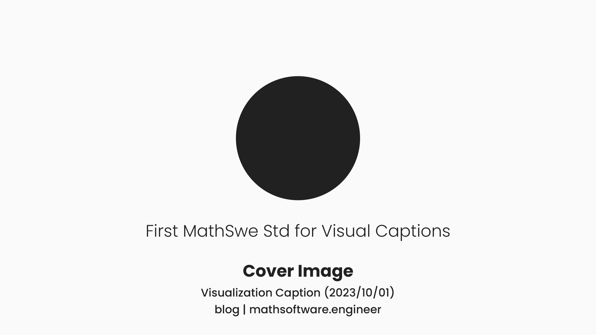

<!-- Copyright (c) 2023 Tobias Briones. All rights reserved. -->
<!-- SPDX-License-Identifier: CC-BY-4.0 -->
<!-- This file is part of https://github.com/tobiasbriones/blog -->

# Visualization Caption (2023/10/01)

---

## Importance of Captions

Captions are integral to content like images, animations, or videos. They can be
found in many formats and richness, but one (MathSwe) standard has to be
introduced to formalize their usefulness and move forward, creating further
original mathematical content.

The following quote can give relevant insight into a visualization caption.

> A visualization caption is a concise and formal description or label that
> accompanies a graphical representation, chart, or graph. It provides essential
> information about the visual content, such as its purpose, key insights, or
> data sources, in a brief and clear manner. Effective visualization captions
> are used to enhance understanding and context for the audience, especially
> when interpreting complex data or presenting findings in reports or
> presentations.
>
> Source: [Chat \| OpenAI](https://chat.openai.com) [1]

They are essential because content that's generated —binary files— from the DSL,
—unlike source code— lose the context as they're binary. Generated content can
be images or videos, for instance.

Notice that **domain components (like model representations) have the context
distributed in the right place since they're relative, so they don't need many
captions, but generated binary artifacts like images or videos are absolute, so
the way to visually relativize them is by tracking the context with captions**.

Recall that **I (so MathSwe) work with homogeneous designs**.

According to the underlying language, it can be that *everything is an article*,
for instance. So, a site, an article, a section, an image, or a paragraph *are
all articles* (i.e., subject to the same principles).

This can also mean that *everything is a function* if we're talking about
programming instead of articles or books —that is, FP.

For example, for domain content, we have a well-defined structure: domain name (
or organization name), subdomain (if any), path (entry or article name),
sections, subsections, resources inside subsections, etc. You don't need to add
redundant context to each image or part of the article or app.

On the other hand, if it comes to a separate file, that relative context is
lost, so it has to be applied again.

It's hard to "copy-paste" a domain-specific component (which is relative) to
"steal it" to an *external system* (which is absolute or fragmented). Now, on
the other hand, generated content such as files are "easy to steal"
because their form is already absolute or "compiled."

Even though files can be "easy to steal away from the place they belong,"
this is fixed by applying good captions that prevent social media
"influencers" from stealing and profiting from others' content.

So, captions have two main advantages: relativizing generated binary content and
preventing unethical practices from third parties.

Captions are important to keep either domain or generated visualizations
cohesive and coherent to the logical place where they belong.

## Caption Design

Captions consist of various concise elements that apply context from abstract
sources all the way to the underlying visualization.

One key principle is to create from the center, that is, optimize for the
center. This plays well with the left-to-right/top-to-bottom (abstract to
detail) adage.

When watching a graphic resource, the main content to optimize is the underlying
resource, like the image or video. Therefore, the underlying visualization has
to be in the center.

Captions are secondary and complement the visualization, so they have to go to
the bottom, always to the center.

Needless to say:

- The more top, the more specialized the caption to the (textual) content of the
  visualization in the center.
- The more bottom, the more abstract captions get.

This is to guarantee the principle of cohesion or composability.

A standard for visualization captions allows the generation of full-featured
relative content from the source language.

### Source Home

For visualizations exported as binary files, this information will keep them
attached to the origin where they belong.

The home can be the domain name or app/organization name.

**The home consists of two values: a mandatory home and an optional sub-home.**

For example, if we take resources from this article, their home may
be `blog | mathsoftware.engineer`, and the sub-home the name of the blog
article `Visualization Caption (2023/10/01)`.

They are the most abstract captions in the composition, so they go all the way
to the bottom.

**The font-weight is `Medium`**. It's an exact match. If it were bolder
(`Semi Bold`), the whole caption would get bloated. If it were thinner
(`Normal`), it'd look like a paragraph, but captions are not paragraphs but
*titles*[^1].

[^1]: The only exception is abstract captions that have to be `Light` since
    they're "abstract titles," a bit longer, and require elegance to match the
    composition

The home or homes of a visualization add the abstract context of the place where
they were generated. They're strong titles that differentiate from normal text
but keep the composition clean.

### Sub-Home

Similarly to how the home gives the universe set where resources belong, this
can be narrowed down to something concise, but more specific to have the context
of where the resource is particularly related, so what it actually is about.

It's a high-level title that does not give the context of the universe set like
homes do, but the actual content of the visualization topic.

**Sub-homes may be the underlying article name, app path, or the subdomain
itself as well.**

As said above, if we'd take a resource from this article, the sub-home would be
its heading.

They have the same definition as homes but are optional.

They may be omitted for special first-class content. So, that's relative
(like everything). It must be coherent and depends on the concept you want to
optimize.

Sub-home captions are a strategic way to communicate not the root source but the
visualization topic or even more abstract like the subdomain but without being
as abstract as the root source or home.

### Visualization Title

The next level consists of the actual title of the underlying resource that
concisely encloses the definition of the visualization.

If it's an image, its caption title is the name of the image. If it's a video
animation, it defines the whole video in one simple title.

The font weight is `Bold`, which is the proper weight for titles in general. It
must be a high-level style (title cased) as well.

By reading the caption title of the visualization you must be able to understand
what it's all about.

## References

OpenAI. (2023). ChatGPT (September 25 Version) [Large language model].
[Chat \| OpenAI](https://chat.openai.com)
