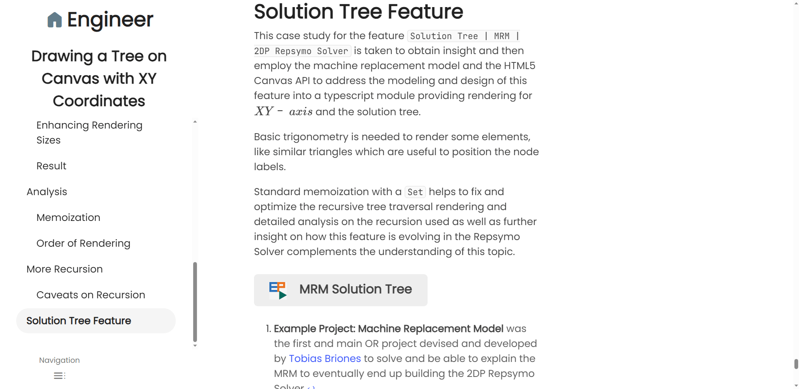

<!-- Copyright (c) 2023 Tobias Briones. All rights reserved. -->
<!-- SPDX-License-Identifier: CC-BY-4.0 -->
<!-- This file is part of https://github.com/tobiasbriones/blog -->

# New Article and Code Navigation Features (2023/09/09)

---

## Updates on Platform UI UX Ergonomics

The platform has received many functional and non-functional features recently.

<figcaption>

<strong>
New Style and Features
</strong>

</figcaption>

There have been updates on the standards in various regards.

As previously noticed on
[Automating the Platform Operations and Beyond (2023/08/31)](/automating-the-platform-operations-and-beyond-2023-08-31),
there have been operations features internally to start automating design
decisions and workflows.

Page styles and new UI/UX features are also available in production.

Just to mention some designs depicted above, notice how:

- The page layout focuses the article in the center as the main content.
- Puts the navigation to the left.
- Uses the Poppins font (which is the currently official font because of its
  mathematical/geometrical properties).
- The `h1` heading is aligned to its version in the navigation view.
- Some colors and sizes are well established (besides the Piaxid design
  I've been devising since 2017[^1]).

[^1]: You can think of Piaxid as the philosophy I originally invented to make
    pure design decisions

With all this, there's much to update about these new results.

## Article Navigation

The features for navigating inside articles are in production and recently
designed.

Article contents navigation is fundamental to moving among the tree of
homogeneous[^2] articles I create. This way, all this high-quality content
can be put together[^3].

[^2]: My articles are homogeneous since they have the *same* design, so I can
    **scale up** the whole content as I add more articles by letting the
    platform design principles **constant** (i.e., relativity)

[^3]: Recall the cohesion principle to build greater wholes

I finished polishing the so-called **ToC (Table of Contents)**[^4] feature this
time.

[^4]: I don't like using those commonly used generic terms you see from older
    computing and academia, like "table" of "contents," because it makes the
    articles more heterogeneous by using those repetitive stereotypes

From design, we have that an article is the same as its navigation, so both have
a different level of abstraction.

That is, **the article and its navigation are the same, but the nav is a resumed
version with only the headings or sections**[^5][^6].

[^5]: It's important to see my design view to conceptualize and understand the
    principle of homogeneity —both article and nav are the *same*, with
    *different* levels of abstraction or purpose

[^6]: It could also include other major navigation links like image or table
    captions

This well-designed navigation will start allowing readers to move smoothly among
the platform articles, so besides having great qualities already, now they're
also simpler and nice to browse with.

### Desktop

The desktop design has the article navigation on the left, and the article is
focused in the center.

You can see in the screenshot how the `More Recursion` section is selected in
the navigation since the article is scrolled to that position.

<figcaption>

<strong>
New Article Navigation
</strong>

</figcaption>

So, what's on the right? I'll implement that later. I'll place the footnotes,
references, and others like the footer. That way, the design is from left to
right, with the article centered as the page's main content.

The navigation is updated whenever the reader scrolls over the article or loads
a URL with a section hash.

For example, the URL path for the selected section is
`/drawing-a-tree-on-canvas-with-xy-coordinates#more-recursion`, indicating that,
`more-recursion` is the section ID to select.

When you select a section from the navigation, this is also applied to the URL
hash, and you're smoothly led to the section via scroll.

This navigation allows users with greater displays, like a monitor or tablet, to
leverage greater power while enjoying the reading.

### Mobile

This is the mobile version of the responsive article navigation.

As you can see, from **the bottom menu —which is also a new feature 👾—** you can
open the navigation from the left, and it'll take the foreground of the screen.

**The navigation can be expanded or hidden via the "Navigation" menu button**
for either mobile or desktop, but this feature is more advantageous for mobile.

<figcaption>

<strong>
Mobile Article Navigation
</strong>

</figcaption>

Then, when you select a section, like `Node Circle and Content`, you'll be led
to that section via smooth scroll:

<figcaption>

<strong>
Mobile Article Reading
</strong>

</figcaption>

Similarly to how a PDF is read, articles have those features now. The difference
is that PDFs are binary files with no meaning 😐 while my articles are
domain-specific systems (i.e., actual engineering instead of mere text) 🦾.

This responsive mobile navigation will allow readers to efficiently move among
articles, even on devices that can only support one view at a time.

## Source Code Navigation

Articles can have an associated EP (Example Project) or subdirectory in which
there are source files that can be browsed and read now in first class without
exiting the site.

This is another win for educational content[^7] as it allows direct access to
the project's source code besides its article.

[^7]: I've provided my content on mathsoftware.engineer under CC and BSD 🆓
    licenses so far, so it's always been education-friendly

EP source code, files like markdown, and images can be browsed and viewed with
this feature.

### Accessing an Article EP

Articles can have an EP (Example Project) associated with the reading, which
has been integrated lately.

I've worked with these concepts for much longer before, so now I'm executing.

Underlying source code is usually a wanted feature from readers. It's when we
beg the question, "Where's the full code?" 😸, since standalone code snippets
often don't suffice.

Further, than code, **the actual project is integrated into its article. They're
projects inside articles (i.e., second-class); therefore, they're all EPs**.

So, for richer articles with EP, you can read the publication as usual. Now, you
can also **browse over the project's source code and run the deployment of the
EP itself (if applicable)**.

The article's EP appears at the bottom of the page, if any.

<figcaption>

<strong>
Article EP Navigation
</strong>

</figcaption>

So you can read the source code files (and others like project Markdown docs
and images). Each resource has its GitHub link, so you can also browse and read
them from GitHub.

<figcaption>

<strong>
EP Source Code Navigation
</strong>

</figcaption>

If you go to the GitHub subdirectory tree, you can browse over all (literally) 
the source files.

Recall that GitHub is a dev abstraction (lower-level), and using the web app
(i.e., mathsoftware.engineer) to browse has the premium advantage of being a
first-class experience (you don't exit the platform[^8]).

[^8]: Relatable with the math closure principle: **enjoy an uninterrupted
    workflow in MathSwe, as any operation you perform in MathSwe stays in
    MathSwe** 🔢

<figcaption>

<strong>
EP GitHub Code Navigation
</strong>

</figcaption>

The following screenshot is another example of how this is achieved in 
mobile too:

<figcaption>

<strong>
Mobile Source Code Reading
</strong>

</figcaption>

Code navigation has been a significant achievement in organizing and sharing my
content and further projects. More enhancements are due in the future, but for
now, it's a great step already.

Another super exciting feature is the new standard to navigate to an EP 
deployment path.

That is, you can read the article; if it has an EP, you can open it in source
code form. Furthermore, if the EP is a web app, it was deployed automatically
by [SWAM Ops](/automating-the-platform-operations-and-beyond-2023-08-31)[^9]
when the article was built. Therefore, **you can open it as a web application**.

[^9]: SWAM Ops is an automation tool I've been writing for MathSwe software
    operations, so in this case, for mathsoftware.engineer

<figcaption>

<strong>
Article EP Deployment
</strong>

</figcaption>

This access has been available since always, but now it's standard and more
automated, so I can worry much less about off-topic tasks when developing
projects and articles.

As you can see in the illustration, there's a URL path structure consisting of
the article ID, the EP name (access to EP source code), and the "app" sub-path
(access as a web app) when applicable.

The new features for EP navigation are making project integration into articles
more powerful, so they get to a further degree of quality and usefulness.

### Accessing an Article Subdirectory

You can also access an article generic subdirectory with files the same way you
do it for accessing article projects.

Sometimes, source files are not projects but just files. So, they can be put
into a subdirectory like the following example. Articles can either have EPs,
subdirectories, or both.

<figcaption>

<strong>
Article Subdirectory Navigation
</strong>

</figcaption>

The subdirectory button appears at the bottom of the article and leads you to
the subdirectory path.

Then, you can open files to read them, as if it were a GitHub Gist containing
the article code snippets.

<figcaption>

<strong>
Subdirectory File Navigation
</strong>

</figcaption>

You can open them as files or subdirectories on GitHub too.

<figcaption>

<strong>
File GitHub Navigation
</strong>

</figcaption>

So, besides article projects, its subdirectories with content can also be
browsed and opened.

### Markdown and Further File Rendering

As seen before, source code files are displayed as code, so markdown and image
files are also rendered as such.

If you open a markdown file, instead of reading its raw low-level text, you'll
get the web app-rendered resource, which turns them into a sub-article.

<figcaption>

<strong>
Markdown File Opened
</strong>

</figcaption>

This can be useful for EP documentation like `README.md` files.

Image files can also be displayed, but that feature is still a low priority.

These rendering features enrich the article projects and files so files can be
viewed as high-level or first-class resources.

## Testing new Articles

I've successfully tested the new ToC and source code navigation features in the
coming articles in staging.

As published in
[Finishing Writing the Documentation for my Next EP (2023-07-14)](/finishing-writing-the-documentation-for-my-next-ep-2023-07-14),
I have the article
[Building Slides from Screenshots App in JavaFX](/building-slides-from-screenshots-app-in-javafx)
almost ready to be published.

<figcaption>

<strong>
Excitement on new Articles Deployment
</strong>

</figcaption>

So, this is how the source tree of the article project can be browsed. Its
style is still plain because reading the contents of the resources is more
important, so this has more priority over directory navigation.

<figcaption>

<strong>
Slides EP Source Tree Navigation
</strong>

</figcaption>

This way, you can see (in the URL path) how the EP is *related* to its article:

<figcaption>

<strong>
Slides EP Source File Opened
</strong>

</figcaption>

The introduction of these new platform UI/UX ergonomics will make a remarkable
impact when releasing these kinds of polished and long articles. That's why I
haven't published many articles and projects yet. As always, I optimize for
quality rather than quantity.

## Page Footer Style

The site footer look has also changed recently.

I tried not to change much about these secondary components because since I was
using plain Jekyll and GitHub pages 😑. Now, I've polished the styles according
to the design.

<figcaption>

<strong>
New Footer
</strong>

</figcaption>

As I said, I'll put the footer strategically on the right side for the desktop
layout so the article page in the center is more cohesive. This is because the
footer is not part of the article, so it shouldn't go at the center but to the
right bottom, that is, **a progressive disclosure design**.

The new footer style (that was around for a while already) will put the cherry
on top of the site design for now.

## Powering the Platform Articles with Advanced Navigation

The latest article navigation (i.e., table of contents), EP and subdirectory
access, and the application of styles have turned the platform articles into
powerful math software engineering references and have also turned into more
establishing MathSwe standards implemented into UI/UX ergonomics.
