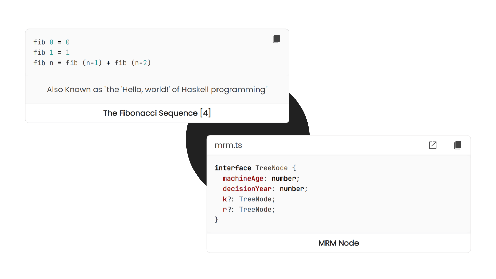

<!-- Copyright (c) 2023 Tobias Briones. All rights reserved. -->
<!-- SPDX-License-Identifier: CC-BY-4.0 -->
<!-- This file is part of https://github.com/tobiasbriones/blog -->

# New Code Snippet Feature (2023/10/11)

---

## Structure

Code snippets, like any other article or content, must have an inherent
structure to make them autonomous parts of a bigger article.

As specified recently in
[Visualization Caption (2023/10/01)](/visualization-caption-2023-10-01), the
design keeps scaling for code snippet captions. Everything is an article (i.e.,
relative), thus the principles are the same.

Therefore, snippet captions have to be smoothly readable, from top to bottom and
left to right.

An article has a fundamental structure that makes it cohesive and composable:
abstract, body, and conclusion.

Hence, code snippets have a header with *context that introduces you* to the
body containing the code and exits smoothly via its title (i.e., the
conclusion).

Just like a function: the domain, the definition, and the transformed output.

Needless to say, the optimization target here is the code snippet or body, so
this must be focused in the center. So the header goes to the top and the
conclusion to the bottom.

Titles are powerful since you don't have to read the whole article (i.e., the
code snippet), only the title or conclusion, to know what it does, even if you
don't know the underlying PL.

Besides the fundamental structure of an article, there's a marvelous standard
for adding a more detailed conclusion: the snippet abstract caption.

In the same way, the abstract visualization caption belongs to the visualization
body —as specified in the given article above—, code snippets can also have an
abstract caption resuming the whole snippet in a line title-cased description.

I love abstract captions since they make some content look more premium —a
property I also addressed previously.

Some content should have abstract captions, mostly when the title gets too
large. Most content shouldn't have an abstract caption, though.

Therefore, code snippets can have captions like visualizations or any other
content.

They have a specific structure consisting of a heading including the context of
the source code, the body containing the snippet, an optional abstract caption,
and the snippet title serving as a conclusion. These elements constitute a
cohesive block of code that can be composed as per needs.
