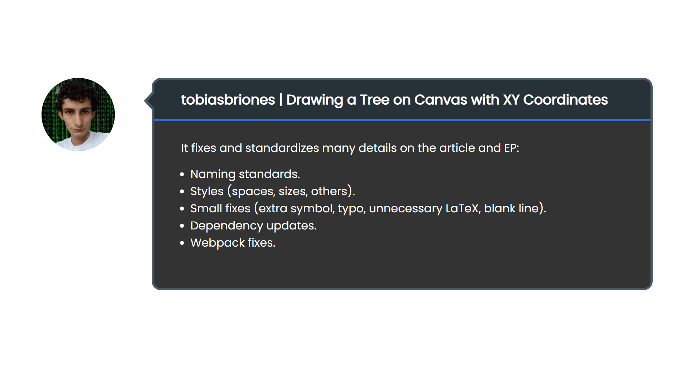

<!-- Copyright (c) 2023 Tobias Briones. All rights reserved. -->
<!-- SPDX-License-Identifier: CC-BY-4.0 -->
<!-- This file is part of https://github.com/tobiasbriones/blog -->

# Cleaning up Details (2023/10/06)

---

Today, an initial set of fixes and enhancements were integrated into the
first-class article "Drawing a Tree on Canvas with XY Coordinates" to keep up
with the current changes.

These are initial updates that will become major updates to the article[2]
in the next integrations.

---

This update includes several fixes, and enhancements [1]:

It fixes and standardizes many details on the article and EP:

- Naming standards.
- Styles (spaces, sizes, others).
- Small fixes (extra symbol, typo, unnecessary LaTeX, blank line).
- Dependency updates.
- Webpack fixes.

---

These changes can be seen in the article overall and the EP allowing a greater
UI and internal experience of the solution tree EP[3].

After a wide interlude, these minor updates made it to production.

Newer updates (in general) will be shipped at a faster cadence thanks to the
latest automation and standards I've been implementing and publishing. There are
more platform standards to publish next, like captions for code snippets.

Therefore, both the platform and projects are receiving updates.

Next, incoming (platform) updates will allow the new and *powerful*
code snippet component, enabling composable captions with features to copy code
snippets, and open the underlying source code file (without leaving
mathsoftware.engineer).

It'll also contain the recently standardized animations for rendering the
solution tree and an enhanced article redaction with the principles I've been
talking about using FP to write article structures.

For example, captions in code snippets will make them *cohesive*, feature-rich,
and browsable —unlike plain snippets.

These new updates will allow the user a more robust and clean experience of the
article and its EP. Now, I can immediately keep integrating further major
updates.

## Bibliography

- [Visualization Caption (2023/10/01) \| Blog](/visualization-caption-2023-10-01).
- [New Article and Code Navigation Features (2023/09/09) \| Blog](/new-article-and-code-navigation-features-2023-09-09).
- [Automating the Platform Operations and Beyond (2023/08/31) \| Blog](/automating-the-platform-operations-and-beyond-2023-08-31).

## References

[1] Clean up details on drawing-a-tree-on-canvas-with-xy-coordinates by
tobiasbriones · Pull Request #9 · mathsoftware/engineer. (n.d.). GitHub.
[PR \| Engineer \| mathsoftware \| GitHub](https://github.com/mathsoftware/engineer/pull/9).

[2] Briones, T. (n.d.). Drawing a Tree on Canvas with XY Coordinates. Math
Software Engineer.
[Drawing a Tree on Canvas with XY Coordinates](https://mathsoftware.engineer/drawing-a-tree-on-canvas-with-xy-coordinates).

[3] Briones, T. (n.d.). EP: MRM Solution Tree | Drawing a Tree on Canvas with XY
Coordinates | mathsoftware.engineer. 
[EP: MRM Solution Tree](https://mathsoftware.engineer/drawing-a-tree-on-canvas-with-xy-coordinates/mrm-solution-tree---ep/app).
