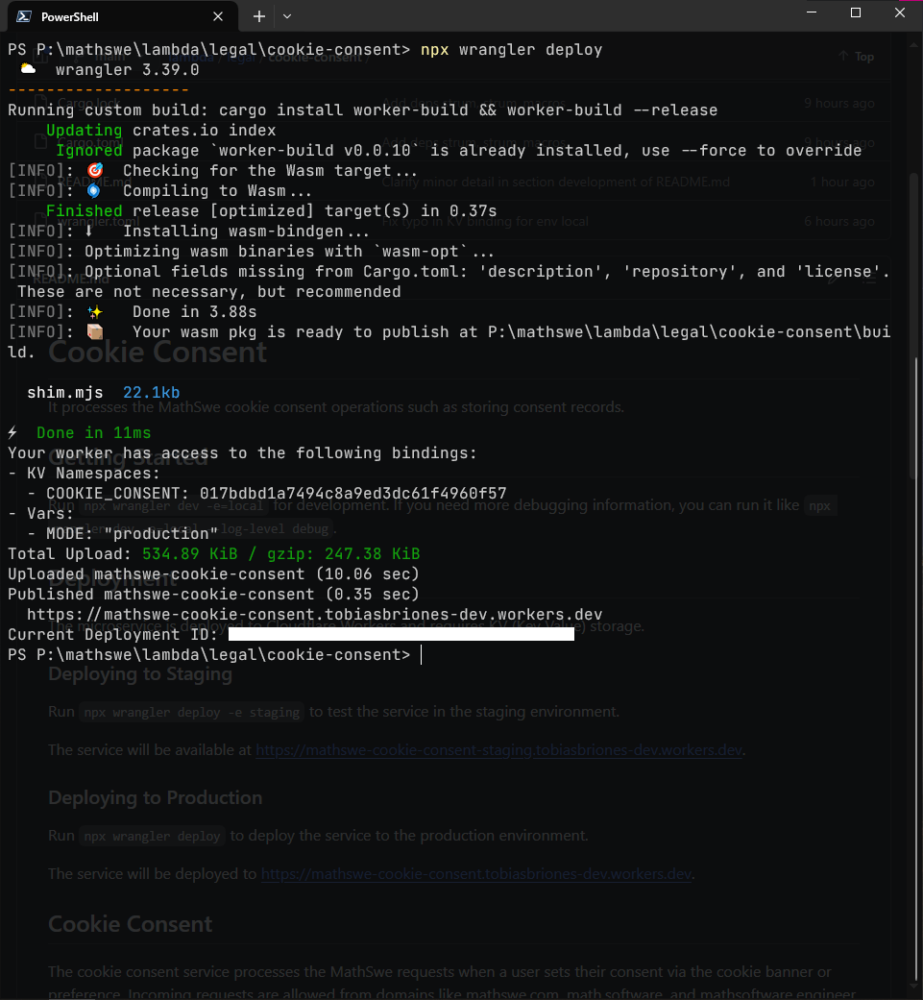

<!-- Copyright (c) 2024 Tobias Briones. All rights reserved. -->
<!-- SPDX-License-Identifier: CC-BY-4.0 -->
<!-- This file is part of https://github.com/tobiasbriones/blog -->

# New Cookie Consent Microservice Ready | MathSwe Legal (2024/03/28)

The new cookie consent service is finished in the brand-new legal repository of
MathSwe. The service deployment to production will provide advanced compliance
by storing consent proofs to support the front-end banner with user preferences.

---

**Publish cookie-consent v0.1.0**

Mar 28: PR [#1](https://github.com/mathswe/legal/pull/1) merged
into `main <- cookie-consent`
by [tobiasbriones](https://github.com/tobiasbriones)
{: .pr-subtitle }

It creates and thoroughly implements the `cookie-consent` microservice that
allows the storage of consent records.

It implements the following general plan:

- Create Rust `lib` project with WASM.
- Initialize Cloudflare Worker.
- Integrate Cloudflare KV.
- Support staging environment.
- Add `Geolocation` support.
- Add `AnonymousIpv4` support.
- Define domain in mod `consent`.
- Implement method `POST` at `/` for registering consents.
- Implement CORS with allowed origins.
- Update documentation in `README.md`.

The service was tested locally, from `staging.mathswe.com` and
`staging.math.software`, which proves correct working.

It provides the API established in the `README.md` file in the root directory of
the `cookie-consent` service. It is ready to support processing the consent
records in production for storage from the cookie banners.

The cookie consent microservice is available in production with its initial
version `0.1.0`.



Recall that cookies are going to be used minimally in MathSwe websites or web
apps. Even though, formal redaction of a cookie policy and implementations of
all these requirements, such as cookie banner and consent proof, are still
mandatory to proceed.

The service stores the proof of consent as per
[its documentation](https://github.com/mathswe/legal/tree/0eabd7fed082fe59e325236ff338a5ca7ee7bc38/cookie-consent#cookie-consent-1),
which considers the requirements established in
[What information does Proof of Consent hold? \| CookieYes](https://www.cookieyes.com/documentation/proof-of-consent/)
and [Storing consent records \| Finsweet Cookie Consent for WebFlow](https://finsweet.com/cookie-consent#store-consents).

Regarding how long these records have to be stored, one educated value would be
2 years since the consent cookie expires in 1 year (then the banner shows
again). I still don't have a mechanism for eliminating old consents.

With a simple `POST` request from the client with the user preference as its
body, *the consent will be stored as legal proof*, thus **complying with the
most advanced cookie law requirements** that most websites won't even care to
implement.

`Body Sample Required for Storing Consent Proof | Cookie Consent Preference`

```json
{
    "essential": true,
    "functional": true,
    "analytics": true,
    "targeting": true
}
```

The server takes the other information from the HTTP request, so the client
doesn't have to send anything else.

Now, I can finish the cookie banner development on the React side, and comply
with the international regulations about cookie usage.

---

**Move cookie-consent to root dir**

Mar 28: PR [#2](https://github.com/mathswe/legal/pull/2) merged
into `main <- cookie-consent`
by [tobiasbriones](https://github.com/tobiasbriones)
{: .pr-subtitle }

The repository was renamed from "lambda" to "legal" to include only first-class
legal microservices instead of all microservices.


---

**Add README.md to root project**

Mar 28: PR [#3](https://github.com/mathswe/legal/pull/3) merged
into `main <- legal/docs` by [tobiasbriones](https://github.com/tobiasbriones)
{: .pr-subtitle }

It adds an updated `README.md` to the project's root.


---

**Update copyright header with new repo link**

Mar 28: PR [#4](https://github.com/mathswe/legal/pull/4) merged
into `main <- legal/legal` by [tobiasbriones](https://github.com/tobiasbriones)
{: .pr-subtitle }

The repo changed from "mathswe/lambda" to "mathswe/legal."

---

The `mathswe/legal` repository was initialized with the `cookie-consent`
service, and it's meant to serve any legal responsibilities, such as privacy
policies in the future.

The repository has no license yet, so the code is proprietary. You can still
read the code since the repo is public, but I'm not currently providing any
license to the repo.

The cookie consent microservice version `0.1.0` is available in production to
enable finishing the cookie banner on the front-end and complying with the most
advanced requirements of cookie laws by storing consent record proofs.
