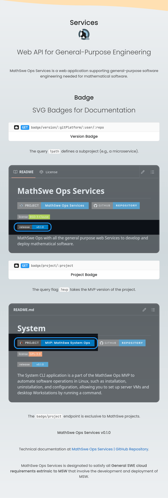

<!-- Copyright (c) 2024 Tobias Briones. All rights reserved. -->
<!-- SPDX-License-Identifier: CC-BY-4.0 -->
<!-- This file is part of https://github.com/tobiasbriones/blog -->

# MSW Ops v0.2.0 | MathSwe Ops MVP (2024/09/20)

## MSW Ops Home Page with the New Services Application

This release adds the MathSwe Ops Services project to a section on the landing
page and integrates it to improve its internal development documentation.

MathSwe Ops Services
[had its initial release](/mathswe-ops-services-v-0-1-0-2024-09-18) with two
endpoints providing badges for release and project (name with icon), and this
release presents it as a new project to final users.

- [New Services Project with Documentation Badges \| MathSwe Ops MVP (2024/09/20)](/new-services-project-with-documentation-badges---mathswe-ops-mvp-2024-09-20).

MathSwe Ops Services documentation
at [ops.math.software/#services](https://ops.math.software/#services).

GitHub release at
[Ops.Math.Software v0.2.0: Updates the MSW Ops Home Page with the New Services Application.](https://github.com/mathswe-ops/mathswe-ops---mvp/releases/tag/v0.2.0).

Presenting the Services project on the MSW Ops home page is a way to show how
MathSwe also supports General SWE (general-purpose), besides MSWE (mathematical
domain-specific).

## MathSwe Ops Services

The new Services application features on the MSW Ops home page.

**Page Snapshot**

- [MVP: MathSwe Ops Web v0.2.0](images/mvp-_-mathswe-ops-web-v0-2-0-desktop.png).

MSW Ops provides a new product that, unlike the other MSW, focuses on
(cloud) general-purpose software engineering rather than domain-specific. You
will need it when engineering some MSW, such as MVPs or production-grade
applications that indirectly help MSW.

## Featuring General-Purpose Engineering Services

Mathematical software needs General SWE in practice, despite general-purpose
being extrinsic to MSW. General SWE shows on base-standard production-grade
projects and MVPs. Engineers and developers with high standards close to MSWE
can leverage new software, like MathSwe Ops Services, now featured on the MSW
Ops home page, to automate their workflow, even if the projects are not
mathematical.
