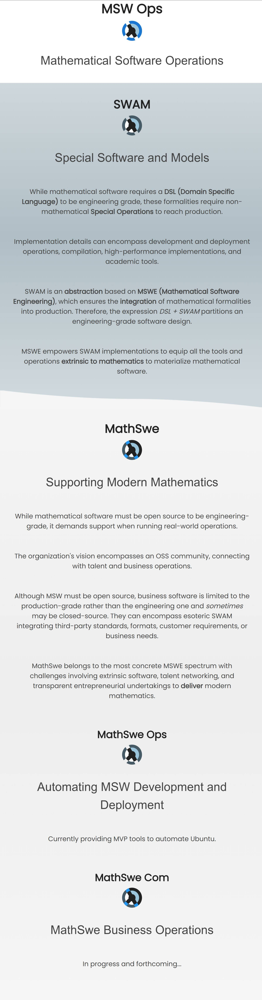
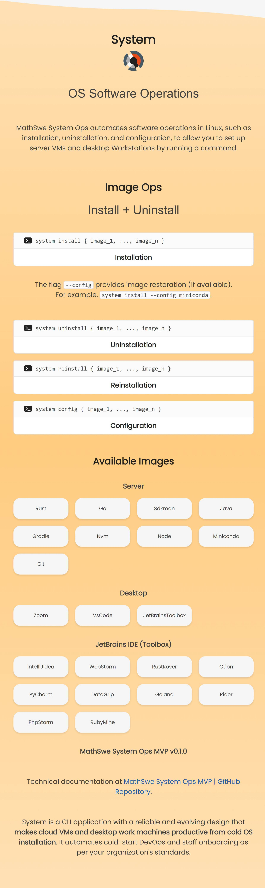

<!-- Copyright (c) 2024 Tobias Briones. All rights reserved. -->
<!-- SPDX-License-Identifier: CC-BY-4.0 -->
<!-- This file is part of https://github.com/tobiasbriones/blog -->

# System and MSW Ops v0.1.0 | MathSwe Ops MVP (2024/08/30)

MathSwe Ops is a wide form of SWAM (Special Software and Models) undertaking its
new MVP that automates extrinsic OS image operations for fast system cold-start.
This initial release brings a new CLI app to operate Ubuntu software and the new
MSW Ops landing page featuring these new concepts and products.

## CLI App for OS Automation and the MSW Ops Web Home

One of the MathSwe Ops MVP challenges is automating onboarding and setup for
workstations and VMs for fast cold-start availability or restoration. It must be
capable of safely installing and restoring software without human interaction
(except when the OS asks for superuser passwords) on a case-by-case basis.

This initial release provides results to the
[Initializing the MathSwe Ops GitHub Organization (2024/06/19)](/initializing-the-mathswe-ops-github-organization-2024-06-19)
insight.

- [Designing Image Ops \| MathSwe Ops MVP (2024/08/08)](/designing-image-ops---mathswe-ops-mvp-2024-08-08).
- [New Image Catalog and Landing Page \| MathSwe Ops MVP (2024/08/22)](/new-image-catalog-and-landing-page---mathswe-ops-mvp-2024-08-22).
- [New Config Command \| MathSwe Ops MVP (2024/08/30)](/new-config-command---mathswe-ops-mvp-2024-08-30).

MSW Ops deployment at [Ops.Math.Software](https://ops.math.software).

GitHub release at
[System, Ops.Math.Software v0.1.0: Publishes a CLI App for OS Automation and the MSW Ops Web Home](https://github.com/mathswe-ops/mathswe-ops---mvp/releases/tag/v0.1.0).

MathSwe System Ops is a new CLI app for Ubuntu that implements the image concept
with operations such as installation, uninstallation, reinstallation, and
configuration to automate software. The MSW Ops web home presents the essential
concepts and the System app documentation.

## New System CLI App

The System CLI application is a part of the MathSwe Ops MVP to automate software
operations in Linux, allowing you to set up server VMs and desktop Workstations
by running a command.

An image is a model of a software package with OS operations to install,
uninstall, or reinstall it. It can expand to include other operations, like
configuring (restoring software state).

The technical documentation of this release is at
[MathSwe System Ops MVP v0.1.0 \| GitHub](https://github.com/mathswe-ops/mathswe-ops---mvp/tree/v0.1.0/system).

System is a CLI application with a reliable and evolving design that makes
**cloud VMs and desktop work machines productive from cold OS installation**. It
automates cold-start DevOps and staff onboarding as per your organization's
standards.

### Getting Started

MathSwe System Ops MVP is compatible with Ubuntu. Its
[release](https://github.com/mathswe-ops/mathswe-ops---mvp/releases/tag/v0.1.0)
attaches the `deb` installer and its `sha256` checksum.

### Image Operations

The System app currently provides commands to install, uninstall, reinstall, and
configure software on your OS.

*Syntax:*

<figure>
    

        <code class="d-block language-plaintext highlighter-rouge" 
            style="
                position: relative;
                background-color:#fafafa;
                border:1px solid #e0e0e0;
                border-radius:.25rem;
                padding:0.5rem 1rem !important;
                border-bottom: none !important;
            ">
            <i class="fa fa-terminal" style="
                color: #fafafa;
                background: #212121;
                padding: 2px 4px;
                border-radius: 4px;
                position: relative;
                top: -2px;
                margin-left: 8px;
                margin-right: 8px;
                font-size: 10px;">
            </i>
            system install { image_1, ..., image_n }
        </code>
    

    <figcaption>Installation</figcaption>
</figure>

The flag `--config` provides image restoration (if available). For example,
`system install --config miniconda`.

<figure>
    

        <code class="d-block language-plaintext highlighter-rouge" 
            style="
                position: relative;
                background-color:#fafafa;
                border:1px solid #e0e0e0;
                border-radius:.25rem;
                padding:0.5rem 1rem !important;
                border-bottom: none !important;
            ">
            <i class="fa fa-terminal" style="
                color: #fafafa;
                background: #212121;
                padding: 2px 4px;
                border-radius: 4px;
                position: relative;
                top: -2px;
                margin-left: 8px;
                margin-right: 8px;
                font-size: 10px;">
            </i>
            system uninstall { image_1, ..., image_n }
        </code>
    

    <figcaption>Uninstallation</figcaption>
</figure>

<figure>
    

        <code class="d-block language-plaintext highlighter-rouge" 
            style="
                position: relative;
                background-color:#fafafa;
                border:1px solid #e0e0e0;
                border-radius:.25rem;
                padding:0.5rem 1rem !important;
                border-bottom: none !important;
            ">
            <i class="fa fa-terminal" style="
                color: #fafafa;
                background: #212121;
                padding: 2px 4px;
                border-radius: 4px;
                position: relative;
                top: -2px;
                margin-left: 8px;
                margin-right: 8px;
                font-size: 10px;">
            </i>
            system reinstall { image_1, ..., image_n }
        </code>
    

    <figcaption>Reinstallation</figcaption>
</figure>

<figure>
    

        <code class="d-block language-plaintext highlighter-rouge" 
            style="
                position: relative;
                background-color:#fafafa;
                border:1px solid #e0e0e0;
                border-radius:.25rem;
                padding:0.5rem 1rem !important;
                border-bottom: none !important;
            ">
            <i class="fa fa-terminal" style="
                color: #fafafa;
                background: #212121;
                padding: 2px 4px;
                border-radius: 4px;
                position: relative;
                top: -2px;
                margin-left: 8px;
                margin-right: 8px;
                font-size: 10px;">
            </i>
            system config { image_1, ..., image_n }
        </code>
    

    <figcaption>Configuration</figcaption>
</figure>

The program encodes official image information internally to keep this sensible
data safe, like download URL domain names and protocols.

The variable part, like software versions and checksums, currently belongs to
JSON files in its
[image directory](https://github.com/mathswe-ops/mathswe-ops---mvp/tree/v0.1.0/system/image).
The `image/` internal directory of the program contains the volatile data about
images. Volatile information also contains the configuration to restore when
running the `config` command.

For example, `miniconda.json` contains the version, hash, and Python version the
program will `install`, while `miniconda.config.json` contains the Conda
environment and packages the program will `config` into the Miniconda software
(or image).

You can't currently change image customization (JSON) since it is part of the
installer unless you fork, update your changes, and build.

Therefore, the image repository consists of the **program modules** that support
concrete software images plus their **JSON information** with volatile data that
requires maintenance.

The System app automates **ad-hoc** steps in a case-by-case image basis that
otherwise you must figure out manually.

### Available Images

The initial release supports many images.

**Available Server Images**

- Rust
- Go
- Sdkman
- Java
- Gradle
- Nvm
- Node
- Miniconda

**Available Desktop Images**

- Zoom
- VsCode
- JetBrainsToolbox

**Available JetBrainsIde Images**

- IntelliJIdea
- WebStorm
- RustRover
- CLion
- PyCharm
- DataGrip
- Goland
- Rider
- PhpStorm
- RubyMine

Notice the image ID you pass to the CLI argument is the lowercase and
hyphen-separated value, for example, `JetBrainsToolbox => jetbrains-toolbox`.

The app implements the `Config` operation for the `Miniconda` and `Git` images.

The app's robust modular design will allow the repository to support many more
images and features.

## MSW Ops Home

The new projects from MathSwe Ops need a web home or landing page to formalize
abstractions like SWAM and present resulting products.

The ***abstract*** part of the page defines **MSW Ops (Mathematical Software
Operations)** and **SWAM (Special Software and Models)**.

It concludes with the ***concrete*** concepts of **MathSwe**, like
**MathSwe Ops** and **MathSwe Com**.

The later sections will present concrete products, like **MathSwe System Ops**
`v0.1.0`, with clean end-user documentation.

**Page Snapshot**

- [MVP: MathSwe Ops Web v0.1.0](images/mvp-_-mathswe-ops-web-v0-1-0.jpeg).

- [MVP: MathSwe Ops Web Desktop v0.1.0](images/mvp-_-mathswe-ops-web-desktop-v0-1-0.jpeg).

MSW Ops is running at its subdomain
[Ops.Math.Software](https://ops.math.software).

The MSW Ops page defines the essential concepts behind mathematical software
operations I've figured out in the past. It also presents upcoming products like
MathSwe System Ops with its end-user documentation.

## Reaching Production with MSW Ops and OS Automation

The previous initialization of the MathSwe Ops GitHub organization led to the
value this release provides: a tangible product and home for organizing and
deploying the operational products.

The System CLI MVP is a robust application written in Rust that will help
satisfy the demands of developing MSW in local Workstations and deploying it to
cloud VMs. It currently **provides image operations** to fasten a recently
installed OS.

Even though the System CLI is an OS-level project or OS-level SWAM, it also
serves as a *foundation* for growing more high-level mathematical tools by
enforcing MSWE principles, like SWAM. Therefore, while a particular MSW can have
its SWAM, MathSwe Ops provides the foundational (umbrella) SWAM to empower the
particular SWAM of that MSW.

While the System app in its initial release can automate onboarding and OS
cold-start operations for Workstations and VMs, the MSW Ops web home is also in
production, providing the abstract behind it and the new products, like the
System app, completing the engineering process from theory to production.
