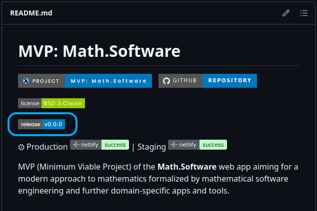
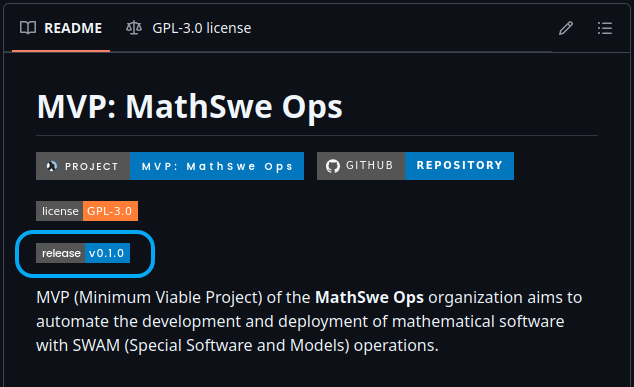
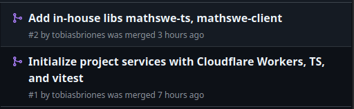
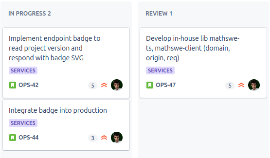

<!-- Copyright (c) 2024 Tobias Briones. All rights reserved. -->
<!-- SPDX-License-Identifier: CC-BY-4.0 -->
<!-- This file is part of https://github.com/tobiasbriones/blog -->

# Initializing MathSwe Ops Services (2024/09/15)

MathSwe Ops Services is a new server application that will provide all
general-purpose web services to facilitate the General SWE processes involved in
mathematical software.

While developing MVPs for MSW and MathSwe Ops, I found generic parts of the
development process requiring automation. They enrich the general-purpose
engineering process in MathSwe.

I will get this project started with one **tiny problem** I had. Then, I will
add any services I need.

The first problem is about maintaining the version badge in the `README.md`
documentation. For some generic badges, you can use some online services to
generate them, like Shields.Io. However, MathSwe standards demand first-class
support, more customized aspects, and new badge types.

Releases (PRs and commits) must be as efficient as possible to reduce any
overhead burden or off-topic tasks that hinder the actual development.

The release badge is custom since it needs to know how to read the project
version, and I got a standard for that (`info.ts`). Badges also need to be
rounded, etc.

I needed to update an SVG file to each subproject MVP's "public" directory so
the `README.md` could read the badge from that URL, which requires updating the
SVG manually before every release.

Therefore, **the first service** in MathSwe Ops Services will be an endpoint
that *reads* a MathSwe project's version and responds with the version badge.

The project will be a TypeScript Node.js modular monolith because of its
versatile general-purpose production-grade design. The initial deployment
platform will be Cloudflare Workers, like the Cookie Consent microservice.

Notice that MathSwe Ops Services is a "normal" production-grade software and not
an MVP because it doesn't aspire to the engineering grade, unlike MVPs.

Using Rust or microservices would be over-engineering, as said, due to the
general-purpose objectives.

As per the license, MathSwe Ops Services is permissive BSD-3-Clause to widen the
technical engagement about developing and deploying MSW.

I currently have some tickets and two PRs merged to `services/dev`. I
initialized the project and designed two in-house libraries, `mathswe-ts` and
`mathswe-client`, to start standardizing the usage of FP and TS projects and
server tools, respectively.

I will publish the PR blogs after publishing this blog, that's why the ticket is
still in "Review."

The last tasks involved an innovative way to apply general pattern matching in
TS, which I figured out in about two days, and exhaustive communication tasks
(i.e., publishing blogs). Following this, I will enable the endpoint for the
version SVG badge, allowing for the release of well-documented projects with
minimal overhead.

MathSwe Ops Services is a TypeScript Node.js (modular) monolithic application
designated to satisfy all the general-purpose needs involving
non-engineering-grade development and deployment of MSW. As motivation, its
initial endpoint will read a MathSwe project's version to respond with its
version SVG badge to remove the overhead when releasing projects. The Services
app will integrate any automation or service to support engineering processes
extrinsic to MSW that are part of General SWE.
