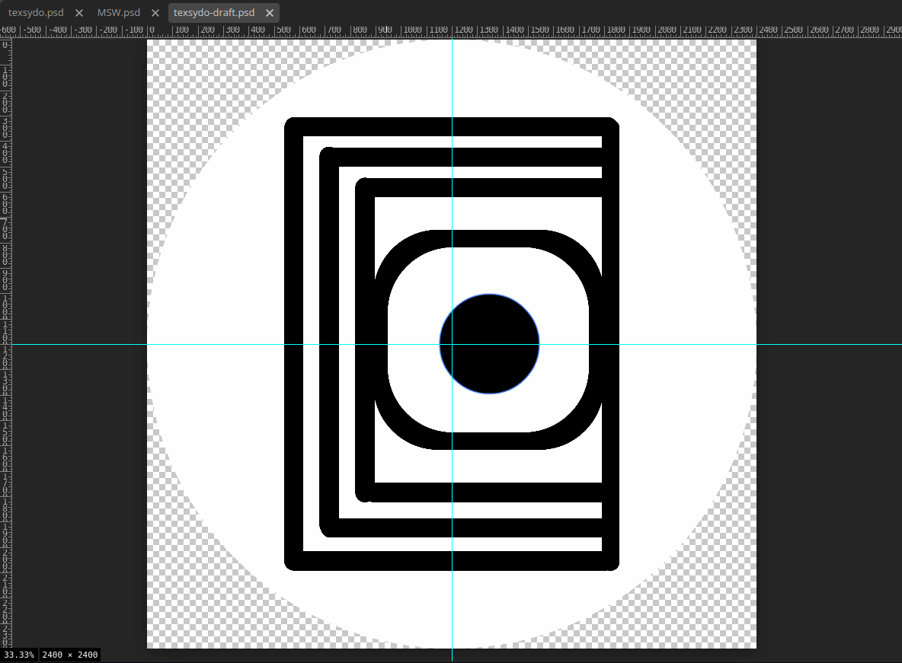
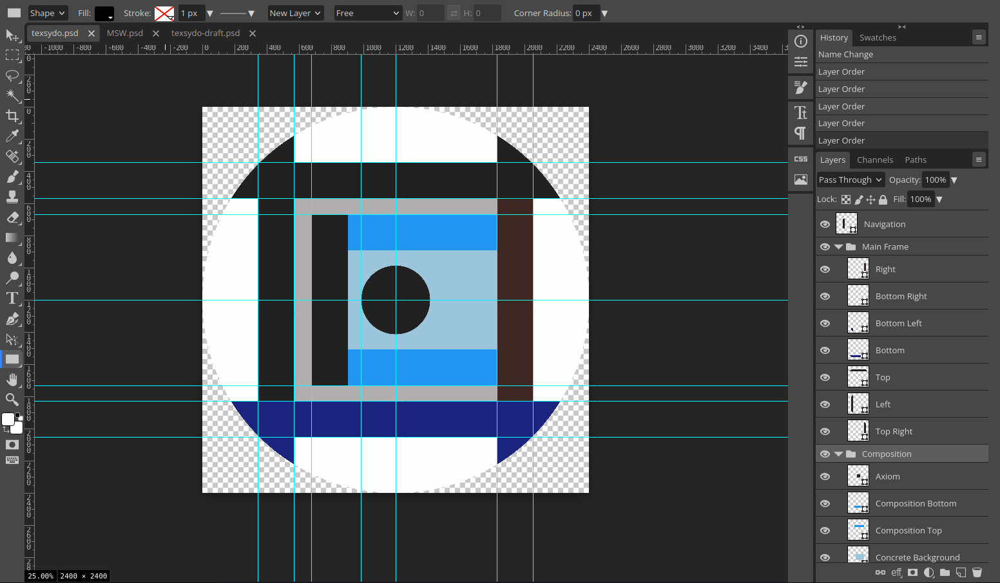
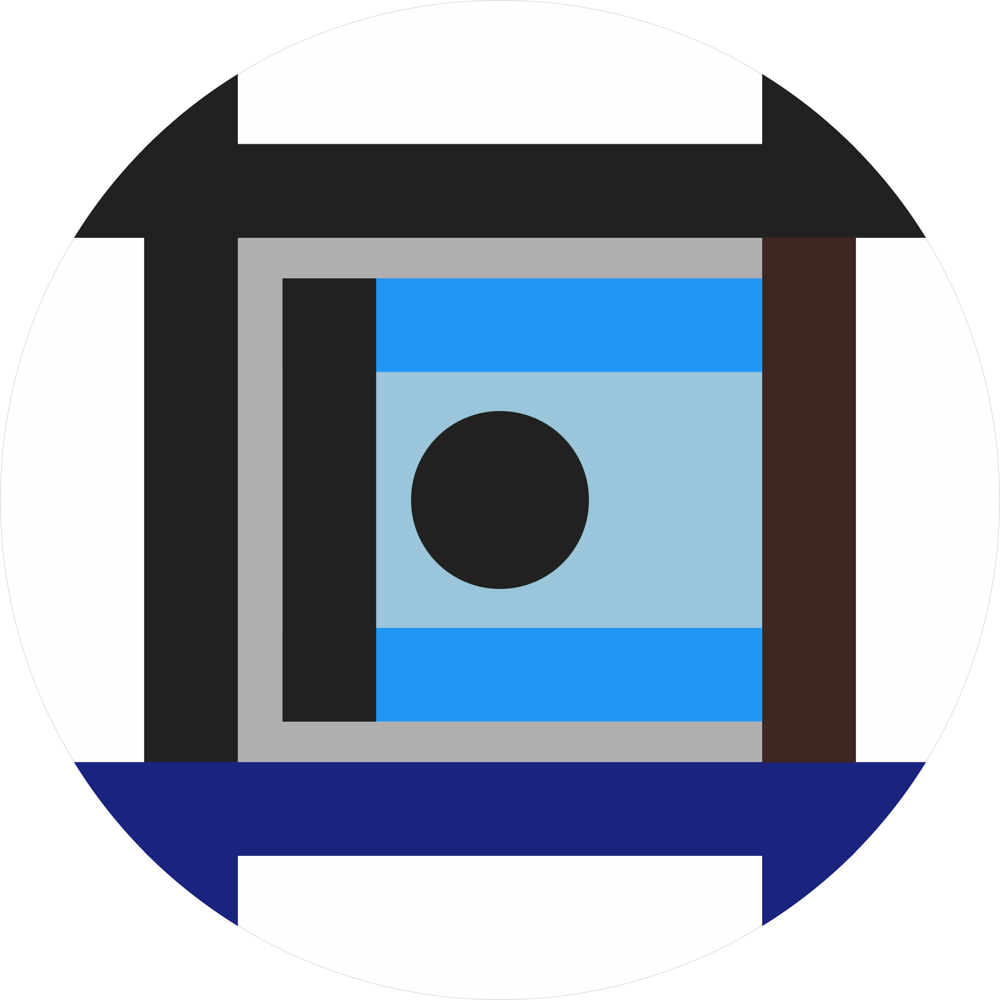

<!-- Copyright (c) 2024 Tobias Briones. All rights reserved. -->
<!-- SPDX-License-Identifier: CC-BY-4.0 -->
<!-- This file is part of https://github.com/tobiasbriones/blog -->

# Initializing the Texsydo GitHub Organization (2024/09/04)

## Texsydo Web and FX Prototypes

The two prototypes are Web, which I use to deploy my articles, and FX, which
automates cover images for Web. After validating and developing them as internal
prototypes, I am now upgrading them to MVPs hosted on the new Texsydo GitHub
organization. Their DSLs aim for the engineering grade, so this MVP space is
urgent to move them forward.

I've written about the technicalities in previous blogs.

- [Automating the Platform Operations and Beyond (2023/08/31)](/automating-the-platform-operations-and-beyond-2023-08-31).
- [Text Ops: New Add PR Command (2024/03/23)](/text-ops-_-new-add-pr-command-2024-03-23).
- [Testing the Texsydo FX Prototype (2024/09/03)](/testing-the-texsydo-fx-prototype-2024-09-03).

Texsydo Web is a tool that automates and standardizes the development of
mathematical articles or documentation with a web target. Texsydo FX compliments
the automation of standard graphical content like cover images and rendering of
mathematical models. They need their upgrade to MVP to formalize results as a
new MathSwe product providing Applied MSW essentials.

## Upgrading the Logo Draft

I created an idea for the Texsydo logo a few months ago, so I needed to compose
it thoughtfully to initialize the Texsydo project formally. As always, I take
the essential idea of Piaxid and MathSwe to give semantics to the logo elements.

I opened up the logo draft and found its look was incipient with many details,
but I already had the base concept.

I had to take two new colors to match the project semantics, recalling that it's
about how MathSwe standardizes articles.

Like all the current MathSwe logos, I still don't apply the smooth curve to the
sharp boundaries to avoid losing time with Photopea. In fact, Texsydo FX is
supposed to accept a DSL to generate the exact *representations* of these
mathematical graphics. So I don't waste time making them manually.

It has the "axiom" enclosed by "components" or "widgets" you find in my smart
articles, the left navigation to expand to the "abstract," and the right
navigation to diverge to the outside world. The top and left are abstract, the
bottom is concrete, and the right is the system boundary. All colors are
semantic, obviously.

MathSwe logos are **mathematical art** I create. The Texsydo logo particularly
denotes the **mental model** of *a graph* I always have in mind to know where I
am, in abstract terms. It's like a pilot without visuals who can still navigate
and understand where and what they are doing.

I've conceptualized two kinds of articles, the normals with left navigation like
this blog article, and minimalistic ones for presentations or landings, like MSW
home. The focus always optimizes for **the center**.

You read rich articles from left to right and top to bottom, while presentation
ones are centered and from top to bottom. Notice how the "axiom" keeps centered
when you "close away" the "left navigation." Logic itself tells me if what I do
makes sense. In other words, the "center" is the "left" of rich articles (LTR)
and the "center" of minimalistic ones.

Hence, we can claim that **the axiom is invariant** as it's always the
"center" of *any* article.

The Texsydo logo is, like all MathSwe logos I've devised, mathematical art that
represents the robustness of the MSW and MSWE concepts. The new logo, enables me
to start producing Texsydo with its coming MVPs, Web, and FX. As a fun fact, I
initially used Photopea to draw, but it's Texsydo FX the one that will engineer
mathematical art.
