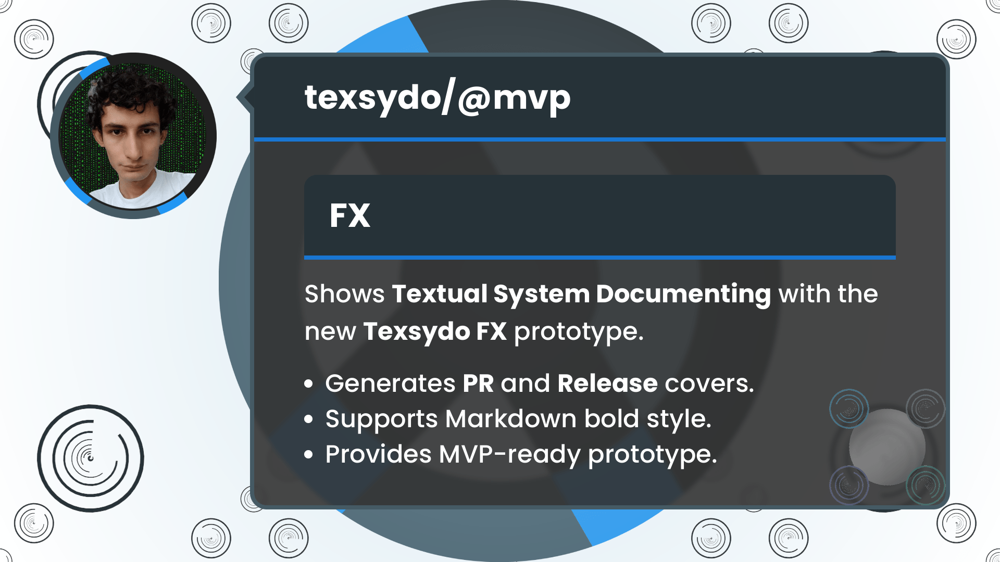

<!-- Copyright (c) 2024 Tobias Briones. All rights reserved. -->
<!-- SPDX-License-Identifier: CC-BY-4.0 -->
<!-- This file is part of https://github.com/tobiasbriones/blog -->

# Testing the Texsydo FX Prototype (2024/09/03)

## PR and Release Articles

I designed the cover for PR and release blogs. These blogs are updates on
MathSwe developments for GitHub PRs and repository releases. They contain
valuable high-level information to *communicate* from the lowest-level technical
detail to the product's high-level engineering.

Commits, PRs, and releases (from lower-level to higher-level) *must be as
productive as possible* to avoid *burning out repeating banal work*, so therein
lies the urgency of moving tools on, like MathSwe Ops and, in this case,
Texsydo (Web and FX).

MathSwe PRs and releases introduce this semantic information progressively, so
there's much data that tools like Texsydo Web/FX can infer. Tools can infer a
substantial part of an article's cover image when the article belongs to a
class, like PRs or releases.

## Introducing Texsydo

In MathSwe, everything optimizes for the source code to leverage MSWE principles
like the mathematical inference that even articles (i.e., English text) are
subject to.

I introduced the **Texsydo (Textual System Documenting)** concept, similar to
the Repsymo (Representational System Modeling) I introduced much before[^1].

[^1]: I introduced the MRM EP in 2019 for my OR class, then Repsymo under
    different names before I figured out the "Repsymo" one

Texsydo is a major project, specifically Applied MSW, like Repsymo.

I've conceptualized and prototyped it for the last few months of testing code
and years of validating concepts. I use its prototype to deploy articles and
render models in my Canvas Play project.

Texsydo is officially **reaching the prototype stage** with this blog, and 
**it's ready to become an MVP**[^2].

[^2]: It goes to MVP since its DSL (not the JavaFX implementation) aims for the
    engineering grade, which requires MVP first to fasten results

I just released the
[initial version of the MathSwe Ops MVP](/system-and-msw-ops-v0-1-0---mathswe-ops-mvp-2024-08-30)
with the MathSwe System Ops CLI app. I can employ my experience initializing the
MathSwe Ops project to move the MVPs of Texsydo (and then Repsymo, MSW, etc.)
on.

It means that the Texsydo project as a whole is finally coming with the Web and
FX MVPs 🎉 after internal prototype stages.

## Texsydo FX Prototype

I started writing the cover image graphics with HTML and CSS to make it easier
to understand. Then, I manually "compiled" that into JavaFX and Kotlin to
leverage its powerful toolset I also know well.

JavaFX code is ugly and slow to write and test, even with Kotlin. So, using HTML
with manual screenshots first to understand the specs was a good decision. I
just wrote the well-defined web specs into the JavaFX scene.

Its CLI requires an unnamed parameter denoting **the cover it will generate**.
It can be `pr-cover` or `release-cover`.

It accepts a `preview` unnamed parameter to open the JavaFX window to see the
rendered image.

According to the last prototype throw-away commit, I finished the app on August
8th, which generates the cover image for PR and releases blogs through a JavaFX
application.

It even **supports Markdown syntax to add bold text** using JavaFX `Text` within
`TextFlow`.

I generated the cover image for my last PR and Release updates after I ensured
all the metrics were optimal with many observations and tests. Together with
up-to-date MSW styles, I could finish this graphical-demanding work.

`Generating a PR Cover Image`

```
gradle run --args="pr-cover preview \
  --subheading='FX' \
  --bg-color=white \
  --bg=bg.png \
  --subdomain=fractal-effects.png \
  --profile-photo=profile.jpeg \
  --heading=texsydo/@mvp \
  --abstract='Shows **Textual System Documenting** with the new **Texsydo FX** prototype.' \
  --footer='Generates **PR** and **Release** covers.,Supports Markdown bold style.,Provides MVP-ready prototype.'"
```

Since the command has the `preview` parameter, it will just open a window with
the image the program rendered.

When you omit the `preview` flag, the program will write the image to the
specified output directory.



If you map the command to the resulting image, you will find all the
compositions on the cover the app automatically rendered.

### Integration of Texsydo FX into Texsydo Web

Another Texsydo tool with context, like Texsydo Web, will integrate Texsydo FX,
which just generates what you pass to it.

I've used and developed the
[Texsydo Web prototype](/automating-the-platform-operations-and-beyond-2023-08-31)
for over a year.

Texsydo Web calls Texsydo FX to build the final artifact that goes to
production, that is, the web article. So, I had to integrate the Texsydo Web
prototype to **infer** most of the cover values from the article and call
Texsydo FX to generate the cover image.

As I always say, MathSwe is all about domain-specific systems. My articles are
semantic, so these *cohesive* settings **enable tools to automate or
*infer*** anything. If the article is a GitHub PR or Release update, the system
will *infer* everything I've done before.

Engineering discourages inefficient and error-prone repetition of the work you
already did since it **creates a cycle**[^3].

[^3]: You describe the cycle when you *go down* to low-level details, then *go
    up* to your work

Top engineering standards, like MSWE, require the application of mathematical
inference to optimize as much as possible and, therefore, to remove cycles or
anti-patterns. When you design your domain-specific system, you start inducing
formalities. Then, you can apply these mathematical techniques.

The Texsydo Web prototype currently deduces most of the values to employ the new
Texsydo FX prototype that automates the cover images.

On the other hand, integrating and testing all these tools has been a
complicated endeavor sometimes due to their prototype stage.

I covered sensitive parts of Texsydo Web with unit testing to ensure I wouldn't
find nonsense later, but there are always out-of-hand challenges.

External changes when writing articles included supporting new article variants
or syntaxes, updating the smart dictionary, figuring out and fixing CLI
arguments that worked on Windows but not on Ubuntu, etc.

These "live" challenges required me to go back to debug the problem, *removing
much energy from the actual tasks* I had to do. Therefore, **it's crucial and
about time to move the Texsydo prototypes to MVP grade**.

Textual systems, like articles including natural language, are also source code.
Removing work and code redundancy by leveraging inference is required by MSWE,
the engineering grade. Integrating Texsydo FX into Web was successful leading to
prioritizing the transition to MVP stage.

### Texsydo FX with a JavaFX Implementation

Texsydo FX (DSL) aims for the engineering grade, but its implementation
(SWAM) may be limited to the production grade.

Its current JavaFX implementation and any other "high-level" implementations
(web, etc.) *cannot be engineering-grade*.

Also, notice that "FX" has nothing to do with "JavaFX" (which goes altogether).
I started the project with HTML and CSS and chose JavaFX to settle.

I use JavaFX due to its backend and Java2D capabilities, Kotlin, and my
significant experience with the technology. Besides, JavaFX is probably the best
choice when it comes to niches.

Despite there being software, like Texsydo FX, which spec (DSL) aims for the
engineering grade, some of its implementations (SWAM) may be limited to the
production-grade. The project results in an MVP because the DSL will be
engineering grade. Therefore, even if the SWAM implementation is not engineering
grade, it still needs to integrate the DSL, which is engineering grade.
