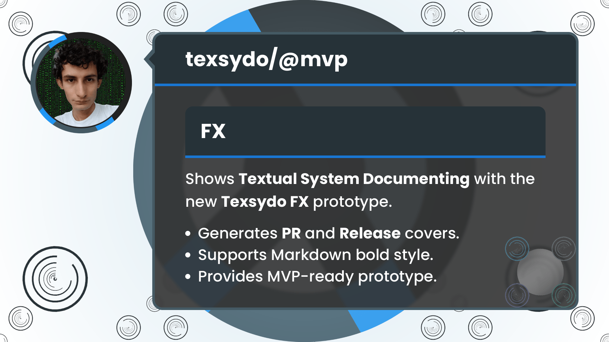

<!-- Copyright (c) 2024 Tobias Briones. All rights reserved. -->
<!-- SPDX-License-Identifier: CC-BY-4.0 -->
<!-- This file is part of https://github.com/tobiasbriones/blog -->

# Testing the Texsydo FX Prototype for over a Month (2024/09/03)

## PR and Release Articles

I designed the cover for PR and release blogs. These blogs are updates on
MathSwe developments for GitHub PRs and repository releases. They contain
valuable high-level information to *communicate* from the lowest-level technical
detail to the product's high-level engineering.

Commits, PRs, and releases (from lower-level to higher-level) *must be as
productive as possible* to avoid *burning out repeating banal work*, so therein
lies the urgency of moving tools on, like MathSwe Ops and, in this case,
Texsydo (Web and FX).

MathSwe PRs and releases introduce this semantic information progressively, so
there's much data that tools like Texsydo Web/FX can infer. Tools can infer a
substantial part of an article's cover image when the article belongs to a
class, like PRs or releases.

## Introducing Texsydo

In MathSwe, everything optimizes for the source code to leverage MSWE principles
like the mathematical inference that even articles (i.e., English text) are
subject to.

I introduced the **Texsydo (Textual System Documenting)** concept, similar to
the Repsymo (Representational System Modeling) I introduced much before[^1].

[^1]: I introduced the MRM EP in 2019 for my OR class, then Repsymo under
    different names before I figured out the "Repsymo" one

Texsydo is a major project, specifically Applied MSW, like Repsymo.

I've conceptualized and prototyped it for the last few months of testing code
and years of validating concepts. I use its prototype to deploy articles and
render models in my Canvas Play project.

Texsydo is officially **reaching the prototype stage** with this blog, and 
**it's ready to become an MVP**[^2].

[^2]: It goes to MVP since its DSL (not the JavaFX implementation) aims for the
    engineering grade, which requires MVP first to fasten results

I just released the
[initial version of the MathSwe Ops MVP](/system-and-msw-ops-v0-1-0---mathswe-ops-mvp-2024-08-30)
with the MathSwe System Ops CLI app. I can employ my experience initializing the
MathSwe Ops project to move the MVPs of Texsydo (and then Repsymo, MSW, etc.)
on.

It means that the Texsydo project as a whole is finally coming with the Web and
FX MVPs 🎉 after internal prototype stages.

`Generating a PR Cover Image`

```
gradle run --args="pr-cover preview \
  --subheading='FX' \
  --bg-color=white \
  --bg=bg.png \
  --subdomain=fractal-effects.png \
  --profile-photo=profile.jpeg \
  --heading=texsydo/@mvp \
  --abstract='Shows **Textual System Documenting** with the new **Texsydo FX** prototype.' \
  --footer='Generates **PR** and **Release** covers.,Supports Markdown bold style.,Provides MVP-ready prototype.'"
```

Since the command has the `preview` parameter, it will just open a window with
the image the program rendered.

When you omit the `preview` flag, the program will write the image to the
specified output directory.


