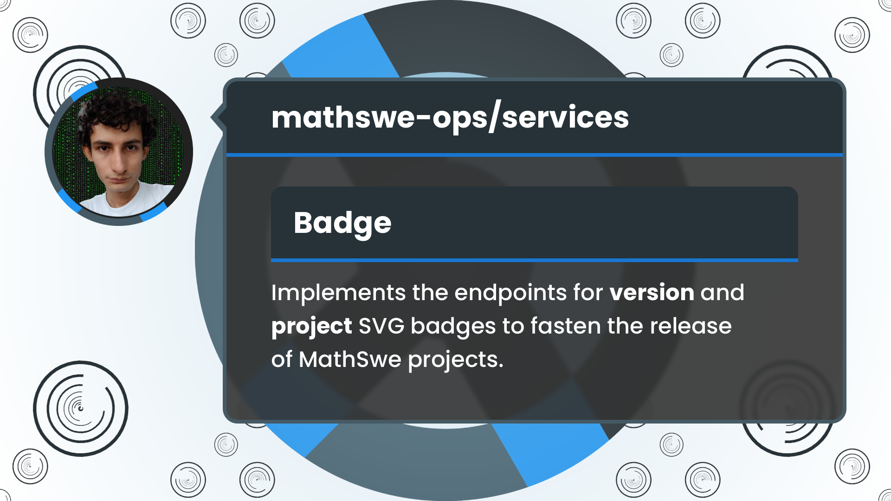

<!-- Copyright (c) 2024 Tobias Briones. All rights reserved. -->
<!-- SPDX-License-Identifier: CC-BY-4.0 -->
<!-- This file is part of https://github.com/tobiasbriones/blog -->

# New Badge Version and Project Endpoints | MathSwe Ops Services (2024/09/18)




Getting a badge to show a project's version in its documentation is more
difficult for MathSwe projects as these can be granular independent projects
inside the same repository, like microservices. MathSwe also requires project
badges with their icon to present them. The Services API needs to automate these
badges for version and project to improve the development and (primarily)
fasten the release of MathSwe projects.

---

**Allow hyphens in Hostname**

Sep 16: PR [#3](https://github.com/mathswe-ops/services/pull/3) merged into
by [tobiasbriones](https://github.com/tobiasbriones)
{: .pr-subtitle }

It fixes the rejection of valid hostnames with hyphens.

---

**Add router with MS-Client CORS**

Sep 16: PR [#4](https://github.com/mathswe-ops/services/pull/4) merged into
by [tobiasbriones](https://github.com/tobiasbriones)
{: .pr-subtitle }

It adds the Itty-Router dependency that routes CF Worker applications and sets
up the CORS origin to only accept MathSwe-Client curated origins.

---

**Implement inference of project version from GitHub repository**

Sep 17: PR [#5](https://github.com/mathswe-ops/services/pull/5) merged into
by [tobiasbriones](https://github.com/tobiasbriones)
{: .pr-subtitle }

It defines a Git platform and build-system abstractions such as GitHub, NPM, and
Cargo to provide an implementation through the GitHub API that reads a project
(including subdirectories) given its repository URL, infers the build system it
uses, finally, it reads the project's version.

It only reads public repositories at branch `main` (production) for simplicity.


<figure>
<div class="header user-select-none headerless">
    <div class="caption">
        
    </div>

    <div class="menu">
        

        <button type="button" data-code="export async function inferVersion(
    gitPlatform: GitPlatform,
    user: string,
    repo: string,
    path: Option&lt;string&gt;,
): Promise&lt;Either&lt;string, string&gt;&gt;
" onclick="onCopyCodeSnippet(this)">
            <span class="material-symbols-rounded">
            content_copy
            </span>

            <div class="tooltip">
                Copied
            </div>
        </button>
    </div>
</div>

```ts
export async function inferVersion(
    gitPlatform: GitPlatform,
    user: string,
    repo: string,
    path: Option<string>,
): Promise<Either<string, string>>
```



{{ markdownContent | markdownify }}


<figcaption>InferVersion API</figcaption>
</figure>


<figure>
<div class="header user-select-none headerless">
    <div class="caption">
        
    </div>

    <div class="menu">
        

        <button type="button" data-code="const rustProject = await inferVersion(
    gitHub,
    &quot;rust-unofficial&quot;,
    &quot;awesome-rust&quot;,
    none,
);
const jsProject = await inferVersion(
    gitHub,
    &quot;jquery&quot;,
    &quot;jquery&quot;,
    none,
);
const nestedMvp = await inferVersion(
    gitHub,
    &quot;mathswe-ops&quot;,
    &quot;mathswe-ops---mvp&quot;,
    some(&quot;system&quot;),
);

console.log(rustProject);
console.log(jsProject);
console.log(nestedMvp);
" onclick="onCopyCodeSnippet(this)">
            <span class="material-symbols-rounded">
            content_copy
            </span>

            <div class="tooltip">
                Copied
            </div>
        </button>
    </div>
</div>

```ts
const rustProject = await inferVersion(
    gitHub,
    "rust-unofficial",
    "awesome-rust",
    none,
);
const jsProject = await inferVersion(
    gitHub,
    "jquery",
    "jquery",
    none,
);
const nestedMvp = await inferVersion(
    gitHub,
    "mathswe-ops",
    "mathswe-ops---mvp",
    some("system"),
);

console.log(rustProject);
console.log(jsProject);
console.log(nestedMvp);
```



{{ markdownContent | markdownify }}


<figcaption>Infering Project Versions</figcaption>
</figure>


<figure>
<div class="header user-select-none headerless">
    <div class="caption">
        
    </div>

    <div class="menu">
        

        <button type="button" data-code="{ _tag: &#x27;Right&#x27;, right: &#x27;0.1.0&#x27; }
{ _tag: &#x27;Right&#x27;, right: &#x27;4.0.0-beta.2&#x27; }
{ _tag: &#x27;Right&#x27;, right: &#x27;0.1.0&#x27; }
" onclick="onCopyCodeSnippet(this)">
            <span class="material-symbols-rounded">
            content_copy
            </span>

            <div class="tooltip">
                Copied
            </div>
        </button>
    </div>
</div>

```
{ _tag: 'Right', right: '0.1.0' }
{ _tag: 'Right', right: '4.0.0-beta.2' }
{ _tag: 'Right', right: '0.1.0' }
```



{{ markdownContent | markdownify }}


<figcaption>Output: Infering Project Versions</figcaption>
</figure>

Besides providing some GitHub and build system abstractions, it's a useful API
that an endpoint can use to get the version of a given GitHub project, even if
it is a nested subdirectory, like microservice (independently versioned) or mono
repository with sub-projects.

---

**Add test suite for readBuildSystem**

Sep 17: PR [#6](https://github.com/mathswe-ops/services/pull/6) merged into
by [tobiasbriones](https://github.com/tobiasbriones)
{: .pr-subtitle }

It adds some tests for the method that reads the GitHub project's build system
by mocking the file list API response.

---

**Implement endpoint badge/version**

Sep 18: PR [#7](https://github.com/mathswe-ops/services/pull/7) merged into
`services/dev <- badge` by [tobiasbriones](https://github.com/tobiasbriones)
{: .pr-subtitle }

It provides the new endpoint that takes a repository GitHub URL, or one of its
subprojects (e.g., microservice), and responds with the badge showing its
current version.

---

**Implement endpoint badge/project and enhance badge styles and code**

Sep 19: PR [#8](https://github.com/mathswe-ops/services/pull/8) merged into
`services/dev <- badge` by [tobiasbriones](https://github.com/tobiasbriones)
{: .pr-subtitle }

The badge/project endpoint provides the main badge for a given MathSwe project
(including MVPs).

---

The version badge endpoint required a relatively complex implementation to fetch
a project version and return the SVG badge. It also required me to fix some
styles in the SVG template. I also applied more FP with the FP-TS library and
MathSwe-TS I designed in the previous PR #2, which was my first time using them.

The `git-platform/git-platform` and `git-platform/project` modules provide
GitHub support to get a repository version by reading it directly from the
GitHub API. They also infer a subproject version, like a microservice or a
project in a mono repository, by reading the version in their build tool file,
such as `package.json` or `Cargo.toml`.

Regarding the project badge, it accepts MathSwe projects with MVP variants
(query param), which have their icon defined inside the Services app, so I just
have to call the endpoint to keep `README.md` files clean.

The integration adds two GET endpoints to the MathSwe Ops Services API to fetch
the version/release and the project SVG badge. The version badge takes a GitHub
repository in its route params and a "path" query if you want a subproject
version, while the project badge takes a MathSwe project and an "MVP" query. The
new badge endpoints provide automation steps when releasing and creating MathSwe
projects by implementing their custom standards.


