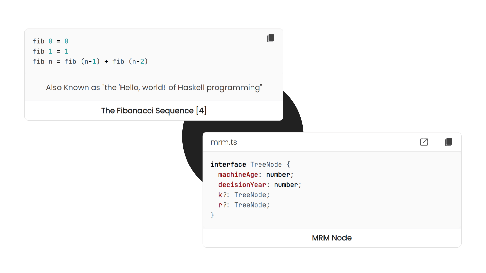

<!-- Copyright (c) 2023 Tobias Briones. All rights reserved. -->
<!-- SPDX-License-Identifier: CC-BY-4.0 -->
<!-- This file is part of https://github.com/tobiasbriones/blog -->

# New Code Snippet Feature (2023/10/11)



---

Code snippets are a powerful communication weapon in engineering for
documentation. The new MathSwe standard has made it to production with cohesive
code blocks implementing crucial features for copy and open actions.

## Structure

Code snippets, like any other article or content, must have an inherent
structure to make them autonomous parts of a bigger article.

As specified recently in
[Visualization Caption (2023/10/01)](/visualization-caption-2023-10-01), the
design keeps scaling for code snippet captions. Everything is an article (i.e.,
relative), thus the principles are the same.

Therefore, snippet captions have to be smoothly readable, from top to bottom and
left to right.

An article has a fundamental structure that makes it cohesive and composable:
abstract, body, and conclusion.

Hence, code snippets have a header with *context that introduces you* to the
body containing the code and exits smoothly via its title (i.e., the
conclusion).

Just like a function: the domain, the definition, and the transformed output.

Needless to say, the optimization target here is the code snippet or body, so
this must be focused in the center. So the header goes to the top and the
conclusion to the bottom.

Titles are powerful since you don't have to read the whole article (i.e., the
code snippet), only the title or conclusion, to know what it does, even if you
don't know the underlying PL.

Besides the fundamental structure of an article, there's a marvelous standard
for adding a more detailed conclusion: the snippet abstract caption.

In the same way, the abstract visualization caption belongs to the visualization
body —as specified in the given article above—, code snippets can also have an
abstract caption resuming the whole snippet in a line title-cased description.

I love abstract captions since they make some content look more premium —a
property I also addressed previously.

Some content should have abstract captions, mostly when the title gets too
large. Most content shouldn't have an abstract caption, though.

Therefore, code snippets can have captions like visualizations or any other
content.

They have a specific structure consisting of a heading including the context of
the source code, the body containing the snippet, an optional abstract caption,
and the snippet title serving as a conclusion. These elements constitute a
cohesive block of code that can be composed as per needs.

## Code Snippet Feature

The new code snippet feature is available in production, and it has two major
features to make snippets powerful tools for users besides the implementation
of the standard provided above.

The two features implemented are copying and opening its file.

The "copy" button puts the code snippet as is in your clipboard.


<figure>
<div class="header user-select-none headerless">
    <div class="caption">
        
    </div>

    <div class="menu">
        

        <button type="button" data-code="const axesCanvas = new TreeAxesCanvas();

axesCanvas.init(canvasEl);
axesCanvas.render();
" onclick="onCopyCodeSnippet(this)">
            <span class="material-symbols-rounded">
            content_copy
            </span>

            <div class="tooltip">
                Copied
            </div>
        </button>
    </div>
</div>

```ts
const axesCanvas = new TreeAxesCanvas();

axesCanvas.init(canvasEl);
axesCanvas.render();
```



{{ markdownContent | markdownify }}


<figcaption>Try to Copy this Snippet</figcaption>
</figure>

The "open" source file button is programmed for code snippets that have a
subdirectory or project (EP) associated with the article. That is, if the
snippet exists in the article files, SWAM Ops programmed a button for that
snippet, so you can open it.


<figure>
<div class="header user-select-none ">
    <div class="caption">
        met start | Main.java
    </div>

    <div class="menu">
        <button type="button" data-path="source/Main.java" onclick="onOpenCodeSnippetLink(this)">
    <span class="material-symbols-rounded">
    open_in_new
    </span>
</button>

        <button type="button" data-code="var root = FXMLLoader.&lt;Parent&gt;load(loadResource(&quot;app.fxml&quot;));
var scene = new Scene(root, WINDOW_WIDTH, WINDOW_HEIGHT);

scene.getStylesheets().add(
    loadResource(&quot;app.css&quot;).toExternalForm()
);

primaryStage.setTitle(&quot;Slides&quot;);
primaryStage.setScene(scene);
primaryStage.show();
" onclick="onCopyCodeSnippet(this)">
            <span class="material-symbols-rounded">
            content_copy
            </span>

            <div class="tooltip">
                Copied
            </div>
        </button>
    </div>
</div>

```java
var root = FXMLLoader.<Parent>load(loadResource("app.fxml"));
var scene = new Scene(root, WINDOW_WIDTH, WINDOW_HEIGHT);

scene.getStylesheets().add(
    loadResource("app.css").toExternalForm()
);

primaryStage.setTitle("Slides");
primaryStage.setScene(scene);
primaryStage.show();
```



{{ markdownContent | markdownify }}

<div class="abstract">This Snippet Belongs to a Source File</div>

<figcaption>Go to the Source File</figcaption>
</figure>

The source file navigation was implemented when
[Source Code Navigation \| Source Code Navigation](/new-article-and-code-navigation-features-2023-09-09#source-code-navigation).

The news here is the snippet buttons, so you can visit its file directly 🎉.

Code snippets are composed according to the needs.

If you noticed, the first snippet is plain simple, while the Java snippet has a
full header, belongs to a source file, and has an abstract besides the common
features. As said, they're composable.

That's how the code snippet features are finished in production, replacing the
older default snippets.

## Powerful Code Snippet Integration

Code snippet captions have been standardized by extending the previously
published specs for visualization captions.

Code snippets were implemented, allowing composability for various kinds of
possible snippets.

The implementation of the code snippet standard and the copy and open file
features have come to make the platform source code more integrated, resulting
in crucial value for users who mainly benefit from source code, including
myself.


<div class="my-4">
  <div class="subdir-btn my-4">
    <a class="btn" href="source">
      
      <span>
        Source
      </span>
    </a>
  </div>
</div>