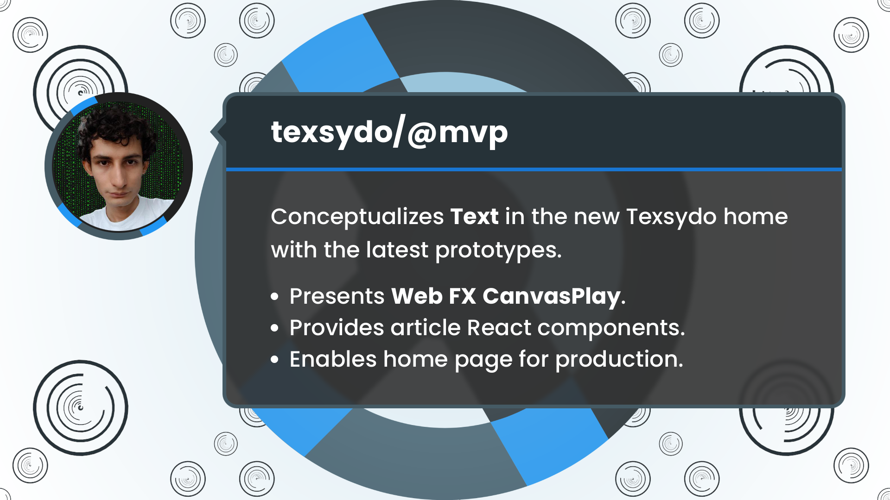

<!-- Copyright (c) 2024 Tobias Briones. All rights reserved. -->
<!-- SPDX-License-Identifier: CC-BY-4.0 -->
<!-- This file is part of https://github.com/tobiasbriones/blog -->

# New Home Page | Texsydo MVP (2024/10/13)

Many internal prototypes migrating to the recent MathSwe Prototypes repository
are part of Texsydo Web and FX. While they still haven't migrated to MVP, the
Texsydo home page can present them so their documentation can reach production
and complement esoteric technical results with their high-level products.

---

**Initialize Texsydo app tsd.math.software**

Sep 25: PR [#1](https://github.com/texsydo/texsydo---mvp/pull/1) merged into `tsd/dev <- tsd.math.software` by [tobiasbriones](https://github.com/tobiasbriones)
{: .pr-subtitle }

It follows the MathSwe Ops Templates and MSW Ops application base to provide a
new web application as the home of Texsydo (Textual System Documenting) at
"Tsd.Math.Software."

---

**Add project documentation with README.md**

Sep 26: PR [#2](https://github.com/texsydo/texsydo---mvp/pull/2) merged into `tsd/dev <- tsd/docs` by [tobiasbriones](https://github.com/tobiasbriones)
{: .pr-subtitle }

It adds the root documentation of the repository and fixes minor details in
existing documentation.

---

**Add Texsydo home page with sections text, web, fx**

Oct 12: PR [#3](https://github.com/texsydo/texsydo---mvp/pull/3) merged into `tsd/dev <- tsd.math.software` by [tobiasbriones](https://github.com/tobiasbriones)
{: .pr-subtitle }

It creates the TsdMathSoftware page with redacted sections about the Texsydo
concept and the results of the current prototypes. This PR updates the content
on the Texsydo home page according to the latest results.

Formalizing Texsydo is crucial to extracting the power of the existing
prototypes and other projects, like Repsymo, that require mathematical text.
Texsydo is a base for applied MSW since it provides the communication and formal
documentation existing on any mathematical application.

The "Text" section is abstract and took me a good while to redact properly since
it is difficult to resume a whole project that's barely a new MVP into 5 tiny
paragraphs. However, even when Texsydo is a new MVP, I've been defining it under
the hood, as well as the other projects.

I had to iterate to move the Texsydo FX Prototypes on, so I could redact the
"FX" section. I also worked together with the MathSwe Ops Templates to keep the
boilerplate setup of the other React and JavaFX applications synced.

I finished migrating the graphics prototypes in [TSD FX Prototype v0.2.0:
Finishes Migration from Playground
EP](https://github.com/mathswe/prototypes/releases/tag/v0.2.0), under the hood,
while working on TsdMathSoftware.

There are other tasks in this long PR:

- Adds Texsydo icons, after design iterations in Photopea.
- Adds new components to reuse among MathSwe React apps:
- `TerminalOutput`: Models a terminal (CLI) to show brief steps after running a
command (e.g., building, deploying, etc).
- `Presentation`: Images carousel with MathSwe captions and zoom control (based
on the one of MSW Engineer (Jekyll)).
- `InlineCode`, `SnippetBlock`: Basic code snippets without language syntax.
- `AutoVideo`: Introduces the video component to display models or animations
previously rendered by Texsydo FX.

The abstract section "Text" formalizes what Texsydo is, while the "Web" and "FX"
sections present the prototypes as they become MVPs available to the public.
Finally, the next section, "Canvas Play," is almost ready, allowing the web app
to be deployed.

---

**Add section canvas-play with aspect ratio support for videos**

Oct 13: PR [#4](https://github.com/texsydo/texsydo---mvp/pull/4) merged into `tsd/dev <- tsd.math.software` by [tobiasbriones](https://github.com/tobiasbriones)
{: .pr-subtitle }

It updates the remaining sections according to the latest high-level results. It
adds the in-article subsection to "Web" and the "Canvas Play" section to the
page.

It contains support for video animations with aspect ratios `1-1` and `9-16` so
they are responsive and the Canvas Play section can show those visualizations.

This PR finishes adding the content for the latest updates on Texsydo MVP and
Prototypes, which makes the page available at production.

---

It was crucial to formally define Texsydo so I could understand the roadmap and
clearly explain these technical concepts to others.

The new Texsydo web home provided components that other articles will reuse,
although it still requires those from MSW Engineer. The collaboration with
MathSwe Ops Templates is unifying the common code among React and JavaFX
applications in MathSwe.

The section Text conceptualizes Texsydo while the others present the latest
results in its prototypes for a quick iteration that complements the deeply
technical challenges from previous years with a high-level presentation.
Prototype sections include Web, FX, and Canvas Play, which enable the Texsydo
home page to reach production.

