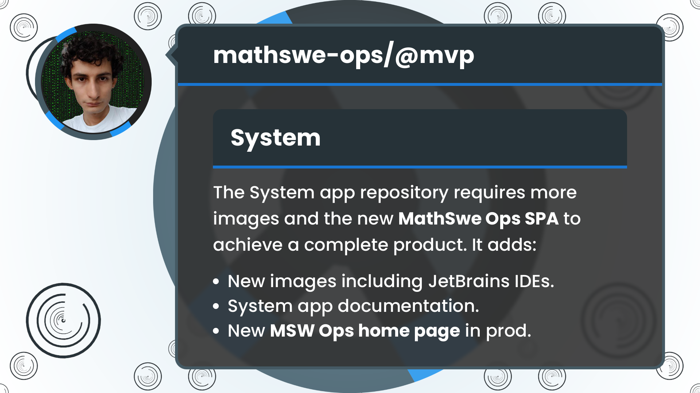
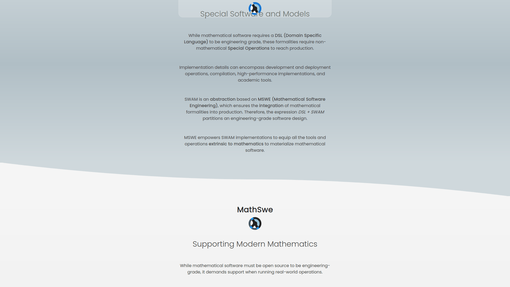
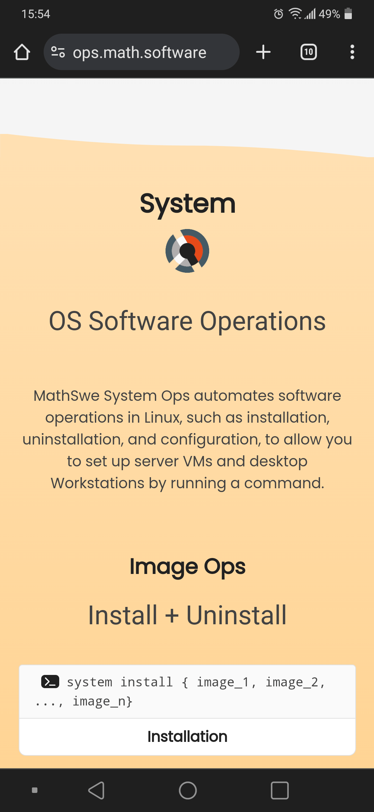

<!-- Copyright (c) 2024 Tobias Briones. All rights reserved. -->
<!-- SPDX-License-Identifier: CC-BY-4.0 -->
<!-- This file is part of https://github.com/tobiasbriones/blog -->

# New Image Catalog and Landing Page | MathSwe Ops Mvp (2024/08/22)




The System app repository requires more images to add enough value before its
initial release, like Miniconda and JetBrains IDEs. It's crucial not to leave
behind its documentation right now, as the new MSW Ops web home must also move
forward to reach end users to achieve a complete product.

---

**Implement ImageOps for nvm, node, miniconda, vscode, jetbrains-toolbox plus all IDEs**

Aug 14: PR [#7](https://github.com/mathswe-ops/mathswe-ops---mvp/pull/7) merged into `ops/dev <- system` by [tobiasbriones](https://github.com/tobiasbriones)
{: .pr-subtitle }

This PR implements `ImageOps` for a wide variety of server and desktop images
and all the required low-level details.

New server images include `NvmImage`, `NodeImage`, and `MinicondaImage`, while
new desktop images provide `VsCodeImage` and another powerful abstraction via
the `JetBrainsToolboxImage` and the `JetBrainsIdeImage`.

While the `JetBrainsToolboxImage` only implements operations for the Toolbox
app, I figured out, developed, and tested thoroughly to devise the abstraction
`JetBrainsIdeImage` to support all IDEs simultaneously.

JetBrains provides IDEs as standalone apps and snap packages, or you can install
them via the Toolbox (preferred option). The objective of this PR is to automate
the Toolbox itself. For example, you can set up a machine with the Toolbox app
plus IDEs installed out of the box after installing the OS.

The objective is to automate the Toolbox, not to replace it.

The Toolbox app doesn't provide a CLI, so automating the IDE installations
within the Toolbox environment is not trivial. Recall that the Toolbox is a GUI
app, so it's more obscure to automate.

I checked how the Toolbox app works under the hood (I had observed it before but
still required more details). Therefore, I implemented the operations to
automate all IDEs in the Toolbox environment.

The `JetBrainsIdeImage` supports all the IDEs with common operations.


<figure>
<div class="header user-select-none headerless">
    <div class="caption">
        
    </div>

    <div class="menu">
        

        <button type="button" data-code="pub enum JetBrainsIdeImageId {
    IntelliJIdea,
    WebStorm,
    RustRover,
    CLion,
    PyCharm,
    DataGrip,
    Goland,
    Rider,
    PhpStorm,
    RubyMine,
}
" onclick="onCopyCodeSnippet(this)">
            <span class="material-symbols-rounded">
            content_copy
            </span>

            <div class="tooltip">
                Copied
            </div>
        </button>
    </div>
</div>

```rust
pub enum JetBrainsIdeImageId {
    IntelliJIdea,
    WebStorm,
    RustRover,
    CLion,
    PyCharm,
    DataGrip,
    Goland,
    Rider,
    PhpStorm,
    RubyMine,
}
```



{{ markdownContent | markdownify }}


<figcaption>IDEs Available to Operate into the Toolbox App</figcaption>
</figure>

JetBrains software uses the `YearSemVer` format this PR introduces, so the image
information will look like:


<figure>
<div class="header user-select-none ">
    <div class="caption">
        SerializedJetBrainsIdeInfo
    </div>

    <div class="menu">
        

        <button type="button" data-code="{
    &quot;version&quot;: &quot;2024.2.0&quot;,
    &quot;hash_sha256&quot;:
    &quot;f059c9fd965a9dbf520381ee4119408f96c336eaa3b69a8c31abd1d716dbbfb4&quot;
}
" onclick="onCopyCodeSnippet(this)">
            <span class="material-symbols-rounded">
            content_copy
            </span>

            <div class="tooltip">
                Copied
            </div>
        </button>
    </div>
</div>

```json
{
    "version": "2024.2.0",
    "hash_sha256":
    "f059c9fd965a9dbf520381ee4119408f96c336eaa3b69a8c31abd1d716dbbfb4"
}
```



{{ markdownContent | markdownify }}


<figcaption>Image Info Corresponding to the IntelliJ IDEA Image</figcaption>
</figure>

The implementation provides smart constructors with higher-order functions that
operate well with the `ImageLoadContext` a previous PR introduced.


<figure>
<div class="header user-select-none headerless">
    <div class="caption">
        
    </div>

    <div class="menu">
        

        <button type="button" data-code="let info_loader = ImageInfoLoader::from(
    &amp;self.id, PathBuf::from(&quot;image&quot;), PathBuf::from(&quot;&quot;)
);
let ctx = ImageLoadContext::new(&amp;os, info_loader);
let image = match self.id {
    Zoom             =&gt; ctx.load(ZoomImage::new)?,
    VsCode           =&gt; ctx.load(VsCodeImage::new)?,
    JetBrainsToolbox =&gt; ctx.load(JetBrainsToolboxImage::new)?,
    IntelliJIdea     =&gt; ctx.load(JetBrainsIdeImage::intellij_idea())?,
    WebStorm         =&gt; ctx.load(JetBrainsIdeImage::webstorm())?,
    RustRover        =&gt; ctx.load(JetBrainsIdeImage::rustrover())?,
    CLion            =&gt; ctx.load(JetBrainsIdeImage::clion())?,
    DataGrip         =&gt; ctx.load(JetBrainsIdeImage::datagrip())?,
    PyCharm          =&gt; ctx.load(JetBrainsIdeImage::pycharm())?,
    Goland           =&gt; ctx.load(JetBrainsIdeImage::goland())?,
    Rider            =&gt; ctx.load(JetBrainsIdeImage::rider())?,
    PhpStorm         =&gt; ctx.load(JetBrainsIdeImage::phpstorm())?,
    RubyMine         =&gt; ctx.load(JetBrainsIdeImage::rubymine())?,
};
" onclick="onCopyCodeSnippet(this)">
            <span class="material-symbols-rounded">
            content_copy
            </span>

            <div class="tooltip">
                Copied
            </div>
        </button>
    </div>
</div>

```rust
let info_loader = ImageInfoLoader::from(
    &self.id, PathBuf::from("image"), PathBuf::from("")
);
let ctx = ImageLoadContext::new(&os, info_loader);
let image = match self.id {
    Zoom             => ctx.load(ZoomImage::new)?,
    VsCode           => ctx.load(VsCodeImage::new)?,
    JetBrainsToolbox => ctx.load(JetBrainsToolboxImage::new)?,
    IntelliJIdea     => ctx.load(JetBrainsIdeImage::intellij_idea())?,
    WebStorm         => ctx.load(JetBrainsIdeImage::webstorm())?,
    RustRover        => ctx.load(JetBrainsIdeImage::rustrover())?,
    CLion            => ctx.load(JetBrainsIdeImage::clion())?,
    DataGrip         => ctx.load(JetBrainsIdeImage::datagrip())?,
    PyCharm          => ctx.load(JetBrainsIdeImage::pycharm())?,
    Goland           => ctx.load(JetBrainsIdeImage::goland())?,
    Rider            => ctx.load(JetBrainsIdeImage::rider())?,
    PhpStorm         => ctx.load(JetBrainsIdeImage::phpstorm())?,
    RubyMine         => ctx.load(JetBrainsIdeImage::rubymine())?,
};
```



{{ markdownContent | markdownify }}


<figcaption>IDE Images Loaded via JetBrainsIdeImage Constructors</figcaption>
</figure>

There's a significant boilerplate yet, but considering the process is complex,
with many abstractions behind, it scales well and is still readable.

While plain constructors like `JetBrainsToolboxImage::new` build images
directly, the **higher-order constructors**, like
`JetBrainsIdeImage::intellij_idea`, `JetBrainsIdeImage::webstorm`, etc.,
will build `JetBrainsIdeImage`s to encapsulate the same behavior in that module.

After the program completes the low-level installation in the Toolbox
environment, it restarts the Toolbox app which refreshes the changes and
automatically completes the operation (install or uninstall). The
`JetBrainsIdeImage`s can be said to be semi-managed because it requires the
program to operate various steps but still leverages, in this case, the Toolbox
app, to complete the operation.

I have a minor known bug when installing or uninstalling JetBrains IDEs by batch
(one after another) the Toolbox is restarted to complete the operation, so the
program kills the Toolbox app to open it again. The `jetbrains-toolbox` process
remains a zombie because the parent process (i.e., MathSwe Ops) is still alive,
so the kill process method timesout and gives an error because
`jetbrains-toolbox` never died. This bug is not a priority to solve since it's
not fatal (you just have to manually open the Toolbox in the end), so it doesn't
affect most use cases. I also opened the Jira ticket with low priority to track
this issue, it might be easy to fix or not; and manually testing everything with
side effects takes a lot of effort, too.

There are complex technical details this PR integrates and solves certain
inconveniences with package URLs, where the vendor uses the `latest` version
wildcard or redirects to a low-level URL. The purpose is to perform safe
downloads with the expected version and hash instead of random "latest" versions
without checksum verification. The commit messages address more of these
complexities found.

This PR integrates server images like Node.js and Miniconda while adding desktop
images like VSCode and thoroughly implementing the JetBrains Toolbox image and
all the IDEs with common operations. There are 15 new images 🎉 available in
this PR to grow the productivity of the "MathSwe Ops: System" MVP CLI
application.

---

**Add project up-to-date documentation**

Aug 17: PR [#8](https://github.com/mathswe-ops/mathswe-ops---mvp/pull/8) merged into `ops/dev <- system` by [tobiasbriones](https://github.com/tobiasbriones)
{: .pr-subtitle }

Following the current MSW MVP structure, it adds `README.md` files to the
**System** project and the root project.


---

**Add project ops.math.software with MSW Ops page and sections**

Aug 22: PR [#9](https://github.com/mathswe-ops/mathswe-ops---mvp/pull/9) merged into `ops/dev <- ops.math.software` by [tobiasbriones](https://github.com/tobiasbriones)
{: .pr-subtitle }

It creates the new MVP `ops.math.software` with the main page for mathematical
software operations, including the sections and corresponding subsections of:
- **SWAM:** Introduces Special Software and Models (SWAM) as an MSWE abstraction
to implement extrinsic software to mathematics.
- **MathSwe:** Introduces the organization vision that works on the most
concrete spectrum of MSWE.
- **MathSwe Ops.**
- **MathSwe Com (forthcoming...).**
- **System:** Adds the current end-user documentation of MathSwe System Ops MVP.

It additionally **adds a cubic-curved border to section tops and smooth linear
gradient background to the section** according to semantics. The first section
doesn't need the border, but the others that expand in more content need it to
separate the sections accordingly and give a well-crafter appeal.

<figure>
    
    <figcaption>Section Border Landscape</figcaption>
</figure>

<figure>
    
    <figcaption>Section System on Mobile</figcaption>
</figure>

I'm launching MathSwe's new major project at
[ops.math.software](https://ops.math.software), which uses the UX/UI standards
developed in iterations of MSW MVP and MathSwe Com.

The MSW Ops subdomain is serving the site with pertaining information and the
System MVP application. It will get officially released after I finish the last
commands in the System CLI app, so it presents the initial fully-featured
version of that project to the public.

---

Implementing new images to the System CLI required more low-level challenges and
care to keep the project maintainable as an MVP. It brought a milestone before
the coming `v0.1.0` release to the project as it superseded the major technical
issues. Further, it will provide end-user value soon, which the new `README`
documentation updates.

The MSW Ops home page is available with a clean presentation
at [ops.math.software](https://ops.math.software). It already has the current
pre-release documentation of the MathSwe System Ops CLI application.

The MathSwe Ops MVP repository has two MVP projects after this PR. Namely, the
existing System CLI app that has new images in its catalog and the MSW Ops
landing page that covers the end-user home and documentation of MathSwe Ops.


