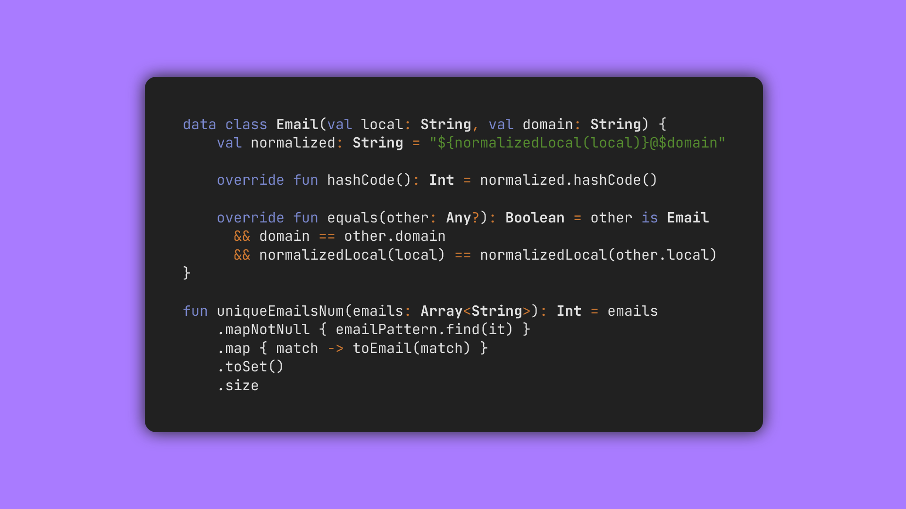

<!-- Copyright (c) 2024 Tobias Briones. All rights reserved. -->
<!-- SPDX-License-Identifier: CC-BY-4.0 -->
<!-- This file is part of https://github.com/tobiasbriones/blog -->

# Overriding Hash Code and Equals in a Multi-Representation Record



Certain models, like email addresses, can hold multiple alternatives or synonyms
of the same model to provide different representations but the same
functionality, thus leading to noise that must be filtered out for
functionality purposes.

## Multiple Email Representations

An email model consists of a **local** name followed by an **@** symbol and a
**domain** name. While this is pretty simple, they might also contain noise like
**dots** and **+** symbols for various purposes.

For example, `joedoe@place.com` is a canonical or base form of an email while
accepting the (infinitely many)
variants `joe.doe@place.com`, `joe.doe+aksfnsfs@place.com`, etc.

In programming terms, an email model can be a record with multiple
representations. That is different email values for readability or testing
purposes but corresponding to the same functionality. Therefore, emails can be
equal (or not) depending on your abstraction.

## Email Type

I created the `Email` record in Kotlin, thus using a `data class` and
overriding `toString`, `hashCode`, and `equals`.


<figure>
<div class="header user-select-none ">
    <div class="caption">
        Email.kt
    </div>

    <div class="menu">
        <button type="button" data-path="email---ep/src/main/kotlin/Email.kt" onclick="onOpenCodeSnippetLink(this)">
    <span class="material-symbols-rounded">
    open_in_new
    </span>
</button>

        <button type="button" data-code="&#x2F;**
 * Represents an email address consisting of a local part and a domain name.
 * The local part may contain periods (&quot;.&quot;) or plus signs (&quot;+&quot;), where any
 * content after a plus sign (&quot;+&quot;) and any additional periods (&quot;.&quot;) are
 * ignored for the purpose of determining email equality.
 *&#x2F;
data class Email(val local: String, val domain: String) {
    val normalized: String = &quot;${normalizedLocal(local)}@$domain&quot;

    override fun toString(): String = &quot;$local@$domain&quot;

    override fun hashCode(): Int = normalized.hashCode()

    override fun equals(other: Any?): Boolean = other is Email
      &amp;&amp; domain == other.domain
      &amp;&amp; normalizedLocal(local) == normalizedLocal(other.local)
}
" onclick="onCopyCodeSnippet(this)">
            <span class="material-symbols-rounded">
            content_copy
            </span>

            <div class="tooltip">
                Copied
            </div>
        </button>
    </div>
</div>

```kotlin
/**
 * Represents an email address consisting of a local part and a domain name.
 * The local part may contain periods (".") or plus signs ("+"), where any
 * content after a plus sign ("+") and any additional periods (".") are
 * ignored for the purpose of determining email equality.
 */
data class Email(val local: String, val domain: String) {
    val normalized: String = "${normalizedLocal(local)}@$domain"

    override fun toString(): String = "$local@$domain"

    override fun hashCode(): Int = normalized.hashCode()

    override fun equals(other: Any?): Boolean = other is Email
      && domain == other.domain
      && normalizedLocal(local) == normalizedLocal(other.local)
}
```



{{ markdownContent | markdownify }}


<figcaption>Email Implementation</figcaption>
</figure>

The function `normalizedLocal` will provide the base form of the `local`
field to remove the redundancy, so enabling **uniqueness** for that value.

The `equals` implementation matches the `other` generic object to an `Email`
type to check the rest of the field matching. This would be done via
`instanceof` (JDK16) in Java. The `hashCode` equals the normalized (main form
without repetition or canonical) email value.

Implementing `hashCode` is a key (pun intended) for discerning among `Email`
objects, like in a `Set` or `Map`.

The `hashCode` and `equals` methods have to be overridden in this case since
the `Email` type has many representations of the same model, so all the
redundant emails boil down to the main form and then compare for equality.

### Email Normalization Definitions

Important definitions are required for finishing the previous `Email`
implementation. They
regard [the definitions given first](#multiple-email-representations) for
dots (.) and plus (+) symbols.


<figure>
<div class="header user-select-none ">
    <div class="caption">
        Email.kt
    </div>

    <div class="menu">
        <button type="button" data-path="email---ep/src/main/kotlin/Email.kt" onclick="onOpenCodeSnippetLink(this)">
    <span class="material-symbols-rounded">
    open_in_new
    </span>
</button>

        <button type="button" data-code="&#x2F;**
 * It removes the redundancy of an email local value containing dots (.).
 *&#x2F;
fun normalizedLocalDot(local: String): String =
    local.replace(&quot;.&quot;, &quot;&quot;)

&#x2F;**
 * It removes the redundancy of an email local value containing a plus (+)
 * symbol, by eliminating everything after the first + occurrence.
 *&#x2F;
fun normalizedLocalPlus(local: String): String =
    local.takeWhile { char -&gt; char != &#x27;+&#x27; }

&#x2F;**
 * It normalizes the email local value by removing any redundancy.
 *&#x2F;
fun normalizedLocal(local: String): String =
    normalizedLocalDot(normalizedLocalPlus(local))
" onclick="onCopyCodeSnippet(this)">
            <span class="material-symbols-rounded">
            content_copy
            </span>

            <div class="tooltip">
                Copied
            </div>
        </button>
    </div>
</div>

```kotlin
/**
 * It removes the redundancy of an email local value containing dots (.).
 */
fun normalizedLocalDot(local: String): String =
    local.replace(".", "")

/**
 * It removes the redundancy of an email local value containing a plus (+)
 * symbol, by eliminating everything after the first + occurrence.
 */
fun normalizedLocalPlus(local: String): String =
    local.takeWhile { char -> char != '+' }

/**
 * It normalizes the email local value by removing any redundancy.
 */
fun normalizedLocal(local: String): String =
    normalizedLocalDot(normalizedLocalPlus(local))
```



{{ markdownContent | markdownify }}


<figcaption>Email Normalization for the Local Component</figcaption>
</figure>

This way, `normalizedLocalDot` takes care of any dot by removing
it, `normalizedLocalPlus` filters out anything after any plus symbol,
and `normalizedLocal` composes both.

### Email Uniqueness Challenge

This problem gives you a list of strings supposed to be email addresses
with [the dot and plus constraints](#multiple-email-representations) defined
before. You have to return the number of unique emails in the list.

These kinds of toy (interview) problems don't care much about realistic
requirements. For example, you can pass the tests even if the email is invalid,
but the count "passes." They're probably also full of imperative approaches that
are hard to maintain with real conditions.

By working out the subproblems declaratively with mathematical definitions, you
will scale a well-defined domain supporting any kind of requirements.

First, I needed to define a language to match any valid email address.


<figure>
<div class="header user-select-none ">
    <div class="caption">
        Email.kt
    </div>

    <div class="menu">
        <button type="button" data-path="email---ep/src/main/kotlin/Email.kt" onclick="onOpenCodeSnippetLink(this)">
    <span class="material-symbols-rounded">
    open_in_new
    </span>
</button>

        <button type="button" data-code="&#x2F;**
 * Defines a regex for valid email addresses, capturing the &quot;local&quot; and
 * &quot;domain&quot; groups.
 *&#x2F;
val emailPattern: Regex = &quot;&quot;&quot;
    (?&lt;local&gt;^[a-zA-Z0-9._%+-]+)@(?&lt;domain&gt;[a-zA-Z0-9.-]+\.[a-zA-Z]{2,}$)
    &quot;&quot;&quot;
    .trimIndent()
    .toRegex()
" onclick="onCopyCodeSnippet(this)">
            <span class="material-symbols-rounded">
            content_copy
            </span>

            <div class="tooltip">
                Copied
            </div>
        </button>
    </div>
</div>

```kotlin
/**
 * Defines a regex for valid email addresses, capturing the "local" and
 * "domain" groups.
 */
val emailPattern: Regex = """
    (?<local>^[a-zA-Z0-9._%+-]+)@(?<domain>[a-zA-Z0-9.-]+\.[a-zA-Z]{2,}$)
    """
    .trimIndent()
    .toRegex()
```



{{ markdownContent | markdownify }}


<figcaption>Email Regex Pattern</figcaption>
</figure>

The regex captures two groups, `local` and `domain`, for matching expressions.
The set of accepted inputs is **the language**. Of course, the language just
defined is that of all valid emails we required above.

Notice the email language defined by the regex might be actually integrated into
the `Email` type for building a DSL, for example, by using refinements.

Finally, checking redundancy can boil down to counting a `Set`.


<figure>
<div class="header user-select-none ">
    <div class="caption">
        Email.kt
    </div>

    <div class="menu">
        <button type="button" data-path="email---ep/src/main/kotlin/Email.kt" onclick="onOpenCodeSnippetLink(this)">
    <span class="material-symbols-rounded">
    open_in_new
    </span>
</button>

        <button type="button" data-code="&#x2F;**
 * Returns the number of unique email addresses.
 *&#x2F;
fun uniqueEmailsNum(emails: Array&lt;String&gt;): Int = emails
    .mapNotNull { emailPattern.find(it) }
    .map { match -&gt;
        val (local, domain) = match.destructured
        Email(local, domain)
    }
    .toSet()
    .size
" onclick="onCopyCodeSnippet(this)">
            <span class="material-symbols-rounded">
            content_copy
            </span>

            <div class="tooltip">
                Copied
            </div>
        </button>
    </div>
</div>

```kotlin
/**
 * Returns the number of unique email addresses.
 */
fun uniqueEmailsNum(emails: Array<String>): Int = emails
    .mapNotNull { emailPattern.find(it) }
    .map { match ->
        val (local, domain) = match.destructured
        Email(local, domain)
    }
    .toSet()
    .size
```



{{ markdownContent | markdownify }}


<figcaption>Counting Unique Emails</figcaption>
</figure>

The solution maps the generic email list to matching expressions, representing
strings belonging to the email language defined by the regex. By destructuring
the two groups, it maps the original `String` to the `Email` domain type.
Subsequently, it converts the `Email` list to a `Set` to eliminate redundant
entries, thus resolving the count required for uniqueness. This works
because `Email` already has the implementation for equality.

#### Testing Email Values

I generated and reviewed a bunch of tests to check my code.


<figure>
<div class="header user-select-none ">
    <div class="caption">
        class EmailTest | EmailTest.kt
    </div>

    <div class="menu">
        <button type="button" data-path="email---ep/src/test/kotlin/EmailTest.kt" onclick="onOpenCodeSnippetLink(this)">
    <span class="material-symbols-rounded">
    open_in_new
    </span>
</button>

        <button type="button" data-code="&#x2F;&#x2F; ... &#x2F;&#x2F;
@Test
fun `test uniqueEmailsNum with duplicate emails`() {
    val emails = arrayOf(
        &quot;test.email@gmail.com&quot;,
        &quot;test.email@gmail.com&quot;,
        &quot;test.email@outlook.com&quot;
    )
    assertEquals(2, uniqueEmailsNum(emails))
}

&#x2F;&#x2F; ... &#x2F;&#x2F;

@Test
fun `test uniqueEmailsNum with emails containing plus symbol and dots`() {
    val emails = arrayOf(
        &quot;test.email+spam@gmail.com&quot;,
        &quot;test.email+spam.news@yahoo.com&quot;,
        &quot;testemail+spam.news1@yahoo.com&quot;,
        &quot;test.email+update@outlook.com&quot;
    )
    assertEquals(3, uniqueEmailsNum(emails))
}
" onclick="onCopyCodeSnippet(this)">
            <span class="material-symbols-rounded">
            content_copy
            </span>

            <div class="tooltip">
                Copied
            </div>
        </button>
    </div>
</div>

```kotlin
// ... //
@Test
fun `test uniqueEmailsNum with duplicate emails`() {
    val emails = arrayOf(
        "test.email@gmail.com",
        "test.email@gmail.com",
        "test.email@outlook.com"
    )
    assertEquals(2, uniqueEmailsNum(emails))
}

// ... //

@Test
fun `test uniqueEmailsNum with emails containing plus symbol and dots`() {
    val emails = arrayOf(
        "test.email+spam@gmail.com",
        "test.email+spam.news@yahoo.com",
        "testemail+spam.news1@yahoo.com",
        "test.email+update@outlook.com"
    )
    assertEquals(3, uniqueEmailsNum(emails))
}
```



{{ markdownContent | markdownify }}


<figcaption>Tests for the Uniqueness Challange</figcaption>
</figure>

With the given test suite, the `uniqueEmailsNum` function can be checked for
many cases.

## Reducing Multiple Representations to the Main One

Definitions can allow multiple representations of the same model, while the main
form is clean without repetitions. Alternative forms can be reduced to
the main one, simplifying the problems required to solve.

An email address is one example of a model that can hold infinitely many forms
that point to the same address or owner.

Addressing these simplifications will often lead to a declarative mathematical
approach with engineering standards like code maintenance and scalability. The
approach given for an `Email` type can be further worked out to build a DSL.

One declarative approach to *define the language of all emails* is employing
regular expressions —another formal concept— thus enriching the program
capabilities by accurately refining our domain.

The hash value of equal objects must match to keep consistency in object
equality and hash-based data structures. Therefore, the redundant alternatives
are filtered out for implementing equality and making them equal to the main
form.


<div class="my-4">
  <div class="subdir-btn my-4">
    <a class="btn" href="email---ep">
      
      <span>
        Email
      </span>
    </a>
  </div>
</div>