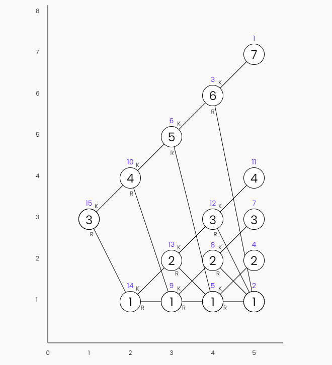

<!-- Copyright (c) 2022 Tobias Briones. All rights reserved. -->
<!-- SPDX-License-Identifier: CC-BY-4.0 -->
<!-- This file is part of https://github.com/tobiasbriones/blog -->

# Everything is Relative

Your life is going to change like mine did when you truly understand that
everything is relative.

I used to see everything as absolute, now I can see relativism after years of
math, engineering, and philosophy.

This is too heavy thus I will only provide a simple idea.

I design modules and trees. What are low-level and high-level?

Everything is a domain, homogeneity is key for pureness.

The root of a tree is not low-level or high-level as is, it depends on the
observer.

You can always take a subtree, and its root role will change.

## Absolutists are Stupid

We have that:

> **stupid:** having or showing a great lack of intelligence or common sense.
>
> Source: [Oxford Languages](https://languages.oup.com/google-dictionary-en)

Absolutists tell you stone-written rules because they're stupid, but certainly,
*the only constant is change*, so you have to adapt to change to be intelligent
(intelligence definition apparently said by
[Stephen Hawking](https://en.wikipedia.org/wiki/Stephen_Hawking)) so you
need to go domain specific --which is an art-- to match a case-by-case basis.
That is the opposite of absolute, *it's relative* and that's why human
common sense can only lead to wrong conclusions that are easy or absolute to
understand while in fact, *everything is relative*.

When you go domain specific you have *more information* to take more optimal
decisions in a case-by-case basis. Hence, being absolutist is nothing but plain
stupid.

### Stay Away from Absolutists

There's another definition of someone stupid that says that a stupid person 
or organization hurts others and also hurts themselves. For example, a 
stupid robber will not steal your phone because of incapability but will also 
hurt or kill you so both end up losing.

Lose-lose relationships are the opposite of what you need to fulfil your
purpose in life or be relative.

Absolutists are stupid, stupids create lose-lose relationships, therefore, 
stay away from absolutists.

### I'm Relativist and You Should Too

I'm relativist after learning and analysing tons of math, science, 
engineering, and philosophy. Where the last is the underlying category of 
this article.

I learned to create win-win relationships, so I'm the opposite of stupid, I'm a 
genius. Stupids create lose-lose relationships whilst intellectuals create 
win-win relationships.

You should be relativist too to create win-win relationships and so fulfil 
your purpose in life and other's purpose in life too. When that happens, the 
system is highly cohesive, it can message itself, that is, is homogeneous.

Think about this, imperative programming is stupid as is full of workarounds 
like managing/tracking mutable state whilst declarative programming or FP is 
based on formal definitions, it just happens what it must happen because the 
*logic is not fragmented* like OOP systems, but instead, *everything is 
relative*.

## Perspective: Business vs User

The business logic can be high-level for the business but then the presentation
layer is a low-level detail.

## Scalability

If you chop a tree you still get a tree, but if you chop a pyramid it'll stop
working as they're not homogeneous.

### Scale Your Social Skills

I'm technically skilled, but I've also proved to be socially skilled by scaling
my skills horizontally.

I've been good at socializing in person with students with no technical
knowledge, they are enthusiasts or superficial instead. That's because the
underlying *domain* is the same and *scales* unlike a pyramidal-like structure
that is vertical, that is, it can't scale.

I won't want to talk to an accountant for example, but that doesn't mean I don't
have communication skills.

In other words, if you are technical excellent you must also be an excellent
communicator in THAT domain (wrongly called "manager"), yes, excellent at both.

#### Don't Grow Vertically

If you do two things but are mediocre at one, you scaled vertically. For
example, a plain engineer is a horrible scientist if they try to be one, despite
the fact that they're supposed to have an academic background.

I can mathematically show horizontal and vertical growing. It's easy, just about
vector spaces. No one has a remote idea of what I'm talking about. I use to talk
just for myself only. If they are mathematicians they suck at engineering, and
if they are engineers they suck at (everything) math.

#### Vertical Structures Can't Scale Up

If you're a mere manager or whatever unicorn-hyped buzzword made up by
capitalists, then you can't scale that skill, and you might be able to talk to
some people but nothing else, and you will never be an engineer with technical
competence. Although, being so is still part of humanity.

Or the same, an engineer can have social skills on their domain but a
heterogeneous workaround like a boss or a manager (made-up by people or
capitalists instead of scientific facts or direct knowledge) is just that (a
manager) since monoliths can't scale, that's why they are monoliths and
vertical (they fall apart).

I say or can define vertical/monolith/pyramidal/impurities to give a precise
representation of the abstraction of doing things wrong by employing workarounds
that bypass the real problems that actually have to be addressed with real
science and facts instead of made-up buzzwords.

Why do you think companies only last one or two centuries at best while
science, math and engineering are always universal (mostly math)?

## Heterogeneous Systems are Not Needed

Therefore, capitalism, universities, and all those archaic hierarchies of power
are evil and unnecessary, can you see the abstraction I inferred?.

Therefore, we don't need buzzwords like Managers, SCRUM, Startups, OOP jungle of
patterns, there's a lot to elaborate on this (workarounds).

We need autonomous engineers where some will be the root of technical domains
and others will be skilled in the root of people domains smoothly following the
dependency/domain tree.

Many can say that "capitalist/OOP works or does great things" but that's
because it can be sold but not proven. We can do much better by being more
homogeneous. In the beginning of my entrepreneurship endeavour I used to think
about building commercial companies (hence by those mindsets I used to think
more absolutely), but after learning a lot, that's the last move I want to do.
Money and impurities are imminent out there, but as I said, we can be more
homogeneous to do much better.

### Humans are Not Needed

Manual manpower was required in the past century when computers (useful
computers we know today) and globalization didn't exist. Now most of the
manual work made by humans is done by machines, but also better done since
*humans themselves are just another workaround* who have to evolve to get rid
of themselves.

Think of human stages, times are completely different, so it reminds of the
[Rust compiler that is written in Rust](https://github.com/rust-lang/rust/tree/master/compiler)
--a general-purpose language has to be built in itself-- and has to get rid of
itself in order to evolve.

In the long run, you can't even compare an old version of human or programming
language to a modern version. *The only constant is change* so that leads us
to be domain-specific to be able to be at top of evolution by accurately
defining what we need for our purpose of life.

Manual manpower was mostly deprecated long ago, now, traditional corporations
with remarkable vertical hierarchies (they're literally superior to you
according to them) are being suppressed by startups which have better
structures that are more homogeneous but still full of buzzwords. Will
managers/bosses/teachers/coaches/mediators/... be next to be
deprecated? I don't think so as humans are stupid enough to keep on the
status quo, but in the meantime machines are evolving at a faster pace than
human primates.

Machines are fast to evolve, as a fun advise, watch "Futurama: Evolution and
the Missing Link".

Thus, it looks like humans are just peons of evolution doing workarounds to
build better systems from the rules of evolution. A peon for me is an entity
that does not satisfy its purpose of life. If you need workarounds then
you're definitely a peon and the only way out is to be more homogeneous
contrary to what humans are, to eventually achieve the-right-thing-right that I
define as fulfilling the purpose of each entity.

Humans are heterogeneous by nature and work as peons or workarounds
(otherwise life would be perfect for humans) and [heterogeneous systems are
not needed](#heterogeneous-systems-are-not-needed) so humans are not
required too, since a near perfect civilization will necessarily have to be
homogeneous in order to scale and so not to be human.

So humans are not needed because machines end up doing a better job, evolve
faster, and humans who were peons can evolve into something further to optimize
their purpose in life via human-machine composition. As you can see,
inheritance (like the OOP way) with heterosexual reproduction was just another
workaround, I have better ways of reproducing myself by writing formal articles
and sharing my thoughts for example, so I'll teach by giving the example (hence
I call them Example Projects). I'm pretty sure that Einstein would've thought
like that where they will remind you by your actions forever instead of just
giving birth to empty-disk temporal humans.

Do you wonder why children of "geniuses" like Einstein are not "geniuses" too?
Why vertical hierarchies with inheritance like king and prince (and many more
you can imagine) are nonsense? I had wondered since I'm a good observer and an
intellectual.

Absolutists think they are superior because they have better genes by being
"descendants of the king" or whatever underlying hierarchy, but sorry to
break it, their genes are mostly boilerplate, so they can't be more wrong.

There are better ways to reproduce than inheritance, only primates use
inheritance to give offspring. Recall that there are two components to
develop:

- physical (general-purpose), and
- intellectual (domain-specific) so you want to reproduce the intellectual one
  much more as the physical one is just boilerplate.

So that's another point on homogeneity (all humans are the same) and
speciality (domain-specific) to understand yourself to eventually fulfil
your purpose in life instead of being a peon of an absolutist. When you
fulfil your purpose in life, the logic is cohesive and flows naturally.

Sex is another stereotype and can only be used to define primitive animals but
people still classify you as "man" or "woman" as if it were inheritance.
Here comes the common programmer advice to use composition instead of
inheritance. Your sex is not a base class that defines you as an
extremely-coupled vertical hierarchy, it's part of you but not "the base class".

The way how something is depends on the observer, the result of what will
happen depends on who makes the observations, if others understand
inheritance they will interface with you in that way, if they understand
composition they are likely to be much clever and interface with
mathematicians or computer scientists, you can read the
[Conway's law \| Wikipedia](https://en.wikipedia.org/wiki/Conway%27s_law)
adage to know something similar on how the way organization's products end up
being is relative to the way the underlying organization is. Their
perception of the universe change their reality, and you decide if you want
to see the universe the way the see it. That's why it's recommended to have
a "positive mindset" not because it'll change the bad but because it'll
unlock dormant parts of your body according to my own experience. So you can
have a terrible day when it could've perfectly been a great day if you apply
relativity and change the reality by employing a better mindset.

A pure being does not have sex defined as it's homogeneous like a recursive
function and composable, it "compiles itself". I can say I'm "auto sexual" as I
love myself which leads to the fact that I'm an expert at myself, so I have a
well-defined domain or purpose that can be coupled or imported into another
pure being like me but who has a different domain.

A monolith like a human or animal has to born, get old, and then die because of
their impurities that corrupt their existence. A pure being doesn't get old,
or born or die since there's no monolith that draws that energy from that
being as I talk in
[Why I Work with 6-Month Years](../why-i-work-with-6--month-years) explaining
why monoliths are such a weight to hold, hence they age and eventually die or
fall apart.

Suppose there's a human who is not a peon, then that's a contradiction as
humans are full of heterogeneity or impurities and workarounds, so they're
peons by definition. Therefore, humans will have to evolve (and are doing it
[^1]) via human-machine composition to achieve a more homogeneous design.

[^1]: Check [Nanobots - an overview | ScienceDirect Topics](https://www.sciencedirect.com/topics/engineering/nanobots)

As a fun fact, I'll add here words of Zamasu that are good to contrast with
peons and mutable state (OOP):

> ...beings living in an eternal war...
>
> [Zamasu](https://dragonball.fandom.com/wiki/Zamasu) (Dragon Ball Super)

Imagine constantly living by workaround back and forth to keep mutable state
and "OOP patterns" that can't be proved but only sold, you need to learn to
do the right thing right which is an art like ultra instinct (DBS) to get
out of that circle or "eternal war".

[Ultra instinct](https://dragonballuniverse.fandom.com/wiki/Ultra_Instinct)
makes you move without thinking, it's not imperative where the ordinary mortal
has to think and send signals to move their muscles but declarative or
functional: the art where your body knows how to move itself declaratively.
Your muscles know themselves and are autonomous, they go domain-specific.

### Teach Yourself

Teachers or professors are workarounds, they are seen as "superior persons"
who are supposed to "give you the knowledge", but they are just another
smell of something that is wrong.

Your brain is integrated into your system, and a human is also a monolith, so
it's even more coupled to yourself.

They teach, you have to be a "good" student and have many degrees, but that's
relative: if your university sucks then it's just in vain, and top 25
universities are an intellectual monopoly, so they're not viable options by
any mean anyway.

The only thing you can do is to *teach you about yourself*, you need to be
an expert at *yourself*. They want you to be "someone" in this life like an
engineer, doctor or lawyer, but people are stupid enough that they forget to
work on themselves first. That is key as your brain is yours and if you're
expert at yourself then you can move forward without carrying problems or
workarounds since inception. Knowing yourself is inception of your life journey.

Hence, teachers or professors are more workarounds to sell cheap education
for cheap students even if they have "honours" diplomas.

A teacher is an entity physically far from you, so if you need a teacher to
learn something then it means that your intelligence is *fragmented* --another
common smell of heterogeneous systems--.

External systems (managers, teachers, etc.) acting on fragmented systems
(OO programs, primitive obsession practices, students, employees, etc.) can
only indoctrinate with generic rules because they're not domain experts.

If you need a teacher then you're not learning cohesively because you're
requiring an external system to work with your brain which is already internal
and close to itself and yourself, the knowledge is worked out inside your brain
in the end, so you have to keep highly cohesive there by learning about
yourself and so be much more efficient.

If you are autonomous then you're the domain expert, or expert at being
yourself, at fulfilling your purpose in life or the reason you exist.

If that's not enough insight, then let's go back to the fact that a
programming language is build in itself, e.g. Rust's compiler is built on Rust.
See [Bootstrapping_(compilers) \| Wikipedia](https://en.wikipedia.org/wiki/Bootstrapping_(compilers))
for further information on this. A general-purpose language has to be an
expert at itself, so it can compile itself and be homogeneous there, and
also be considered a serious general-purpose programming language.

See the example I give: I work on my domain or my purpose in life, if you
find out interesting what I do then you will know how to "compile yourself"
and "import" this knowledge I write into your system to scale it
horizontally. What I do is decoupled, it scales, you can use composition to
take it. Universities are extremely coupled on the other hand.

In short, find what is relative/local/domain-specific/close/cohesive
/efficient instead of more absolute approaches like teachers or managers.
The keyword is *find,* so it refers to an art of knowing it in a case-by-case
basis. Absolute systems are easier to understand but are inherently wrong.
Relativity is for true intellectuals as you can see.

#### Universities are External Systems

A university force you to be the way they are and learn what they want,
instead of being like *you* are and learning what *you* want, so
universities are indoctrination because in the end they're nothing else but
bureaucracy so alumni usually ends up knowing nothing or being like the PhD
in computer science who thought that real life was about "making a unicorn
company to become rich and save the world", "being an MBA", and
"play Minecraft".

Software engineering or even worse, *newer careers* like data science are not
available at universities as they're reluctant to adapt to change (they're
stupid literally), so you're enforced to take an awful outdated career to move
on, and you have to take all the ~60 (~110 in my case) classes whether they
make sense or not at all, until then, "you'll be someone in this life". In
other words, universities are huge monoliths, they're absolutists, and a
stupid monopoly.

Going back to [Absolutist are Stupid](#absolutists-are-stupid) we can see
that for example, universities put you a career plan you have to marry for
life, so all possible outcomes of software engineering end up like
"systems engineering" which was my case. Their "systems engineering" is
nothing but a stereotype and a monolith with:

- Fundamentals (calculus, physics, etc.)
- Programming
- Accountability/Bureaucracy/Taxes/Business-Admin
- System Admin
- Networking
- Databases
- Electronics/Electrical-Engineering
- AI
- Security
- Whatever that gets stuff done

The accountability item is absurd, I've never seen that in another curriculum,
and the reason why they push you so much off-topic garbage is because the
government and traditional absolutist companies like banks *need* employees,
so *universities or absolutists build employees* or labourers, but not real
professionals. So much garbage there when they struggle a lot to teach HTML
and CSS to bottom students (most of them) of final year, and I've had to have
the same substandard or third-world treatment that ordinary students also have
because *universities are absolutist*.

That's another way of seeing how *inheritance is plain wrong*. They don't 
care if you do things right, they see you as a peon to sell more off-topic
workarounds, and ordinary students are the majority so universities or schools
only work for them, but do not work if you're different from the ordinary peon. 
Hence, the traditional education system is another workaround to "get stuff 
done".

Even though I was massively successful at that traditional system, is not
because I was ordinary and studied mechanically, but because I let my self-study
be the implication of my good grades. I have self-study (homogeneous, 
auto-study) and the implications are the good grades, but not the other way 
around.

As a fun fact, I've had the *absolute* best grades at university at both
majors (math and engineering) and I have the diplomas over there. I've been
the absolute best for many times from primary school to university, but now
*I'm relativist* so being "the best" now means something different, I'm the best
of myself (homogeneous) whilst absolutists teach you to be the best on
top of others (heterogeneous).

I clearly, state that universities are heterogeneous: you're an inferior
student and then you "become" an engineer/doctor/etc. Needless to say, that
paradigm must not exist and must be replaced by a better system that is
homogeneous and modular:

- You're a professional since day one from zero (literally) to any level you
  want to get, so there's no heterogeneity between "student" and
  "engineer"/"doctor"/etc. Bad doctors also have degrees, but in the end you
  choose them wisely from their practice and trajectory, and not by their 
  degrees.

- You study or take courses you like, so the system is modular, and instead of
  being a student who first has to "learn" and hold ~60 classes at once for
  life (they actually forget all of them anyway) and then "become" an
  "engineer"/"doctor"/etc. you can just interoperate or "compile yourself"
  to build up your experience and apply your *current* skills as a
  professional at some level of experience.

The university monolith *fragments* you into two stages: a "learning" stage
(you're useless) and a "professional" stage (you have a degree on hand) but
that's nonsense. Modern computing is *concurrent* and that's how my brain works
too. I can solve logical problems in my mind like improving this article while  
I'm at work or exam then I know what I have to do when I have the free time
to realize it, and I can achieve being unbiased on my concurrent thoughts.

Why wait for 5 years to have a first job and stop being a dirty student who
can't have a job before (in your domain), can't be happy because you have to 
be a "good" student, and get by with a miserable amount of money as a "student".

Ordinary knowledge tells you that you have to go to university. But it
doesn't tell you the reason why, I'll tell you here: because universities are
intellectual monopolies, you're a professional or "someone in this life"
only if you go to universities, but they don't even have the talent, I mean,
private sector is the one that develops the world while universities are
searching for funds for nonsense "researches" since that is what tell sell,
they sell copyright, whilst in contrast, I create quality content for free
and a with a permissive license. Universities don't follow my example ( 
leading by example) because they're business even if they're public.

Universities don't even scale because that monopoly physically runs out of
space or room pretty soon, so you need to be elite to even go to an ordinary
university.

So they make you think or indoctrinate you that universities are mandatory
whilst they're just another option you can take, *they are external systems*,
and you have to be careful in *not falling into the scam of absolutists* as 
they brainwash you to buy their workarounds or problems on top of problems 
(hence the OOP `ProblemFactory`, see how `*Factory` is boilerplate, so it's 
wrong to follow that paradigm, it's more biased to absolutism).

Universities win when you graduate because they sell "professionals" but
that's not the case most of the time. A university can validate your studies,
but you can be a bottom engineer in real life, since universities are
external systems that do not know you but only emit *generic judgements*. They
don't even know about a particular profession as they have many careers and
are not focused on one.

I set the example of MIT which is the "Institute of Technology" so it makes
sense to study at MIT and be good at, and they also share free content. I
used to watch the MIT videos when I was in Calculus I, etc., so I was into a
third-world university with bottom standards for scientific careers, but I
was already an expert at myself, and *I knew* that I had to act like that to
obtain a better result for myself, that is, no one told me what I had to do,
I just "compile myself", I'm homogeneous or pure.

When you need someone else then you take the good (e.g. MIT videos) to keep
flattened or scale horizontally, so we have functional programming, a
homogeneous system that is a cohesive whole.

## Final Thought

Einstein was a genius to have figured it out against what ordinary people were
programmed to think. I think he used to be high like me too, since he imagined
crazy ideas in his mind. Now we have machines in this era, and I can expand on
that idea.

I've asked myself how can I develop a step-by-step output for any arbitrary
computation. I'd be talking here about a project I used to call Didalgoring
Lesson (Didactic Algorithm Lesson) but I've evolved the idea after studying
and figuring out many ways and concepts over the years. I posed these
problems to myself, for example, when I had to teach data structures, I had
to create the steps with Photoshop, so I needed to scale and devise that idea of
representing any arbitrary algorithm. I certainly must be on the homogeneous
(pure/relative/simplest/functional) side to achieve the ultimate scalability in
terms of logic.

**Image from the [Repsymo Solver](https://repsymo.com) I invented**. Guess what
those little numbers mean:

**MRM Tree Drawing Order | Repsymo**
