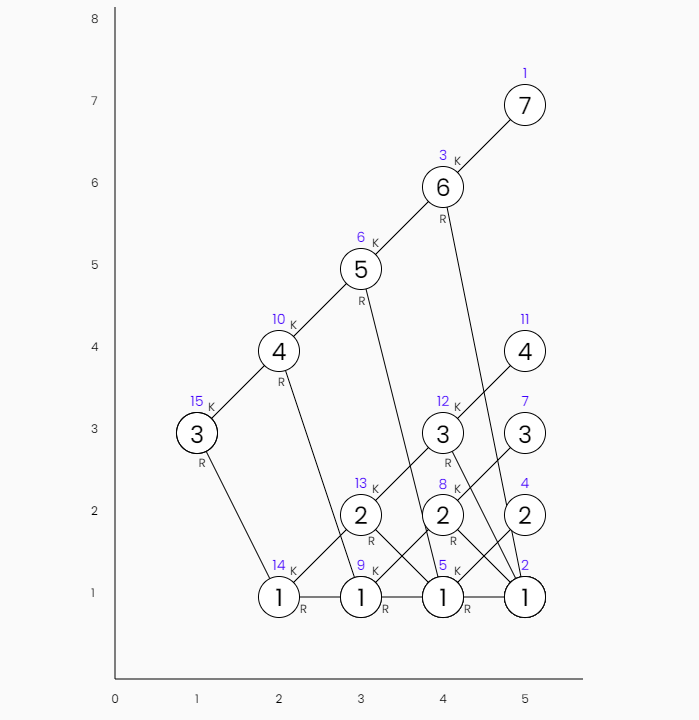

<!-- Copyright (c) 2022 Tobias Briones. All rights reserved. -->
<!-- SPDX-License-Identifier: CC-BY-4.0 -->
<!-- This file is part of https://github.com/tobiasbriones/blog -->

# Everything is Relative

Your life is going to change like mine did when you truly understand that
everything is relative.

I used to see everything as absolute, now I can see relativism after years of
math, engineering, and philosophy.

This is too heavy thus I will only provide a simple idea.

I design modules and trees. What are low-level and high-level?

Everything is a domain, homogeneity is key for pureness.

The root is not low-level or high-level as is, it depends on the observer.

You can always take a subtree, and its root role will change.

The business logic can be high-level for the business but then the presentation
layer is a low-level detail.

For the end-user is the other way around. We moved the observers or the frame of
reference.

If you chop a tree you still get a tree, but if you chop a pyramid it'll stop
working as they're not homogeneous.

Therefore, capitalism, universities, and all those archaic hierarchies of power
are evil and unnecessary, can you see the abstraction I inferred?.

Therefore, we don't need buzzwords like Managers, SCRUM, Startups, OOP jungle of
patterns, ...

We need autonomous engineers where some will be the root of technical domains
and others will be skilled in the root of people domains smoothly following the
dependency tree.

I'm technically skilled, but I've also proved to be socially skilled by scaling
horizontally my skills.

I've been good at socializing in person with students with no technical
knowledge, they are enthusiasts or superficial instead. That's because the
underlying domain is the same and SCALES.

I won't want to talk to an accountant for example, but that doesn't mean I don't
have communication skills.

In other words, if you are technical excellent you must also be an excellent
communicator in THAT domain (wrongly called "manager"), yes, excellent at both.

If you do two things but are mediocre at one, you scaled vertically. For
example, a plain engineer is a horrible scientist if they try to be one, despite
the fact that they're supposed to have an academic background.

I can mathematically show horizontal and vertical growing. It's easy, just about
vector spaces. No one has a remote idea of what I'm talking about. I use to talk
just for myself only. If they are mathematicians they suck at engineering, and
if they are engineers they suck at (everything) math.

But if you are a mere manager or whatever unicorn-hyped buzzword made up by
capitalists, then you can't scale that skill, and you might be able to talk to
some people but nothing else, and you will never be an engineer with technical
competence. Being so is still part of humanity though.

Einstein was a genius to have figured it out against what ordinary people were
programmed to think. I think he used to be high as F. like me too. He imagined
crazy ideas in his mind. Now we have machines in this era, and I can expand on
that idea.

**Image from the MRM | Repsymo Solver I invented**. Guess what those little 
numbers mean.
