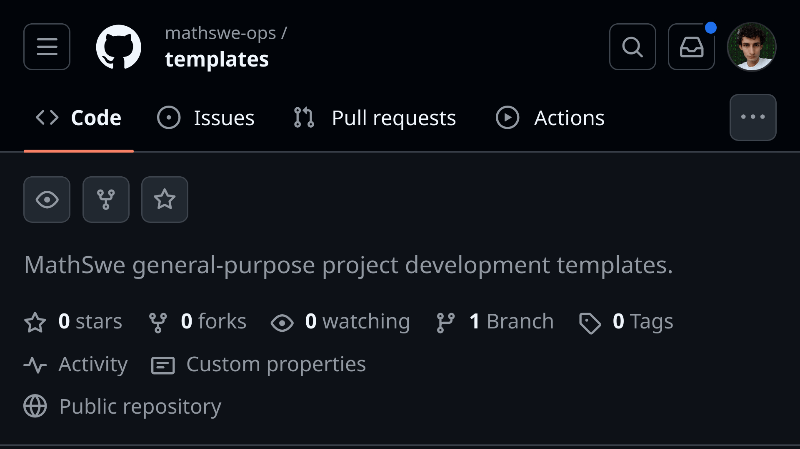

<!-- Copyright (c) 2024 Tobias Briones. All rights reserved. -->
<!-- SPDX-License-Identifier: CC-BY-4.0 -->
<!-- This file is part of https://github.com/tobiasbriones/blog -->

# Providing Templates for Repetitive General-Purpose Projects (2024/09/20)

I created a repository for storing project templates since I have to repeat the
same web frontend ceremony for every MathSwe web app I create. Manually
replicating the same project setup burns you out and adds inconsistencies,
making everything hard to maintain and think about.

---

I have a problem where MathSwe must take (wrap) modular mathematical
applications to deploy them. For example, the Math Software app (pure) will need
a MathSwe final application to host it and become a tangible product in
production, so MathSweCom adds Cookie Consent with analytics ("business" side).
The direction goes from MSW to MathSwe, and both require the same web ceremony
for a monolith web application. How can they be reused like actual modules
*without overengineering*?

I've thought about microfrontends, but these would turn into over-engineering
right now and also require you to copy-paste the mundane project structure,
unlike microservices in the backend, where you have minimal overhead in a modern
language of your choice.

If you want microfrontends, it won't be the same as microservices. You can
choose Rust, Go, Kotlin, etc., to build a low-development-overhead microservice
right ahead. In the frontend, you only have JS, and you must set up TS on top of
JS 🫠, Vite/Webpack, and web structure. JS is the only idiotic ecosystem where
whenever you start a project, you always must replace it with another language
on top of it 🤡. Further, I use functional libraries, like `fp-ts`, plus MathSwe
standard libraries (in the future), which only increase the development overhead
as the number of "micro" projects scale up. Consider that you can use Haskell
(i.e., no extra FP libraries/languages) in the backend if you want, but the
frontend is limited to JS.

A microfrontend itself is a monolith with parts it will never use nor make sense
at all, like an `index.html` with `head` tags. So, you must repeat the same
"getting started" web bloat *every time* you create a "microfrontend." You don't
have the advantage of using an optimal language since you will have to add
another language that transpiles to JS, if possible (e.g., TS, Purescript).

All "microfrontends" are coupled to the same project setup, language(s), initial
libraries, and ill-informed boilerplate (like `index.html`s). So,
"microfrontends" are more similar to monoliths from their cold startup.

Further, microfrontends require a "central monolith," and they have hidden
complexity, like downloading libraries multiple times. If you're not especially
*careful* and have multiple teams with big domain boundaries, I don't see
microfrontends as a feasible solution. Conversely, microservices (normal
programs instead of web bloat) can provide **significant value *earlier***.

Creating microservices requires attention to your domain design, but **creating
microfrontends demands exceptional attention to all the design details**, and
they can easily have **the disadvantages of both monoliths and microfrontends**.
I should only consider microfrontends for huge enough and well-defined
application boundaries.

I also thought about creating a `fe-ops` CLI in Rust as scripting without
abstractions, but my needs are still unclear, and I have *many*
priorities. So, a CLI would also be overengineering.

Therefore, I'm opting for easier (probably simpler) solutions *at this
development stage*, like unifying templates to **remove inconsistencies among
projects**. So
[here's the template repository](https://github.com/mathswe-ops/templates)
where I will add project structures to have as a reference. Copy-pasting
templates seem dummy, but it's easy and might **provide value immediately**.

I can also employ prototypes for immediate solutions. Their advantage is that I
only add throw-away commits without formally developing and releasing products
with blogs and documentation. With prototypes, I can write whatever code I need
with zero responsibilities about formalities.

In short, I have many potential options, including:

- A repository with project templates to copy-paste from.
- A CLI to help with build steps.
- A prototype, like the "Texsydo Web prototype," while validating requirements.
- Designing microfrontends.

I will work with templates first to move on as fast as possible while
understanding the requirements better.

---

There are various options, not so great, to reuse project setups while creating
many web applications (either monoliths or microfrontends).

If you want to create microfrontends, fixing the consistency and organizational
standards is crucial. These have significantly more overhead than microservices
due to the messy web ecosystem and many projects sharing the same setup.

Since no solution is great and I need the one that helps the fastest while
understanding other requirements, I decided to create templates and copy-paste
them into projects that share the same setup.

While working with templates, I still must ensure they're not duplicate so
they're maintainable among templates and kind of "composable." It is crucial to
keep templates in "good shape" since these are supposed to be sources of truth
for all underlying applications (e.g., all React apps).

The repository I created will be for hosting any significant template to apply
to all projects as a base standard. I will include the template for a React +
TS + SWC + Vite + Vitest + etc. web application. I will experiment in this
repository and will evolve the templates according to needs, considering them
as, at least, a temporary help.

