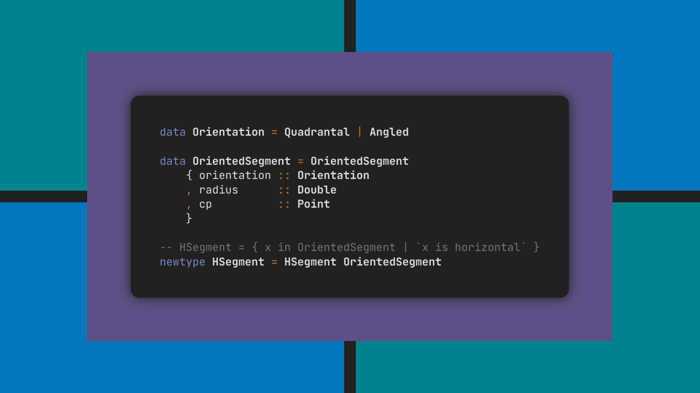

<!-- Copyright (c) 2024 Tobias Briones. All rights reserved. -->
<!-- SPDX-License-Identifier: CC-BY-4.0 -->
<!-- This file is part of https://github.com/tobiasbriones/blog -->

# Removing Record Redundancy with Sum and Refinement Types



Systems should initiate simplification by removing common duplications like
records that only differ in their name, particular types already created as a
universal definition, and runtime memory waste. The engineer should probably
leverage algebraic and refinement types with composition for an optimal design.

## Physical Redundancy

Creating repeating structures is a design flaw that should probably be removed
via expression simplification.

From the definitions line shapes, I've been writing about a
[problem](/ensuring-principle-compliance-_-this-line-sum-type-is-not-a-partition-2023-12-07),
so we have something like the following design example:


<figure>
<div class="header user-select-none headerless">
    <div class="caption">
        
    </div>

    <div class="menu">
        

        <button type="button" data-code="data Point = Point Double Double

data Line
  = Segment { start :: Point, end :: Point }
  &vert; HSegment { radius :: Double, center :: Point }
  &vert; VSegment { radius :: Double, center :: Point }
" onclick="onCopyCodeSnippet(this)">
            <span class="material-symbols-rounded">
            content_copy
            </span>

            <div class="tooltip">
                Copied
            </div>
        </button>
    </div>
</div>

```haskell
data Point = Point Double Double

data Line
  = Segment { start :: Point, end :: Point }
  | HSegment { radius :: Double, center :: Point }
  | VSegment { radius :: Double, center :: Point }
```



{{ markdownContent | markdownify }}

<div class="abstract">HSegment and VSegment are the Exact Same Data Representation</div>

<figcaption>Inefficient Design with Redundant Types</figcaption>
</figure>

I'll omit the fact that `Line` is not a partition[^1] and just focus on the 
repetition of the way the records were defined here.

[^1]: Line is a sum of three product types with overlap (i.e., `HSegment` and
    `VSegment` are a *refinement* of `Segment`, which is redundant in `Line`)

We have the variants `HSegment` and `VSegment` sharing exactly the same data
representation. Therefore, this design is flawed since repetition is a common
trait of bad programs —mostly in domain-specific programs where expertise is the
key to reaching the engineering grade.

In the above case, we notice (as boilerplate) a physical redundancy since two
records are defined the same way, so as a software engineer when reading that
code, you must obviously see it *factorizable* to simplify the code.

## Factorizing the Duplication with Sum Types

When something hard/physical is duplicated (thus inefficient), a common insight
as an engineer is to create relations to simplify the problem. Sum types are
relations since they create the disjoint union of variants, while product types
or records are hard because they define the actual data to be held.

I can state a design fixing some of the issues described before. I'll take the
geometric language design I gave in
[Designing the Angle Geometry for an Oriented Segment](/designing-the-angle-geometry-for-an-oriented-segment)
as a base. The repetition will be removed by softening the problem via a sum
type.

For a given concept, we can have **a main definition** out of all the equivalent
ones in our domain[^2].

[^2]: This is like mathematical equivalent definitions where you prove the
    double implication among all of them, so you choose one at your will that
    makes the most sense for the underlying application


<figure>
<div class="header user-select-none headerless">
    <div class="caption">
        
    </div>

    <div class="menu">
        

        <button type="button" data-code="data Segment = Segment { start :: Point, end :: Point }
" onclick="onCopyCodeSnippet(this)">
            <span class="material-symbols-rounded">
            content_copy
            </span>

            <div class="tooltip">
                Copied
            </div>
        </button>
    </div>
</div>

```haskell
data Segment = Segment { start :: Point, end :: Point }
```



{{ markdownContent | markdownify }}


<figcaption>Main Segment Definition</figcaption>
</figure>

Then, we won't have the overlap problem I stated in other articles, where
`Segment` "eats" the other variants when defined as a sum type. So, notice I
broke the flawed `Line` [sum type](#physical-redundancy), and now `Segment` is
directly a product type.

For an API for segments with common orientations, **an equivalent definition**
is what I did to fix the design issues of overlapping. You should immediately
notice *the sum type needed is for the orientation variants* (i.e., horizontal
or vertical).


<figure>
<div class="header user-select-none headerless">
    <div class="caption">
        
    </div>

    <div class="menu">
        

        <button type="button" data-code="newtype SignedAcute = SignedAcute Angle -- (-90, 0) and (0, 90) deg

data QuadrantalOrientation = Horizontal &vert; Vertical -- { 0, 90 } deg

-- Defines the angle to build an oriented segment, which must be exactly in
-- (-90, 90]deg.
data Orientation
  = Quadrantal QuadrantalOrientation
  &vert; Angled SignedAcute

data OrientedSegment = OrientedSegment
  { orientation :: Orientation
  , radius      :: Double
  , cp          :: Point
  }
" onclick="onCopyCodeSnippet(this)">
            <span class="material-symbols-rounded">
            content_copy
            </span>

            <div class="tooltip">
                Copied
            </div>
        </button>
    </div>
</div>

```haskell
newtype SignedAcute = SignedAcute Angle -- (-90, 0) and (0, 90) deg

data QuadrantalOrientation = Horizontal | Vertical -- { 0, 90 } deg

-- Defines the angle to build an oriented segment, which must be exactly in
-- (-90, 90]deg.
data Orientation
  = Quadrantal QuadrantalOrientation
  | Angled SignedAcute

data OrientedSegment = OrientedSegment
  { orientation :: Orientation
  , radius      :: Double
  , cp          :: Point
  }
```



{{ markdownContent | markdownify }}

<div class="abstract">Introducing the Sum Type to Remove the Record Redundancy</div>

<figcaption>Equivalent Segment Definition</figcaption>
</figure>

The `OrientedSegment` is an equivalent definition of `Segment`
storing the segment angle and ball in $$R^2$$ for its length. Both are
**isomorphic types**.

I'm also taking the exact `(-90, 90]deg` angle *from the DSL* to populate the
whole plane, so any possible line segment can be defined via
`OrientedSegment` in only one way.

Any segment can be described with either data type I designed, and they don't
overlap since they're equivalent/independent definitions instead of belonging to
the same `Line` sum type given in [Physical Redundancy](#physical-redundancy).

The sum type removing the redundancy of the previous `HSegment` and
`VSegment` records is `QuadrantalOrientation`. That's what I mean by
*factorizing expressions to simplify them*.

The introduction of a sum type for the segment orientation eliminated the two
redundant records for horizontal and vertical *variants* by factorizing them
from two redundant records into a cohesive `OrientedSegment` record with sum
type variants.

## Enriching the Domain Types with Refinements

One important case when redundancy is shown is when we have a superset already
but want a smaller subset to create a specific type.

From the [above example](#physical-redundancy) of the `Line` sum type, we can
see that `Segment` covers all the other possible options, so we don't need to
over-engineer this with a sum type but create a simple subset or refinement type
of the universe set.

From [the simplification](#factorizing-the-duplication-with-sum-types) above
that removed the duplication, we have **our universe set as
`OrientedSegment`** since we want to take subsets like `HSegment` and
`VSegment` **without creating redundant types**. The simplification above is a
correct step to perform, but something else is still missing to fix the `Line`
design since we no longer have the `HSegment`
and `VSegment` types.

Notice a sum type is a universe consisting of a partition of its subsets[^3] or
variants, while a refinement type is a subset of some universe type. In both,
it's essential to know well the universe type to proceed with a design. You
cannot create refinements of a variant since they're not types[^4][^5]. They're
different abstractions, so use them wisely.

[^3]: So you can optimize for one of the disjoint subsets of your choice

[^4]: The type in the example [above](#physical-redundancy) is `Line`,
    not `Segment`, so you cannot refine `Segment` with the given ADT

[^5]: In Java, you can because of what I said in my
    [other article's footnote](/designing-the-angle-geometry-for-an-oriented-segment#fn:4),
    but of course, don't do it


<figure>
<div class="header user-select-none headerless">
    <div class="caption">
        
    </div>

    <div class="menu">
        

        <button type="button" data-code="-- Ensure to create the refinements via LiquidHaskell --

-- HSegment
--   = { (HSegment x _ _) in OrientedSegment &vert; x is (Quadrantal Horizontal) }
newtype HSegment = HSegment OrientedSegment

-- VSegment
--   = { (VSegment x _ _) in OrientedSegment &vert; x is (Quadrantal Vertical) }
newtype VSegment = VSegment OrientedSegment
" onclick="onCopyCodeSnippet(this)">
            <span class="material-symbols-rounded">
            content_copy
            </span>

            <div class="tooltip">
                Copied
            </div>
        </button>
    </div>
</div>

```haskell
-- Ensure to create the refinements via LiquidHaskell --

-- HSegment
--   = { (HSegment x _ _) in OrientedSegment | x is (Quadrantal Horizontal) }
newtype HSegment = HSegment OrientedSegment

-- VSegment
--   = { (VSegment x _ _) in OrientedSegment | x is (Quadrantal Vertical) }
newtype VSegment = VSegment OrientedSegment
```



{{ markdownContent | markdownify }}

<div class="abstract">Refinements for Oriented Segment Subtypes</div>

<figcaption>Subsets of a Universe Set</figcaption>
</figure>

First, you have to notice you have a universe set. Then you'll want specific
types for important subsets, so you know you should create refinements reusing
the universe type instead of creating more types again from scratch that'll
pollute the code with duplication. Therefore, we have a cohesive system,
eliminating design duplications, yet a powerful type system to cover all the
domain needs.

## Removing Field Redundancy for Memory Optimization

The refinement applied to `OrientedSegment` is a neat solution, but more
redundancy complications can arise when the data representation of the
refinement types gets simplified down in structure, thus leading to duplicated
fields created at runtime.

If we create the refinements as suggested
[above](#enriching-the-domain-types-with-refinements), since each subtype is a
refinement of `OrientedSegment`, they will store **a redundant field** for the
`orientation`, thus inefficient in memory.

We know they're unnecessary from the very refinement definition: A `HSegment`
will always be horizontal, etc. That information is already part of the type
system, so it's redundant to store the `orientation` field.

Since we're in FP, we can trivially compose what we need. So, as I said above,
the `OrientedSegment` consists of a ball that gives its radius and center point.

Therefore, we can define the data type for what we need, and exclude the
redundant part that is now part of the type system.


<figure>
<div class="header user-select-none headerless">
    <div class="caption">
        
    </div>

    <div class="menu">
        

        <button type="button" data-code="data Ball = Ball { radius :: Double, cp :: Point }
" onclick="onCopyCodeSnippet(this)">
            <span class="material-symbols-rounded">
            content_copy
            </span>

            <div class="tooltip">
                Copied
            </div>
        </button>
    </div>
</div>

```haskell
data Ball = Ball { radius :: Double, cp :: Point }
```



{{ markdownContent | markdownify }}

<div class="abstract">Extracting the Common Fields for Our Refinement</div>

<figcaption>Definition of an \(R^2\) Ball</figcaption>
</figure>

Now that the redundant `orientation` field is removed, we can define the
refinements in a memory-optimal layout.


<figure>
<div class="header user-select-none headerless">
    <div class="caption">
        
    </div>

    <div class="menu">
        

        <button type="button" data-code="newtype HSegment = HSegment Ball

newtype VSegment = VSegment Ball
" onclick="onCopyCodeSnippet(this)">
            <span class="material-symbols-rounded">
            content_copy
            </span>

            <div class="tooltip">
                Copied
            </div>
        </button>
    </div>
</div>

```haskell
newtype HSegment = HSegment Ball

newtype VSegment = VSegment Ball
```



{{ markdownContent | markdownify }}


<figcaption>Memory Efficient Refinements</figcaption>
</figure>

Now, as an engineer, you have two options:

- Include `Ball` in the previous definitions, which might be over-engineering.
- Keep the redundant fields between `OrientedSegment` and `Ball` in the design
  to trade the memory duplication off at runtime, although much better than 
  the problem of [Physical Redundancy](#physical-redundancy).

Recall that records with the same fields in the same package are disallowed
because (that's redundant, thus inefficient) the compiler generates accessor
functions with the names of the record fields.


<figure>
<div class="header user-select-none headerless">
    <div class="caption">
        
    </div>

    <div class="menu">
        

        <button type="button" data-code="Main.hs:30:20: error:
    Multiple declarations of ‘radius’
    Declared at: Main.hs:25:5
                 Main.hs:30:20
   &vert;
30 &vert; data Ball = Ball { radius :: Double, cp :: Point }
   &vert;                    ^^^^^^

Main.hs:30:38: error:
    Multiple declarations of ‘cp’
    Declared at: Main.hs:26:5
                 Main.hs:30:38
   &vert;
30 &vert; data Ball = Ball { radius :: Double, cp :: Point }
   &vert;                                      ^^
" onclick="onCopyCodeSnippet(this)">
            <span class="material-symbols-rounded">
            content_copy
            </span>

            <div class="tooltip">
                Copied
            </div>
        </button>
    </div>
</div>

```
Main.hs:30:20: error:
    Multiple declarations of ‘radius’
    Declared at: Main.hs:25:5
                 Main.hs:30:20
   |
30 | data Ball = Ball { radius :: Double, cp :: Point }
   |                    ^^^^^^

Main.hs:30:38: error:
    Multiple declarations of ‘cp’
    Declared at: Main.hs:26:5
                 Main.hs:30:38
   |
30 | data Ball = Ball { radius :: Double, cp :: Point }
   |                                      ^^
```



{{ markdownContent | markdownify }}


<figcaption>Duplicated Record Fields are Disallowed</figcaption>
</figure>

Storing repeated values at runtime is also a
[Physical Redundancy](#physical-redundancy). Hence, we have a tight relation
between the product types we design and the physical data that occupies the
hardware.

The Haskell compiler is a great ally when spotting "code smells" that are just
bypassed in ordinary languages. Of course, it all comes from mathematics instead
of made-up C++ or JS tricks; hence it's so good.

So, you have to decide the tradeoff as the designer. Recall that the former
solution is more mathematical, while the latter focuses on implementation
details.

It'd be great if a compiler generated the refinements properly. For example, the
[refinement made before](#enriching-the-domain-types-with-refinements) should
not store the `oriented` field at runtime, provided the compiler could infer
this valuable[^6] information. That's what I mean by "implementation detail."
When you deal with them, tradeoffs come across, and the math or high-level 
concepts fade away 😐.

[^6]: Pun intended since `oriented` is a redundant "value" at runtime, but I
    also suggest it's "valuable" information for the compiler to infer

The previous math-like refinement could still be optimized not to remove a
design redundancy but a memory one, meaning an implementation detail. As an
engineer, you must understand your domain and technical tradeoffs since
compilers, even the Haskell one, are far from perfect to give us the perfect
solution to every situation.

## Principles for Engineers

Simplifying expressions in functional programs is **a basic/essential skill**
any software engineer must have since it's how you were trained in the CS/math
majors.

So, instead of simplifying polynomials and such with set theory, you now have to
simplify programming expressions with type theory. That's how you apply abstract
skills developed during math courses, mostly if you're self-taught since that
shows you're ahead.

Applying simplification techniques *is mandatory for any engineer*, regardless
of your domain, whether it is mathematical software or not. If you work in other
domains, you'll always have expressions to simplify building the
"business/app logic" into engineering-grade artifacts. Programmers and
developers are not engineers because they don't *engineer* anything and don't
care about the engineering grade. It doesn't matter how they get called in their
tech jobs.

These skills primarily concern **engineers** rather than apparently similar
roles lacking **rigor**, like software development or programming.

## Fixing Redundancy is a Major Key to Simplify Systems

Removing design flaws showing redundancy, or boilerplate, is mandatory for
crafting engineering-grade software since the existence of repetition in the
codebase suggests we need to apply simplification techniques like polymorphism
to our *expressions*.

If we don't simplify the code, we'll have a far-from-correct design, resulting
hard to test, document, etc. Therefore, it's not an engineering-grade design.

The inefficient hard duplication in a program, like **records that only differ
in their name**, can be simplified by factorizing the duplication into a
cohesive unit with sum-type variants.

Refinement types are a complex feature that barely a few languages like Haskell
extensions can support, if at all. They're powerful abstractions since we can
**express** the very same math definitions. Notice how types are the sets of 
set theory while subtypes are then subsets of set theory.

When tools like compilers are unable to help anymore, we have to
"get our hands dirty" with implementation details, bringing tradeoffs with
lower-level code. Therefore, you apply the "engineer" part of your "math
software engineer" title.

It's essential to have a strong mathematical and computer science background for
being a software engineer.

The functional type system allows us to create simple expressions for our
programs via abstractions like **algebraic and refinement types**, which are all
about pure functions, thus functional programming.

FP also includes the concepts of types analogously to mathematical sets.
So, we can have further abstractions like isomorphic types to enrich our domain
with equivalent definitions of your choice.


